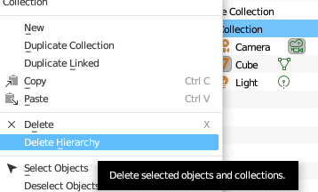
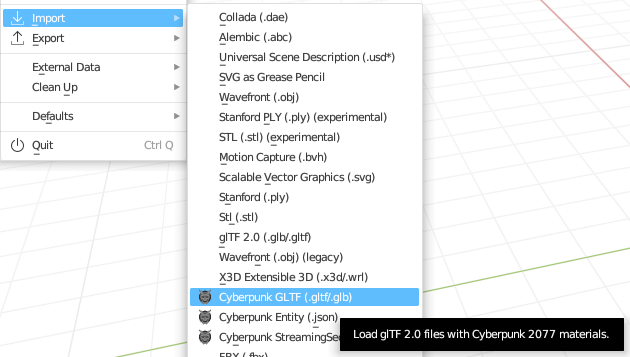
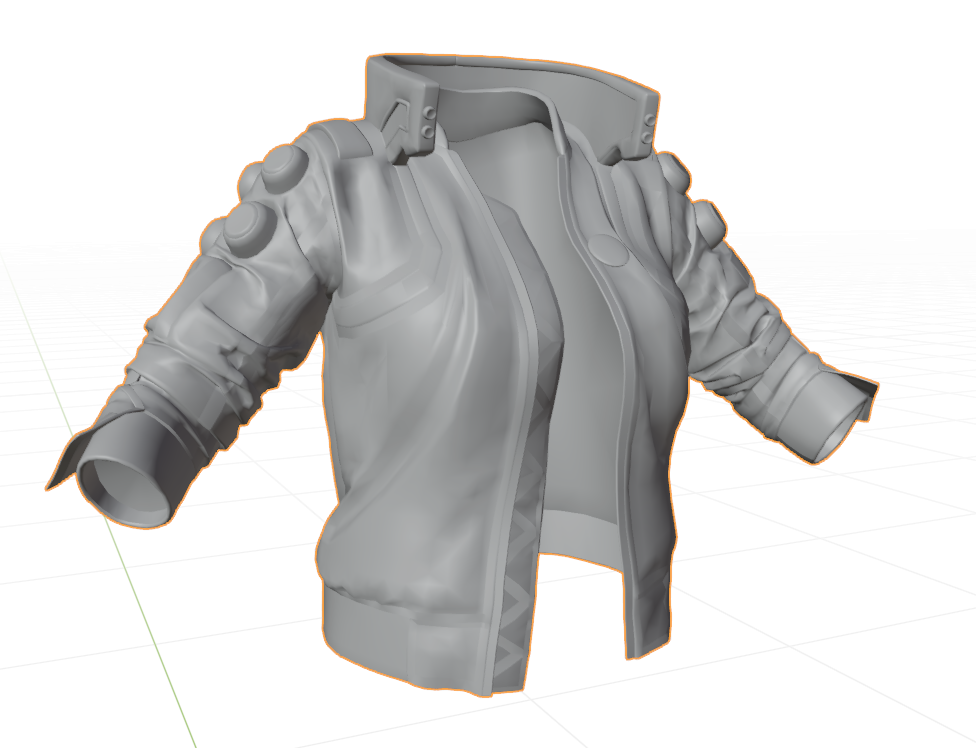
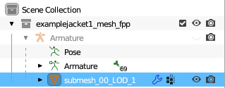
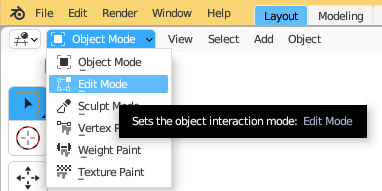
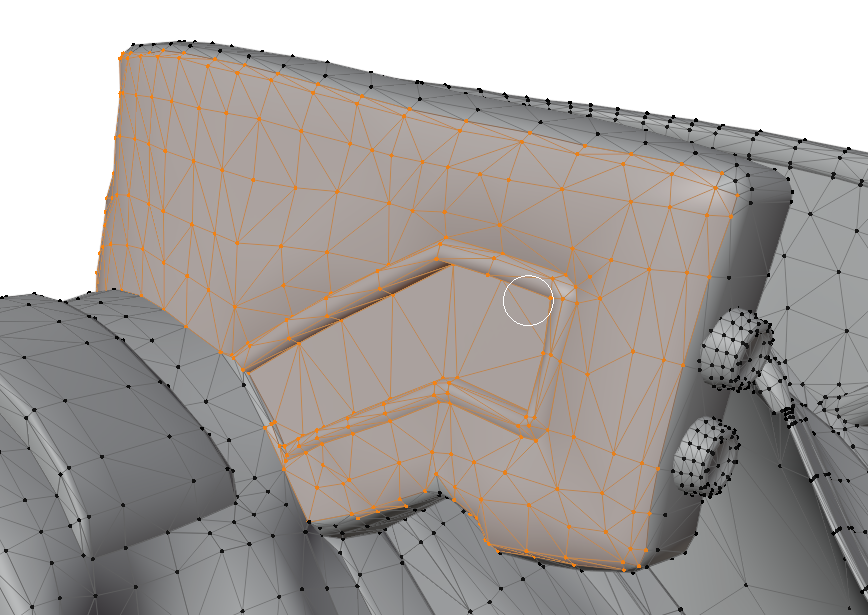
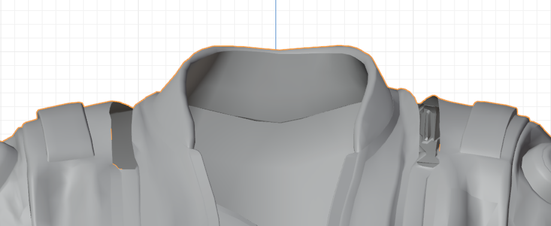
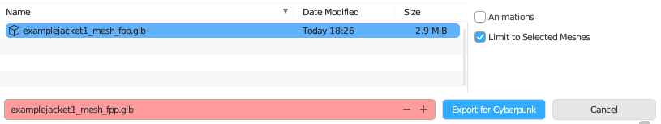

# 3d editing: Submeshes

This page contains a theory part and a guide.

The guide section of this page has been created in the context of [first-person-perspective-fixes.md](../../modding-guides/items-equipment/first-person-perspective-fixes.md "mention"): [#editing-the-.mesh](../../modding-guides/items-equipment/first-person-perspective-fixes.md#editing-the-.mesh "mention"). It will show you how to split a mesh into submeshes (or how to alternatively delete these parts of the mesh).


If you run into problems, check [troubleshooting-your-mesh-edits.md](troubleshooting-your-mesh-edits.md "mention"), or consult the .


## What are submeshes?

For more information about this see [submeshes-materials-and-chunks.md](../files-and-what-they-do/file-formats/3d-objects-.mesh-files/submeshes-materials-and-chunks.md "mention") and the section [#submeshes-in-blender](../files-and-what-they-do/file-formats/3d-objects-.mesh-files/submeshes-materials-and-chunks.md#submeshes-in-blender "mention")

To learn how you can use them for appearance management, check [#chunkmasks-partially-hiding-meshes](../files-and-what-they-do/file-formats/3d-objects-.mesh-files/submeshes-materials-and-chunks.md#chunkmasks-partially-hiding-meshes "mention")

## Guide: Splitting off submeshes


For more information on splitting meshes, you can [check this guide](../../modding-guides/textures-and-luts/textured-items-and-cyberpunk-materials.md#step-2-processing-the-downloaded-mesh).


### Prerequisites

You have the [wolvenkit-blender-io-suite](../modding-tools/wolvenkit-blender-io-suite/ "mention") and a compatible version of Blender installed.

### Importing the mesh into Blender

1. Open Blender and create a new General file.&#x20;
2.  Optional, but recommended: delete everything in the file. In the scene collection in the top right, right click on “Collection” and click “Delete Hierarchy,” as we don't need these.

    <figure><figcaption></figcaption></figure>
3. Press File → Import → Cyberpunk GLTF and browse to your .glb file.
4.  Import the file (default settings).

    <figure><figcaption><p>Please for the love of god, install the Cyberpunk Blender Add-On.</p></figcaption></figure>


### Selecting the right parts

Directly after importing the mesh, Blender will be in Object Mode.

1.  Your item should appear in the 3D viewport now. Use the camera controls to the left of the scene collection (or mouse/keyboard shortcuts if you're familiar with them) to get a better view of the item.

    <figure><figcaption></figcaption></figure>
2. In the **scene collection**, find the newly-added collection and expand the armature
3. You will see the item's **meshes** (which correspond to Wolvenkit's submeshes as defined by name).
   * My jacket only has one submesh. Your item might have more.&#x20;

<figure><figcaption></figcaption></figure>

4. In the scene collection, select all the submeshes of your item
   * click on the first, then shift-click on the last

### Edit Mode: making a selection

Now, select the parts of your mesh that you want to split off (or delete). If you have never done that, read the section below before starting, as it can save you a lot of time.


* Selecting with the `shift` key held down will let you add to a selection. Holding the `ctrl` key will let you subtract from it.
* There are **four** select tools (hotkey to cycle them: `w`), which you can select in the toolbar on the left by holding the first panel.
* You can turn on x-ray mode (hotkey: `alt+z`) to select things on both sides of the mesh
* Keys on your numpad will set the cameera to e.g. profile or top view. Try around!


1. Switch to Edit Mode (keyboard shortcut: `Tab`)

<figure><figcaption></figcaption></figure>

2. Click in the 3D viewport next to your mesh to deselect everything. Use the camera controls to get close to what you want to select. In my example, it's going to be the entire collar.
3. Start by selecting a single vertex on the part that you want to get rid of.
4. Press Ctrl + L (select linked)
5. If you're lucky, it will select what you want. If not, undo (shortcut: `Ctrl+Z`) and select things by hand.&#x20;
6. Once you have made your selection, decide how to proceed: either by [#splitting-off-submeshes](3d-editing-submeshes.md#splitting-off-submeshes "mention") or by [#deleting-vertices](3d-editing-submeshes.md#deleting-vertices "mention").

<figure><figcaption><p>Selecting vertices</p></figcaption></figure>

### Splitting off submeshes

TODO: This needs a screenshot or two

1. `Split` your selection (shortcut: `P`)
2. You will now have (a) new mesh(es) in Blender. Those are your future new submeshes
   * Each will be named `original_mesh_name.001`
3. **Rename** each of them, following the naming schema from the original meshes:&#x20;

```
submesh_<index>_LOD_1
```


The value for **index** corresponds to your **submesh index** in Wolvenkit, so this is how you can re-order them.

The number after **LOD** determines the **level of detail** of your mesh. By default, you will want to stick to 0.


4. After you have renamed all meshes, proceed to [#exporting-from-blender](3d-editing-submeshes.md#exporting-from-blender "mention").

### Deleting vertices


This will irreversibly remove the corresponding geometry from the mesh. If you don't want that, see [#splitting-off-submeshes](3d-editing-submeshes.md#splitting-off-submeshes "mention") instead.


At any point, you can press `x` and select `delete vertices` to **remove** parts of your mesh. In this example, we will delete the entire collar:

<figure><figcaption><p>Deleting vertices</p></figcaption></figure>

<figure><figcaption><p>Done!</p></figcaption></figure>

## Exporting from Blender

After your mesh is edited to your satisfaction:

1. If you're still in Edit mode: change back to object mode (shortcut: `tab`)
2. The meshes should still be selected.
3. Hit File → Export → Cyberpunk GLB
4. Overwrite the .glb file that you imported, so that you can import it with Wolvenkit. \
   &#xNAN;_&#x49;f you are considering to do something else instead:_ [_read this first_](https://app.gitbook.com/s/-MP_ozZVx2gRZUPXkd4r/wolvenkit-app/usage/import-export#file-structure)

<figure><figcaption></figcaption></figure>

Now, you can [import your mesh into Wolvenkit](exporting-and-importing-meshes/#importing-to-.mesh).
