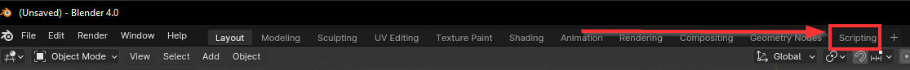
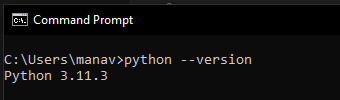
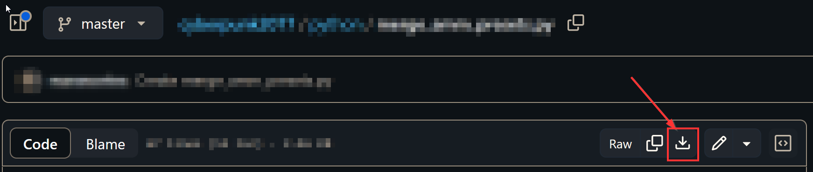
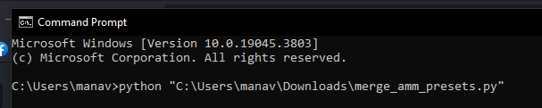

# Running Python Scripts

## **Summary**

**Published**: Dec 14 2023 by [manavortex](https://app.gitbook.com/u/NfZBoxGegfUqB33J9HXuCs6PVaC3 "mention")\
**Last documented update**: Mar 18 2024 by [manavortex](https://app.gitbook.com/u/NfZBoxGegfUqB33J9HXuCs6PVaC3 "mention")

This guide will teach you how to execute Python scripts under Windows.&#x20;

<details>

<summary>Where do I get Python scripts?</summary>

* The Magnificent Doctor Presto's [messy github repository](https://github.com/DoctorPresto/Cyberpunk-Helper-Scripts/)
* manavortex's [messy github repository](https://github.com/manavortex/cyberpunk2077/blob/master/python)
* Simarilius's [messy github repository](https://github.com/Simarilius-uk/CP2077\_BlenderScripts/) (for Blender)

</details>

<details>

<summary>A list of potentially useful scripts</summary>

[For a folder of .mlsetup.jsons, turn layer opacity to 0 for any layer using certain microblends](https://github.com/manavortex/cyberpunk2077/blob/master/python/materials/clean\_up\_scratch\_layers.py)

</details>

## Running Python scripts in Blender

This guide is for running files outside of **Blender**.&#x20;

If you want to run a Python script in Blender, you need to switch your viewport to the scripting perspective and click "play".&#x20;

You can find a dedicated guide on [blender-running-python-scripts.md](blender-running-python-scripts.md "mention") in the 3d editing section.

<figure><figcaption><p>To run Python in Blender, go here.</p></figcaption></figure>

## Step 0: Getting Python

We start by checking if you have Python installed already.

1. Open a Windows command prompt (Hotkeys: `Windows+R`, type `cmd`, press enter)
2. In the window that now opens, type the following:

```
python --version
```

If you have Python installed, it will now say something like "`Python 3.11.3`" . In that case, you can go directly to [#step-1-downloading-the-script](running-python-scripts.md#step-1-downloading-the-script "mention").

<figure><figcaption></figcaption></figure>

Otherwise, please keep reading.

3. Close the command window - after installing Python, you need to open a new one.
4. Go to [python.org](https://www.python.org/downloads/windows/) and download the correct installer package for your system - that will usually be Windows installer (64-bit). Take the latest stable release, it will be at the very top of the page.

<figure><figcaption></figcaption></figure>

3. Now, follow [this guide](https://www.digitalocean.com/community/tutorials/install-python-windows-10) until you have installed Python, or google something like `install python on windows for dummies` and follow that guide until you have installed Python.
4. Proceed to [#step-1-downloading-the-script](running-python-scripts.md#step-1-downloading-the-script "mention")

## Step 1: Downloading the script


The link in this guide is an example script in case you don't have one. If you do, use that one instead.


1. Go to mana's github repo and grab the [.py script to merge AMM presets](https://github.com/manavortex/cyberpunk2077/blob/master/python/merge\_amm\_presets.py): &#x20;

<figure><figcaption><p>Yes, github is scary, this is scary code. Don't worry, I gotchu.</p></figcaption></figure>

2. Download the file by clicking the corresponding button. Save it somewhere where you can find it easily.
3. Open the script with a text editor of your choice (we recommend [Notepad++](https://notepad-plus-plus.org/downloads/) under Windows)
4. Check the top of the file for anything that needs to be adjusted:
   1. Ignore the lines starting with `import`
   2. Read the lines starting with `#`. They are **comments** and will tell you what to put.
5. Once you have everything set up, save the script.

Now it is time to run it. Keep reading!

## Step 2: Run the script

1. Open a command window again (Hotkey: Windows+R, type `cmd`, press enter)
2. Type `python "` (`python`, space, quotation mark)
3. Drag-and-drop the script you downloaded on the console window
4. Type another quotation mark and hit enter

<figure><figcaption></figcaption></figure>


The quotation marks will prevent error with spaces in path names. Leave them away at own risk :)


That's it - the script will now run and do things

## Troubleshooting

### It complains about errors!

1. Step the Python version ([#step-0-getting-python](running-python-scripts.md#step-0-getting-python "mention"), item 1 and 2). As of 2023, the version should start with a 3.

If that isn't it, you made a mistake while editing the script file. Make sure that you don't have single backslashes in strings:

```python
bad  = "C:\Games\Cyberpunk 2077"
good = "C:\\Games\\Cyberpunk 2077"
```

If it's not that, you can use a [Python syntax checker](https://extendsclass.com/python-tester.html), or ask ChatGPT (I'm not kidding). Good luck!

### No module named…

If you are running into this error in **Blender**, it should be enough to run the program as admin.

Otherwise, you are missing a **Python module**, and need to install it. You can do that by running the following code from your Windows cmd:

```
pip install <your_module_name>
```

If that does not work, google for something like `pip install module your_module_name windows`.&#x20;
