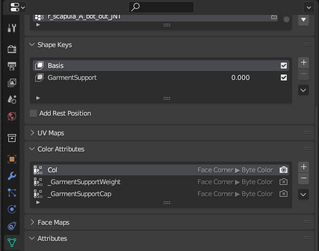
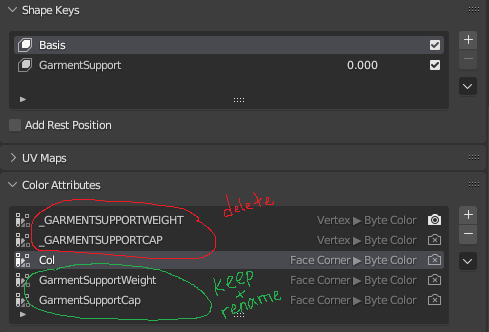
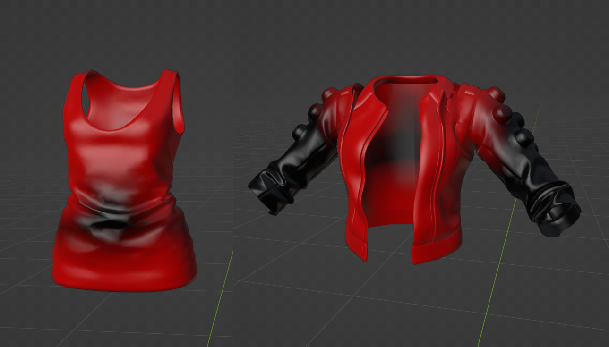
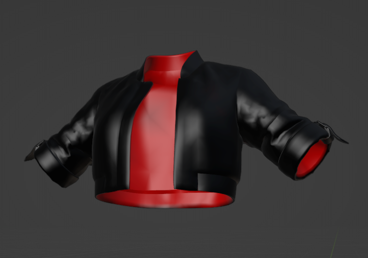
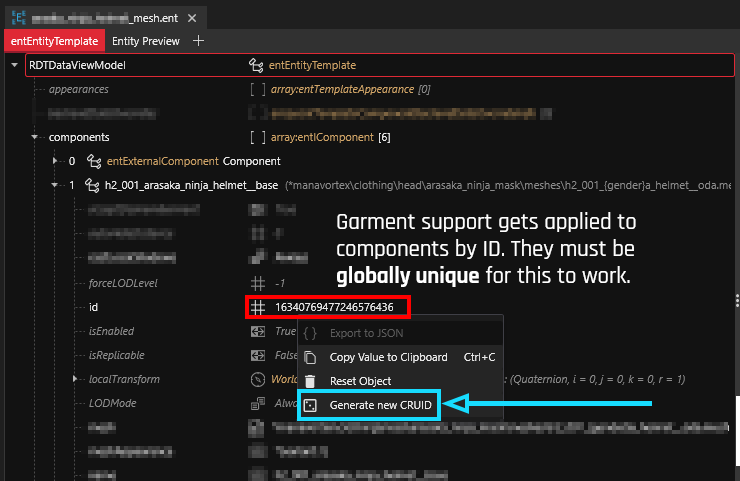

# Garment Support: How does it work?

## Summary

This page will teach you how garmentSupport works – the system that Cyberpunk2077 uses to tuck pants into boots and shirts under jackets. It contains theory, which you don't need to understand to use the system.

_Credit goes to psiberx (_[_discord post_](https://discord.com/channels/717692382849663036/955663052903178270/1059406562277470240) _with initial explanation of the algorithm), island dancer for providing screenshots and know-how, and Auska for making morphtarget/garmentSupport import able in Wolvenkit._

### Wait, that's not what I want!

If you want to **create** garment support, check [garment-support-from-scratch.md](garment-support-from-scratch.md "mention")

If you want to **use** garment support in an existing mod, you only need to use [#component-prefixes](./#component-prefixes "mention")

If your garment support is shrinking too far, check the section for [#painting-garment-support-in-blender](./#painting-garment-support-in-blender "mention")

If you have other problems, see [#troubleshooting-garment-support](./#troubleshooting-garment-support "mention") at the end of the page.

## What is garment support?

The engine morphs garments to avoid clipping — for example, if you equip a pair of boots and V's jeans no longer cover the shoes, but get tucked under.

<figure><figcaption><p>Garment Support in action</p></figcaption></figure>

This process is accomplished via 'parameters' on the mesh:

<figure><figcaption><p>These will show up as shape keys in your Blender export</p></figcaption></figure>

### Why doesn't it work on my NPC?

GarmentSupport only works on **actual garment items** that have been equipped using the game's **transaction system**. As of October 2024, that's not the case for NPCs. \
You'll have to go refitting!

## Component prefixes

Garment support will be applied based on garmentScore. For this, the **prefix** of the component name will be considered (components are named in your .app or .ent file's component array).

A high garment score means that the item is "on top", squishing anything worn "below". (See [#the-algorithm](./#the-algorithm "mention") for details.)

The prefixes are as follows:


<table><thead><tr><th width="130"></th><th></th></tr></thead><tbody><tr><td><p>h0_</p><p>t0_</p><p>s0_</p><p>l0_<br>...</p></td><td>Any component with a 0 in its prefix will be treated like a body mesh (no deform/squishing of <strong>any</strong> meshes with x0_ prefixes across .ent files)</td></tr><tr><td>h1_</td><td>Head inner (mask, sunglasses)</td></tr><tr><td>h2_</td><td>Head outer (helmet, bandana)</td></tr><tr><td>t1_</td><td>Torso inner (shirts)</td></tr><tr><td>t2_</td><td>Torso outer (jackets, coats...)</td></tr><tr><td>s1_</td><td>Shoes</td></tr><tr><td>l1_</td><td>legs (pants that aren't leggins)</td></tr></tbody></table>

## How it looks if it's broken


<figure><figcaption><p>Often, you can salvage things by deleting the parameters in WolvenKit</p></figcaption></figure>

## The algorithm


TL;DR: High garment score means "on top", items below will get squished.



Components with the same prefix in the same .ent file will not squish each other, e.g. `l1_stockings` and l1\_pants will not deform each other, but they will deform `s1_socks`


The game calculates the garment score by checking the prefix of component names, where the one with the lowest prefix is the innermost:

```
s0 = 0    // no prefix will also be 0
l0 = 10
a0 = 20
t0 = 30
h0 = 40
s1 = 50
l1 = 60
t1 = 70
i1 = 80
hh = 90
h1 = 100
h2 = 110
t2 = 120
```

After considering the component name, the game will consider the tags in the .ent's `visualTagSchema`:

```
PlayerBodyPart = -2000
Tight = -1000
Normal = 0
Large = +1000
XLarge = +2000
```

An example for `t0_000_pma_base__full` (the default body component, torso+legs):

```
+30          prefix: t0_
-2000        visualTag: PlayerBodyPart

—————————————————————————
-1970
```


## Painting Garment Support in Blender

_based on experimental research by revenantFun_

### TL;DR:&#x20;

1. Make sure that you have the parameters `_GarmentSupportWeight`, `_GarmentSupportCap` and `Col`, and that all of them are in the format `Face Corner > Byte Color`
2. `_GarmentSupportWeight`: Vertex paint it red (RGB 1, 0, 0)
3. `_GarmentSupportCap`: Vertex paint it black (RGB 0, 0, 0) if it isn't
4. `Col`: Vertex paint it black (RGB 0, 0, 0) if it isn't
5. You're done!

### Step by step, with explanations

In a given mesh, garment support is handled by two color attributes: `_GarmentSupportWeight and` `_GarmentSupportCap`. In Blender, these are found in the `Data` panel under `Color Attributes`, together with the third attribute, `Col`.


For exporting, all three of these must be in the format `Face Corner > Byte Color`&#x20;


Here's how it looks like:

<figure><figcaption><p>Always make sure all three are Face Corner > Byte Color format before exporting. You can convert back and forth between formats with the down arrow button on the right.</p></figcaption></figure>

### Fixing up old meshes

If you are editing vanilla items, you may find parameters of the type `Vertex -> Byte Color` with their names in ALL CAPS, such as `_GARMENTSUPPORTWEIGHT` _and_ `_GARMENTSUPPORTCAP`. Delete them by selecting them and clicking the minus icon:

<figure><figcaption><p>Repeat for every submesh in your mesh, until they all match the required format.</p></figcaption></figure>



It's crucial to repeat this process for every submesh in your garment, or your attributes will not get written correctly on export.


If all you're doing is trying to preserve existing garment support before doing some light editing or refits on vanilla garments, you can stop right here!

If you're making a brand new item and making your garment support from scratch, however, you'll need to keep reading to find out how these parameters should look.

### Painting Your Parameters

Garment support color attributes are edited in `Vertex Paint` mode in the viewport:

<figure><figcaption></figcaption></figure>

#### `_GarmentSupportWeight`

This attribute affects how the mesh behaves when layered with other garments:

<table><thead><tr><th width="131">Colour</th><th width="125">RGB value</th><th>Explanation</th></tr></thead><tbody><tr><td>Black</td><td>0, 0, 0</td><td>heavy deform, lots of squishing (default behaviour)</td></tr><tr><td>Red</td><td>1, 0, 0</td><td>light deform, no squishing</td></tr></tbody></table>


Simple base game clothing will have a flat red layer. If you have a flat **black** layer, you may want to paint it red, as this will deform more than you might want.


<figure><figcaption><p>Two examples of correctly-formatted vanilla garment weights. If in doubt, just paint it red.</p></figcaption></figure>

#### `_GarmentSupportCap`

`_GarmentSupportCap` determines stopping points for the deformation effects of garment support. Like `_GarmentSupportWeight`, it is painted only with red and black.&#x20;

<table><thead><tr><th width="131">Colour</th><th width="125">RGB value</th><th>Explanation</th></tr></thead><tbody><tr><td>Black</td><td>0, 0, 0</td><td>no garment cap</td></tr><tr><td>Red</td><td>1, 0, 0</td><td>limited GS influence on the meshes below (more red = less squishing). The garment itself will serve as a delimiter.</td></tr></tbody></table>

With vanilla items, you will see red GarmentSupportCap on areas that will either

* directly intersect with the body \
  _(the ends of sleeves and legs, the bottom of a shirt, the opening of a turtleneck...)_
* sit right above something that _shouldn't_ be deformed \
  _(the player body, or a tight-fitting shirt, or the lapels of an open jacket)_

The cap **provides a shrinking limit**, so without GarmentSupportCap, every part of your mesh will apply shrinking/tucking on the meshes layered "below".&#x20;

Often, this is completely okay and your `_GarmentSupportCap` layer can be flat black. Otherwise, you need to paint red those parts which either cut straight through the body or butt right up against other items.

<figure><figcaption><p>The inside layer of this jacket is red because it will sit right next to either the body or to a tight-fitting shirt beneath. The ends of the sleeves are red where they will intersect with the arms. If it looks like a pair of <a href="https://kagi.com/proxy/Christian-Louboutin-Red-Soles-Leatherpants-1705105G7A8239-003.jpg?c=lFxAz961AQseBBy54_M8zgruPArCy1Fhk5UmjaBwEUZWFft0OeQLjAipIZg8CHd0ifGMT2Eb499x1OutYZAOcLbNVqrdz9xzZCcjmNpkg9uJW8i26v9bWW0PdCgzByEIU_oMoC1P4PKNDS203JBoJeUGAnigYvaSy_nGhRg7lAQbnOqIvBUvuEwaJOmSgWJYF32onWrTewAZ3GZYBkGz6OaR39jvLvb4ZaTZIiEBxKNJJU-MsZSTDfFHj-Yxbeik7wZJ3vH0hhv4yeZgDCLuPUEm9WjrybgusPqHU8oJ2cA%3D">Louboutins</a>, you've painted it inside-out.</p></figcaption></figure>

If this step is skipped, you can have unexpected clipping, but nothing will break. If your mesh seems like it's being too aggressive when you layer it over other things, and leaving holes in whatever you're trying to layer under it, try painting more of the inside faces red.

### That all seems like a lot of work? Can I make this less worse somehow?

The simplest way to add functioning garment support to your custom item is to have a flat red `_GarmentSupportWeight` attribute, a flat black `_GarmentSupportCap` attribute, and a flat black `Col` attribute. Your mesh will export and, assuming you have the proper shapekeys, will morph in (more or less) the way you'd expect! The next page will outline this process step-by-step.


**Every** submesh of your garment _must_ have these three attributes in order for garment support to function correctly - even submeshes that contain non-deformable things like accessories, buckles, chains, belts, etc.


## Troubleshooting Garment Support

### My garment support is shrinking too far!

Check [#painting-garment-support-in-blender](./#painting-garment-support-in-blender "mention") — **paint it red**, baby!

### My garment support explodes on contact with another item!

It's not doing that to spite you. Most likely, you have a non-unique component ID, and the game can't tell the two items apart. Here's how to resolve that:

<figure><figcaption><p>The CRUID editor is available in Wolvenkit 8.14+ - you can go grab the <a href="https://github.com/WolvenKit/WolvenKit-nightly-releases/releases">Nightly</a>, too </p></figcaption></figure>

### Importing with Garment Support

Make sure that your mesh has the [Import Garment Support](https://app.gitbook.com/s/-MP\_ozZVx2gRZUPXkd4r/wolvenkit-app/usage/import-export/models#import-garment-support "mention") property checked (this should be default by now).

If that doesn't work, you still have the option to re-create [garment-support-from-scratch.md](garment-support-from-scratch.md "mention") in Blender

### Yeeting Garment Support

If you're fed up with this shit and just want your item to stop cosplaying as exploding pixel cloud, you can use [#option-2-guaranteed-to-work-delete-garmentsupport-from-the-mesh](../troubleshooting-your-mesh-edits.md#option-2-guaranteed-to-work-delete-garmentsupport-from-the-mesh "mention").


This wil prevent your garment from shrinking under other, "larger" garments, and practically guarantee that it clips.

