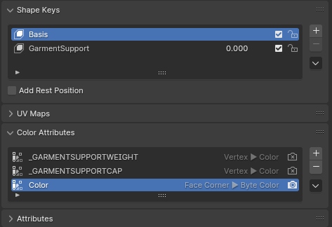

# Painting garment support parameters

## Summary

Created on: 28. 10. 2023 by [revenantFun](https://app.gitbook.com/u/bkAQ2D9IRHUOAUHOfXIINTBTeWz1 "mention")\
Last documented update: Feb 12 2025 by [revenantFun](https://app.gitbook.com/u/bkAQ2D9IRHUOAUHOfXIINTBTeWz1 "mention")

This page will describe the two color attributes used by Garment Support and how to edit them in Blender.

### TL;DR - or The Lazy Version, for paint-haters:&#x20;

1. Make sure that under Color Attributes you have the parameters `_GARMENTSUPPORTWEIGHT`, `_GARMENTSUPPORTCAP` and `Color`, and that the first two are in the format **Vertex > Color** while the last is in the format **Face Corner > Byte Color**.
2. `_GARMENTSUPPORTWEIGHT`: Vertex paint it red (RGB 1, 0, 0)
3. `_GARMENTSUPPORTCAP`: Vertex paint it black (RGB 0, 0, 0)
4. `Color`: Vertex paint it black (RGB 0, 0, 0)
5. Done!

### Garment Support Parameters And You

In a given mesh, garment support is handled by two color attributes: `_GARMENTSUPPORTWEIGHT`and `_GARMENTSUPPORTCAP`. In Blender, these are found in the Data panel under Color Attributes, together with the third attribute, `Color`.


The exact names of the parameters and their color formats are dependent on the specifics that the Cyberpunk Blender Addon and Wolvenkit expect from a mesh, as well as the versions you're using of the addon and of Blender itself. They may change subject to coding errors or become outdated. Use caution, try to match whatever vanilla meshes have when you export them, and if you notice an error on this page, please feel free to edit it or ping someone on Discord for help.


Here's how this currently looks in Blender 4.1:

<figure><figcaption>
You can convert back and forth between formats with the down arrow button on the right. If you are editing an older .glb, you may need to change or rename your attributes to match what the current version of Blender and/or the Blender addon requires.
</figcaption></figure>


**Every** submesh of your garment _must_ have these three attributes in order for garment support to function correctly - even submeshes that contain non-deformable things like accessories, buckles, chains, belts, etc.


### Painting Your Parameters In Blender

Garment support color attributes are edited in `Vertex Paint` mode in the viewport:

<figure><figcaption></figcaption></figure>

#### `_GARMENTSUPPORTWEIGHT`

This attribute affects how the mesh deforms when it is layered with other garments. Specifically, `Weight` determines the **strength** of the morphing that is applied to the mesh when other clothes are stacked over it. It can be thought of as a map of the relative _flexibility_ of the mesh; which parts are more stable, which are squishier, and by how much.

<table><thead><tr><th width="131">Colour</th><th width="125">RGB value</th><th>Explanation</th></tr></thead><tbody><tr><td>Black</td><td>0, 0, 0</td><td>heavier deform; lots of squishing, easily crushed by other garments</td></tr><tr><td>Red</td><td>1, 0, 0</td><td>lighter deform; less severe squishing by other garments</td></tr></tbody></table>


Simple base game clothing will often have a flat red layer. If you have a flat **black** layer, you may want to paint it red, otherwise it will deform more than you might want.


<figure><figcaption>
Two examples of correctly-formatted vanilla garment weights. If in doubt, just paint it red.
</figcaption></figure>

With vanilla items, you will often see one of two general patterns for weight painting:

1. Largely red, with a little black toward the center of mass
2. Largely black, with red areas around the neck and shoulders, hips and pelvis, and the ends of limbs

This is illustrative of what `GARMENTSUPPORTWEIGHT` is useful for, which is creating a smooth transition between areas that are tucked in or covered versus areas that are not. If you leave it either completely red or completely black, there will be no differentiation between which parts of your garment are crushed and which are not besides the presence (or absence) of another piece of clothing nearby. The morphing will work, but it will work _uniformly_. With careful weight painting, however, you can affect the degree to which areas are crushed, such as where the bottom of a formal shirt might be tucked into pants.


While it can refine and soften the effect of morphing on your mesh, garment support weights cannot work miracles. It won't completely prevent an area from morphing, even at full 1.0 red strength. If you need to keep an area from being squished at all, consider editing your GarmentSupport shapekey by hand to give that area less deformation overall.


The reasoning behind not simply painting it all red and calling it a day is simply that sometimes you do really want some serious crushing to happen! Having a clean transition between red and black lets you preserve that functionality, and also lets you create less of a Crushed Into Triangles look wherever heavy morphing is required, such as around the edges of pants and sleeves, or the areas around the torso where a shirt disappears under the jacket above it.

#### `_GARMENTSUPPORTCAP`

This attribute determines the extent of the garment's effect **on other meshes**. In other words, it defines a limit on what effect the garment will have on whatever mesh is **beneath it** in the layering system, provided that that mesh also has Garment Support. Whereas the `Weight` determines how other clothes affect _your mesh_, the `Cap` determines how your mesh affects _others_.

"The mesh beneath" can be understood here to be any other GS-enabled mesh, including vanilla clothes, GS-enabled modded clothes, or even the player body itself.

<table><thead><tr><th width="131">Colour</th><th width="125">RGB value</th><th>Explanation</th></tr></thead><tbody><tr><td>Black</td><td>0, 0, 0</td><td>Cap not active; this part of the garment <strong>will</strong> crush the mesh beneath it.</td></tr><tr><td>Red</td><td>1, 0, 0</td><td>Cap active; this part of the garment will <strong>not</strong> crush the mesh beneath it.</td></tr></tbody></table>

Like `_GARMENTSUPPORTWEIGHT`, the `_GARMENTSUPPORTCAP` is painted using red and black. _**Unlike**_ the weight parameter, the cap parameter is painted not in a gradient between red and black, but in areas of either one or the other at full strength. Any vertex painted red with a strength ≥ 0.5 will be treated the same as full red for the purpose of deciding whether the cap is active for that vertex.

With vanilla items, you will see red on areas that will either

* directly intersect with the body \
  &#xNAN;_(the ends of sleeves and legs, the bottom of a shirt, the opening of a turtleneck, the waist of pants)_
* sit right above something else that _shouldn't_ be deformed \
  &#xNAN;_(the inside face of a bra resting flush against the player body, the inside of a high jacket collar where it touches the neck and collarbones, the underside of the lapels on an open jacket)_

The cap **provides a limit**; without it, every part of your mesh will apply shrinking/tucking on the mesh(es) layered below it, in accordance with the `Weight` of the mesh underneath.&#x20;

Often, this is completely okay, and your `_GARMENTSUPPORTCAP` layer can be left black. Otherwise, you will need to paint red those parts which either cut straight through the body or butt right up against other items.

<figure><figcaption>
The inside layer of this jacket is red because it will sit right next to either the body or to a tight-fitting shirt beneath. The ends of the sleeves are red where they will intersect with the arms.
</figcaption></figure>

Note that this does not actually **prevent** the mesh beneath your garment from morphing at all - it still will, as determined by its own `Weight`. But the "crushing strength" of an item without painted caps is additive with the mesh it's affecting; that mesh will deform on its own, and then the mesh on top will deform it further with no regard for health or safety and you may end up getting more than you wanted. This tends to produce heavy clipping, especially near areas that are both a) highly crushed and also b) easily visible to the camera, such as under the open sides of jackets, or up against high collars, or beneath the hems of sleeves.

* Areas with heavy crushing that are going to be invisible to the player are fine, but should be avoided in places that are exposed. This is why painting the cap is especially important for skimpy clothing, clothing with a lot of large gaps, or jackets that will be layered over larger items.
* The effect of the cap will be more pronounced if you are using or testing your garment on a body mod that does not itself have Garment Support. (This is most modded bodies!) In vanilla, the effect is less noticeable because the clothes and the body all shrink together in harmony; with a modded body that stays static while the clothes around it squish, you can end up with body parts suddenly exposed where you didn't intend them to be.


If the cap is left black or even skipped completely, nothing will actually _break_. However, if your mesh seems like it's being too aggressive when you layer it over other things, and leaving holes in whatever you're trying to layer under it, try painting more inside faces red.


### That all seems like a lot of work. Is there an easy mode?

Sure! The simplest way to add functioning garment support to your custom item is to have a flat red `_GARMENTSUPPORTWEIGHT` attribute, a flat black `_GARMENTSUPPORTCAP` attribute, and a flat black `Color` attribute. Your mesh will export and, assuming you have the proper shapekeys, will morph in (more or less) the way you'd expect!

But if you'd like to get it working as clean and smooth as the vanilla morphing can be at its best, getting into the practice of manually painting your weights and caps can make that happen for you.

