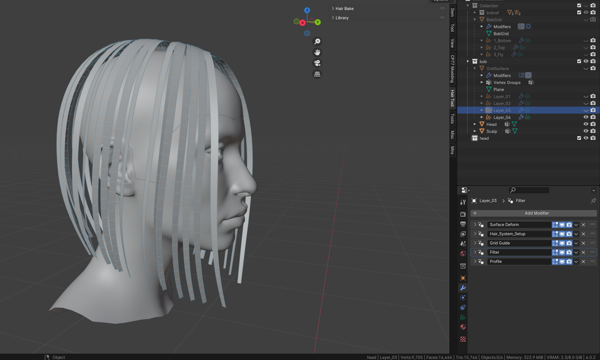

# Hair modeling beginner tutorial

## **Summary**

**Created:** July 21 2024 by **@eagul**

This guide will show you how to create your own hair in Blender from scratch.

## **Prerequisites:**

* Some familiarity with Blender and basic modeling skills. \
  If you don't know how to Use Blender yet, check out [blender-getting-started](blender-getting-started/ "mention") and complete at least the donut tutorial!
* The paid Blender AddOn Hair Tool (purchase it on [Gumroad](https://bartoszstyperek.gumroad.com/l/hairtool))

**Usefull links:**\
Hair Tool discord server: [https://discord.gg/GwjA9NrKww](https://discord.gg/GwjA9NrKww)\
Hair Tool official documentation: [https://joseconseco.github.io/HairTool\_3\_Documentation/](https://joseconseco.github.io/HairTool\_3\_Documentation/)

You can download the example project [from our github](../../\_example\_mods\_and\_templates/hair\_tool\_bob\_demo.7z)!


Don't blindly copy the exact values I used, play around with them and see what works best for your hairstyle!&#x20;


## Step 1: Creating a grid surface.

Using any modeling method you like, create a so called grid surface. This should have the topology of a plane (no holes, loops, etc). Mark the root edge sharp. \
\
**Core concept:** Keep the poly count low. The less 'control points' you have, the easier it is to control the object. \
&#x20;

<figure><figcaption>
A correct grid surface
</figcaption></figure>

Grid surface tips

Shrinkwrap the sharp edge to the scalp mesh.\
Use a Mirror Modifier. Hair Tool has ways to break up the symmetry.\
It is best to only have a single grid surface per hair system. One half of a grid can still affect curves which are not generated from it, and this can cause issues.\
Subdivision surface modifier can be used.\
\
I model by simply extruding edges, and some sculpt mode mixed in.\
Loop Tools addon is good for cleanup ('relax').\
\
Set Viewport display to 'Wire'. You can change the opacity in viewport overlays menu, and assign random colors in shading menu. \
 (1) (1) (2).png>) (1) (1) (2).png>)

You can set 'Mean Vertex Crease to 1 on specific edge loops, if you want them to remain sharp while using a subdiv modifier.\
 (1).png>)

## Step 1.1: Generating the first layer

Why layers?

When building hair card meshes, you want bottom layers to be opaque, and surface layers to be progressively more transparent. The bottom layers will prevent the scalp from shining through, while the covering layers will provide a volumetric effect, and hide the sharp contours of high-alpha bottom layers.\
\
Here is an example of a hair texture. Notice multiple strands, which become more and more transparent the further to the right they are. \
 (1).png>)

There are multiple textures with similar density, this will introduce a bit of diversity and randomness. Hair tool is able to randomly distribute select UV boxes to a selection of cards, using UV tools which will be described later.

Why not just use a ton of lower density textures? It is certainly an option, but poly count can get quite high with such an approach. With a proper layer structure and optimization, hair meshes can consist of as little as 3000 vertices. Most of Cyberpunk 2077's meshes have 10-20k vertices.

\
Open the HT panel (N), expand the Hair System, Sub-Systems and Deformers menus.

<figure><figcaption></figcaption></figure>

Press CTRL + Shift + H, then Transfer Hair system to Empty Curve. The hair object will now be a curves object parented to the grid surface.&#x20;

<figure><figcaption>
Change viewport display settings if you like
</figcaption></figure>

Add the following deformers:\
\- Align tilt to source surface\
\- Mirror

Additionally, set the desired profile width in the Profile tab.

Deformer settings and tips

 (1) (2).png>)

Increase subdivision steps to 4. This affects the 'virtual' curve's subdivision, but it will not affect the final poly count. If you need more points near the roots, use the Slide Points deformer. Change Uniform factor to change the distribution of curves across the sharp edge.

An incredibly usefull deformer. Aligns the tilt of the curve to the source surface. Enable twist fix if the curve is twisting in unexpected ways.

 (2).png>)

Mirror deformer will create a symmetric copy around the origin of the object, unless a different target is specified. For now, the symmetry is perfect (which is not desired), but that will be fixed later.\
The order of deformers matters. They work from top to bottom, just like modifiers. You can think of them as such.&#x20;

<figure><figcaption>
Current progress
</figcaption></figure>

## Step 1.3: Adding volume to the first layer

Add a 'Filter' Subsystem below the Grid Generator Subsystem. This subsystem allows you to add deformers to any curve object. It does not matter if curves are virtual or real.&#x20;

What are virtual and real curves?

You may have noticed already, that if you go into edit mode on the curves object we are working on, you are seemingly unable to interact with the individual curves. They are still 'virtual', sometimes referred to as 'fake'. That's because they are fully procedurally generated from the grid surface. \
Procedural workflows have a ton of advantages, you can change parameters at any time, the primitive geometry is very easy to edit if made correctly."\
A subsystem or deformer can easily be copied over to a new grid surface or system, making the creation of subsequent hairstyles much faster.\
\
A subsystem can be 'baked'. This will create real curves, which you will be able to edit freely in edit mode.\
However, since subsystems are applied from top to bottom, you can only bake them starting from the top.\
\
It is a good practice to leave everything procedural as long as possible. Additionally, make sure to save a backup before baking.

A separate filter subsystem is created for the upcoming deformers. This is done so the first subsystem can be later baked separately from these deformers. It will facilitate manual edits, because there will be far less control points.

Add the following deformers:\
\- Duplicate strands\
\- Attach to surface\
\- Mirror (hide it in the first subsystem)

Deformer settings and tips

 (1).png>)

The duplicate deformer will multiply each filtered curve, and distribute the children in a set radius. \
Make sure to enable Even Thickness to prevent children clipping through eachother if generated on an angled surface.\
\
Distribution Shape value is 0 by default. A value closer to 1 will pull the generated curves closer to the parent, and a negative value will push them away toward the circumference of the radius. Here, a value of 0.2 resulted in nice layering toward the tips.

 (1).png>)

A duplicate deformer is often paired with a Clump deformer. This pulls the duplicated children toward their parent.

 (1).png>)

Attach to surface deformer will pull the roots of the curves toward the source surface. Make sure to personalize the input values on this deformer, they can vary significantly for each hairstyle. You want to avoid creating patches of clipping, as shown here:

 (1).png>) (1).png>)

<figure><figcaption>
Current progress
</figcaption></figure>

## Step 1.4: Breaking up the perfection

In order to create a convincing mesh, you need to introduce some imperfections. In procedural HT, this is mostly accomplished by using randomizing input masks, and the noise deformer.

Add the following deformers:\
\- Add Tilt\
\- Noise Deform

Deformer settings and tips

The Add Tilt deformer with a randomize input mask is capable of... you guessed it... adding... a random tilt... to individual strands...\
Press the downward arrow right of the tilt value to randomize said value.\
 (1).png>)

For this hair, I will be using a fairly low random tilt, to have a straight, and neat hair look. For messier hairstyles, or more outside layers, a higher tilt value can be beneficial.\
 (1).png>)

You can mess with the flip seed to achieve a better result for specific strands, if needed.\
\
Adding some random tilt can also help greatly when hair like this is viewed from the front (cards are flat from the side, so in certain cases the hair may appear overly thin).

The Noise Deform deformer is incredibly usefull for introducing some randomness to the curves.

 (1).png>)

Both the random Tilt and Noise Deform deformers should be **below** the mirror deformer. As stated previously, deformers take effect from top to bottom, so the randomness introduced will not be symmetric.

<figure><figcaption>
Current progress
</figcaption></figure>

## Step 1.5: A quick preview

It's a good practice to check the shaded look of the hair during modeling. This can for example help you spot clipping or thin areas, while also providing a more accurate visual representation of the final result.&#x20;

Setting up the material

If you are using HT default material/shader, you can skip this section. \
If you plan to use a custom shader or textures, read on.

In the Profile menu, you can find 2 input fields, one for the material, one for UV Data.

 (1).png>)\

When selecting a custom shader, this happens:

 (1).png>)\

To fix this issue, copy the HTool\_UV node from the HT default material, and plug it into the image nodes in your custom shader.

 (1).png>)

Now, your UV's will most likely be completely messed up. To fix this, navigate to UV Editing workspace.

 (1).png>)

Press the Hair UV button in the top-right corner of the UV editor and follow the instructions to set up new UV boxes for your hair.

.png>)\

Then, navigate back to your deformers, where you can find the UV Regions Distribute deformer. Use it to assign UV boxes to the layer.\

Navigate to Render settings, select EEVEE, and enable Ambient Occlusion!

<figure><figcaption></figcaption></figure>

And now, you should have a decent preview of what you have created already :D\
Here, I added a Lenghten deformer to re-gain some of the length lost to UV transparency (which i forgot to account for before).\

<figure><figcaption>
Current progress
</figcaption></figure>

## Step 1.6: Generating the second layer

Duplicate the curve object you used for layer 1. Press the \[2] indicated with the red circle. **Do this for both subsystems!**\
&#x20;If you don't want profile data to remain linked, make profile data unique too. I will not be making profile data unique for this hair.

What is the [2]?

When you duplicate an object with a hair system, or paste a hair system, or perform the same actions on the profile tab, you are not creating new data blocks. Rather, linking a new object to the same data.\
Changing a parameter in the hair syste of object 1 will also change system 2, because they share the same data.\
By simply pressing the \[2] (or higher number, if more systems shade data), you can make it unique, and thus independent.&#x20;

<figure><figcaption></figcaption></figure>

Hide the filter subsystem of the second layer.&#x20;

Add the following deformers:\
\- Slide Points\
\- Push Out\
\- Attach to Surface

Deformer settings and tips

Slide points will give you more curve resolution towards eighter end of the strands. Here we need a bit more points at the roots.\
.png>)

\
Add the Attach to Surface deformer below the Push Out, but before you start tweaking the input curve.

.png>)\

The Push Out deformer will allow you to create a second layer from the same grid surface. Add a Profile Curve input mask to the Influence Range value of the Push Out deformer. Use the influence range input to finely control how much each part of the curve gets pushed out. You want the curves in this subsystem to be just above the first layer. Make sure to push the roots out above the first layer too!

.png>).png>)

<figure><figcaption>
Enable random wire color in shading options for convenience. Blue is the second layer
</figcaption></figure>

## Step 1.7: Adding volume to the second layer

Unhide the filter subsystem. Hide the mirror deformer in the first subsystem.

At this point, you are free to customize this layer however you like.\
These are the changes I made:\
\- Increase the amount of strands generated from the grid\
\- Randomize spacing of said strands to some degree\
\- Increased random tilt to 15 degrees\
\- Increased Noise Deform amplitude a bit\
\- Slightly increased Lenghten, and added a random Trim deformer. Average length slightly increased.\
\- Selected lower density UV boxes for this layer.

<figure><figcaption></figcaption></figure>

<figure><figcaption></figcaption></figure>

## Step 1.8: Final layers

Optional, but if your poly limit allows for it, you can include additional layers for even more detail. Use similar techniques as described above to create those layers.\
I am adding 2 more layers, low density, with large push out values.&#x20;

Screenshots of my layers

.png>)

.png>).png>)

To create the 4th layer, I used a Set Radius deformer. It allows you to control the width of cards, without needing to make the profile unique.

## Step 2: Fringe

To create a fringe, you can simply repeat the same steps as for the main body of the hair, so create a grid surface and generate layers from it. However, for the purpose of showcasing HT's features, I will demonstrate a more manual approach to modeling hair.

Select the scalp mesh. Press Shift + A, add Curve > Empty Hair. Then, select Sculpt mode.\
In the top bar menu, change settings for Curve Shape. I used 0.05m and 5 points for this. Both can be changed easily later in edit mode. Place down a couple curves. Comb them into position using the appropriate brushes, using edit mode, or Hair Tool's modeling workspace.

HT modeling tools

Hair Tool introduces a whole curve modeling workspace, with a couple unique tools,  which greatly facilitate manually editing curves.\
Documentation: [https://joseconseco.github.io/HairTool\_3\_Documentation/hair\_modeling/](https://joseconseco.github.io/HairTool\_3\_Documentation/hair\_modeling/)\

<figure><figcaption>
Manually placed guide curves for the fringe
</figcaption></figure>

Add the following deformers:\
\- Align Tilt\
\- Mirror \
\- Radius set, and taper the roots (flip influence range arrow)\
\- Optionally other procedural deformers, I added a Lenghten, but you can just as well simply edit the curves directly.

<figure><figcaption>
First layer of manually placed curves
</figcaption></figure>

Then, duplicate the object, make subsystems unique, push it out using the deformer or manually do it, in order to create the next layer. \
It is inefficient to model every curve manually, so make use of the duplicate strands deformer, as showcased earlier in the procedural section. \

Deformers and layers

.png>)

These are the deformers I used for the second and third layer of the fringe. Each layer is made from 5 or 6 guide curves with 5 vertices each.&#x20;

.png>).png>)

<figure><figcaption>
Hair after modeling 2 more layers for the fringe
</figcaption></figure>

Again, if your poly count allows, it's good to add some thin coverling layers on top, they will aid with realism and blend the fringe a bit better into the main part of the hair.

<figure><figcaption>
One more low-density layer with broken flow
</figcaption></figure>

## Step 3: Baking Subsystems and manually finishing

Any hairstyle will have some strands that cannot be tamed. Sometimes they are referred to as flyaways. When making the fringe, you can simply model them while making the final layers, because you are using real curves anyway. See image above.

Converting 'fake' curves to real curves

This operation is called Baking Subsystems. You can access it by pressing the 3 dots next to the Sub-Systems menu. Baking will allow you to finish procedural operations manually.

.png>)

If your strands are not attached to the scalp, and you want them to remain this way, make sure to un-check the attach to surface option in the context menu which appears in the bottom left when baking.

If you are satisfied with the procedural result, you don't need to bake it.

**Make sure to apply the subdivision surface modifier to your grid surface before baking subsystems.**

It is a good practice to backup a procedural copy of the object before baking.

If you want to add deformers again after baking, you can simply add a new filter subsystem.

If you would like to finish layer 2 (where we had 2 subsystems, one guide curve generator, one curve duplicator), you can bake only the first subsystem. This will only convert the curves from the first subsystem to real instances, making it much easier to edit.\
\
I'm baking layer 3 and 4, which do not use Duplicate strands deformers, so I can simply bake all subsystems.

<figure><figcaption>
Layer 3 after baking, with strand overlay enabled.
</figcaption></figure>

After baking your subsystems, you can use any curve modeling tools to edit them further.\
HT's Hair Modeling is very well suited for this.&#x20;

<figure><figcaption>
After manually adding some flow variation to Layers 3 and 4
</figcaption></figure>

## Step 4: Finishing Touches

Add a couple extra strands to break up the flow, if desired.

<figure><figcaption></figcaption></figure>

<figure><figcaption></figcaption></figure>

Add some deformers to the strands, be creative!

## Final result:

<figure><figcaption></figcaption></figure>

<figure><figcaption>
There's a bit of shading issues near the top of the fringe, but they won't be an issue when ported to Cyberpunk. If the goal is different... figure it out i guess, good luck.
</figcaption></figure>

