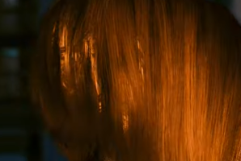
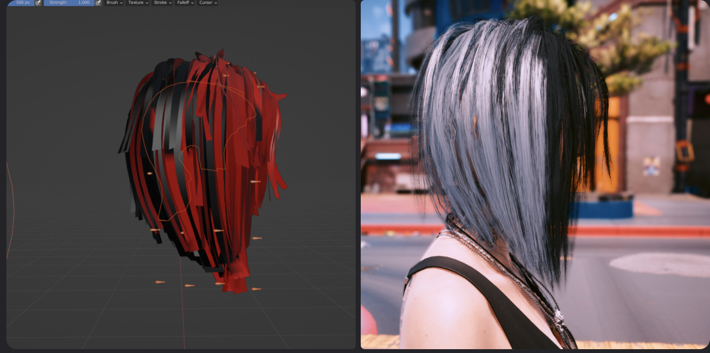
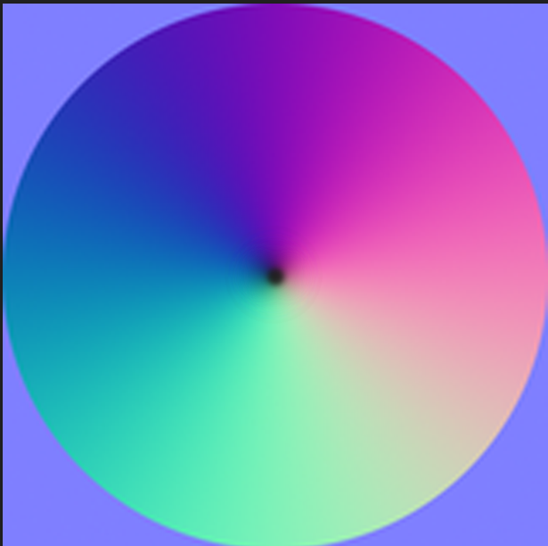
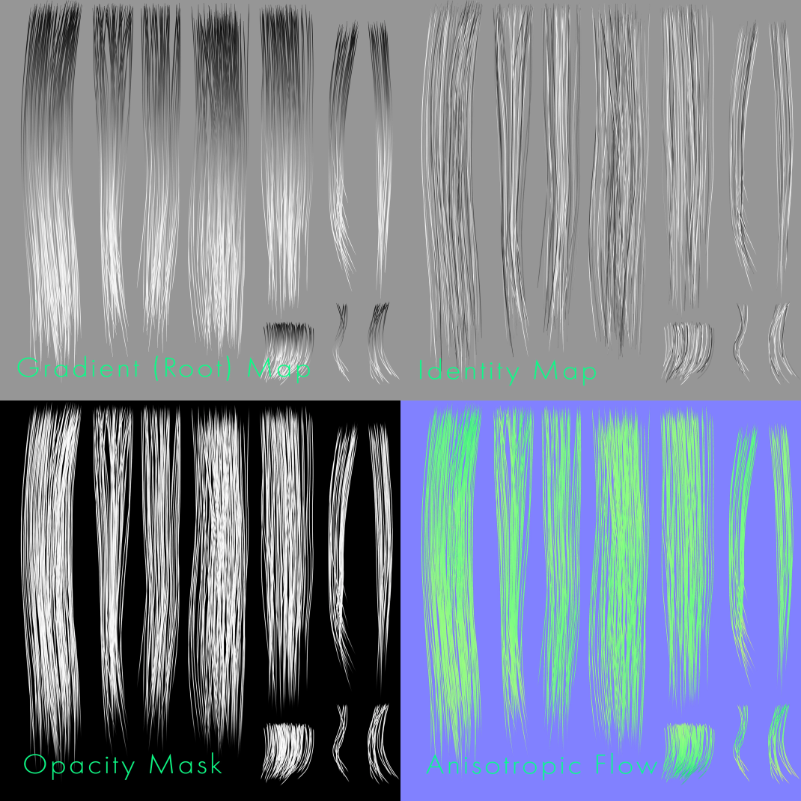

# Vertex Color and Hair

## Summary

Created: Jul 07 2025 by [mana vortex](https://app.gitbook.com/u/NfZBoxGegfUqB33J9HXuCs6PVaC3 "mention") based on a rant by IslandDancer\
Last documented update: Jul 07 2025 by [mana vortex](https://app.gitbook.com/u/NfZBoxGegfUqB33J9HXuCs6PVaC3 "mention")

Cyberpunk hair material uses the vertex colour attribute to fake ambient occlusion. They are usually red at the scalp and the innermost layer of hair cards, whereas the outer layers are black.&#x20;

Doing it the other way around looks bad:

<figure><figcaption></figcaption></figure>

<figure><figcaption>
Red is dark and dull, black is bright and shiny
</figcaption></figure>

## Anisotropy

[Anisotropy](http://www.neilblevins.com/art_lessons/aniso_ref_real_world/aniso_ref_real_world.htm) is a reflection characteristic of any surface with a grained/grooved structure that runs predominantly in one direction. Reflections blur and stretch perpendicular to the direction of the grooves.&#x20;

Cyberpunk mimics this behaviour with the **flow texture,** which acts as a tangent map in telling the shader that the hair strands run from root to tip:

<figure><figcaption>
Directions are encoded via colour
</figcaption></figure>

<figure><figcaption></figcaption></figure>

The dread flow map is inverted, as the dreadlocks have strands running in the opposite direction.

## Demo video


Video courtesy of IslandDancer. Paint job is deliberately shitty.



Anissotropy in action, courtesy of IslandDancer


