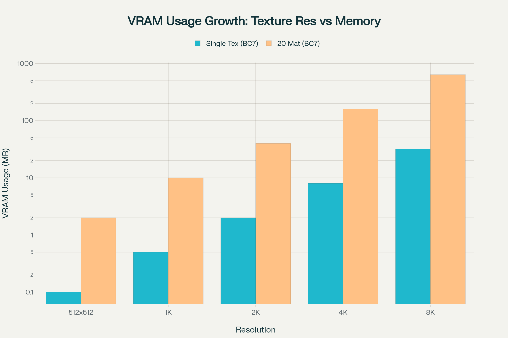

# On 4k textures and high poly meshes

## Summary

**Created:** Jul 18 2025 by [mana vortex](https://app.gitbook.com/u/NfZBoxGegfUqB33J9HXuCs6PVaC3 "mention")\
**Last documented update:** Jul 18 2025 by [mana vortex](https://app.gitbook.com/u/NfZBoxGegfUqB33J9HXuCs6PVaC3 "mention")

This page will tell you why high resolution textures and high poly meshes are **bad practice** and why you should stay away from them.&#x20;

### Further reading

[Why Does 4k Gaming Require So Much VRAM? (Tom's Hardware)](https://www.tomshardware.com/news/why-does-4k-gaming-require-so-much-vram)

[Does Polygon Count in 3d Modelling Matter For Game Assets?](https://3d-ace.com/blog/polygon-count-in-3d-modeling-for-game-assets/)

[Optimize mesh rendering using level of detail (UNITY docs)](https://docs.unity3d.com/6000.3/Documentation/Manual/lod-landing.html)

[A Stream Algorithm for the Decimation of Massive Meshes (academic paper, RWTH Aachen)](https://www.graphics.rwth-aachen.de/media/papers/streamdeci1.pdf)

### **TL;DR**

Game asset resolution is optimized to have the **lowest possible** and **highest necessary** resolution. The highest resolution will only be used on **extreme close-ups** on **high video resolution**, so most of the time, the extra data **will be discarded**.

For that reason, extra detail is **sloppy**: most of the time, the game will have to do extra work to throw it away. Do not be sloppy.

In addition, high-resolution files are **bigger**: loading them will take longer and clog up VRAM, thus causing lags and stutters.&#x20;

***

## File size

Let's start with a truism: high resolution has a higher file size than low resolution.&#x20;

That is bad, because whenever a file is streamed from disk ("loaded"), it has to go through your VRAM. When VRAM is full, the game will use your "regular" system memory, and when **that** is full, the data will be cached on disk.

A NVIDIA 2080 has **8GB** VRAM, a 4080 has **16GB**. Your regular gaming notebook has **16GB** of system memory.&#x20;

#### How many 4k textures does that fit?

Assuming that your 4k texture has a size of 32MB, an average gaming notebook can hold **256** of these in its VRAM — if it loads nothing else.

#### And those high poly meshes?

With those, it is not the file size that causes the problem, but the **number of vertices** (see [#meshes-and-level-of-detail](on-4k-textures-and-high-poly-meshes.md#meshes-and-level-of-detail "mention")for more info): every vertex (point) and face (triangle) on a mesh adds to the workload of the GPU.

Have a comparison  of the female base body mesh:

<table><thead><tr><th></th><th data-type="number">Number of vertices</th><th data-type="number">Number of triangles</th><th>File size (MB)</th></tr></thead><tbody><tr><td>Vanilla</td><td>4641</td><td>7896</td><td>0.9</td></tr><tr><td>Angel Body (Hyst)</td><td>28863</td><td>52124</td><td>1.5</td></tr></tbody></table>

The modded body has over 6 times as many verts, but the file size is "only" 150%.

## Screen Resolution

How many texels are sampled depends on the **screen resolution**: guess what you need to make use of those sweet 4k textures? That's right.&#x20;

I don't know about you, but I'm not rich enough for a GPU that can handle Cyberpunk at 4k.

#### But I am that rich!


Good for you! Consider [donating to Wolvenkit](https://www.patreon.com/RedModdingTools), because we sure aren't.


So you're running Cyberpunk on your 4k monitor in 4k resolution. Surely you will now make full use of those huge-ass textures?

Wrong!

Game engines are optimized towards the **minimum.** Unless you are right in front of something, the game wil use **mimapping** to show lower-resolution versions of it. So you see, you'll only really benefit from 4k textures during macro photography.


Most of the time, those extra voxels only fill up memory.&#x20;


## Texture Resolution and Visual Return

When you double texture dimensions, you **quadruple** pixel count (and memory usage):&#x20;


The data below is about **a single texture**. Your clothing item will have **at least two** (**`Albedo`** and **`Normal`**) — and that's without [colour variants](../materials/configuring-materials/tinting-textures-in-wolvenkit.md)!&#x20;


<table><thead><tr><th width="147.33331298828125">Image resolution</th><th width="118.3333740234375" data-type="number">Pixel count</th><th width="238.66668701171875">Size in MB (BC7 compressed)</th><th width="220.3333740234375">Size in MB (uncompressed)</th></tr></thead><tbody><tr><td>256x256</td><td>262144</td><td>0.1</td><td>1.0</td></tr><tr><td>512x512</td><td>1048576</td><td>0.5</td><td>4.0</td></tr><tr><td>1024x1024 (1k)</td><td>4194304</td><td>2.0</td><td>16.0</td></tr><tr><td>2048x2048 (2k)</td><td>16777216</td><td>8.0</td><td>64.0</td></tr><tr><td>4096x4096 (4k)</td><td>67108864</td><td>32.0</td><td>256.0</td></tr></tbody></table>

<figure><figcaption></figcaption></figure>

As you can see, the numbers are getting bigger quickly. That's why Cyberpunk's shaders are optimized the way they are.

## Meshes and Level of Detail


3D models are **rendered in real time**. For that, **every triangle counts**!&#x20;


### Visual return

Extra polygons offer little improvement, unless the object is extremely close to the camera. If that is not the case, they can even **cause problems** by introducing visual glitches such as **tearing**.

<table><thead><tr><th width="160.93939208984375">Screen Coverage</th><th width="224.36358642578125">Object Type</th><th width="213.63623046875">Typical Poly Count</th><th>Visual Return</th></tr></thead><tbody><tr><td>15%</td><td>Player Character/weapon</td><td>40,000-120,000</td><td>1.00</td></tr><tr><td>10%</td><td>NPC/Enemy</td><td>20,000-40,000</td><td>0.80</td></tr><tr><td>5%</td><td>Significant Prop</td><td>4,000-20,000</td><td>0.60</td></tr><tr><td>3%</td><td>Small Prop</td><td>1,000-4,000</td><td>0.40</td></tr><tr><td>1%</td><td>Distant Prop</td><td>&#x3C;1,000</td><td>0.20</td></tr><tr><td>0.5%</td><td>Very Distant Object</td><td>500</td><td>0.10</td></tr></tbody></table>

### Ray tracing

Here's a brief explanation on how raytracing works:

1. For each pixel on the screen, the engine shoots a virtual "ray" from the camera
2. on contact with an object, the game calculates its surface properties (material, colour, reflectiveness...)
3. Based on those properties, additional **bounce rays** will be created that influence nearby surfaces
4. For performance reasons, this is usually cut off (capped) after a number of bounces

Overly detailed meshes can drain performance here, as it adds bounces that you won't even see.
