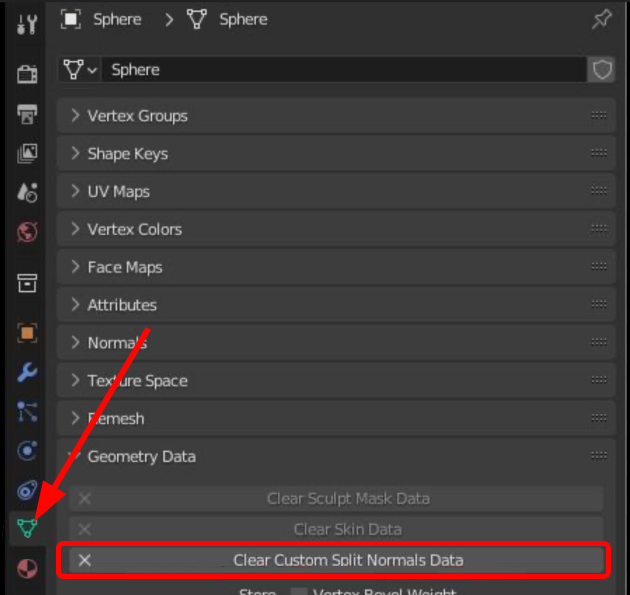
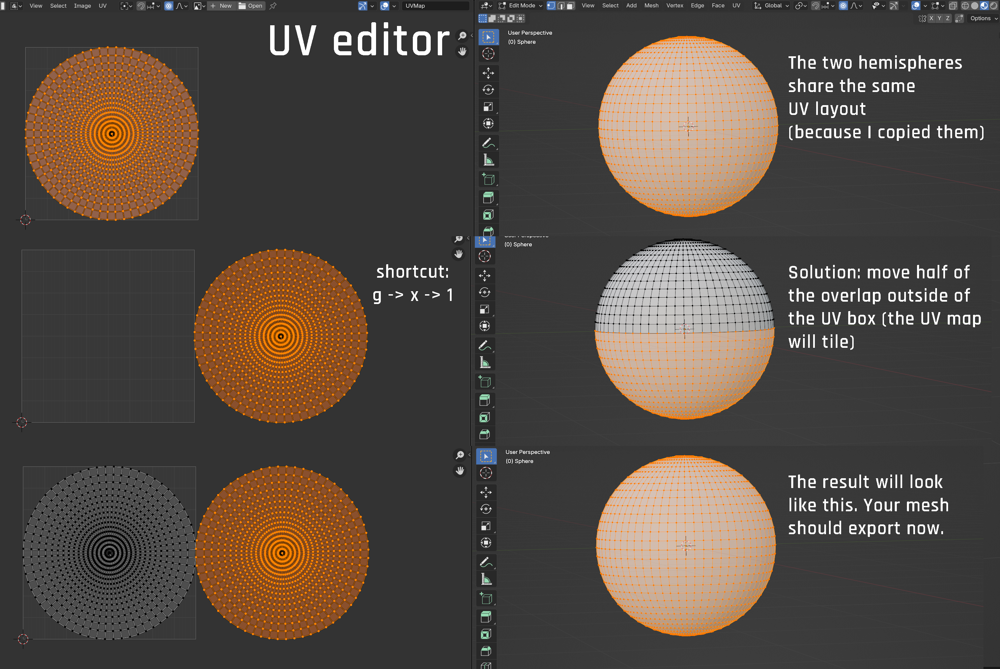
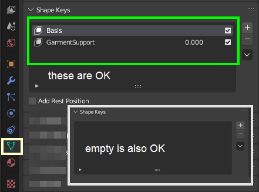
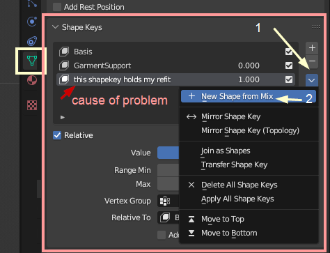
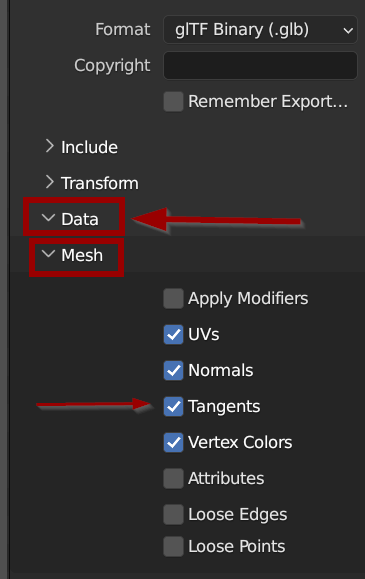
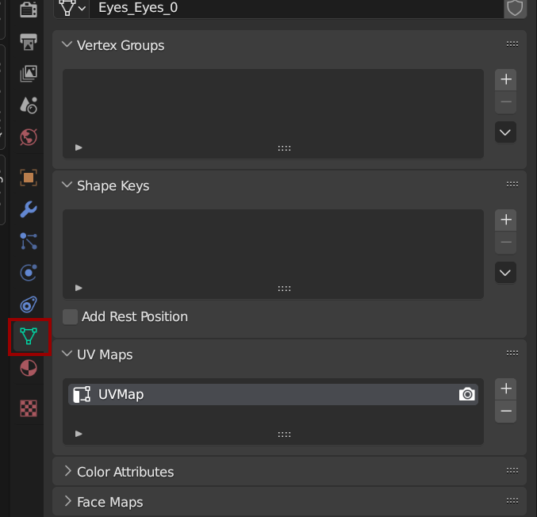
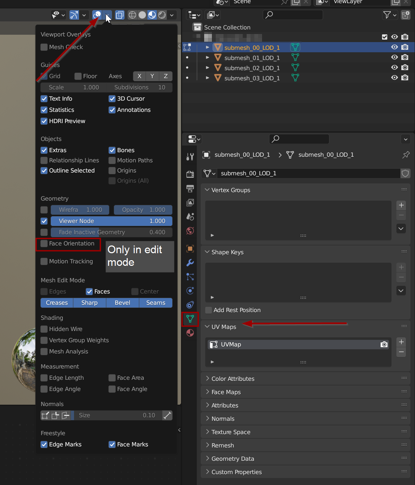
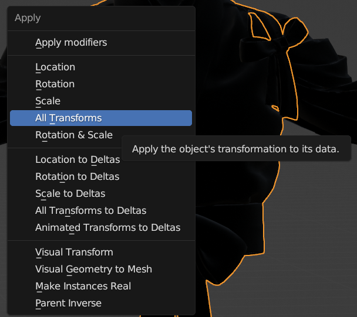
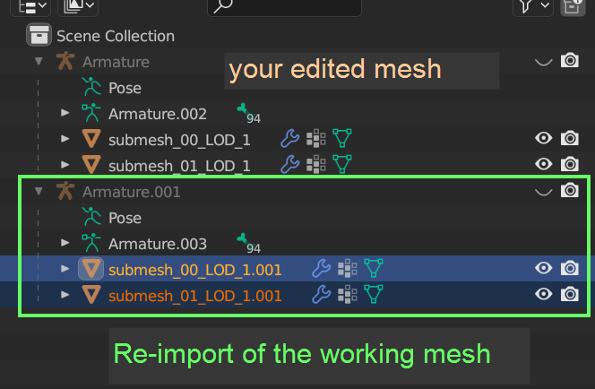
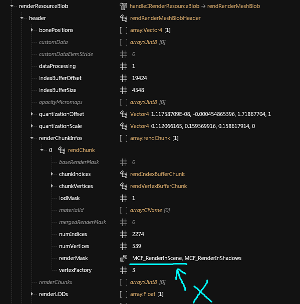

# Troubleshooting your mesh edits





## Summary

Last documented update: Jan 31 2025 by [manavortex](https://app.gitbook.com/u/NfZBoxGegfUqB33J9HXuCs6PVaC3 "mention")

This page will help you troubleshooting your mesh edits.

### Wait, this is not what I want!

* For texture trouble, check [images-importing-editing-exporting.md](../../modding-guides/textures-and-luts/images-importing-editing-exporting.md "mention") -> [#troubleshooting](../../modding-guides/textures-and-luts/images-importing-editing-exporting.md#troubleshooting "mention")
* For a guide on exporting and importing meshes, check [wkit-blender-plugin-import-export.md](../modding-tools/wolvenkit-blender-io-suite/wkit-blender-plugin-import-export.md "mention")
* If you don't know how to begin editing, check one (or all) of the following:
  * [r-and-r-refitting-step-by-step.md](../../modding-guides/items-equipment/recolours-and-refits/r-and-r-refitting-step-by-step.md "mention")
  * [blender-getting-started](blender-getting-started/ "mention")

This page&#x20;

## Importing

### Wolvenkit finds too many vertices, but Blender export is fine!

The [wolvenkit-blender-io-suite](../modding-tools/wolvenkit-blender-io-suite/ "mention") will check all your meshes against the vertex limit (\~65k) before exporting. However, under certain circumstances, Blender's default export shatters your plugin into a million parts. **This is not the plugin's fault**!

#### Delete custom normal split

You can check if your mesh has any custom `split normal` attributes, and delete them.


As this will irrevocably change your 3d object, create a **backup** first.



<figure><figcaption></figcaption></figure>

#### Check your UV splits

The GLTF algorithm **really** doesn't like it if two vertices have the same UV coordinates (see [this ticket](https://github.com/KhronosGroup/glTF-Blender-IO/issues/912)).&#x20;

Here's how you can fix it:

1. Select the overlap
2. move the overlap out of the UV editor's box (it will tile, so everything is fine)\
   Shortcut: `g` -> `x` -> `1` or `g` -> `y` -> `1`
3. Profit

<figure><figcaption></figcaption></figure>

### My import won't show up in-game!

We need to troubleshoot your **import**.&#x20;

#### Does the Wolvenkit preview update?

Yes: The problem is somewhere else, the mesh import works fine.

No: [#is-there-an-error-message-in-the-console](troubleshooting-your-mesh-edits.md#is-there-an-error-message-in-the-console "mention")

#### Is there an error message in the console?

Yes: Here's where your problem is. Make the error message go away by checking the rest of this guide.

No: [#do-you-have-extra-shapekeys](troubleshooting-your-mesh-edits.md#do-you-have-extra-shapekeys "mention")

#### Do you have extra shapekeys?

In Blender, check your shapekey section. It should look like the green box (or be empty).&#x20;

<figure><figcaption></figcaption></figure>

If it does not, you need to **apply** any extra shapekeys, because Wolvenkit will ignore them on reimport. Expand the box below, or check [here](../modding-tools/wolvenkit-blender-io-suite/wkit-blender-plugin-akl-autofitter.md#modifier-cannot-be-applied-to-a-mesh-with-shapekeys) to find out how.

<details>

<summary>Get the edit out of the shapekeys</summary>


Do the following things:

1.

    <figure><figcaption></figcaption></figure>
2. Duplicate your mesh: Select it in Object Mode, then press Shift+D
3. Click the arrow under the `-` button next to the shapekey box
4. Click `New Shape from Mix`
5. Now, delete all the **other** shapekeys (select them and click `-`)
6. Delete your new shapekey as well. That will **apply** it.
7. In Object Mode, select the duplicate of your mesh (that still has all the shapekeys)
8. Delete your additional shapekeys. That will reset it to an un-refitted shape. We want only the game ones here!
9. Go to Edit Mode (hotkey: `tab`)
10. Select all vertices (hotkey: `A`)
11. Delete all vertices (hotkey: `X`)
12. Go back to Object Mode (hotkey: `tab`)
13. Select your shapekey-less refitted mesh
14. Select your empty mesh
15. Join them together (hotkey: `ctrl+J`)

If everything went well, you should now have a mesh with Wolvenkit-compatible shapekeys!

</details>

### Tangents

You get an error message like this:

`Message: One or more Geometry in provided GLTF doesn't contain Tangents data. Tangents must be included within glTF files.`

#### Use the Cyberpunk Blender IO Plugin to export

Quick, easy, recommended: the plugin will tell you exactly what's broken and how to fix it. Download it [here](https://github.com/WolvenKit/Cyberpunk-Blender-add-on/releases).

Alternatively, you can check by hand:

<details>

<summary>Expand if you like to suffer</summary>

1. Check if your mesh is **triangulated**. If you aren't sure whether or not it is, go into edit mode, select everything, and go to Face -> Triangulate (Shortcut: Ctrl+T)
2. Check your export settings and make sure that you have the correct box checked upon export:\
   
3. If the error persists, check that each of your submeshes has an UV map: \
   \
   If not, you have to create one (and probably UV unwrap your mesh).

</details>

## Importing: bone troubles

### Bones not found in import mesh(es)

The armature you created in Blender has more bones than the mesh you're trying to import into. Since Wolvenkit can't create these bones (yet? Mesh import/export is hard), you're seeing an error message.

To get rid of it, delete the bones in Blender, or import into a different mesh (see [#fixing-bone-troubles](troubleshooting-your-mesh-edits.md#fixing-bone-troubles "mention") as for how)

### Bone: neutral\_bone not present in export Rig(s)/Import Mesh

The neutral bone is created by the glb export plugin when there are vertex groups without a parent bone. WolvenKit will not let you import if there is a mismatch.


Your armature in Blender needs to have a bone for every vertex group in the submesh, and there must not be vertices with no vertex group assigned.&#x20;

You then need to import over an [already-existing .mesh file](troubleshooting-your-mesh-edits.md#option-2-the-netrunner-suit) which supports all those bones.


### Fixing bone troubles

The following two scripts help you finding and/or fixing the problem. Switch to the Blender Scripting perspective and create a new, blank text file. Then, toggle the Blender system console to see their output (Blender: Window -> Toggle System Console)

**Missing bones**

**Optional:** To find which bones you're missing, you can use [this script](https://gist.github.com/manavortex/080d04065ee4c45aaad1e7c221db68c9), which will print their names to console. You can also skip this step and try the troubleshooting below.

**Vertices without weights**

You can use the [wolvenkit-blender-io-suite](../modding-tools/wolvenkit-blender-io-suite/ "mention")'s [#mesh-tools](../modding-tools/wolvenkit-blender-io-suite/#mesh-tools "mention") to `Group Ungroup Verts` — if you're lucky, that will solve the problem.&#x20;

#### Option 1: Fuck those bones: Python

You can find a [Python script on mana's github](https://github.com/manavortex/cyberpunk2077/blob/master/python/armature_cleanup/armature_delete_unused_bones.py) that will drop unused bones and vertex groups. Run it in Blender's Scripting Perspective with your meshes selected.

#### Option 1: Fuck those bones: Noesis

You can [import the mesh with Noesis](exporting-and-importing-meshes/#noesis-.fbx-2), which will not do any of these checks. For that, you need to import/export via .fbx.


Since noesis expects differently-named submeshes under the root armature, you'll want to export the mesh via noesis, join your changed meshes on those under Noesis\_Root, and import it again.\
**Caution:** You'll have to rotate your armature in this case.



While this will get your mesh into the game, the missing bones mean that parts of it won't move the way you expect it!


#### Option 2: The Netrunner suit

The armature from the following mesh has a lot of bones and will often resolve most of your issues:

```
t0_005_pwa_body__t_bug.mesh
t0_005_pma_body__t_bug.mesh
```

Try using the Netrunner body as a base for import. You can use Wolvenkit's [Select base mesh](https://app.gitbook.com/s/-MP_ozZVx2gRZUPXkd4r/wolvenkit-app/usage/import-export/models#select-base-mesh "mention") feature for this.


To create more submeshes, you can either&#x20;

* Try the [Preserve Submesh Order ](https://app.gitbook.com/s/-MP_ozZVx2gRZUPXkd4r/wolvenkit-app/usage/import-export/models#preserve-submesh-order "mention")import setting
* create more submeshes with the correct naming in Blender, e.g. `submesh_01_LOD_1`, `submesh_02_LOD_1`


If you end up with missing bones,&#x20;

#### Option 3: Transferring bones

It's time to play 3d puzzle and assemble bones from multiple sources. Unfortunately, there is no simple solution for this yet. You need to&#x20;

* find the bones that your armature is missing in other meshes
* transfer them into your import target mesh (guide on [xbae's page](https://xbaebsae.jimdofree.com/cyberpunk-2077-guides/cp2077-transferring-and-expanding-skeletons-in-meshes/))
* export all the extra meshes into Blender&#x20;
* [merge their rigs](https://github.com/Simarilius-uk/CP2077_BlenderScripts/blob/main/Merge_rigs.py), which you should do with the linked Python script
* and finally reimport everything back into Cyberpunk.

## Importing: Everything else

WolvenKit will not import a mesh that has any kind of issues. Those include, but are not limited to:&#x20;

* non-flat faces
* zero faces/edges
* loose vertices/edges

**There is no guarantee that any of the steps below will actually solve your problem.**&#x20;

#### **Edit Mode**

In Edit Mode, you can find a few commands in the Mesh -> Clean Up menu:

* Delete Loose
* Split Non-Planar Faces
* Split Concave Faces
* Merge By Distance\



&#x20;If you select your whole mesh, **Merge By Distance** will merge the individual parts, obliterating the seams. To avoid that, make sure to do them one after another:\
\- Select a vertex/edge/face in Edit Mode\
\- hold down Ctrl Num+ to select everything connected\
\- use Merge By Distance before proceeding to the next part of your mesh


#### It's still broken

Your last option is the [3d print tool](https://docs.blender.org/manual/en/latest/addons/mesh/3d_print_toolbox.html) to (hopefully) find out what is wrong with your mesh.&#x20;

Fortunately, the tool is free, easy-to-use and already included in your Blender.


If you don't have a 3d print entry in the tools of your 3d viewport, you might need to enable the plugin in Blender's settings first.


<figure><figcaption><p>Use the 3d print tool in edit mode to directly fix your issues</p></figcaption></figure>

* Zero Edges: Those are bad, fix them (click on them, then press X and just delete them)
* Non-Flat Faces: Those are even worse, as they can make the game crash. You need to split them up until they are flat, or investigate the surrounding edges/vertices to see what's going wrong here.
* Zero Faces: Only fix if you have <100 of them — the tool doesn't always identify them correctly (the mesh analyzed above was `h0_000_pwa_c__basehead`, which is absolutely fine).&#x20;


## In-Game

### My mesh won't show up

#### In Blender

* make sure that you have exactly one UV map
* check **Face Orientation** — most materials won't show backfaces (red). You can import submeshes with the suffix `_doubled` to make WolvenKit generate them for you, like it does with hair.&#x20;

<figure><figcaption></figcaption></figure>

#### In Wolvenkit

When saving your mesh, check the console for errors. In version >= 8.9.0, a basic material validation is taking place. \
If you don't see any warnings, make sure that the resource paths in your mesh are correct and that you aren't loading invisible textures.

### Parts of my mesh are missing

Do they show up in the Wolvenkit preview?

* No: you probably forgot to select them when [exporting from Blender](../modding-tools/wolvenkit-blender-io-suite/wkit-blender-plugin-import-export.md#exporting-from-blender). Make sure that you get them all into Wolvenkit.
* Yes: There's either an issue with your [material assignments](../materials/materials-troubleshooting.md) or with your [chunkmasks](../files-and-what-they-do/3d-objects-.mesh-files/submeshes-materials-and-chunks.md). Refer to the corresponding guides to learn how you can debug this.

### My mesh won't move at all

Some meshes require an entAnimatedComponent along with the garment's component. Check [here](../../modding-guides/npcs/appearances-change-the-looks/#animations-if-you-cant-avoid-them-copy-them-as-well) for details.

### Changes from Blender are missing in-game

For example, you have moved something, but the change doesn't show in the game: this most often happens when you change things around in edit mode, since they are stored as object properties rather than applied immediately.

1. Select the object in edit mode
2. Press Ctrl+A
3. Select "All Transforms" to apply all transformations.



### My mesh is moving weirdly

E.g. you've changed a shape, but now everything moves at an offset.&#x20;

As stated in the [importing/exporting guide](exporting-and-importing-meshes/), it is easy to fuck up the mesh's properties, and this is most likely what happened. The easiest way to "fix" this is to apply your shape deformation to the original object.

#### Replacing the vertices

1. Import the original object into Blender, without any of your changes. If you have to, reexport the working file from Wolvenkit.\
   
2. See [#strategy-2-replacing-the-vertices](porting-3d-objects-to-cyberpunk.md#strategy-2-replacing-the-vertices "mention") on the [porting-3d-objects-to-cyberpunk.md](porting-3d-objects-to-cyberpunk.md "mention") page

### My mesh is completely warped

If you have [added the item](../../modding-guides/items-equipment/adding-new-items/) via [ArchiveXL](https://github.com/psiberx/cp2077-archive-xl) or [swapped out an in-game item](../../modding-guides/items-equipment/editing-existing-items/replace-a-player-item-with-an-npc-item/) with something that belongs in a different slot (e.g. a jacket on the head slot), you might have to fix the corresponding entity file.

### My shadow mesh is always visible

Check the `renderMask` attribute inside `heder / renderChunkInfos / index`_._ For shadow  meshes, there shouldn't be anything but `MCF_RenderInShadows`.

<figure><figcaption></figcaption></figure>

### My mesh ignores my texture edits!

The textures are most likely embedded. Here's how you can force your material to pull in external textures instead:&#x20;

<figure><figcaption><p>Thanks to Adahm for the screenshot</p></figcaption></figure>

### My textures are black and shiny!

That's a problem with your **materials**, not with the mesh itself. Check [images-importing-editing-exporting.md](../../modding-guides/textures-and-luts/images-importing-editing-exporting.md "mention") -> [#troubleshooting](../../modding-guides/textures-and-luts/images-importing-editing-exporting.md#troubleshooting "mention")

## Garment Support

### My mesh is string cheese/exploding vertices/a puddle on the floor

This section will tell you how to delete garment support. If you don't want that (you shouldn't! It's cool!), check the **next section**.

<figure><figcaption><p>Looks like we have guests from beyond the Blackwall</p></figcaption></figure>


To check if it's this, equip **only** the edited item. If it breaks as soon as you put on another clothing item with [garment supports](garment-support-how-does-it-work/#the-algorithm), then the solution below applies.


<figure><figcaption></figcaption></figure>

#### Option 1 (likely to work): Import your mesh with garment supports

On the .glb import setting, check the [Import Garment Support](https://app.gitbook.com/s/-MP_ozZVx2gRZUPXkd4r/wolvenkit-app/usage/import-export/models#import-garment-support "mention") box.&#x20;

#### Option 2 (guaranteed to work): delete GarmentSupport from the mesh

<figure><figcaption><p>This will break automatic shrinking when you put clothes over your item. But hey, if the alternative is a broken mess…</p></figcaption></figure>

### I'm doing everything right, but garment support still explodes!

#### Component IDs

Check the component's **id** in the mesh `.ent` or `.app` appearance's `components` array:

<figure><figcaption></figcaption></figure>

If any given ID is equipped twice, it can break garment support in the way you're observing.

As of January 03 2023, we don't know how these are generated and can't tech the problem away in Wolvenkit. Your only choice here is to manually randomize your ID in a text editor by switching out single digits. Remember that the resulting ID needs to be an even number!

#### Import settings

Make sure to [import your mesh](https://app.gitbook.com/s/-MP_ozZVx2gRZUPXkd4r/wolvenkit-app/usage/import-export/models#import-garment-support) with garment support enabled. If that doesn't do the trick, you can try [re-creating](garment-support-how-does-it-work/garment-support-from-scratch.md) the garment support shapekeys in Blender.
