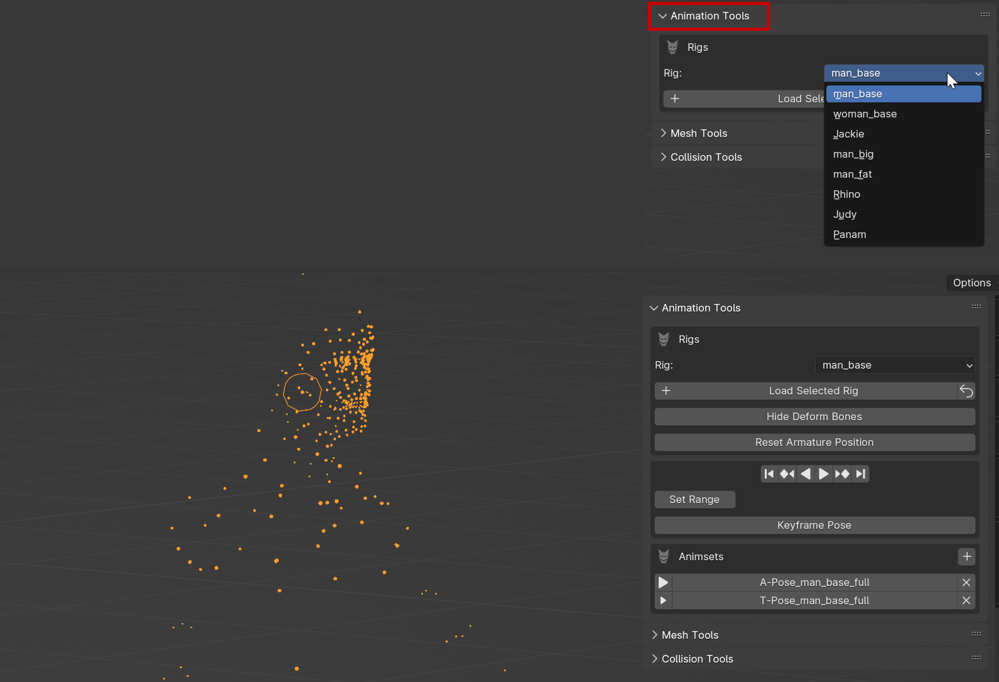
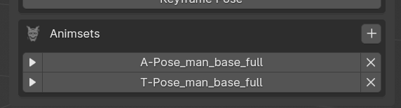
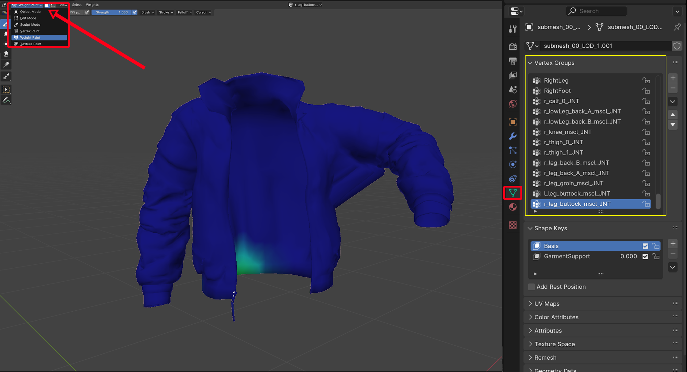
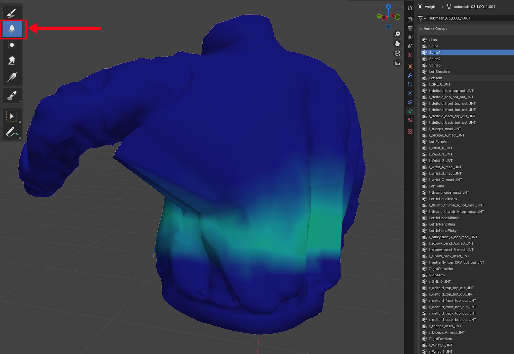

# Weight Painting for Gonks

## Summary

**Created:** ??? by PinkyDude 🦝\
**Last documented edit:** Sep 22 2024 by [manavortex](https://app.gitbook.com/u/NfZBoxGegfUqB33J9HXuCs6PVaC3 "mention")

This guide will show you Pinky's weight painting workflow, sharing tips and tricks on how to fix weights on garments for both refits and custom ports. You can find the original tutorial on [Google Docs](https://docs.google.com/document/d/1nOjvikFu2P3OzE3AGb-vgBCeJNA2tTQXf86skncCgsc/edit).

This guide will use a masc garment, but the process works the same regardless of rig or body type.

### Wait, that's not what I want!

* For porting objects altogether, see [porting-3d-objects-to-cyberpunk.md](porting-3d-objects-to-cyberpunk.md "mention")
* For help with refitting, see [r-and-r-refitting-step-by-step.md](../../modding-guides/items-equipment/recolours-and-refits/r-and-r-refitting-step-by-step.md "mention")
* For converting between bodies, see [rig-swapping-garments-other-body-conversion.md](../../modding-guides/items-equipment/rig-swapping-garments-other-body-conversion.md "mention")

## Requirements

For this guide, you need:&#x20;

| Tool                                                                                     | Version                                                                                                                                                        |
| ---------------------------------------------------------------------------------------- | -------------------------------------------------------------------------------------------------------------------------------------------------------------- |
| [WolvenKit](https://wiki.redmodding.org/wolvenkit/readme)                                | >= 8.14                                                                                                                                                        |
| The [wolvenkit-blender-io-suite](../modding-tools/wolvenkit-blender-io-suite/ "mention") | >= 1.5.5.2, recommended: [1.6.0 develop](../modding-tools/wolvenkit-blender-io-suite/installing-the-wolvenkit-blender-plugin/installing-from-github-source.md) |
| Blender                                                                                  | >= 4.1, recommended: 4.2                                                                                                                                       |

You also need a Wolvenkit project with an item where you want to fix the weights.

## Step 1: Exporting your weight source

For this example, I’ll be starting the weight from scratch for my Tracksuit Jacket:

<figure><figcaption></figcaption></figure>

### 1.1: Finding a donor mesh

It's best practice to ~~steal~~copy the weights from an existing in-game item.&#x20;

A good candidate is the **tight** version of T-Bug's netrunner suit, as it has the required bones for almost everything:

```
base\characters\garment\player_equipment\torso\t0_005_pma_body__t_bug\t0_005_pma_body__t_bug_tight.mesh
base\characters\garment\player_equipment\torso\t0_005_pma_body__t_bug\t0_005_pwa_body__t_bug_tight.mesh
```

Add the correct version for your body gender to your Wolvenkit project.


Since this is a jacket, using the Netrunner Suit will result in useless leg bones. That's not a problem, but you can use a different mesh, if you want.

If you are changing the weights of an existing or ported item, you might run into export errors in Blender. We'll fix these when we get there.


#### Why this is a good mesh

It is really tight. This has a few nice side effects:

* If it clips, it will clip into the body — that is perfect for weights!
* It will avoid "bat wings" around the armpits, where parts of the sleeves or sides will stretch next to the chest

Unfortunately, a perfect fit does (usually) not exist. But don't worry, we can fix this!

## Step 2: Transferring weights

### 2.1.: Importing the Netrunner suit

1. [Export](../modding-tools/wolvenkit-blender-io-suite/wkit-blender-plugin-import-export.md#export-from-wolvenkit) the Netrunner suit to glb
2. [Import](../modding-tools/wolvenkit-blender-io-suite/wkit-blender-plugin-import-export.md#importing-into-blender) it into your Blend file
3. You'll notice it has 3 submeshes. Merge them into a single submesh:
   1. Click into the viewport to deselect everything
   2. Hold the `shift` key and click on each of the three meshes
   3. Press `Ctrl+J`

<figure><figcaption></figcaption></figure>

<figure><figcaption></figcaption></figure>

### 2.2: Preparing your own mesh

If your refitted garment is already broken down into multiple submeshes, you’ll have to do the same thing here. The result will be called "weight container" or "target mesh" in the rest of the guide:

<figure><figcaption><p>My jacket has two different sleeves states; long and rolled. I’ll only duplicate and merge the long sleeves since they cover the arms</p></figcaption></figure>

\
Create a joined duplicate “weight container”:

<figure><figcaption><p>I rename this merged model as “weight” to make it stand out in the list</p></figcaption></figure>

#### Merging by distance

Even if we merged the submeshes, the actual models themselves are still separated. Editing and smoothing the weights will cause them to detach from each other, creating holes and gaps along the seams.

For that reason, you should now clean up your mesh and merge the vertices by distance:

❓ Edit Mode > Mesh > Clean Up > Merge by Distance

#### Cleaning existing vertex groups

When porting assets from other games, a good habit is to always clean the Vertex Groups before transferring weights :\


<figure><figcaption></figcaption></figure>

## Step 3: Transferring weights


You can use the Wolvenkit Blender IO Suite's [Mesh tools](../modding-tools/wolvenkit-blender-io-suite/#mesh-tools) for step 1-5. However, this guide will show you the full manual process.


1. Click the **weight source** (the Netrunner suit)
2. Ctrl+Click on your merged weight container (the **target mesh**)
3. Switch Blender to Weight Paint mode:

<figure><figcaption></figcaption></figure>

4. Select `Weights` -> `Transfer Weights`\


<figure><figcaption></figcaption></figure>

5. A pop up will appear in the bottom left corner of your viewport window. Make the following changes:
   * Vertex Mapping - Nearest Face Interpolated
   * Ray Radius - 5m
   * Source Layers Selection - By Name


You have now successfully transferred the weights from the Netrunner suit to your ported garment. Let's clean this up.

### 3.1 Cleaning up

1. Select Weights -> Limit Total.&#x20;
2. In the pop-up at the bottom left, change the `limit`  from 4 to 8.


3. Finally, select Weights -> Normalize All
4. In the pop-up at the bottom left, un-check `Lock Active`:


## Step 3: Testing on an animated body

We could now transfer the garment's weight to our submeshes, import the result into the game, notice that something is off with the weights, fix it in Blender, rinse, repeat, and waste a lot of time.&#x20;

Instead of doing that, we'll simply hook our garment to an animated body.

### 3.0: Using the prepared resources


To learn how to add these things by hand, read 3.1 - 3.3


I took the time to merge and weight-fix two full bodies who are also already hooked to the inventory “Jacket Check” animation

You can download them from my Resources folder, here:

🔻 [MA Body](https://drive.google.com/file/d/1duXe7h6pL5NWkbgbsMV-3VuAmFICSScd/view?usp=drive\_link) - Man Average RIG

🔻 [WA Body](https://drive.google.com/file/d/11BLepHAH6Qhzlzg2V-R3PMh\_PP2-imAM/view?usp=drive\_link) - Woman Average RIG

To add it to your .blend file, select File -> Append, and select the collection `[MA/WA]_weightCheck`:\


<figure><figcaption></figcaption></figure>

You can now skip to [#id-3.4-connecting-the-meshes-to-the-armature](weight-painting-for-gonks.md#id-3.4-connecting-the-meshes-to-the-armature "mention")

### 3.1: Getting a rig

1. From the Blender AddOn's Animation Tools Panel, select the correct rig for your mesh. You'll most likely want `man_base` or `woman_base`:

<figure><figcaption></figcaption></figure>

2. Change your weight container's `armature modifier` to point at the rig you just imported:

<figure><figcaption></figcaption></figure>

### 3.2 Getting a body

You can use the same body that you've already used for refitting. This tutorial won't cover this — look it up in [r-and-r-refitting-step-by-step.md](../../modding-guides/items-equipment/recolours-and-refits/r-and-r-refitting-step-by-step.md "mention").&#x20;

1. Import your body mesh into Blender
2. Join all the submeshes together
3. Change the body's armature modifier to point at the rig you added in 3.1

### 3.3 Getting an animation

You can see that our added armature already has A-Pose and T-Pose hooked up:

<figure><figcaption></figcaption></figure>

We need a bit more than that, so let's grab ourselves an .anim from the game files.&#x20;

For fitting clothes, you might want to use the inventory idle animations:&#x20;

```
base\animations\ui\male\ui_male.anims
base\animations\ui\female\ui_female.anims
```

Otherwise, you can get creative with the [Wolvenkit Search](https://app.gitbook.com/s/-MP\_ozZVx2gRZUPXkd4r/wolvenkit-app/usage/wolvenkit-search-finding-files) (something like `.anims > !fpp`)

1. Pick an animation and add it to your project.
2. [Export it](../modding-tools/wolvenkit-blender-io-suite/wkit-blender-plugin-import-export.md#export-from-wolvenkit-1) from Wolvenkit
3. [Import](../modding-tools/wolvenkit-blender-io-suite/wkit-blender-plugin-import-export.md#importing-into-blender) the glb into Blender

This will populate the Animsets list.

We can use the play button to make everything move. Now, time to hook everything up.

### 3.4 Connecting the bits

1. Select your merged weight container and change its Armature modifier:\
   `aMa` / `aWa` if you used the prepared resources, the armature from 3.1.2 otherwise

<figure><figcaption></figcaption></figure>

2. Rotating your body, you might already notice holes or clipping:


3. Let’s check the animation by pressing the Play ▶ button on the timeline or in the Animation Tools:

<figure><figcaption><p>Notice the arms, this is the previously mentioned Bat Wings issue</p></figcaption></figure>

4. Arms and collar will need some fixing. Let's go and do that.

### 3.5 Weight Painting Prep

1. Use the Play button at the bottom of Blender's viewport or in the Animation Tools
2. Let the animation play to a point where your issues are clearly visible, then hit the button again to pause it
3. Hide any armatures and collections, so that only the jacket mesh is visible.

## Step 4: Manual weight painting

From experience, we know which bones are responsible for the bat wings, but we'll go through the list one by one. If you want the more target-oriented approach, skip ahead through [#id-4.1-fixing-the-bat-wings](weight-painting-for-gonks.md#id-4.1-fixing-the-bat-wings "mention")

1. Enter Weight Paint mode (at the top left of the Blender viewport)
2. Open and expand the Vertex Group list on the right:

<figure><figcaption><p>This is where you'll check each bone's area of effect, and the "pull" it has on the mesh - the <strong>weight painting</strong>.</p></figcaption></figure>

3. On the right, select the first vertex group (`Hips`)
4. Use the `Blur` tool to fix anything that looks janky
5. Select the next vertex group on the list (`Spine`)

<figure><figcaption></figcaption></figure>


This is where you fuck around and find out! You can always use the&#x20;


### 4.1 Fixing the bat wings

1. Smoothing out the Spine groups helps a bit, but the mesh is still being pulled:

<figure><figcaption></figcaption></figure>

2. We’ll start tackling the actual Arm bones now:

<figure><figcaption></figcaption></figure>

3. We’ll need to clean the armpit on the `[l/r]_SHL_0_JNT` group.  You can do this by using the `Brush` tool (with the Weight slider down to 0), or with the `Radial Gradient` tool:


4. Drag the gradient tool near the armpit to remove all the excessive weight, and then use the blur brush to smooth the area:

<figure><figcaption></figcaption></figure>

5. We’ll do the same with the `[l/j]_triceps_mscl_JNT` group:

<figure><figcaption></figcaption></figure>

6. ...and the `[l/j]_biceps_A_mscl_JNT` group:\


\


That’s much better! \


7. Scroll down to the `[l/r]_latissimusDorsi_mscl_JNT` group and smooth out the area a bit.


You can go back to Object mode and check your weights with the animation at any time!\




This isn’t too bad, we removed most of the stretching and the sleeves behave in a natural-ish way, considering this is a large jacket :> \


### 4.3 Fixing the collar

The garment's collar is also a troublesome area; we can see how mine stretches and clips in all kind of weird way.&#x20;

1. We'll go over the list in order again, starting from the `Spine` bones and adding weights here to harmonize the whole collar:
   1. Select the Sample Weight tool
   2.  Click on any light blue area\


       <figure><figcaption></figcaption></figure>


   3. I’ll once again use the Radial Gradient tool to apply weights in an equal way&#x20;


Be careful when using the Gradient tool


When weight painting with the gradient tool, the weight will apply on BOTH side of the mesh; front and back! To avoid this, rotate the camera and angle your model so your gradient only affect the desired area\


<figure><figcaption></figcaption></figure>

2. Check the following vertex groups. Smooth out jagged edges, and remove incorrect weights.
3. Main vertex groups (avoid editing them too much, if you can avoid it):&#x20;
   1. `[Left/Right]Shoulder`&#x20;
   2. `Neck`, `Neck1`
   3. `Head`
   4. \[`l/r]_sternocleidomastoid_[top/bot]_mscl_JNT`
   5. `[l/r]_butterfly_top_CRV_bot_out_JNT`
4. Remove weights from the following arm and torso related groups (depending on the length of your collar):
   1. `[l/r]_chest_front_[A/B/C]_[bot/top]_out_JNT`
   2. `[l/r]_deltoid_[top/front/back]_[top/bot]_out_JNT`


After manually fixing weights, always do “Limit All” and “Normalize All” from the Weights tab!



\
It’s important to aim for Correct over Perfect, otherwise you’ll get stuck and frustrated really fast, trust me 🧡&#x20;

Don't worry about the clipping, we'll fix that in [#id-5.1-fixing-clipping](weight-painting-for-gonks.md#id-5.1-fixing-clipping "mention").

## Step 5: Transferring back

1. Change your weight container’s rig in the Armature modifier back to its original armature :\


2. Hide the MA\_weightCheck collection and un-hide your garment’s submeshes
3. Transfer the weight from your weight container to each of your garment’s submeshes. You can use the Mesh Tools, or do it by hand (one by one).

### 5.1 Fixing clipping


You can toggle proportional editing on and off by pressing `o`. This guide won't cover proportional editing in detail, but you can look it up under[#step-4-refitting](../../modding-guides/items-equipment/recolours-and-refits/r-and-r-refitting-step-by-step.md#step-4-refitting "mention") in the R\&R guide.


1. For each of your (now weighted) submeshes, change the rig in the armature modifier to animate them.

<figure><figcaption></figcaption></figure>

2. Entering Edit Mode will reset our model back to the default pose. To fix that, we have to check the `On Cage` and `Edit Mode` buttons on the armature modifier:


3. Repeat the step for each of your submeshes
4. Select them all, then enter edit mode by hitting `tab`
5. With proportional editing on, simply select the vertex in the area and slightly pull away from the body:\


6. Use the bar at the bottom of the viewport and move the cursor to change the animation. You'll find and fix more clipping here.
7. Once you're done, change the armature modifier back to the original one.
8. Delete the weight container mesh (you don't need it anymore)

## Step 6: Finishing up

You can now [export](../modding-tools/wolvenkit-blender-io-suite/wkit-blender-plugin-import-export.md#exporting-from-blender) your mesh from Blender, then [import it](../modding-tools/wolvenkit-blender-io-suite/wkit-blender-plugin-import-export.md#importing-into-wolvenkit) back into Wolvenkit.

And that’s about it for this tutorial/workflow on how I handle weight painting!

### Author's remarks

Don’t let weight painting occupy your entire brain while working on a project; it will never be perfect, a lot of vanilla garments have weight paint problems with stretching crotch and armpits area, it’s not something we can 100% control or avoid\


As long as it’s not too visible or mesh breaking, clipping and stretching are easily dealt with in Photoshop or other post-render editing softwares 🤏\


Again, I’m no expert, but I hope this tutorial will help you tackle some annoying aspects of Weight painting!\


Have fun and happy modding y’all! 💛\


Thank you for reading -Pkd\
\


\
