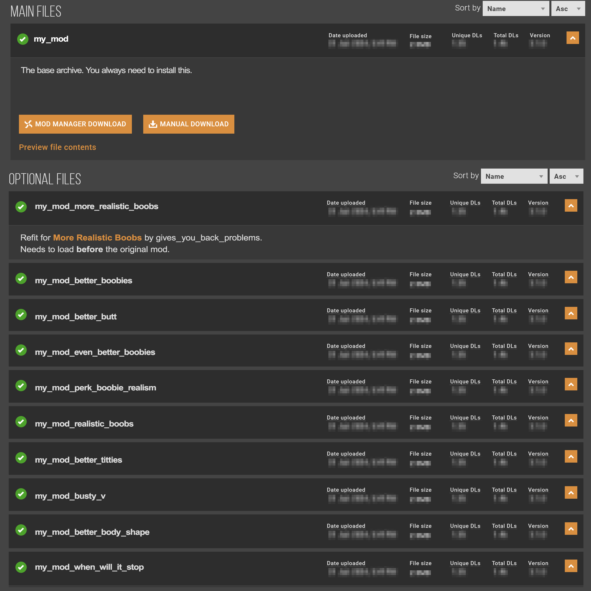

# ArchiveXL: body mods and refits

## Summary

**Published:** ?? by [manavortex](https://app.gitbook.com/u/NfZBoxGegfUqB33J9HXuCs6PVaC3 "mention")\
**Last documented update:** September 17 2024 by AllKnowingLion\
**Minimum required ArchiveXL version:** 1.5

This page explains how to enable **body mod support** in ArchiveXL:

[#body-modders-adding-support](./#body-modders-adding-support "mention")

[#clothing-mods-making-use-of-the-tags](./#clothing-mods-making-use-of-the-tags "mention")

## Checking the current body

Run the following code snippet in CET to see which body is currently installed:

```
print(Game.GetScriptableSystemsContainer():Get("PuppetStateSystem"):GetBodyTypeSuffix(ItemID.new(), GetPlayer(), nil))
```


**NOTE**

The past method of adding the components to each individual appearance [does still work](archived-registering-the-body-tag.md). However, you'll want to use the new method (for version >= 1.14), since it is both more robust and less tedious.


## Body modders: Adding support


Starting with version **1.14**, you can use [archivexl-resource-patching.md](../archivexl-resource-patching.md "mention") to inject your tags into the existing files!

You can download the [template from Nexus](https://www.nexusmods.com/cyberpunk2077/mods/14793), or create one yourself.


### 1. Registering the body mod

1. Create an .xl file in your Wolvenkit Project's resources folder (File -> New file -> ArchiveXL)
2. **Optional**: Name it the same as your current project (e.g. boobs\_for\_back\_problems.archive.xl)
3. Put the following file content:

<pre class="language-yaml"><code class="lang-yaml"><strong>player:
</strong>  bodyTypes: [ NewBody ]  # for substitutions, this will be converted 
                          # to snake case: new_body
</code></pre>

### 2. Patch the player entity files

We'll make use of [archivexl-resource-patching.md](../archivexl-resource-patching.md "mention") for this.

#### Set up the patch .ent

If you downloaded the template project, a patch .ent will already be included.

<details>

<summary>Create your own patch .ent</summary>

1. In Wolvenkit, select File -> New File
2. Scroll down the menu until you find the one with the extension `.ent` (should be EntEntityTemplate)
3. Add a new, blank EntEntityTemplate to your project
4. Give it a good name and move it somewhere
5. Open the file and select the `components` array
6. Add a new `entMeshComponent` and name it `Body:YourBodyTag`
7. Now, proceed with the rest of the guide

</details>

1. Inside the patch .ent, find the `entMeshComponent` under the `components` array.
2. Change its `name` to match your body mod, e.g. `Body:BoobsForBackProblems` -> `Body:NewBody`

#### Register the patch .ent

Make sure that your patch .ent is added to the game by telling ArchiveXL about it. Add the following block to your `.xl` file:

```yaml
resource:
    patch:
        path\to\your\patch_file.ent:
          - !include player_wa.ent 
          - !include player_ma.ent 
```

Include only the relevant body gender!

### 3. Test

That's it, everything should work now! Let's test.

1. [Install your project](https://app.gitbook.com/s/-MP\_ozZVx2gRZUPXkd4r/wolvenkit-app/menu/toolbar#install-and-launch)
2. Launch the game and load into a save
3. [check if the body tag registers](./#checking-the-current-body-mod) by running the CET command.

If yes: Congratulations, you've made it much easier for people to add refits for your body!

### Troubleshooting

The process is so simple that there aren't many things to go wrong:

1. Update [ArchiveXL](https://www.nexusmods.com/cyberpunk2077/mods/4198?tab=files)
2. Double-check your `.yaml` via [yamllint](https://www.yamllint.com/) and make sure you don't have syntax errors (indent matters)
3. Check [ArchiveXL's log file](../../../../for-mod-users/user-guide-troubleshooting/finding-and-reading-log-files.md#a-list-of-framework-logfiles)

If that doesn't work, check if the component gets added correctly. There are two ways to do this:

#### CET:

```
print(GetPlayer():FindComponentByName("Body:NewBody"))
```

#### [RedHotTools](../../../modding-tools/redhottools/):

<figure><figcaption></figcaption></figure>

If that still doesn't work, consider using the [template from Nexus](https://www.nexusmods.com/cyberpunk2077/mods/14793), which has been tried and tested on May 18 2024 with ArchiveXL

## Clothing mods: Making use of the tags

### The problem

Even with the [AKL AutoRefitter](../../../modding-tools/wolvenkit-blender-io-suite/wkit-blender-plugin-akl-autofitter.md), the process of supporting body mods is tedious. And even worse: you then have to pack everything separately for Nexus:

<figure><figcaption><p>Realistic refitting experience</p></figcaption></figure>

### The Solution

If a mod supports **body tags**, ArchiveXL can detect the current body mod, and conditionally load the correct mesh. Now, everything can be put into a single .archive!

### Dynamic Appearances

If you're using [dynamic appearances](../#dynamic-appearances), you don't need to register a suffix and can simply match or substitute for the body tag:

```
appearance name:
t0_recoloured_netrunner_suit&body=new_body

substitution:
*my\mod\meshes\p{gender}a_netrunning_suit_{body}.mesh
```


If no body mod is installed, the value will be `base_body`, so make sure to name your files and folders accordingly!


### Suffixes

If you're sticking to the classical approach, you need to add the following lines to your `.yaml`:

```yaml
  appearanceSuffixes:
    - !append itemsFactoryAppearanceSuffix.BodyType
```

Now, you can use the suffixes in your [root entity](../../../../for-mod-creators/files-and-what-they-do/entity-.ent-files#root-entity) just like camera states or body genders:

```
appearanceName: my_custom_shirt&FPP&NewBody
```

## Supporting mods

The following body mods support dynamic body switching.


If you know something that should be on the list, please edit [the-wiki.md](../../../../the-wiki.md "mention")!



As of 18th March 2024, [Nim's More Body Meshes](https://www.nexusmods.com/cyberpunk2077/mods/3890?tab=description) is compatible again with Gymfiend Body Mod.

Use only one main archive! \[[#\_nim\_more\_body\_meshes\_Gymfiend\_patch.archive](https://www.nexusmods.com/cyberpunk2077/mods/3890?tab=files\&file\_id=72036)]


| Mod                                                                                         | Tag name | substitution value |
| ------------------------------------------------------------------------------------------- | -------- | ------------------ |
| [KS Lion's Lush Body](https://www.nexusmods.com/cyberpunk2077/mods/4901)                    | Lush     | `&body=lush`       |
| [KS Lion's SoLush Body](https://www.nexusmods.com/cyberpunk2077/mods/8392)                  | Lush     | `&body=lush`       |
| [KS Solo Ultimate](https://www.nexusmods.com/cyberpunk2077/mods/6944)                       | Ult      | `&body=ult`        |
| [KS Solo 2.0](https://www.nexusmods.com/cyberpunk2077/mods/15869)                           | Solo\_OG | `&body=solo_og`    |
| [Solo Arms (v1.8.1)](https://www.nexusmods.com/cyberpunk2077/mods/7148)                     | SoloArms | `&body=soloarms`   |
| [KS Songbird 2.0](https://www.nexusmods.com/cyberpunk2077/mods/12898)                       | Song2    | `&body=song2`      |
| [Hyst's Angel Body Mod](https://www.nexusmods.com/cyberpunk2077/mods/14896?tab=description) | Angel    | `&body=angel`      |
| [Hyst's Big Butt](https://www.nexusmods.com/cyberpunk2077/mods/4420)                        | RB       | `&body=rb`         |
| [Hyst's Big Boobs](https://www.nexusmods.com/cyberpunk2077/mods/4654)                       | EBB      | `&body=ebb`        |
| [Hyst's Big Push Up Boobs](https://www.nexusmods.com/cyberpunk2077/mods/9083)               | EBBP     | `&body=ebbp`       |
| [Hyst's Big Boobs & Butt](https://www.nexusmods.com/cyberpunk2077/mods/4654)                | EBBRB    | `&body=ebbrb`      |
| [Hyst's Big Push Up Boobs & Butt](https://www.nexusmods.com/cyberpunk2077/mods/9083)        | EBBPRB   | `&body=ebbprb`     |
| [Gymfiend](https://www.nexusmods.com/cyberpunk2077/mods/6423)                               | Gymfiend | `&body=gymfiend`   |
| [Adonis](https://www.nexusmods.com/cyberpunk2077/mods/4968)                                 | Adonis   | `&body=adonis`     |
| [Na's Flat Chest](https://www.nexusmods.com/cyberpunk2077/mods/6883)                        | Flat     | `&body=flat`       |
