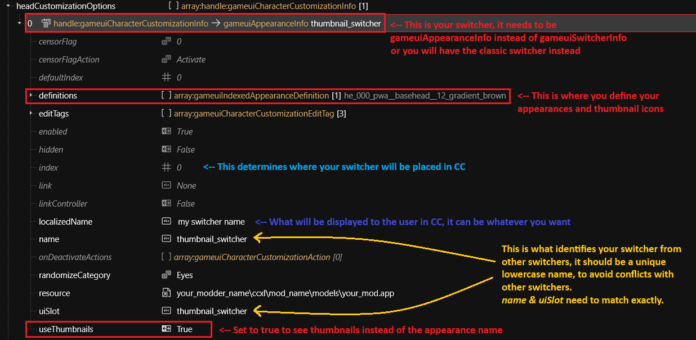
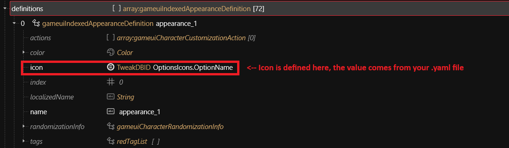
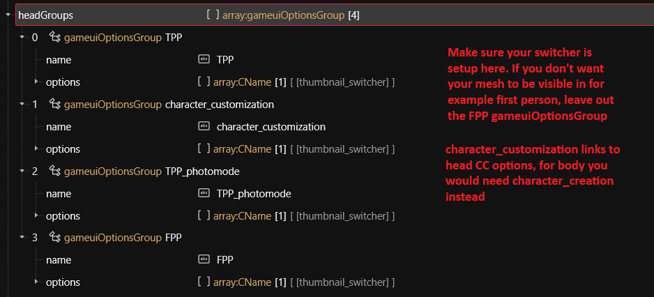

# ArchiveXL: Character Creator additions

## Summary

Published: Jan 19 2025 by [manavortex](https://app.gitbook.com/u/NfZBoxGegfUqB33J9HXuCs6PVaC3 "mention") and [IslandDancer](https://app.gitbook.com/u/s8gktWvqEZWGRxQIsePwOnEI2Mo2 "mention")\
Last documented edit: May 15 2025 by [icxrus](https://app.gitbook.com/u/R7jBoGTs0NQ60YSE39s5jrdLiei2 "mention")

This page groups the individual CCXL addition guides and gives you an overview of the [#switcher-names](./#switcher-names "mention").&#x20;

* For a full explanation of the structure, see [ccxl-hairs.md](ccxl-hairs.md "mention")
* For a guide on starting from zero, see [ccxl-body-tattoos.md](ccxl-body-tattoos.md "mention")

### Wait, this is not what I want!

To learn more about the character creator, check [files-and-what-they-do](../../../files-and-what-they-do/ "mention") -> [character-creator](../../../files-and-what-they-do/file-formats/character-creator/ "mention")

## Switcher names

### Base game switchers

<table><thead><tr><th width="228.70001220703125">Slot in character creator</th><th>Switcher name for .inkcc file</th></tr></thead><tbody><tr><td>Hair</td><td>hairs</td></tr><tr><td>Body tattoo</td><td>body_tattoo</td></tr><tr><td>Eye Color</td><td>eyes_color</td></tr></tbody></table>

### Modded switchers

To prevent the character creator from becoming a cluttered unusable mess, we **strongly encourage** sticking to already-established switcher groups.

If the list below doesn't meet your needs, feel free to [sign up](https://app.gitbook.com/invite/-MP5ijqI11FeeX7c8-N8/H70HZBOeUulIpkQnBLK7) and [edit it!](https://wiki.redmodding.org/cyberpunk-2077-modding/for-mod-creators/modding-tools/the-wiki)


Do **not** change the index! If two switchers have the same index, then only the first one will be used.


#### Tattoo switchers

<table><thead><tr><th>Switcher name for .inkcc file</th><th width="92.6500244140625">Index</th><th>Comment</th></tr></thead><tbody><tr><td>neck_tattoo</td><td>3300</td><td></td></tr><tr><td>left_arm_tattoo</td><td>3301</td><td></td></tr><tr><td>right_arm_tattoo</td><td>3302</td><td></td></tr><tr><td>left_shoulder_tattoo</td><td>3303</td><td></td></tr><tr><td>right_shoulder_tattoo</td><td>3304</td><td></td></tr><tr><td>chest_tattoo</td><td>3305</td><td></td></tr><tr><td>stomach_tattoo</td><td>3306</td><td></td></tr><tr><td>back_tattoo</td><td>3307</td><td></td></tr><tr><td>left_leg_tattoo</td><td>3308</td><td></td></tr><tr><td>right_leg_tattoo</td><td>3309</td><td></td></tr></tbody></table>

#### Thumbnail Selector Switchers

<figure><figcaption>
Setting up a switcher for the thumbnail selector
</figcaption></figure>

<figure><figcaption>
Thumbnail icons
</figcaption></figure>

<figure><figcaption>
Switcher and mesh visibility
</figcaption></figure>
