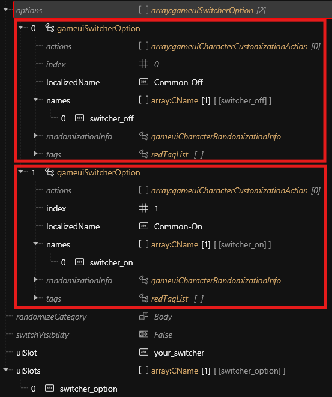

# CCXL: Creating a Switcher

## Summary

This page will demonstrate the ability to create additional switchers in the Character Creator with ArchiveXL.

### Why would I want to do that?

Creating new switchers allows us to add new options to the character creator without occupying existing switchers.

**Examples include:**

* Create switchable tattoo additions that can be toggled _alongside_ the game's vanilla _facial tattoos_ and _body tattoos (Beginner)_
* Control left and right _eye color_ independently using overlay meshes _(Intermediate)_
* Give V switchable hairstyles for feet _(Expert)_


## Requirements

* A WolvenKit project
* A .xl file referencing at least one .inkcharcustomization file
* All necessary meshes, materials, textures, and .app files for your addition
* A .json file for your translation entries, if applicable


## What are switchers?

Switchers are the switches shown in the character creator that allow us to change V's physical appearance. There are two different types of _visible_ switcher: those that cycle through text-labeled options such as hairstyles and tattoos—and those that use icons generally depicting color options. Switchers are defined within separate .inkcharcustomization files for each gender.


## Types of switcher

### Type 1: Cyclic switchers

<figure><figcaption><p>The hairstyle switcher contains text-labeled options. It requires cycling through options</p></figcaption></figure>

There are two types of cyclic switcher—one consists of a _gameuiSwitcherInfo_ that defines index and _options_ and two or more _gameuiAppearanceInfo_'s that contain the corresponding option parameters (the first one usually being the _off_ appearance):

#### gameuiSwitcherInfo

<figure><figcaption><p>Vanilla body tattoo switcher with corresponding appearance options (body_tattoo_00 is default 'OFF' appearance)</p></figcaption></figure>

<figure><figcaption><p>'Options' within the gameuiSwitcherInfo create the options for the switcher, with names pointing to gameuiAppearanceInfo's</p></figcaption></figure>

The other type of cyclic switcher consists of a _gameuiMorphInfo_ with morph names as its options. The chest size switcher for Female body V is an example of this:

#### gameuiMorphInfo

<figure><figcaption><p>The chest size switcher has three options, defined by the morph names.</p></figcaption></figure>

<figure><figcaption><p>The second option has no morphName, and is the 'Default' option.</p></figcaption></figure>

### Type 2: Icon switchers

The hair color switcher acts as a cyclic switcher but has icons instead of names:

<figure><figcaption></figcaption></figure>

It can be expanded to show selectable icons.

<figure><figcaption></figcaption></figure>

The icon switcher does not require a _gameuiSwitcherInfo_ but consists of a single _gameuiAppearanceInfo,_ with its options defined as _**definitions—**_&#x61;ppearance definitions within a .app file:

<figure><figcaption><p>Vanilla eye color switcher consists of gameuiAppearanceInfo with 71 appearance definitions as selectable options. It does NOT have a default 'OFF' option.</p></figcaption></figure>

<figure><figcaption><p>Each appearance definition references a definition within the .app file attached as a resource in the gameuiAppearanceInfo </p></figcaption></figure>

### Nested switchers

A switcher can have other switchers as options. These are known as a _nested switchers:_

<div align="center"><figure><figcaption><p>The hairstyle switcher controls multiple hair_color switchers which also function as appearance options</p></figcaption></figure></div>

The _uiSlot_ and _uiSlots_ parameters are what make this possible—each switcher or option can occupy one _uiSlot,_ and every _uiSlot_ can have only one _active_ option:

<figure><figcaption><p>The hairstyle switcher occupies a uiSlot and controls multiple uiSlots</p></figcaption></figure>

<figure><figcaption><p>This hairstyle occupies the hair_color uiSlot</p></figcaption></figure>

This means that every hairstyle has its own _hair color_ switcher. Since each hair color switcher occupies uiSlot 'hair\_color' only one hair color switcher can be active at any time.


## Switcher attributes

A switcher has multiple attributes that make them behave in a certain way:

<table><thead><tr><th width="171.20001220703125">Attribute</th><th width="202.59991455078125">Found in</th><th width="176.4000244140625">Function</th><th width="168.0001220703125">Value type</th></tr></thead><tbody><tr><td>censorFlag</td><td>gameuiSwitcherInfo<br>gameuiAppearanceInfo<br>gameuiMorphInfo</td><td>Listens for active censor, like nudity</td><td></td></tr><tr><td>censorFlagAction</td><td>gameuiSwitcherInfo<br>gameuiAppearanceInfo<br>gameuiMorphInfo</td><td>Activate/Deactivate switchers based on censorFlag</td><td></td></tr><tr><td>defaultIndex</td><td>gameuiSwitcherInfo<br>gameuiAppearanceInfo<br>gameuiMorphInfo</td><td>Index of default switcherOption / morphName / appDefinition</td><td>int</td></tr><tr><td>editTags</td><td>gameuiSwitcherInfo<br>gameuiAppearanceInfo<br>gameuiMorphInfo</td><td>Dictates where a switcher can be used in-game</td><td>NewGame, HairDresser, Ripperdoc</td></tr><tr><td>enabled</td><td>gameuiSwitcherInfo<br>gameuiAppearanceInfo<br>gameuiMorphInfo</td><td>Determines whether switcher is active or inactive by default</td><td>bool</td></tr><tr><td>hidden</td><td>gameuiSwitcherInfo<br>gameuiAppearanceInfo<br>gameuiMorphInfo</td><td>Hides switcher in character creator</td><td>bool</td></tr><tr><td>index</td><td>gameuiSwitcherInfo<br>gameuiAppearanceInfo<br>gameuiMorphInfo</td><td>Determines order of switchers in Character Creator</td><td>int</td></tr><tr><td>link</td><td>gameuiSwitcherInfo<br>gameuiAppearanceInfo<br>gameuiMorphInfo</td><td>Allows a switcher to control the state of other switchers</td><td>string</td></tr><tr><td>linkController</td><td>gameuiSwitcherInfo<br>gameuiAppearanceInfo<br>gameuiMorphInfo</td><td>The switcher will control other switchers with the same <em>link</em> value</td><td>bool</td></tr><tr><td>localizedName</td><td>gameuiSwitcherInfo<br>gameuiAppearanceInfo<br>gameuiMorphInfo</td><td>The name, usually a translation entry, that will be shown in-game</td><td>string</td></tr><tr><td>name</td><td>gameuiSwitcherInfo<br>gameuiAppearanceInfo<br>gameuiMorphInfo</td><td>The name of a switcher or appearance, referenced by switcher options</td><td>string</td></tr><tr><td>onDeactivateOptions</td><td>gameuiSwitcherInfo<br>gameuiAppearanceInfo<br>gameuiMorphInfo</td><td>Activate/Deactivate other switchers/options when switcher is deactivated</td><td></td></tr><tr><td>options</td><td>gameuiSwitcherInfo</td><td>Creates options for the switcher, referencing names of appearance infos</td><td>string</td></tr><tr><td>definitions</td><td>gameuiAppearanceInfo</td><td>Appearance definition to be referenced in .app file</td><td>string</td></tr><tr><td>morphNames</td><td>gameuiMorphInfo</td><td>The </td><td></td></tr><tr><td>resource</td><td>gameuiAppearanceInfo</td><td>Path to .app file</td><td>path</td></tr><tr><td>randomizeCategory</td><td>gameuiSwitcherInfo<br>gameuiAppearanceInfo<br>gameuiMorphInfo</td><td>The category of a switcher in the randomizer</td><td></td></tr><tr><td>switchVisibility</td><td>gameuiSwitcherInfo</td><td>(More info needed)</td><td>bool</td></tr><tr><td>uiSlot</td><td>gameuiSwitcherInfo<br>gameuiAppearanceInfo<br>gameuiMorphInfo</td><td>The slot which a switcher or option will occupy. Allows only one active option at a time</td><td>string</td></tr><tr><td>uiSlots</td><td>gameuiSwitcherInfo</td><td>The slot(s) a switcher's options will occupy</td><td>string</td></tr></tbody></table>

## Putting it all together

Knowing how a switcher works is important when it comes to creating new switchers with CCXL. Now that we are familiar with the inner workings of a switcher, we can get started.

Be sure you have a WolvenKit project with a file structure following this format:

<figure><figcaption></figcaption></figure>

### Create a .xl file

In order to build a switcher, we need a _.xl_ file so ArchiveXL knows where to find it.

You can create one in WolvenKit. See these steps to do so:

<figure><figcaption><p>Click File > New File</p></figcaption></figure>

<figure><figcaption><p>In the ArchiveXL category, select 'ArchiveXL file', give it a name, and create</p></figcaption></figure>

This will create an empty .xl file that ArchiveXL uses to locate our custom switcher. It can be modified in a text editor like Notepad++. We'll do that once we add our other files but for now, be sure to stick the .xl in the _resources_ folder of your project:

<figure><figcaption></figcaption></figure>

### Create the .inkcharcustomization files

Follow the same steps as last time for the .inkcharcustomization file, but—

* Create one for each gender if applicable (add _\_pwa_ and _\_pma_ respectively when naming)
* Put them in the mod folder of your project

<figure><figcaption><p>Find gameuiCharacterCustomizationInfoResource, give it a name and click 'create'</p></figcaption></figure>

Your project structure should look something like this:

<figure><figcaption></figcaption></figure>

Now that we have the base files for a switcher, let's go ahead and edit our .xl file.

### Modifying the .xl

Open the .xl file in your preferred text editor, and you should have a blank document. Add the following:

```
customizations:
  male: your_modder_name\ccxl\your_mod_name\your_mod_pma.inkcharcustomization
  female: your_modder_name\ccxl\your_mod_name\your_mod_pwa.inkcharcustomization
```

Ensure these paths match the relative paths to your .inkcharcustomization files, and save.

> If you want to use translation entries, be sure to add these in the .xl also. [_See the wiki about it_](../../../../modding-guides/items-equipment/adding-new-items/archive-xl-item-structure-explained.md#the-.xl-file) _for more info._

### Modifying the .inkcharcustomization files

Now we can start building our switcher. The easiest way to do this is to start with one .inkcharcustomization file, then copy everything over once we know it works.

Open a .inkcharcustomization file to get started:

<figure><figcaption></figcaption></figure>

First we must determine which group our switcher belongs to. A good way to figure this out is knowing where the camera should focus in the character creator when using our switcher (arms, head, or body).


### Create a cyclic switcher

Click on _headCustomizationOptions_ (or whichever category you want to use) and then "Add New Element":

<figure><figcaption></figcaption></figure>

Then, click "gameuiSwitcherInfo" and Create:

<figure><figcaption></figcaption></figure>

You should now have an empty switcher:

<figure><figcaption></figcaption></figure>

#### Minimum Attributes:

At minimum, we should change the following attributes to have a working switcher:

* editTags (we have to be able to use this switcher somewhere!)
* localizedName (not required, but helps to identify our switcher in-game)
* name (will be used to identify our switcher in _headGroups_ later on)
* options (must have at least 2 options; 'OFF' can be one)
* uiSlot (must occupy a slot)
* uiSlots (give our options slots to occupy)

You should reference [the table](ccxl-creating-a-switcher.md#switcher-attributes) above to learn more about each attribute.


With the minimum requirements met, your switcher should look something like this:

<figure><figcaption></figcaption></figure>

Now, let's define our switcher _options:_

<figure><figcaption></figcaption></figure>

For our options, they should be indexed to determine their order in the switcher. The _names_ will reference those of our gameuiAppearanceInfo's, while the _localizedNam&#x65;_&#x73; will display as our option names in-game.

Now we need a gameuiAppearanceInfo for each option in our switcher. Follow the same steps you used to create your gameuiSwitcherInfo, but select "gameuiAppearanceInfo" and create, then duplicate it:

<figure><figcaption></figcaption></figure>

Based on the _options_ in our gameuiSwitcherInfo, our first gameuiAppearanceInfo should look like this:

<figure><figcaption></figcaption></figure>

Our second should look like this:

<figure><figcaption></figcaption></figure>

The only thing changing right now is our _name_, to match the ones referenced in our gameuiSwitcherInfo _options_.

We can add our _resource_ (path to a .app file) and _definitions_ (appearance definitions in said .app file) now, or come back to it later.


Right now, we still need to add our switcher and appearances to our _groups_.

### Groups

For most appearance additions, the following groups will suffice:

#### headGroups

If your switcher is in _headCustomizationOptions,_ you'll want to use these four _headGroups:_

* FPP
* TPP
* TPP\_photomode
* character\_customization

#### bodyGroups

If your switcher is in _bodyCustomizationOptions_, you'll want to use these three _bodyGroups_:

* FPP\_Body
* TPP\_Body
* character\_creation (not to be confused with 'character\_customization' in _headGroups_)


Adding your switcher and appearances to _headGroups_ should look like this:

<figure><figcaption></figcaption></figure>

Once this is done, you can save your .inkcharcustomization file (Ctrl + S) and install this mod to test your switcher. If done correctly, you should have a new switcher at the top of the character creator, with two options:

<div><figure><figcaption></figcaption></figure> <figure><figcaption></figcaption></figure></div>

Of course, if you didn't add any path to _resource_ or include any _definitions_ in your gameuiAppearanceInfo, then this switcher won't do much.

### Attaching an appearance

I've borrowed some files to use in this demonstration, in order to give our switcher a purpose:

<figure><figcaption></figcaption></figure>

For a detailed explanation on how these will work together, see [CCXL: Body Tattoos](ccxl-body-tattoos.md).


Going back to our gameuiAppearanceInfo, let's add our .app file to the _resource_ path:

<figure><figcaption></figcaption></figure>

We'll need to add an appearance definition to the _definitions_ slot, but we need to know what they are. Those will be found in our .app file:

<figure><figcaption></figcaption></figure>

You'll want to add the one for whichever gender you are working on to the _definitions_ of your gameuiAppearanceInfo:

<figure><figcaption></figcaption></figure>

Once this is done, we can save with Ctrl + S, install our mod again, and launch. If your resource and definitions were done correctly, you should now have a fully-functional switcher:

<figure><figcaption></figcaption></figure>

Referencing the [table ](ccxl-creating-a-switcher.md#switcher-attributes)above, now is a good time to make any additional customizations to your switcher (_index_, _localizedName_, add additional _options_, etc.)

Once that's done, you can copy everything over to the other .inkcharcustomization file. Be sure to change the _definitions_ of the gameuiAppearanceInfo to correspond with the correct gender when doing so.

