# CCXL: Eye Textures

### Summary

**Published:** Aug 9, 2025  by [nutboy](https://app.gitbook.com/u/y772Qw4Ul9cmqXiuTKkTpLxDVzQ2 "mention") | [island\_dancer](https://app.gitbook.com/u/s8gktWvqEZWGRxQIsePwOnEI2Mo2 "mention")\
**Last documented edit**: Aug 24, 2025 by [icxrus](https://app.gitbook.com/u/R7jBoGTs0NQ60YSE39s5jrdLiei2 "mention")&#x20;

#### Wait, this is not what I want!

* To learn more about adding to character creator with CCXL, go to [.](./ "mention")
* To add new eyebrows options to CC, go to [ccxl-eyebrows.md](ccxl-eyebrows.md "mention")

### Requirements

* You have downloaded the [template project from Nexus](https://www.nexusmods.com/cyberpunk2077/mods/23351)
* Wolvenkit Version:[ 8.16.1 Stable](https://github.com/WolvenKit/WolvenKit/releases/tag/8.16.1) or newer

## Step 0: Make a project

Start by making a new project in WolvenKit. Name your project.

<figure>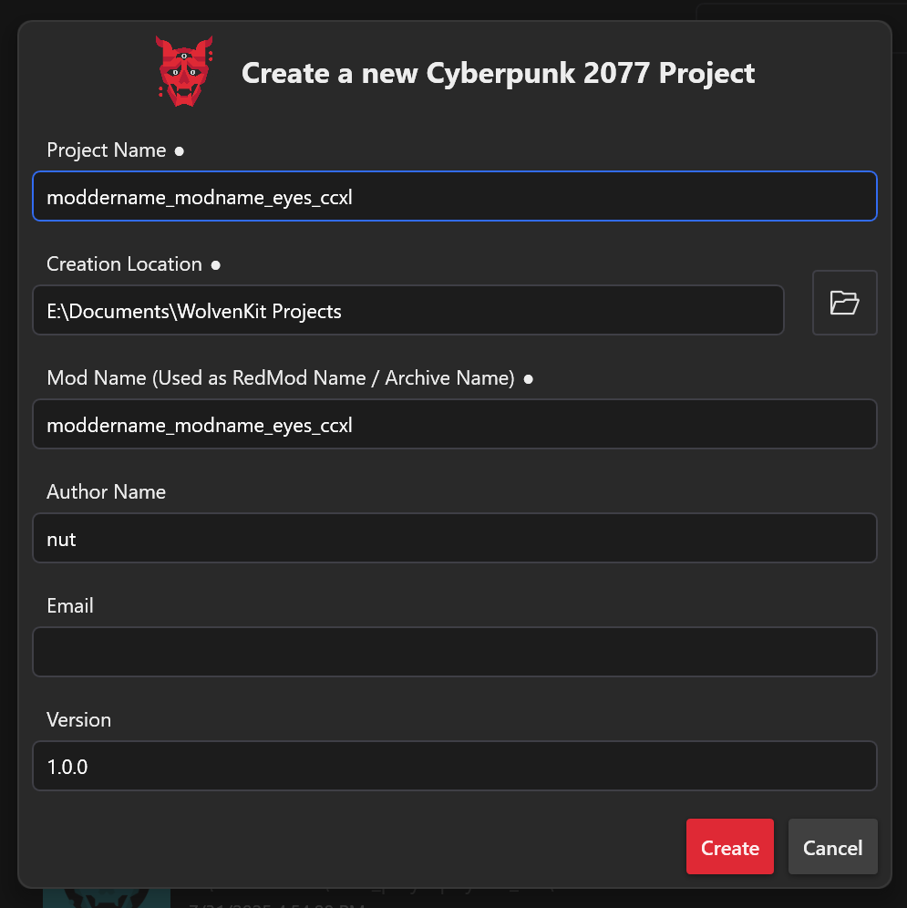<figcaption></figcaption></figure>

Open your new project's root folder by clicking the yellow folder button on the top right of the project explorer: 

In file explorer, open and drag the template files into your project.&#x20;

It will show the files in WolvenKit's project explorer. If it does not, hit the blue refresh 🔄 button next to the yellow root folder button.

Here's what the project template will look like:

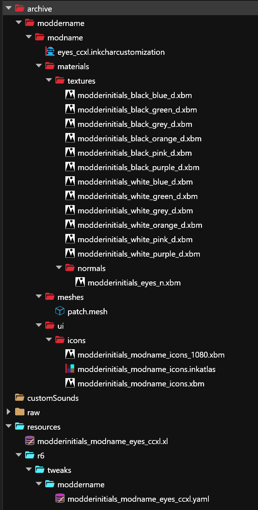

## Step 1: Replace template folder & file names


Check [this page](https://wiki.redmodding.org/cyberpunk-2077-modding/modding-guides/items-equipment/moving-and-renaming-in-existing-projects) on how to update file and folder paths inside the structure.


Next, we need to replace all placeholders of "moddername" and "modderinitials" and "modname" in the project.


The template in a nutshell:

"**moddername**" — change this to YOUR NAME

"**modderinitials**" — change this to YOUR INITIALS\
(or a shortened version of your name, less than 3-4 letters ideally)

"**modname**" — change this to a UNIQUE NAME for your mod\
Do not use the same name for multiple mods.


Here are the full steps:

Locate the Archive section of your project explorer.

Select the first folder, then right click and click Rename (or press F2).

<figure>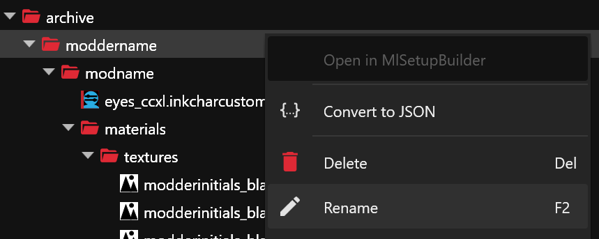<figcaption></figcaption></figure>

* Change folder "moddername" to **YOUR OWN** modder name, and check the box "update in project files". I am using my own name in the example images.

<figure>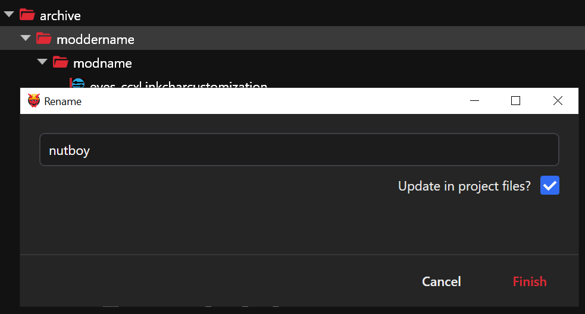<figcaption></figcaption></figure>

* Change the next folder "modname\_ccxl" to **a unique project name** for this project, and check the box "update in project files"

WolvenKit's logs will print a list of places it updated the names.


**HELP!!! I goofed and didn't check the box to "update in project files!"**

Don't worry. Rename your folder back to the placeholder name and do **not** check the update in project files box. Then, rename it again to your new replacement name.

Remember to check the box this time before confirming.


Next, find the **Resources** folder in project explorer, at the bottom.

<figure>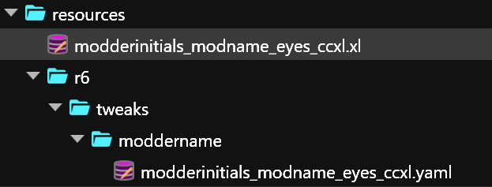<figcaption></figcaption></figure>

Rename the following:

* .xl file and .yaml - "`modderinitials_modname`" to the same as what you just named your project.
* the "`moddername`" folder in r6/tweaks to your **modder name**.

Next, rename the **.inkcharactercustomization** files with "Update in project files" checked.

Next, rename the **.inkatlas** and icon **.xbms** with "Update in project files" checked.&#x20;

Next, rename the placeholder files in the **textures** folders by replacing `modderinitials` with your initials, with "Update in project files" checked.&#x20;

***

## Step 2: Update renamed paths inside files

Open your **.xl** file in your text editor of choice, such as Notepad++ or Visual Studio Pro.

In WolvenKit, copy the path to the inkcharactercustomization file by hovering it and clicking the orange 🟧 button (or right click > "Copy relative path to game file").

<figure>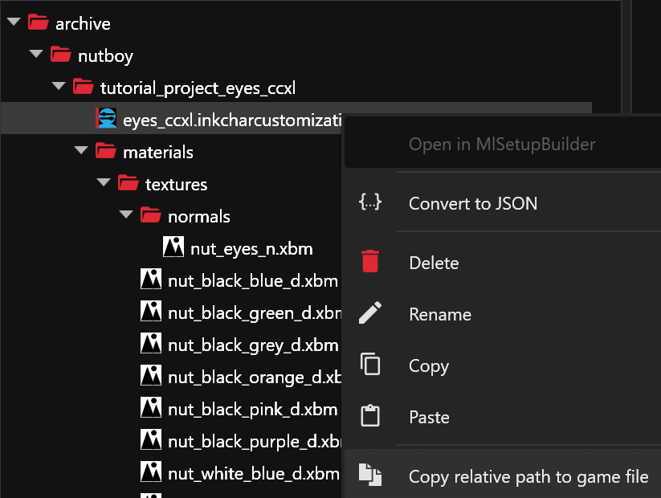<figcaption></figcaption></figure>

In the xl, under customizations, delete the old path after `female:` and paste in your new path. Next, delete and paste the same path after `male:` as well.&#x20;

<figure>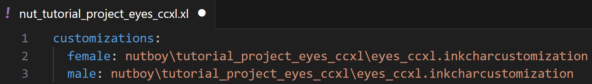<figcaption></figcaption></figure>

Next, copy the relative path to your `patch.mesh`  from Wolvenkit, and replace the placeholder path on the line under `resource: patch:`&#x20;

<figure>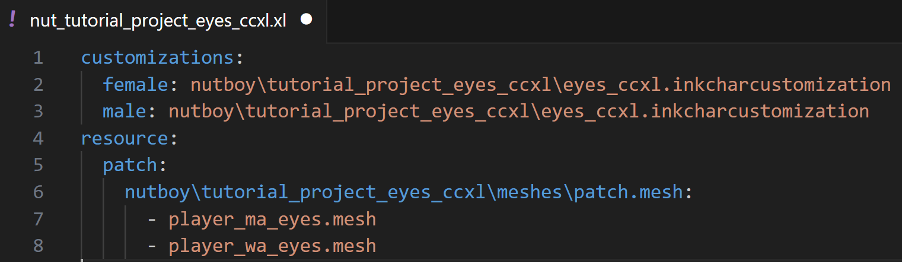<figcaption></figcaption></figure>


Do not delete the `:` after the path.&#x20;


S**ave** your .xl file.

Next, open your .yaml file. Delete the old path after `atlasresourcepath:`

Copy the path to your renamed/updated inkatlas file and paste it into the yaml where the old path was.

<figure>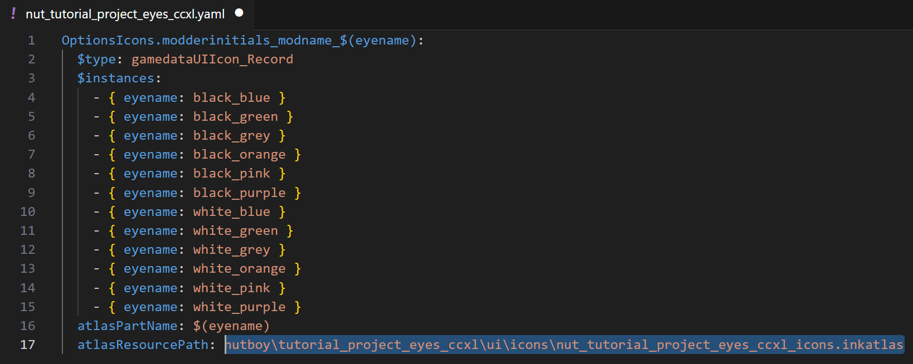<figcaption></figcaption></figure>

**Do not update** `modderinitials_modname` in the first line for now; we'll come back to it and update it later.

**Save** your yaml.

Next, open your patch.mesh and right click the RDTDataViewModel header.&#x20;

<figure>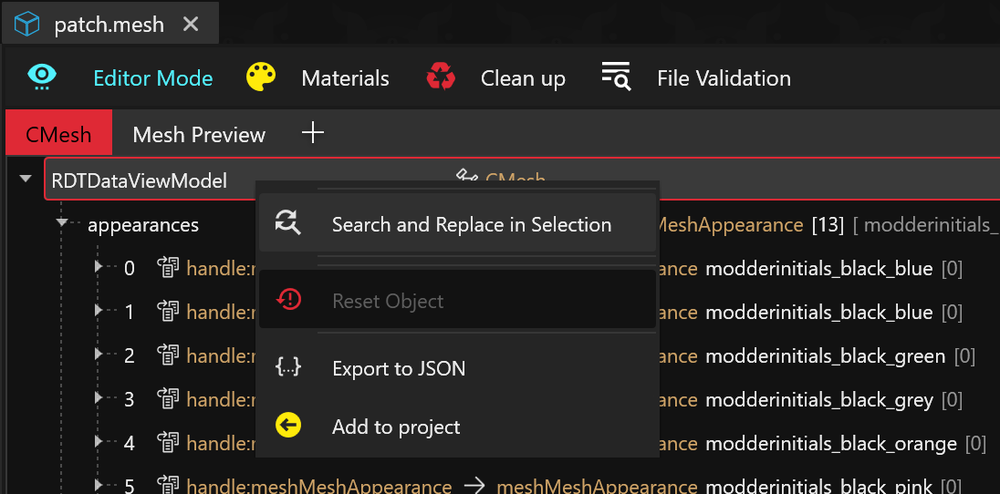<figcaption></figcaption></figure>

Select "Search and Replace in selection" and set the search for "modderinitials" and the replacement to **your initials**. Click Finish.

<figure>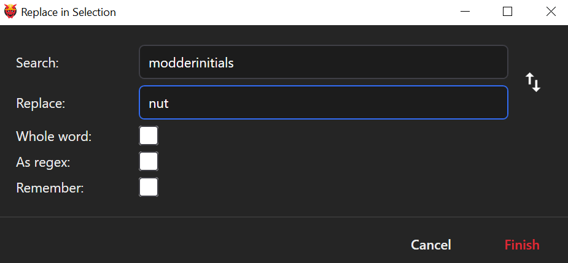<figcaption></figcaption></figure>

Wolvenkit logs will print an update about the replacements.&#x20;

Next, scroll down to **localMaterialBuffer** and expand materials and values until you see **Albedo**.&#x20;

You'll see there's one file path of **moddername**/**modname** that still needs to be replaced.&#x20;

Update the path to match your files. Make sure to keep everything else the same, including the asterisk `*` at the beginning and `{material}`

<figure><figcaption></figcaption></figure>


{material} is a substitution; it tells AXL to match the names of the files in your **materials** folder for each appearance listed in the patch.mesh **appearances** section.&#x20;


Next right click, and convert inkcharcustomization file to **.json**

Scroll down to the raw folder to find the .json it created.&#x20;

<figure>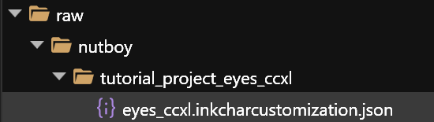<figcaption></figcaption></figure>

Open your **.json** file a text editor such as Visual Studio Code or Notepad++ and **CTRL+F**

* In the search box, type "**modderinitials**"\
  In the replace box, put **your initials**
* Apply the search and replace
* Save your file
* Right click the json in the raw folder, and convert it back
* If the file was open as you converted it back in Wolvenkit, it will ask if you'd like to reload it with the changes you just made. Click yes.

***

## Step 3: Check for broken paths

Now that you've updated a bunch of files, check to make sure nothing broke in the process.

At the top of WolvenKit's UI, go to Project > Scan File for Broken File References

<figure><figcaption></figcaption></figure>

It will open a window. Ignore the inkatlas if it says "none" underneath, it's not an issue. If there are no other missing paths logged, you did it! You're ready to move onto [the next step](ccxl-eye-textures.md#test-your-updated-project).

If there are any other files listed in the window, you have broken paths that need to be fixed. \
Expand below to fix this.

(optional) Fixing broken paths

The first file listed in the broken file reference window is the file you need to open, and the indented list of other file(s) underneath are the paths that need to be updated.

Open any files listed and expand menus as necessary to find the incorrect file path, or right click the first header RDTDataViewModel and click "Search and Replace", searching and replacing instances of "moddername", "modderinitials", or "modname" in the project.&#x20;

Remember to save your files as you update any broken paths.

Repeat scanning for broken file references until the only one left is inkatlas - none.

### Test your updated project

Install your mod with WolvenKit, open your game, and open Character Customization to ensure everything still works: template icons show in the eye list, template eye colors show on the character when you select them, etc.&#x20;

<figure>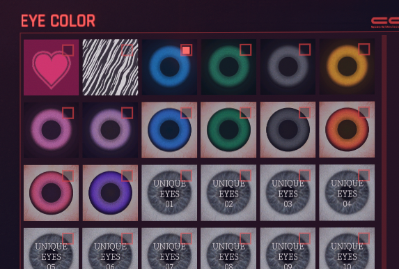<figcaption></figcaption></figure>

If not, go back and check all your paths again.

If everything appears in CC after you've updated all the file names and paths, you're ready to move on and add your own eye textures.

***

## Step 4: Eye textures

Now that the project is set up, it's finally time to add textures to your eyes! You can do this in a few ways:

### Using existing textures

If you already have .xbm **diffuse** and **normal** textures from another eye mod project, go ahead and add them to your project's **textures** folder, then skip to [#step-5-naming-your-textures-appearances](ccxl-eye-textures.md#step-5-naming-your-textures-appearances "mention")

If you're converting a Unique Eyes mod, go to [#converting-textures-from-a-unique-eyes-mod](ccxl-eye-textures.md#converting-textures-from-a-unique-eyes-mod "mention")&#x20;

If you're starting from scratch, go to [#creating-new-textures](ccxl-eye-textures.md#creating-new-textures "mention")

### Converting textures from a Unique Eyes mod

* If you are updating a mod that was made for Halvkyrie's Unique Eyes, open the Wolvenkit **Asset Browser** with **Mod Browser** turned on.&#x20;
* In Asset Browser, navigate to the mod archive that contains your textures. They will look like the image below (normals and roughness files may not be included depending on the mod).&#x20;
* To start you will need the files ending with `_diffuse`. Add the diffuse files to your project.&#x20;
* Delete the template project's placeholder files in the materials folder, and then drag the diffuse files you just added to the project into your project's materials folder. Delete the `base/eyes/textures` folders that were created.

 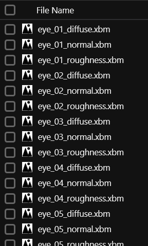

* Next, in Asset Browser, click some of the mod's `_normal`s and `_roughness` files to check if each number is a copy of the same image.
* If all the numbered `_normal`s files look to be the same image, only add one to your project.&#x20;
  * If there are multiple images for normals, see [#using-multiple-unique-normals-in-one-project](ccxl-eye-textures.md#using-multiple-unique-normals-in-one-project "mention")
  * If the mod doesn't include a `_normal` option at all, you can do one of two things:
    * Use the `modderinitials_eyes_n.xbm` texture provided with the template project, if it looks like it will fit the shape of your eyes/iris, or
    * Open your `patch.mesh`, and navigate to the localMaterialBuffer, expanding **@eyes** > **values** > **Normal**. \
      Path to the game's placeholder normal by copying and pasting this: \
      `engine\textures\editor\normal.xbm`  into the Normal section. \
      Save your file.&#x20;

<figure>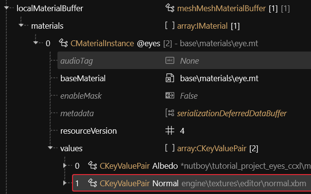<figcaption></figcaption></figure>

* If a `_roughness` file is included and looks like the below image, you can **skip** adding it to your project, it is not needed for CCXL eyes.&#x20;

 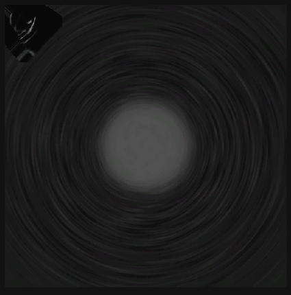

<figure>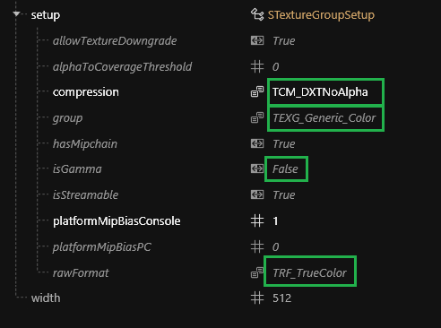<figcaption></figcaption></figure>

* If the mod offers a custom roughness map (and does not look like the image above):&#x20;
  * Add the roughness file(s) to your project in the materials folder and rename it.
  * &#x20;Note that the basegame eye roughness map is not a conventional greyscale roughness map. It is an RGB colour image with linear gamma. See xbm setup above. If using a custom roughness map, you must use the import settings shown in the xbm setup above or it will not display correctly in-game.
  * Next, open your `patch.mesh` and expand your localMaterialBuffer > **@eyes** > **values** section
  * Right click the "Normal" value and duplicate it
  * Change "Normal" to "Roughness"
  * Replace the path to the normal with the path to your Roughness file
  * Save your file.&#x20;

### Creating new textures

You can download a [folder of eye texture resources from the template page here](https://www.nexusmods.com/cyberpunk2077/mods/23351?tab=files). It contains sclera, irises, and normal maps to get you started for both diffuse and gradient eyes.&#x20;

#### Use template placeholder textures to make your own

* Export the project placeholder textures to PNG in the raw folder, then open them in an image editing program of your choice.&#x20;
* Save over the PNGs, and import them back in to Wolvenkit to replace the existing textures.&#x20;
* The eye mesh UV map is inverted on the y axis. Therefore your custom `Albedo` texture also needs to be inverted y:&#x20;

<figure>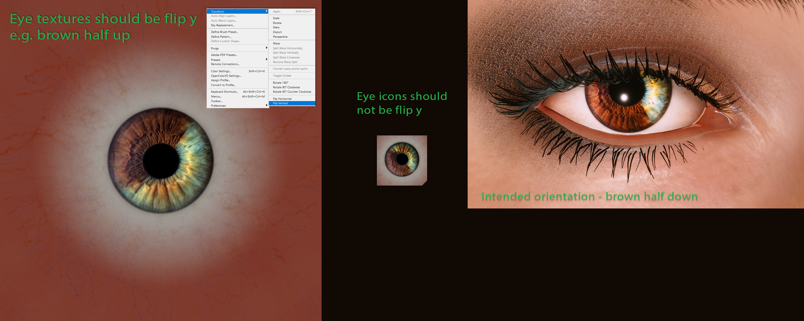<figcaption></figcaption></figure>

* Normal maps should **not** be inverted y. Doing so will change the direction of the xyz vectors encoded as per pixel greyscale value in the rgb channels of the texture. Normal maps are vector maps and not colour images.  You should instead re-generate a normal map using an inverted y `Albedo` texture -> convert to greyscale -> height map:

<figure>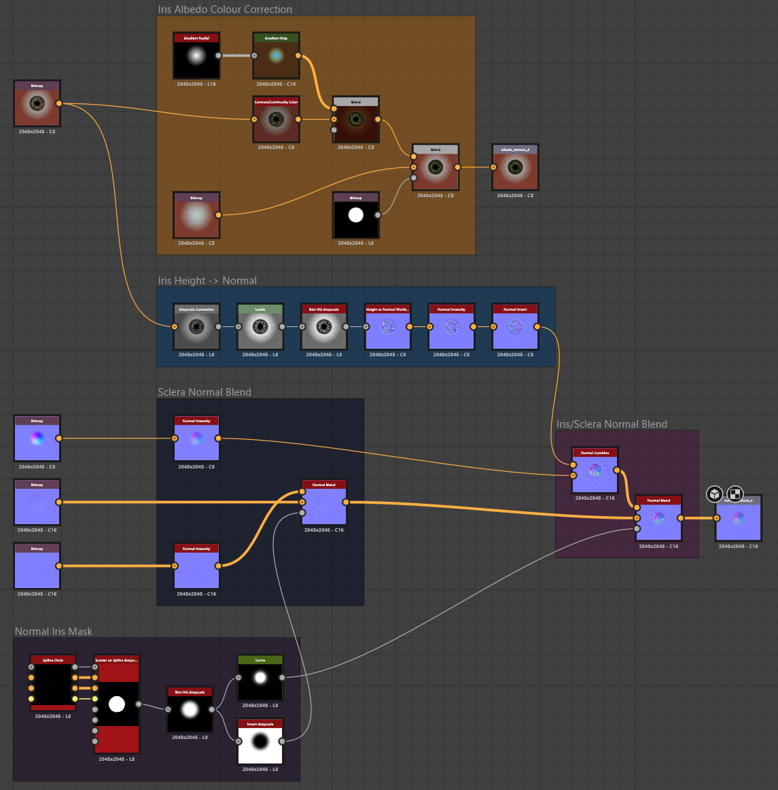<figcaption></figcaption></figure>

* The above screenshot is from Substance Designer and shows a node group that generates a normal map generated from an albedo texture. You can achieve something similar using stock Blender nodes, although the graph will be much less concise.
* If you downloaded the tutorial resources file (Eye Texture Design Resources.zip) from Nexus, you will find template textures and photoshop.psd files you can use to make creating eye textures easier: \
  \
  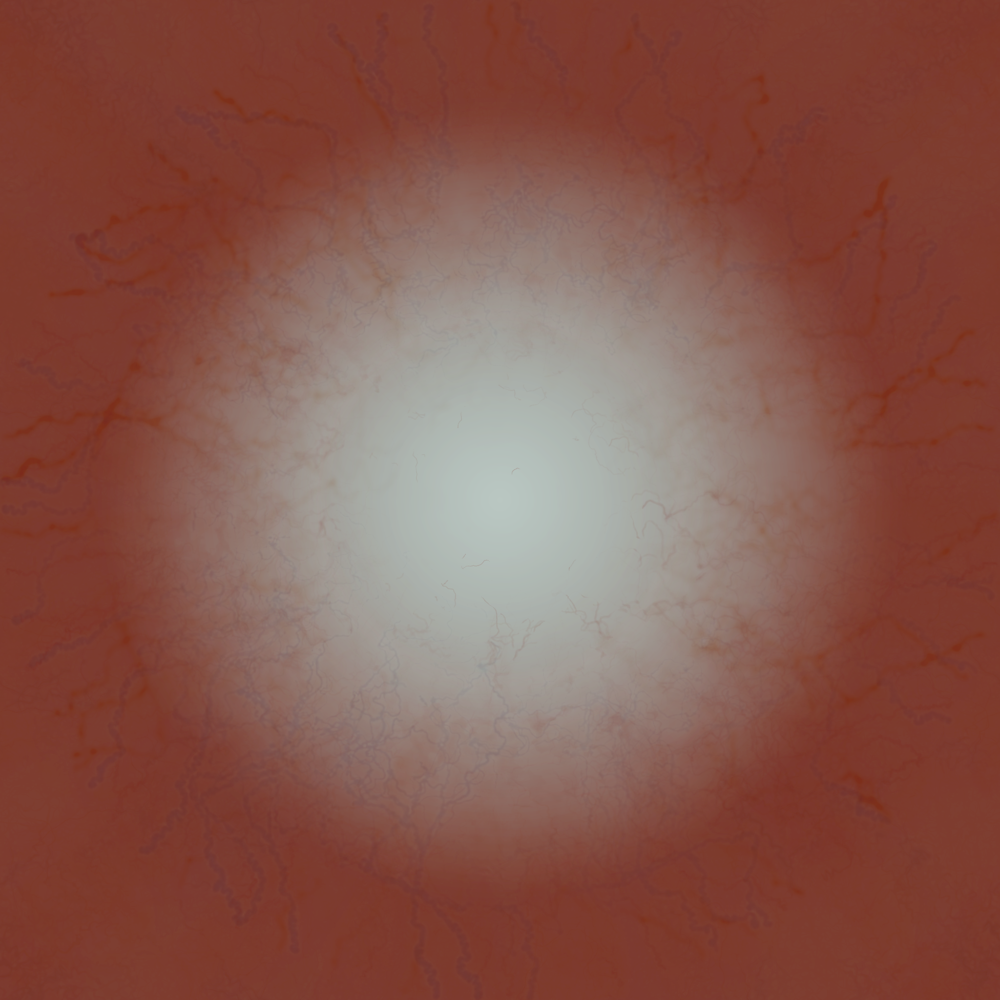\
  \
  Just remember that when combining normal maps you need to do so in Blender/Substance Designer and not GIMP/Photoshop. \
  \
  You need to convert from rgb colour to xyz vector, then multiply add (multiply by 2 then subtract 1). Now you can sum vector components and the direction of the vector can be positive or negative and its magnitude greater than 1.0. Once you have summed vectors, you have to re-normalize xyz back down to a range of 0 to 1.0 which can be converted back to rgb colour.\
  \
  Substance Designer is nice because it has stock nodes like "Normal Combine" and "Normal Blend" which do all of these operations for you, so its as simple as adding nodes and connecting them with wires.\

* For more info on how to export/import and edit textures: [images-importing-editing-exporting.md](../../../../modding-guides/textures-and-luts/images-importing-editing-exporting.md "mention")

#### Other ways to add eye textures


Including `_d` (diffuse), `_n` (normal), or `_r` (roughness) at the end of the file name helps Wolvenkit to automatically use the correct import settings for your PNG images.&#x20;


Using multiple normal maps in one project

<figure>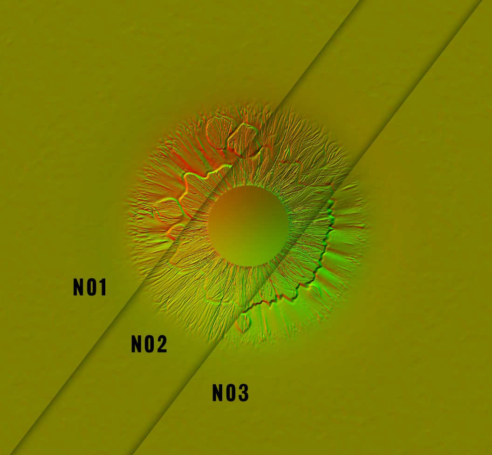<figcaption></figcaption></figure>

Want a more detailed, 3D effect in your character's eyes, showing more depth?\
Or maybe your mod has a few of different iris shapes with their own normals?&#x20;

[**Download the example project here**](https://www.nexusmods.com/cyberpunk2077/mods/23351)**. (NexusMods link)**

* Learn more about normals here: [normal-maps-in-cyberpunk.md](../../../materials/textures/normal-maps-in-cyberpunk.md "mention")
* See [self-made-normal-maps](../../../../modding-guides/textures-and-luts/self-made-normal-maps/ "mention") to make your own custom normal maps
* This project uses links in .xl to connect one normal to multiple dynamic appearances within the project without having to repack a file over and over with different names. \
  See [archivexl-resource-linking.md](../archivexl-resource-linking.md "mention")for more info

<figure>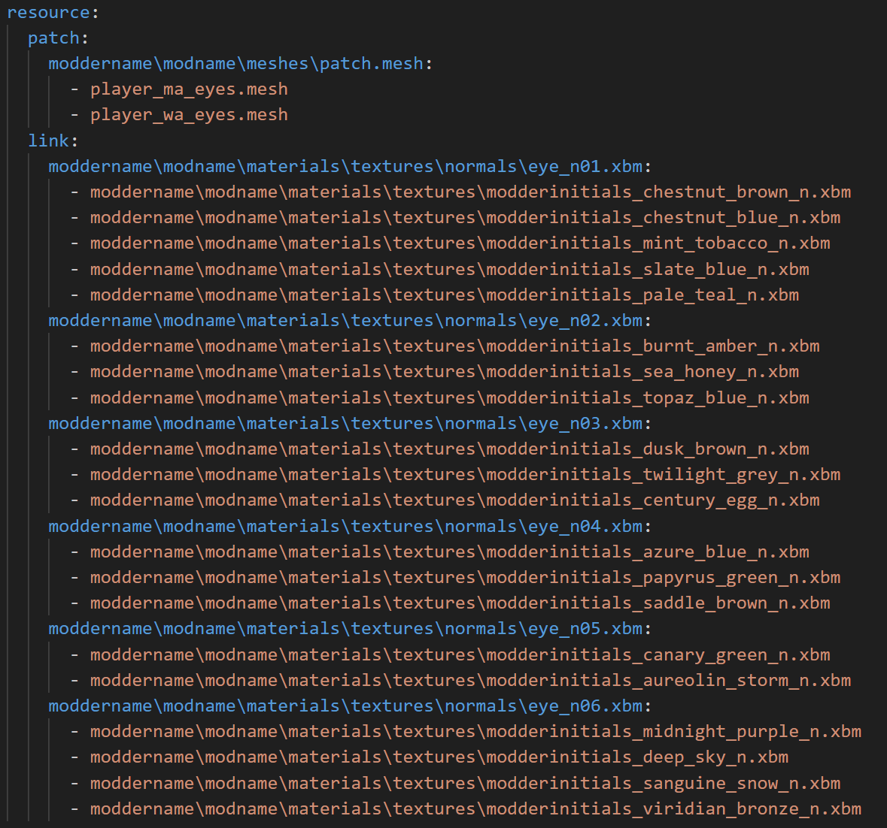<figcaption></figcaption></figure>

Credits: Thank you to IslandDancer for the project materials

.mlsetup Eyes

Prefer to use Cyberpunk's Multilayered materials to create your eyes?&#x20;

[**Download the example project here.**](https://www.nexusmods.com/cyberpunk2077/mods/23351) **(NexusMods link)**\

* See [custom-multilayermasks.md](../../../../modding-guides/textures-and-luts/custom-multilayermasks.md "mention") for how to make your own masks

- For more info about multilayered materials: [multilayered](../../../materials/multilayered/ "mention")

Credits: Thank you to Beaniebby for the project materials

.gradient textures

TBD

## Step 5: Naming your textures/appearances

Like usernames, eye appearance names must be **unique** and used only **once** across all CCXL eye mods, not just your own, but other modder's as well, or they will overwrite each other.


Tips to avoid conflicts:&#x20;

* Always include your "moddername" in the appearance name to make it unique to you
* For "eyename": Be as descriptive as you like without spaces, use underscores `_` between words
* Make each appearance/texture name unique **per mod,** especially if you plan to make multiple mods with alike color options or variations


In your **textures** folder, one by one, select and rename your textures to follow the same naming pattern as the template textures:

<code>modderinitials_eyename_d</code>

"**modderinitials**" — change this to YOUR INITIALS\
&#xNAN;**"eyename"** — change this to a **unique name** for that texture\
"`_d`" — include this suffix at the end of the file for Wolvenkit import/export settings

You do not need to check the "update in project files" box when renaming.&#x20;

(optional) I have multiple sclera variants of one texture!

If you have an eye design with one name, but multiple sclera options, you can use a naming convention like `modderinitials_scleracolor_eyename_d.xbm`

Substitute "**scleracolor**" for your sclera colors, and "**eyename**" for whatever you've named your eyes option(s).

**Example:** I named my texture "eyename"s to **blurple**, **green\_goblin**, **pink\_panther,** and I have two options of each texture for **white** sclera and **black** sclera.

<figure>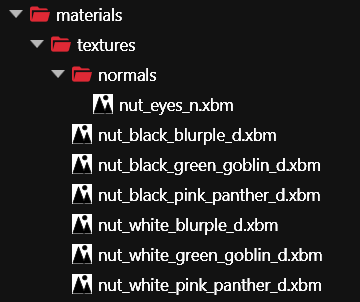<figcaption></figcaption></figure>

Next, open your `patch.mesh` and expand your **Appearances** section.&#x20;

You already updated your "modderinitials" in [#step-2-update-renamed-paths-inside-files](ccxl-eye-textures.md#step-2-update-renamed-paths-inside-files "mention"), so we'll use the Search and Replace function to replace only the placeholder names (ex: black\_blue) with your new unique "**eyename**"s.&#x20;

**Example:**

<figure>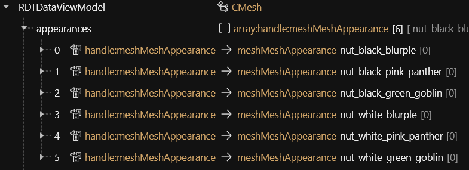<figcaption></figcaption></figure>

The full appearance names should match your texture file names, only without the suffix `_d`&#x20;


If you have more eye appearances than the placeholders available in the template project, you can right click > duplicate an existing entry and rename it to add more. Repeat until there is an entry for every option.



If you have less eye appearances than the placeholders in the template project, **delete** any extra appearances from the patch mesh.


Remember to save your file.

## Step 6: Update appearance names in other files

Now that we have added your new eye textures with their new names, we need to update the other files to use them.

### Find & Replace inkCC names

1. Right click your inkcharcustomization, and click "Convert to json".\
   It will put the converted **.json** in your RAW folder section of the project explorer.
2. Open your **.json** file in a text editor such as Visual Studio Code or Notepad++ and **CTRL+F**
3. In the search box, type "modderinitials" and update it with your own modder initials
4. **CTRL + F** again, then search the name of the first placeholder "eyename" (you can use the .yaml as reference if needed) from before you updated them with your own
5. In the replace box, put your first new eyecolor name
6. Repeat step 5 for each color for each placeholder.
7. Save your .json file
8. Right click it in the raw folder, convert it back from .json
9. Open your newly updated inkcc file. Expand **headCustomizationOptions** > **gameuiAppearanceInfo** > **definitions** and check to make sure the definitions match the appearance names in your `patch.mesh`&#x20;

<em>(optional)</em> If you have more appearances than placeholders

1. Duplicate your last definitions entry and rename it to match the next appearance in your mesh
2. Repeat until there is an entry for every appearance option in your mesh
3. Highlight all the new definitions you added manually and right click > Copy from Array/Buffer
4. Right click the **definitions** array and select Paste into Array/Buffer&#x20;

You should now have the same number of definitions your **gameuiAppearanceInfo** section and the same number in your patch.mesh appearances list, all with matching names.

<em>(optional)</em> If you have less appearances than placeholders

1. Highlight all extra placeholders definitions and right click > Delete Item in Array/Buffer

### Update .yaml names

1. Next, open your .yaml.&#x20;
2. In the section under `$instances:`, edit or delete the placeholder names. After each "`eyename:`" add your own eyename. No need to include your modderinitials here, just the eyename.&#x20;
3. Repeat for each line until all of your appearance options are listed.&#x20;

**Example:**

<figure>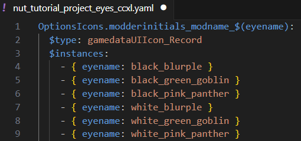<figcaption></figcaption></figure>

_(Optional)_ If you have multiple sclera options, make sure to include each of them.

_(Optional)_ If you had more **placeholders** than appearances, delete any extra lines you did not update.

_(Optional)_ If you have more **appearances** than placeholder options, copy and paste one of the existing options, making sure you copy the **entire line** to add onto the list. All indents/spaces must be the same as the line(s) above, and do not change or delete the `-` or `{ }` brackets. &#x20;

***

## Step 7: Add Custom Icons

* Icons for character creator are 160 x 160 pixels with an optional 80 x 80 pixel version for the mini icon preview in the CC menu.
* If you downloaded the tutorial resources file (Eye Texture Design Resources.zip) from Nexus you will find two template photoshop.psd files called `tutorial_icon_2k.psd` and `tutorial_icon_160x160.psd`. You can use these to create icons using your newly created albedo texture.
* Your albedo texture should be inverted y axis, but we want our icons to be the right way up, so we invert y again, `ctrl+a`, `ctrl+c` to copy to clipboard. Open `tutorial_icon_2k.psd` and `ctrl+v` to paste as new layer. Use the template layer as a guide for where the pupil should line up. When you are satisfied with placement, flatten all layers, scale the image to 160 x 160 pixels and `ctrl+a`, `ctrl+c` to copy to clipboard.
* Open `tutorial_icon_160x160.psd` and `ctrl+v` to paste in as new layer. Move the transparency mask up to your new layer and delete the old layer. `ctrl+shift+s` to save as new image as PNG.
* &#x20;I recommend making a folder of your icon PNGs, with each named exactly after each of your "eyename" (no "modderinitials", no `_d` suffix, just the eye name itself)&#x20;

If you do not have Adobe Photoshop, you can also open .psd files with [Photopea](https://www.photopea.com/) which is a free online image editor.

### Generate the .inkatlas

If you are on [8.16.2 Nightly](https://github.com/WolvenKit/WolvenKit-nightly-releases/releases) or higher version of Wolvenkit you can generate the inkatlas straight within Wolvenkit:

1. Navigate to the top bar and click on **File**
2. From the dropdown select **Add Files**
3. Select **Generate .inkatlas**
4. Fill in **inkatlas file name** using the convention `modderinitials_modname_icons` making sure that it matches the placeholder inkatlas name
5. Then fill in **tile width and height** with `160`&#x20;
6. Lastly navigate the **PNG raw folder** field to where you have stored your icons. Press finish and your inkatlas is generated
7. Now import the 2 .png files it created in your raw folder.
8. Next you can delete the old placeholder .inkatlas and the 2 .xbm's inside the icons folder
9. Now move your newly generated .inkatlas and the 2 .xbm's we just converted from .png to where you deleted the placeholder ones from

If you've never made custom icons or used inkatlases before, check out these articles first:

* [**Custom Icons and UI**](https://wiki.redmodding.org/cyberpunk-2077-modding/modding-guides/custom-icons-and-ui)
* [**Game Icons: .inkatlas files**](https://wiki.redmodding.org/cyberpunk-2077-modding/for-mod-creators-theory/files-and-what-they-do/file-formats/game-icons-the-inkatlas-file)

***

## Step 8: Connect your icons to Character Creator

1. Open your .yaml file.

<figure>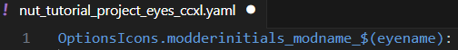<figcaption></figcaption></figure>

2.  On the first line, you'll see there's one instance of "`modderinitials_modname`" that we never replaced. Update it to your name and mod name, save the file.\

    <figure>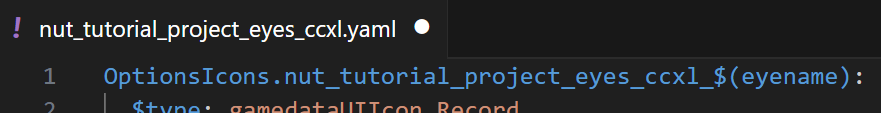<figcaption></figcaption></figure>
3. Next, we need to update our inkcc files to match this change so it knows which icons to use. Open one of your .inkcharcustomization files.
4. Expand `headCustomizationOptions`, then expand the first `gameuiAppearanceInfo`, and expand `definitions`
5. Click your first appearance. It will open a panel on the right, where you'll see a section called "`icon:`"\
   It may be empty, but it might read `OptionsIcons.modderinitials_modname_black_blue` (or some other color)
6. Copy and paste the first line of our .yaml into this `icon:` section. Then change `$(eyename)` to the color name you have open.
7.  Click through each color in the definitions list, and update the `icon:` section, replacing `$(eyename)` with the corresponding color each time. Save your inkcharcustomization file.\

    <figure>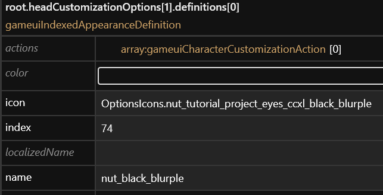<figcaption></figcaption></figure>

&#x20;

## Step 9: Test your finished mod

Install your mod, check in game at that icons are working in the menu, and your eye textures appear.

You have successfully added new eye options to character creator!

***

## Troubleshooting

### I can't scroll down in character creator to see the new eye options!

* make sure you uninstalled the [ICONIC](https://www.nexusmods.com/cyberpunk2077/mods/11041) mod and/or [Appearance Change Unlocker](https://www.nexusmods.com/cyberpunk2077/mods/3850) mods

### My icons are black!

* double check that your OptionsIcons in each definitions entry correctly matches the format in the first line of your yaml, and that all your names are exactly the same, with the same underscore placements, etc.
* double check that your .xbms are pathed correctly in the inkatlas
* double check that your inkatlas "parts" listed are named the same as all texture .xbm names listed in your .yaml

### My icons are white!

* Reimport your icons .xbms with compression settings set to `TCF_None`

### No eye textures / Eyeballs are invisible / I only see a creepy set of weird eyes inside V's skull!&#x20;

* Material paths are wrong in your patch.mesh
* Your path to patch mesh is wrong in .xl
* Your .xbms are in the wrong folder
* The inkcc definitions names do not match the appearance names in your mesh

### My eye textures look extremely dark in the Character Creator screen

* Make sure you do not have the [Eye Depth (Normals) fix mod](https://www.nexusmods.com/cyberpunk2077/mods/13083) installed, if so, uninstall it. \
  This mod is no longer necessary, as AXL now has a built-in eye normal fix.&#x20;
* Your mod's normals aren't pathed correctly \
  (in .mesh or .xl links if you're using multiple normals)
* Check that your normal map was imported correctly. Open the normal .xbm, expand `setup`, and ensure that the compression is set to `TCM_Normals`. If you have multiple normal maps, export the normals then re-import with the correct settings to do it in bulk.&#x20;
* Your mod is missing a normals file for the eyes
  * Use the `modderinitials_eyes_n.xbm` texture provided with the template project, if it looks like it will fit the shape of your eye textures\
    \
    OR\

  * Open your `patch.mesh`, and navigate to the localMaterialBuffer, expanding **@eyes** > **values** > **Normal**. \
    Path to the game's placeholder normal by copying and pasting this: \
    `engine\textures\editor\normal.xbm`  into the Normal section. \
    Save your file.&#x20;
