# CCXL: Eyelashes

## Summary

Published: March 18th 2026 by [icxrus](https://app.gitbook.com/u/R7jBoGTs0NQ60YSE39s5jrdLiei2 "mention")\
Last documented edit: [icxrus](https://app.gitbook.com/u/R7jBoGTs0NQ60YSE39s5jrdLiei2 "mention") on March 18, 2026

### Wait, this is not what I want!

* To learn how to make hair profiles (hair colors), go here: [ccxl-hair-profiles-colors.md](ccxl-hair-profiles-colors.md "mention")
* To learn how to add eye colors, go here: [ccxl-eye-textures.md](ccxl-eye-textures.md "mention")
* To learn how to add eyebrows, go here: [ccxl-eyebrows.md](ccxl-eyebrows.md "mention")
* To learn more about the character creator, check [files-and-what-they-do](../../../files-and-what-they-do/ "mention") -> [character-creator](../../../files-and-what-they-do/file-formats/character-creator/ "mention")

## Requirements

* You have downloaded [the template project files](https://www.nexusmods.com/cyberpunk2077/mods/28290)
* You have installed [the core mod files](https://www.nexusmods.com/cyberpunk2077/mods/28290)
* Wolvenkit Version: [8.17.1 Stable or newer](https://github.com/WolvenKit/WolvenKit/releases)
* ArchiveXL Version [1.26.3 or newer](https://www.nexusmods.com/cyberpunk2077/mods/4198)
* [Blender](https://www.blender.org/) & [Cyberpunk 2077 Blender add-on](https://github.com/WolvenKit/Cyberpunk-Blender-add-on)

#### Shorthand


PWA = Player Woman Average (female character)\
PMA = Player Man Average (male character)

inkcc = shorthand for "inkcharcustomization" files



## Step 0: Make a project

Start by making a new project in WolvenKit. Name your project.

Open your new project's root folder by clicking the yellow folder button on the top right of the project explorer: 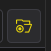

In file explorer, open and drag the template files into your project. It will show the files in WolvenKit's project explorer. If it does not, hit the blue refresh 🔄 button next to the yellow root folder button.


***

## Step 1: Replace template folder & file names


Check [this page](https://wiki.redmodding.org/cyberpunk-2077-modding/modding-guides/items-equipment/moving-and-renaming-in-existing-projects) on how to update file and folder paths inside the structure.


Next, we need to replace all placeholders of "moddername" and "modname" in the project.


The template in a nutshell:

"**moddername**" — change this to YOUR NAME

"**modname**" — change this to a UNIQUE NAME for your mod\
Do not use the same name for multiple mods.


#### Updating the template names

Locate the Archive section of your project explorer.

Select the first folder, then right click and click Rename (or press F2).

<figure>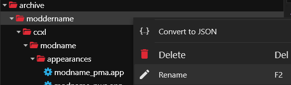<figcaption></figcaption></figure>

* Change folder "moddername" to **YOUR OWN** modder name, and check the box "update in project files". I am using my own name in the example images.

<figure>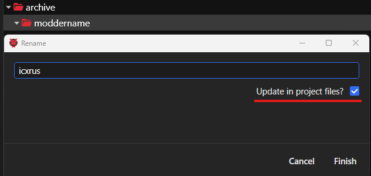<figcaption></figcaption></figure>

* Change the folder "modname" to **a unique project name** for this project, and check the box "update in project files"

WolvenKit's logs will print a list of places it updated the names.


**HELP!!! I goofed and didn't check the box to "update in project files!"**

Don't worry. Rename your folder back to the placeholder name and do **not** check the update in project files box. Then, rename it again to your new replacement name.

Remember to check the box this time before confirming.


Next rename the following:

* Rename the `.inkcharactercustomization` files by replacing `modname` with your unique mod name, ensure "Update in project files" is checked.
* Rename the `.mi` files found under **materials** folder by replacing `modname` with your unique mod name, ensure "Update in project files" is checked.
* Next, find the r**esources** folder in project explorer, at the bottom.

<figure>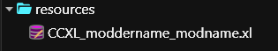<figcaption></figcaption></figure>

* `CCXL_moddername_modname.xl` file - rename to be the same as your project name.


***

## Step 2: Test your mod

Install your mod, open the game and check that everything is working in the character customization. Your option should appear in the switcher for `Eyelashes`.&#x20;


Ensure all the color options work. If you see just a blob in the middle of the eye on Male V, don't worry, we'll change that later.

Since the placeholder mesh is the same as the vanilla option, you may not see a difference in shape.&#x20;


If the option appears and the colors work, you are good to continue.

If not, run file validation on the project and fix any issues with the paths that show up. If there are no issues and things are still not working, check the [#troubleshooting](ccxl-eyelashes.md#troubleshooting "mention") section.

<figure>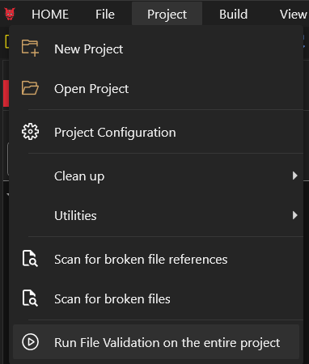<figcaption></figcaption></figure>


***

## Step 3: The .mesh and .morphtarget files

Firstly, you should decide if you are doing drawn eyelashes or modeled eyelashes. This is important as the shape of the mesh and morphtarget depends on this choice.

<figure>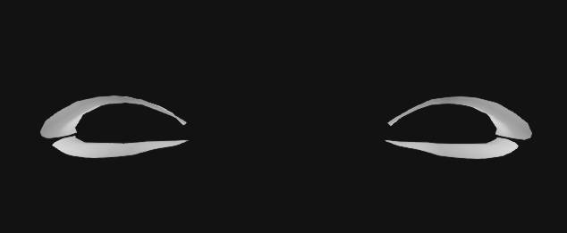<figcaption><p>Drawn eyelashes (2 planes)</p></figcaption></figure>

<figure>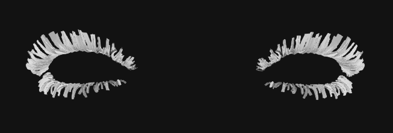<figcaption><p>Modeled eyelashes (each strand is 2 planes intersecting)</p></figcaption></figure>


Generally modeled eyelashes will provide a higher quality result. In vanilla Male V has drawn eyelashes, and Fem V has modeled eyelashes. Both options can be used for either V.&#x20;


This guide will not go into how to model eyelashes, there are a ton of guides for that. For general 3D-modeling information, see [3d-modelling](../../../3d-modelling/ "mention").&#x20;

Keep these in mind when making your eyelashes:

* Use the template morphtarget. Make all your edits **only** to the morphtarget submesh.
* Import the face morphtarget, so you can see where you are placing your eyelashes on the face (and how they morph to different face shapes)
* Import the eye mesh - this lets you access the materials to preview the lash strands. If you are using custom strand textures, you do not need to do this.
  * You can immediately delete the mesh files after import; you only need the material.
* Make sure the eyelash submesh has \_doubled in the name: `submesh_00_LOD_1_doubled`

<details>

<summary>How do I find the vanilla files?</summary>

Eye morphtargets:

```
PWA: base\characters\head\player_base_heads\player_female_average\he_000_pwa__morphs.morphtarget
PMA: base\characters\head\player_base_heads\player_man_average\he_000_pma__morphs.morphtarget
```

Eye meshes:

```
PWA: base\characters\head\player_base_heads\player_female_average\h0_000_pwa_c__basehead\he_000_pwa_c__basehead.mesh
PMA: base\characters\head\player_base_heads\player_man_average\h0_000_pma_c__basehead\he_000_pma_c__basehead.mesh
```

Face morphtargets:

```
PWA: base\characters\head\player_base_heads\player_female_average\h0_000_pwa__morphs.morphtarget
PMA: base\characters\head\player_base_heads\player_man_average\h0_000_pma__morphs.morphtarget
```

</details>

### Updating the template files to yours

Now let's rename the .mesh and .morphtarget files. Replace the `modname` with the unique name of your mod, ensure you tick the "Update in project files?" option just like the previous steps.

Next we will export all the .mesh and .morphtarget files. Tick "Export Garment Support" off for the meshes.&#x20;

Now's the time to make your custom lashes.&#x20;

After you are done with that, replace the template .mesh and .morphtarget following these steps:

* From [Blender](https://www.blender.org/), export into the .mesh and .morphtarget files you exported from Wolvenkit.&#x20;
  * Export **only** the eyelash submesh, not the eyeball or eye wetness submeshes. If your eyelashes are in multiple submeshes, you will have to do extra work.


Do not put Fem V eye shape keys onto Male V and vice versa. If you plan on using the same mesh for both, see [#transferring-shape-keys](ccxl-eyelashes.md#transferring-shape-keys "mention")


* Import into Wolvenkit **first** the .mesh.
* Then import the .morphtarget. This order is **important!**

Repeat for the other gender.

<details>

<summary>I have more than one eyelash submesh!</summary>

You can join submeshes together by selecting all of them and then pressing **CTRL + J**.

If you'd rather not do that, you will need to do some changes in the .mesh file. Don't worry, they are simple.

1. Open the .mesh file by double clicking on it.
2. Expand appearances until you can see `chunkMaterials` and `submesh_00`.

<figure>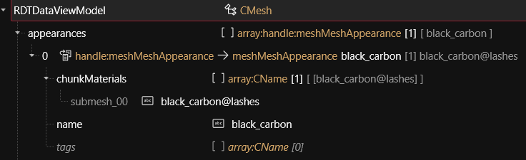<figcaption></figcaption></figure>

3. Click on chunkMaterials and press the yellow plus on the right side of the view.
4. Replace "None" with `black_carbon@lashes` exactly like submesh\_00.
5. Repeat for all your submeshes.
6. Save the file.

</details>

### Transferring shape keys

I'll explain one method of quickly transferring shape keys. This method isn't perfect and you may have to still do manual adjustment, but it should speed things up.

First, you will need to install [this](https://www.blenderkit.com/addons/c047db7a-3b7c-4369-9b1e-99f616bb8830/) add-on to Blender.

Import into Blender your eyelash **.morphtarget** that doesn't have the correct shape keys. Import also the donor **.morphtarget**, aka the morphtarget with the correct shape keys. For this we will assume you have a pwa eyelash morphtarget.

I also recommend importing the head **.morphtarget** so you can check the lashes place correctly after.

* Select the pwa eyelash in blender, and go to the data tab (green triangle). Find where there is a "Shape Keys" panel and click on the Basis option if it is not already selected.
* Press the V shaped button on the side, and select "Delete all".

<figure>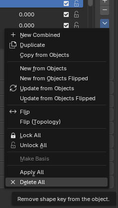<figcaption></figcaption></figure>

* Now adjust your pwa eyelash to be in the correct place on the male face.
* Open the side panel by pressing N. Go to Shape Keys Batch Transfer.
* Set the source as the donor pma eyelash morphtarget submesh. Set the target as your eyelash submesh. And press Transfer Shape Keys.
* Next go to Modifiers (blue wrench). Change your Armature to be the donor morphtarget armature, in this case `Armature__he_000_pma__morphs`. Parent your .morphtarget to the new armature and move it inside the same collection.
* Check all the Shape Keys and adjust if necessary.&#x20;
* Export the .morphtarget to the pma .morphtarget and .mesh.&#x20;
* Import to Wolvenkit. .mesh first, then .morphtarget.


If you get an error about a vertex group creating a neutral bone in Blender, remove that vertex group.&#x20;



***

## Step 4: Custom lash texture

Rename the files in **textures** by replacing `modname` with your unique mod name, ensure "Update in project files" is checked.&#x20;

Provided in the template project is both the vanilla Male V eyelashes: `modname_drawn_lashes_alpha.xbm`, and the vanilla single lash strand used by Fem V eyelashes: `modname_single_lash_alpha.xbm`.

If you are not doing a custom texture or drawn lashes, **you can skip to the next section now.**

If you have a custom eyelash strand texture or you are doing drawn lashes, you can export the relevant `.xbm`. Replace the exported `.png` with your new texture and import back into Wolvenkit.&#x20;


Make sure your eyelash texture looks like the original file, you should not have colors in your alpha texture.


If you are doing drawn lashes, open the .mi files and update the values -> CKeyValuePair -> Value to be the drawn lashes relative file path instead, by default it uses the single lash strand.

<figure>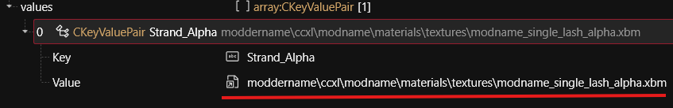<figcaption></figcaption></figure>

Save the .mi file.


***

## Step 5: The .app file

Rename the `.app` files by replacing `modname` with your mod name, ensure "Update in project files" is checked.&#x20;

Next convert the `.app` file to `.json` by right clicking on it and selecting "Convert to JSON".

<figure>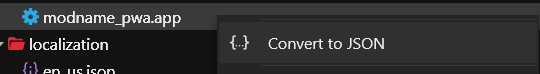<figcaption></figcaption></figure>

The **.json** file will appear in your raw folder.&#x20;

1. Open your **.json** file in a code editor such as [Visual Studio Code](https://code.visualstudio.com/) or [Notepad++](https://notepad-plus-plus.org/downloads/) and press **CTRL+F.**
2. Select the Replace option.
3. Enter into the find field: `moddername_modname` \
   and into the replace field your actual modder name and mod name in the same format, e.g. `icxrus_reallycooleyelashmod`.
4. Select "Replace all". The editor should inform you that 3 occurences were replaced.
5. Save your file and go back to Wolvenkit.
6. Right click on the **.json** in the raw folder and select "Convert from JSON".

Repeat for the other `.app` file.


***

## Step 6: The .inkcharcustomization file

This file is how we tell ArchiveXL what we want to add and to what switcher.

Convert the **.inkcharcustomization** file to **.json** using "Convert to JSON" just like in the previous section. The **.json** file will appear in your raw folder.&#x20;

1. Open your **.json** file in a code editor such as Visual Studio Code or Notepad++ and press **CTRL+F.**
2. Select the Replace option.
3. Enter into the find field: `moddername_modname` \
   and into the replace field your actual modder name and mod name in the same format, e.g. `icxrus_reallycooleyelashmod`.
4. Select "Replace all". The editor should inform you that 6 occurences were replaced.
5. Save your file and go back to Wolvenkit.
6. Right click on the **.json** in the raw folder and select "Convert from JSON".

Repeat for the other `.inkcharcustomization` file.


***

## Step 7: Localization

Open the **en\_us.json** file by double clicking on it. This is not like the JSON files we used in the .app and .inkcc find\&replace method, so don't confuse the 2 despite them using the "same" format.

Expand the options so it looks like this:

<figure>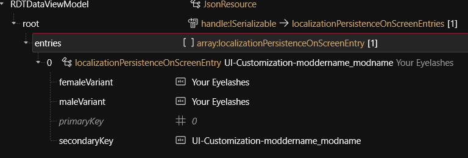<figcaption></figcaption></figure>

Here the important value is the **secondaryKey**, it must be unique. This links directly to your .inkcc and tells ArchiveXL what localization you want to use.

Remember how we replaced `moddername_modname` with the search and replace for the .inkcc file? Remember what you replaced with exactly, and change the `moddername_modname` to be the same. Do **not** touch the `UI-Customization-` part.

Next you can change the **femaleVariant** and **maleVariant** to be what you want to call your eyelash mod in the character customization. This text will be what you see there.

Save the file.


***

## Step 8: Remove unnecessary files

You can now delete the **alpha.xbm** you aren't using in the **textures** folder, if you haven't already.&#x20;

* If you didn't edit the .mi file, this will be the `drawn_lashes_alpha.xbm`.

If you're making the mod for both genders, **skip to the next section**.

If you're only making the eyelashes for one gender, you can remove all the other gender's files. **However**, I highly recommend you make your eyelashes for both V's as it doesn't require too much extra work.

Check [#shorthand](ccxl-eyelashes.md#shorthand "mention") for what the gendered acronyms were, and delete all the files with the acronym of the opposite gender.

You also need to clear these from the **.xl file**. If you are doing a Fem V only eyelash mod, delete from **customizations** the **male:** line completely (don't leave empty lines) and from **resource scope** everything that is under the comment `# Male V`. And vice versa for Male V only eyelashes.

<figure>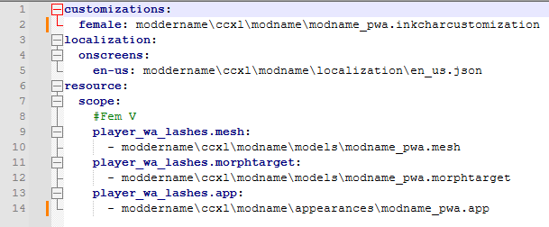<figcaption><p>Example of Fem V only .xl file</p></figcaption></figure>


***

## Step 9: The .xl file

Last check before we are done, ensure all the paths in the .xl file are exactly as they are in your project explorer. If they are not, the mod will not work.


Especially check the **.morphtarget** file path is correct. Wolvenkit's rename function misses morphtarget updating in resource files.


If a path is mismatched, you can grab the correct path by right clicking the file and selecting "Copy relative path to game file".

Save the file after any changes.


***

## Step 10: Install the mod

You're done! Now you can install the mod and see if everything works. If something isn't working, recheck all the steps and the [#troubleshooting](ccxl-eyelashes.md#troubleshooting "mention") section.


***

## Optional: Supporting custom head sculpts

If you want to support custom head sculpts like EKT Asian, you can create a simple override mod. Remember to always ask **permission** before including things from other people's mods in publicly published files!

1. Create a new wolvenkit project.
2. Copy over the `.morphtarget` file from the original eyelash mod. Remember, the folder path must be the exact same as in the original mod!
3. Turn on Mod Browser and find the **eye .morphtarget** of your head replacer.&#x20;
   1. The location of the `.morphtarget` is the same as the one listed in the drop down in [#step-3-.mesh-and-.morphtarget-files](ccxl-eyelashes.md#step-3-.mesh-and-.morphtarget-files "mention").
4. Add it to your project and export both `.morphtargets`.
5. Import them into Blender and follow the steps detailed in [#transferring-shape-keys](ccxl-eyelashes.md#transferring-shape-keys "mention").
6. Export your eyelash morphtarget with the updated Shape Keys from Blender. Remember to only select the eyelash submesh.
7. Import to Wolvenkit.
8. Delete the `base` folder in your Project Explorer.
9. Pack and install the override mod alongside the main mod file.


***

## Troubleshooting

#### All the vanilla colors are black!

* Ensure you are on game version **2.31+**
* Ensure you have ArchiveXL version **1.26.3+**
* Recheck your .xl file has the correct paths

#### There is no Eyelashes switcher!

* Install the required **core mod** to have the switcher appear.

#### My eyelashes are not properly shaping to the eye shapes!

* Adjust your eyelash shape keys to better match the eye shapes like detailed in [#transferring-shape-keys](ccxl-eyelashes.md#transferring-shape-keys "mention").

#### The eyelashes are floating and not following the character!

* You forgot to change the armature and parent of your submesh after transferring shape keys, go back to [#transferring-shape-keys](ccxl-eyelashes.md#transferring-shape-keys "mention").

#### My eyelashes disappeared!

* Select the **Vanilla** option in the Eyelashes switcher **before uninstalling** your eyelash addition.

