# CCXL: Hair Profiles (Colors)

## Summary

Published: May 17, 2025 by [nutboy](https://app.gitbook.com/u/y772Qw4Ul9cmqXiuTKkTpLxDVzQ2 "mention")\
Last documented edit: [nutboy](https://app.gitbook.com/u/y772Qw4Ul9cmqXiuTKkTpLxDVzQ2 "mention") on May 17, 2025

### Wait, this is not what I want!

* To learn how to make hair profiles (hair colors), go here: [Custom Hair Colors](../../../../modding-guides/npcs/guides-all-about-hair/custom-hair-colours.md)
* To learn to add a hairstyle to character creator, read [CCXL hairs](ccxl-hairs.md)
* To learn more about the character creator, check [files-and-what-they-do](../../../files-and-what-they-do/ "mention") -> [character-creator](../../../files-and-what-they-do/file-formats/character-creator/ "mention")
* To convert an existing hairstyle to CCXL, check [convert-a-hair-mod-to-hair-ccxl-mod.md](../../../../modding-guides/npcs/guides-all-about-hair/convert-a-hair-mod-to-hair-ccxl-mod.md "mention")

## Requirements

* You have [downloaded the template project from Nexus](https://www.nexusmods.com/cyberpunk2077/mods/21545)
* You have hair profiles (.hp) files and/or gradient (.xbm) files ready
* Wolvenkit Version:[ 8.16.1 Stable](https://github.com/WolvenKit/WolvenKit/releases/tag/8.16.1) or newer


PWA = Player Woman Average (female character)\
PMA = Player Man Average (male character)

inkcc = shorthand for "inkcharcustomization" files


## Step 0: Make a project

Start by making a new project in WolvenKit. Name your project.&#x20;

Open your new project's root folder by clicking the yellow folder button on the top right of the project explorer: 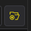

In file explorer, open and drag the template files into your project. It will show the files in WolvenKit's project explorer. If it does not, hit the blue refresh 🔄 button next to the yellow root folder button.

## Step 1: Replace template folder & file names


Check [this page](../../../../modding-guides/items-equipment/moving-and-renaming-in-existing-projects.md) on how to update file and folder paths inside the structure.


<figure>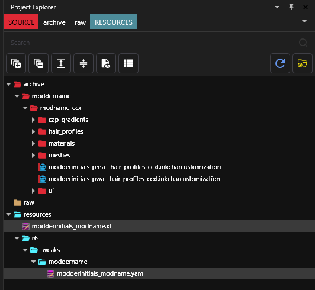<figcaption>
your project should look like this to start
</figcaption></figure>

Next, we need to replace all placeholders of "moddername" and "modderinitial" and "modname" in the project.&#x20;


The template in a nutshell:

"**moddername**" — change this to YOUR NAME

"**modderinitials**" — change this to YOUR INITIALS \
(or a shortened version of your name, less than 3-4 letters ideally)

"**modname**" — change this to a UNIQUE NAME for your mod\
Do not use the same name for multiple mods.


Here are the full steps:

Locate the Archive section of your project explorer.&#x20;

<figure>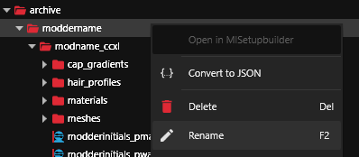<figcaption></figcaption></figure>

Select the first folder, then right click and click Rename (or press F2).&#x20;

<figure>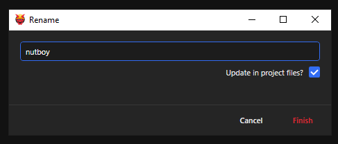<figcaption></figcaption></figure>

* Change folder "moddername" to **YOUR OWN** modder name, and check the box "update in project files"
* Change the next folder "modname\_ccxl" to **a unique project name** for this project, and check the box "update in project files"

WolvenKit's logs will print a list of places it updated the names.


**HELP!!! I goofed and didn't check the box to "update in project files!"**

Don't worry. Rename your folder back to the placeholder name and do **not** check the update in project files box. Then, rename it again to your new replacement name.&#x20;

Remember to check the box this time before confirming.&#x20;


Next, find the **Resources** folder in project explorer, at the bottom.&#x20;

Rename the following:&#x20;

* .xl file and .yaml - "`modderinitials_modname`" to the same as what you just named your project.&#x20;
* the "`moddername`" folder in r6/tweaks to your **modder name**. &#x20;

Next expand your **materials** folder. Inside there are a bunch of .mi files. \
Rename all "`modname`" file names to your mod name with "Update in project files" checked. \
Do not delete the `__` and suffix following (`__beard`, `__braid`, `__brows`, etc) for any files.

Next, rename the **.inkcharactercustomization** files with "Update in project files" checked.

Next, rename the **.inkatlas** and icon **.xbms** with "Update in project files" checked.

***

## Step 2: Update renamed paths in files

Open your .xl file in your text editor of choice, such as Notepad++ or Visual Studio Pro.&#x20;

<figure>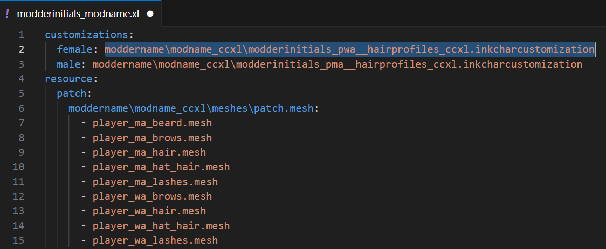<figcaption></figcaption></figure>

In WolvenKit, copy the path to the updated female (PWA) inkcharactercustomization file by hovering it and clicking the orange 🟧 button (or right click > "Copy relative path to game file").

In the xl, under customizations, delete the old path after `female:` and paste in your new path.&#x20;

Repeat the above steps for the `male:` (PMA) inkcharactercustomization file.&#x20;

Remember to **save** your .xl before exiting.&#x20;

<figure>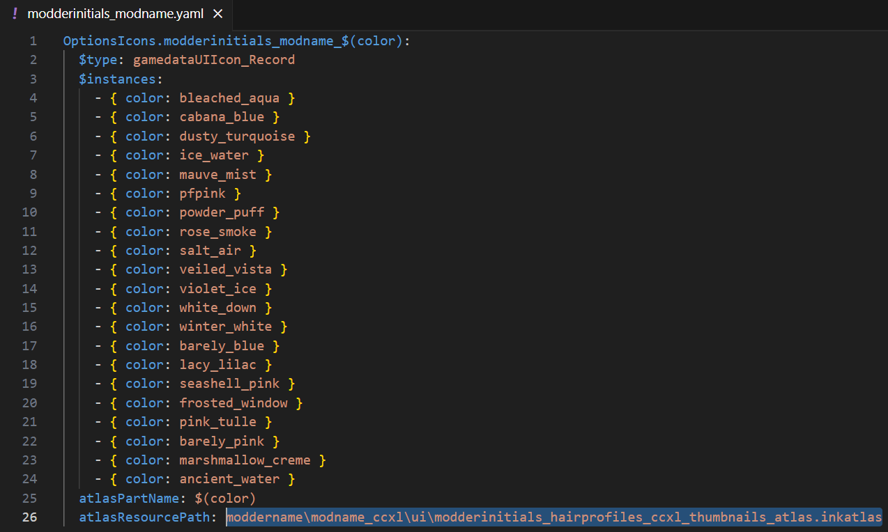<figcaption></figcaption></figure>

Open your .yaml file. Delete the old path after `atlasresourcepath:`

Copy the path to your renamed/updated inkatlas file and paste it into the yaml where the old path was.&#x20;

**Save** your yaml.&#x20;

***

## Step 3: Check for broken paths

Now that you've updated a bunch of files, check to make sure nothing broke in the process.

At the top of WolvenKit's UI, go to Project > Scan File for Broken File References

<figure>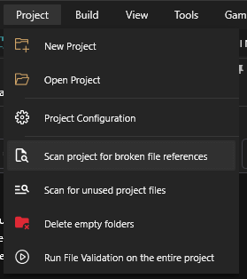<figcaption></figcaption></figure>

It will open a window. Ignore the inkatlas if it says "none" underneath, it's not an issue.&#x20;

If there are any other files listed in the window, you have broken paths.&#x20;

The first file listed is the file you need to open, and the indented list of other file(s) underneath are the paths that need to be udpated.

Open any files listed and expand menus as necessary to find the incorrect file path, or right click the first header RDTDataViewModel and click "Search and Replace", searching and replacing instances of "moddername", "modderinitials", or "modname" in the project. Remember to save your files as you update any broken paths.

Repeat scanning for broken file references until the only one left is inkatlas - none.&#x20;

<figure>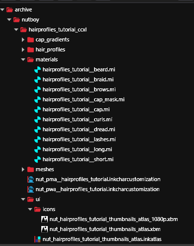<figcaption>
Example of the project with all files renamed.
</figcaption></figure>

Install your mod with WolvenKit, open your game, and open Character Customization to ensure everything still works: icons are still in the hair color list, hair colors show on the character when you select them, etc. If not, go back and check all your paths again.

***

## Step 4: Add your hair colors (.hp) and gradients

Now that your mod's file structure is set up, delete the placeholder .hp files in the `hair_profiles` folder and replace them with your own .hp files. &#x20;

<figure>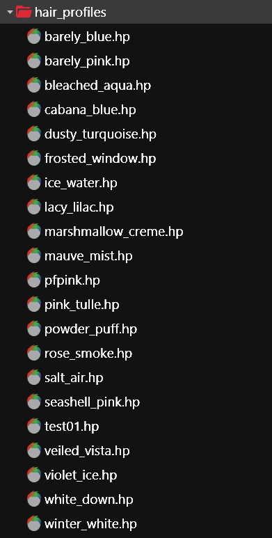<figcaption>
Delete these, and add in your own
</figcaption></figure>


**Make sure you've named each .hp file its own unique name.**&#x20;

If you are converting an old hair colors replacer mod where the names are basegame hair color names, give them new unique names.


### Custom Caps & Eyebrows (Gradients)

<figure>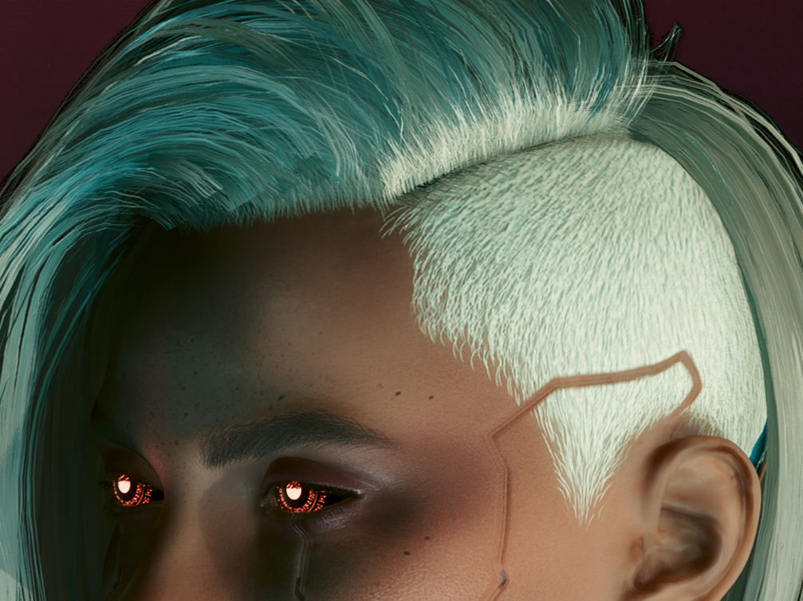<figcaption>
Example of a cap with a custom gradient to match the hair color.
</figcaption></figure>

If you are including custom gradients for the hair cap (scalp base) of hairs and eyebrow color options that match each of your colors, delete the placeholders in the **cap\_gradients** folder and add your own.

There is not currently a full tutorial for how to make custom gradients, so here's a short and sweet version: You can find a basegame cap gradient such as by searching `hh_cap_grad` in WolvenKit's asset browser, add it to your project, export as PNG, then edit it in Photoshop or an image editing program of your choice to make something close to your hair colors. Once done, convert the files back from PNG to .xbm and put them in the `cap_gradients` folder.

Name each of your gradient .xbms to `hh_cap_grad__color`, with "color" being the corresponding .hp color name. Make sure not to remove the extra \_ betwee "grad" and your color name. &#x20;

### No custom gradients? No problem

<figure>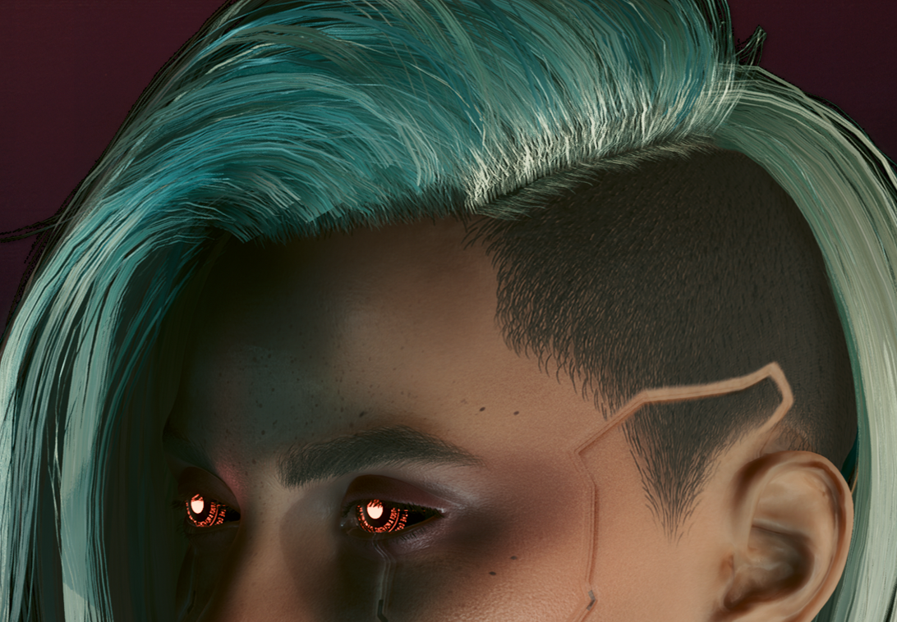<figcaption>
Example of a cap using black_carbon instead of a custom gradient.
</figcaption></figure>

1. First, pick a color for your roots/hair cap. **It will be used by all your hair colors**. \
   My character has dark roots; I use **black\_carbon** in this example, but you can use any `hh_cap_grad` gradient fil&#x65;**.**

<figure>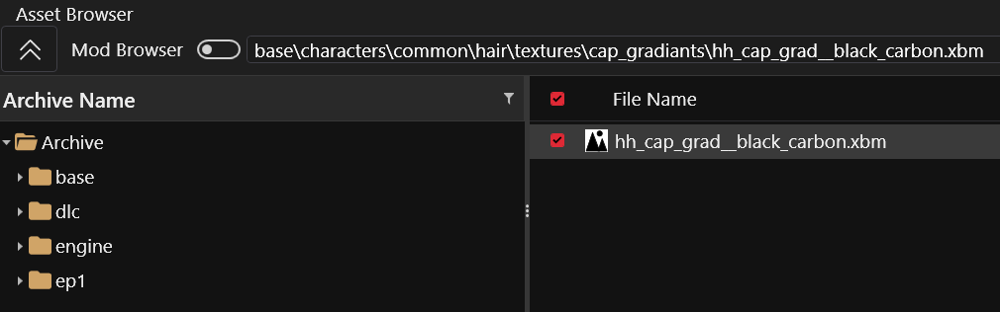<figcaption></figcaption></figure>

You can find it by searching: `base\characters\common\hair\textures\cap_gradiants\hh_cap_grad__black_carbon.xbm`

In WolvenKit's asset browser. Double click to add it to project.&#x20;

<figure><figcaption></figcaption></figure>

2. Delete the template gradients by highlighting and right click deleting them.&#x20;

<figure>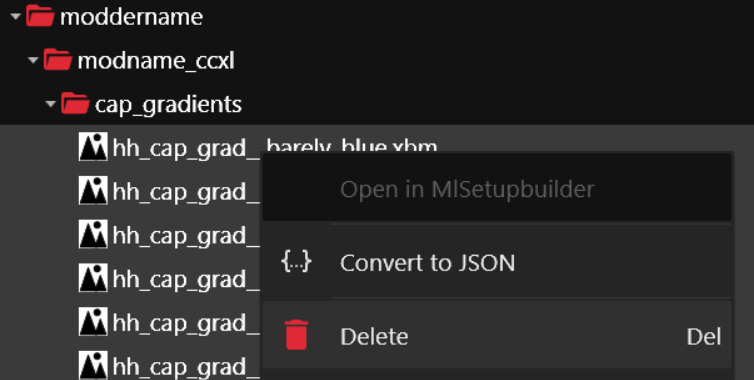<figcaption></figcaption></figure>

3. Drag the black carbon gradient .xbm into your empty cap\_gradients mod folder, then delete the empty base folder from your project.

<figure>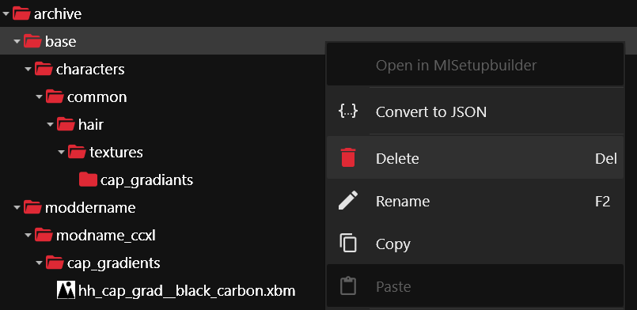<figcaption></figcaption></figure>

4. Hover the black carbon file with your mouse, use the orange button to copy the path (or right click > Copy relative path).&#x20;
5. In the materials folder, open your .mi file ending in `_cap` (NOT `_cap_mask)` )

<figure>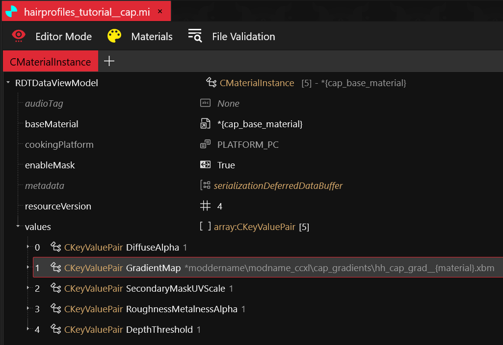<figcaption></figcaption></figure>

6. Expand values section, click **GradientMap.** In the window on the right side, paste the path to your black carbon gradient into the **DepotPath** box.&#x20;
7. Change Flags to **default,** then **save.**

<figure><figcaption></figcaption></figure>

Next we need to update our InkCC files so we don't add basegame black carbon as an eyebrow option more than once.&#x20;

1. Open both the PWA and PMA inkcc files.&#x20;

<figure><figcaption></figcaption></figure>

2. Expand the last **gameuiAppearanceInfo** entry in each inkcc. The uiSlot near the bottom will read `eyebrows_color.`&#x20;
3. Right click **gameuiAppearanceInfo** for the eyebrows\_color entry, and right click Delete Item in Array/Buffer.

<figure>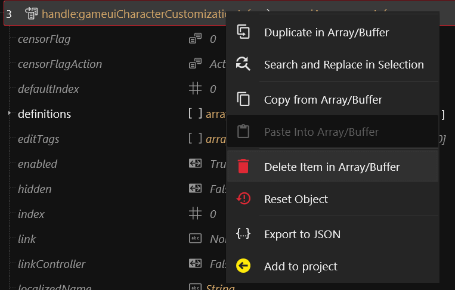<figcaption></figcaption></figure>

4. Delete this in each inkcc file, both PMA and PWA.&#x20;
5. **Save** your files.

***

## Step 5: Replace placeholder hair color names in files

Now that we have new hair colors, we replace the old names in all the other files.

### Find & Replace color names

1. Right click your `patch.mesh`, and click "Convert to json". \
   It will put the converted **.json** in your RAW folder section of the project explorer.
2. Convert the inkatlas, and PWA/PMA inkcharcustomization files to **.json**&#x20;
3. Open your **.json** files and your **.yaml** in a text editor such as Visual Studio Code or Notepad++ and **CTRL+F**
4. In the search box, type the name of the first placeholder color (you can use the .yaml as reference if needed.) \
   In the replace box, put the name of your first hair color. It must be the same name as your .hp files and same as the suffix of the gradient .xbms.&#x20;
5. Save your file. Tab to the next .json. Run the search and replace again. \
   Save, repeat for the last json.&#x20;

If you had less colors than placeholders, open your files after converting back from .json.&#x20;

### (optional) Delete extra placeholders

In each of the files, you can highlight everything that you want to keep, and right click > "Delete all but selection in array/buffer" and it will delete the extra placeholders.&#x20;

Placeholders will be found in the following locations in each file:

* .mesh - list of **appearances**
* .inkcharcustomization files - in each appearance's **definitions** section. \
  (There are up to 3 appearance sections in the PWA file and 4 in the PMA file whose definitions list you'd have to expand and delete extra placeholders from.)
* .inkatlas - **parts** sections
* .yaml - you must open in a text editor and delete the **entire line** of a placeholder you no longer need, including the - and any indents/spaces on that line.


At this point, you can install and see if your new colors show in the character creator in game.&#x20;

If a hair color shows up pure black or blonde instead of the color it should be, you've made a typo somewhere.


***

## Step 6: Add Custom Icons

* Icons for character creator are 160px by 160px with an additional, smaller 1080p version for the mini icon preview in the CC menu.
* You are welcome to edit the template .xbms in a photo editing program of your choice. \
  In WolvenKit, at the top, go to "Tools > Export Tool" and select the icons .xbms. \
  It will convert them to PNGs in your RAW folder, which you can edit, save over, then go to "Tools > Import Tool" to import them back to .xbm
* I recommend making a folder of your icon PNGs, with each named exactly like your .hp colors. Use the [icon python script](https://github.com/DoctorPresto/Cyberpunk-Helper-Scripts/blob/main/generate_inkatlas.py) to generate a brand new inkatlas. Name your new inkatlas exactly the same as your placeholder inkatlas, delete the placeholders and make sure your icon .xbms paths are correct in the inkatlas file.

If you've never made custom icons or used inkatlases before, check out these articles first:

* [**Custom Icons and UI**](https://wiki.redmodding.org/cyberpunk-2077-modding/modding-guides/custom-icons-and-ui)
* [**Game Icons: .inkatlas files**](https://wiki.redmodding.org/cyberpunk-2077-modding/for-mod-creators-theory/files-and-what-they-do/file-formats/game-icons-the-inkatlas-file)

***

## Step 7: OptionsIcons - Connect icons to Character Creator

1. Open your .yaml file.&#x20;

<figure>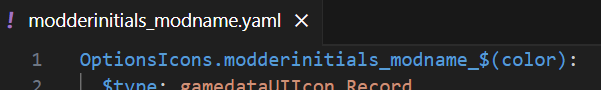<figcaption></figcaption></figure>

2. On the first line, you'll see there's one instance of "`modderinitials_modname`" that we never replaced. Update it to your name and mod name, save the file.&#x20;
3. Next, we need to update our inkcc files to match this change so it knows which icons to use. Open one of your .inkcharcustomization files.&#x20;
4. Expand `headCustomizationOptions`, then expand the first `gameuiAppearanceInfo`, and expand `definitions`.&#x20;
5. Click your first color. It will open a panel on the right, where you'll see a section called "`icon:`"\
   It may be empty, but it might read `OptionsIcons.modderinitials_modname_bleached_aqua` (or some other color)
6. Copy and paste the first line of our .yaml into this `icon:` section. Then change `$(color)` to the color name you have open.&#x20;
7. Click through each color in the definitions list, and update the `icon:` section, replacing `$(color)` with the corresponding color each time. Save your inkcharcustomization file.&#x20;
8. Next, highlight all definitions you just updated. Right click > Copy from array buffer

<figure>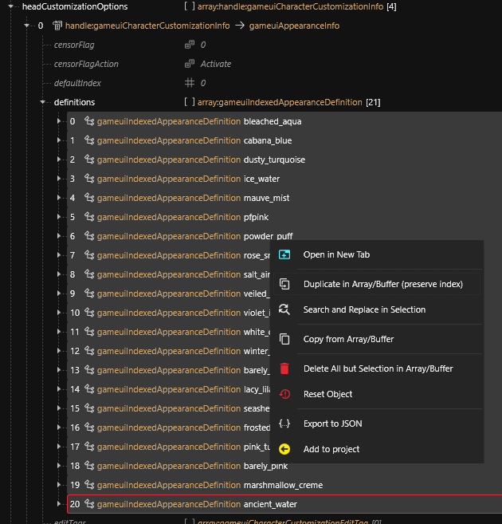<figcaption></figcaption></figure>

9. Collapse this first `gameuiAppearanceInfo` section, then expand the next one underneath.&#x20;
10. Right click definitions, click "Clear Array/Buffer". \
    (if it doesn't allow you to clear, expand the definitions list, highlight all the definitions, and right click clear array/buffer that way)

<figure>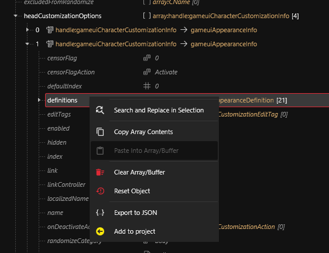<figcaption></figcaption></figure>

11. Once cleared, right click definitions again, paste selection into array buffer.

<figure>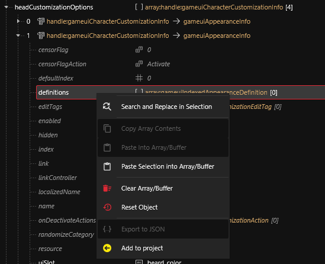<figcaption></figcaption></figure>

12. Repeat those steps for the remaining `gameuiAppearanceInfo` definitions lists.&#x20;
13. Then, repeat again with the other inkcharcustomization file.&#x20;


There is no difference between PMA/PWA  `definitions` lists, so once you've updated one definitions list, you can continue the process of clearing, copying and pasting without having to update the `icons:` section individually in all the other `gameuiAppearanceInfo` definitions lists.


## Step 8: Test your finished mod

Install your mod, and check in game that icons are working.&#x20;

You have successfully added new colors to character creator!

***

## Troubleshooting

### My icons are black!&#x20;

* double check that your OptionsIcons in each definitions entry correctly matches the format in the first line of your yaml, and that all your color names are exactly the same, with the same underscore placements, etc.
* double check that your .xbms are pathed correctly in the inkatlas
* double check that your inkatlas "parts" listed are named the same as all hair color names listed in your .yaml

### My hair is black or blonde!

* you've messed up the name of an appearance in your mesh or did not update the paths to the .mi files in your mesh
