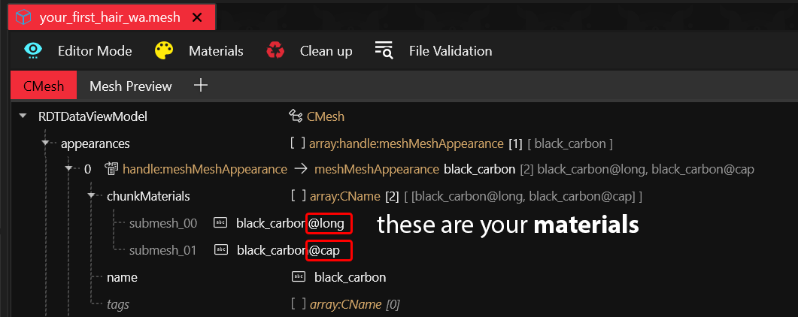
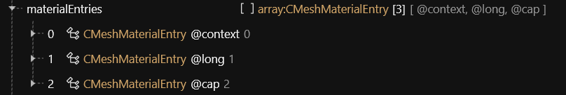
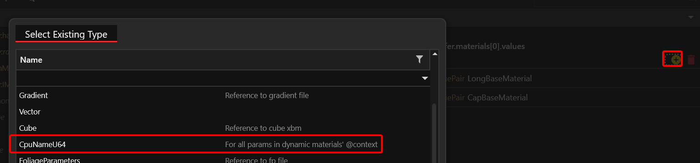
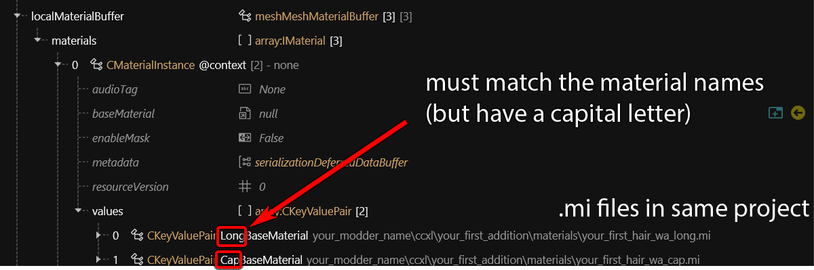
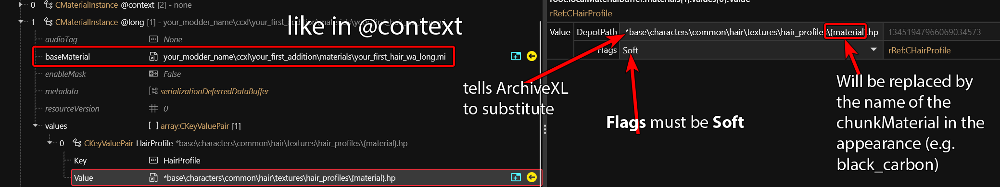
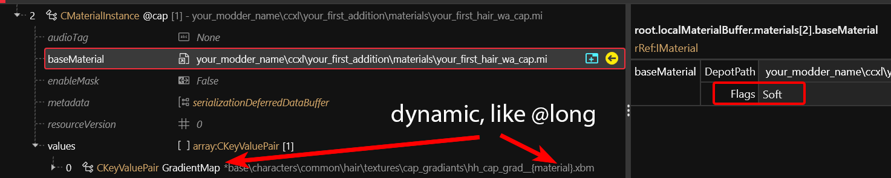
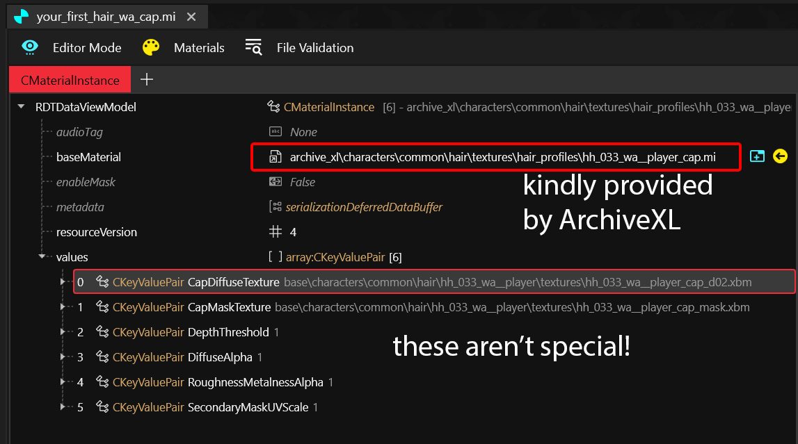
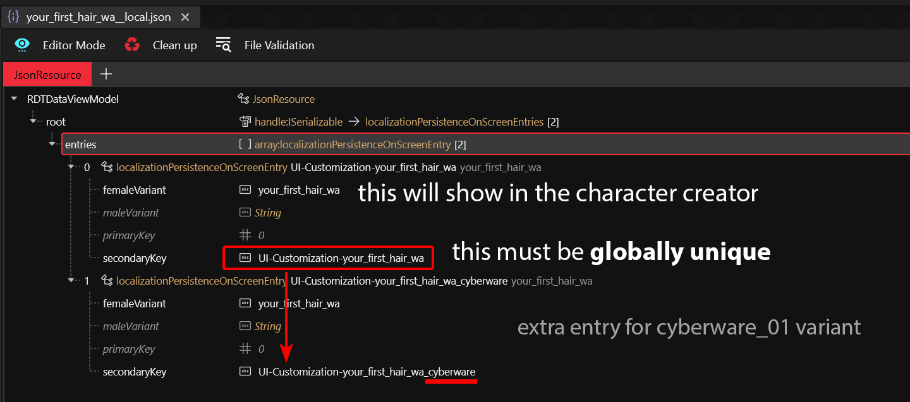
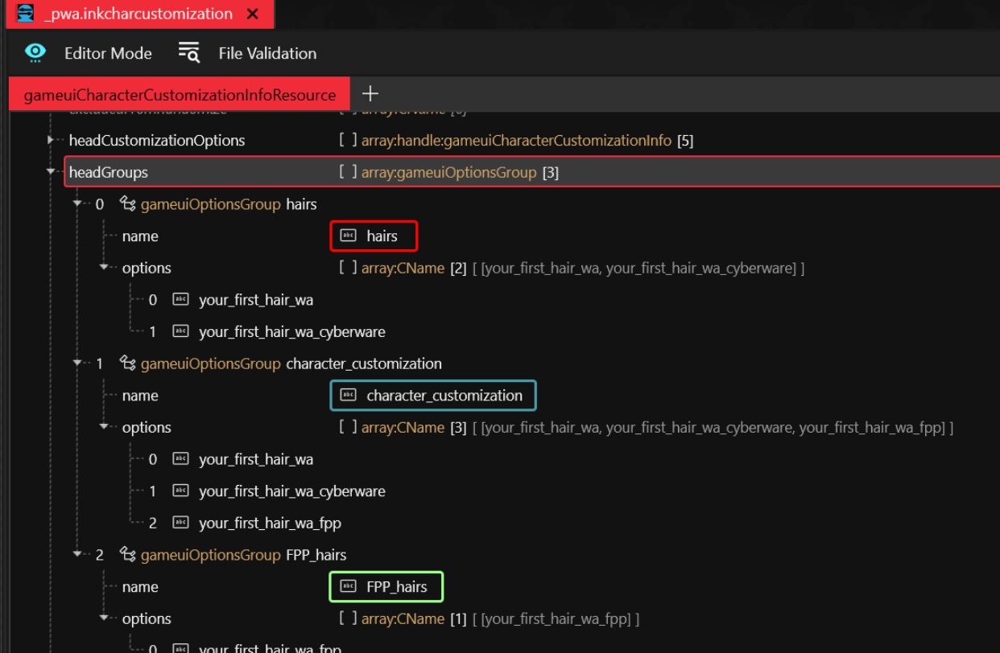

# CCXL: Hairs

## Summary

Published: Jan 20 2025 by [manavortex](https://app.gitbook.com/u/NfZBoxGegfUqB33J9HXuCs6PVaC3 "mention") and [IslandDancer](https://app.gitbook.com/u/s8gktWvqEZWGRxQIsePwOnEI2Mo2 "mention")\
Last documented edit: Jan 18-20 2025 by [manavortex](https://app.gitbook.com/u/NfZBoxGegfUqB33J9HXuCs6PVaC3 "mention"), [IslandDancer](https://app.gitbook.com/u/s8gktWvqEZWGRxQIsePwOnEI2Mo2 "mention"), [CyberVesna](https://app.gitbook.com/u/cmjyzwfGm7YaRhuU9Kyk4uTuE3Y2 "mention") and [nutboy](https://app.gitbook.com/u/y772Qw4Ul9cmqXiuTKkTpLxDVzQ2 "mention")

This page will tell you how to use ArchiveXL to add hair to the character creator.&#x20;

### Wait, this is not what I want!

To learn more about the character creator, check [files-and-what-they-do](../../../files-and-what-they-do/ "mention") -> [character-creator.md](../../../files-and-what-they-do/character-creator.md "mention")

## Requirements

You have downloaded the example project from [Nexus](https://www.nexusmods.com/cyberpunk2077/mods/19228)

## TL;DR

If you would rather understand what you're doing, please skip to [#step-1-deleting-.ent-files](ccxl-hairs.md#step-1-deleting-.ent-files "mention")!

1. Download example project
2. Add your `.mesh` file to the project
3. Copy the `appearances`, `materialEntries`, and `localMaterialDefinitions` from the template mesh
4. Overwrite it with your own
5. Overwrite the `.rig` and the `.animgraph` with your own, if you have them
6. Adjust `.app` file entry
7. If you're not using base game textures: Change files paths in the `.mi`
8. Rename the `.xl` file
9. Change translation key in the `.json` file to something unique for your mod
10. Change translation entries in the `.inkcharactercustomization` file
11. Custompath everything — do not publish anything that still contains tutorial files!
12. Profit

## Let's go!

We will be moving **backwards** through the files: starting at the bottom, and working our way to the top (the character creation and the .xl control file).

1. Start by downloading the example project from [Nexus](https://www.nexusmods.com/cyberpunk2077/mods/19228)
2. Unpack the `source` folder into the root of your existing hair project so that it merges with yours
3. Move any `.mesh`, `.animgraph`, and `.rig` files from your original hair to `your_modder_name\ccxl\your_first_addition\meshes`

## Step 1: Deleting .ent files

If you don't have any `.ent` files, you're good!&#x20;

If you do have them, delete them now – we don't need them in our CCXL projects.

## Step 2: Adjusting the .app file

Thanks to ArchiveXL magic, your .app file needs **only one appearance**. All other appearances will be extrapolated from it!

You can use any of the existing base game hair colours, as long as the definition itself is valid.

<details>

<summary>If you are converting an existing mod with an .app file</summary>

1. **Delete** all but the first appearance
2. If you have anything in `partsValues`, make sure to **remove** it – the .ent file it was pointing at is gone now
3. `partsOverrides` will make sure your hair colours assign correctly. Keep them, but clear any `depotPaths` you have set (ArchiveXL will handle that for you)

</details>


If you want to add more meshes/rigs to the template .app (for example from uuhv4), you can **duplicate** the `entSkinnedMeshComponent` and the matching `entAnimatedComponent` from the context menu.



File Validation can help you making sure that your hair components and paths are correct.&#x20;


<figure><figcaption></figcaption></figure>

## Step 3: The .mesh files

This section will explain how ArchiveXL works its magic to pick all the right hair colours and -textures from three entries and a piece of duct tape.


If you are converting an existing hair mod, you probably already have these files.&#x20;

In this case, copy `appearances`, `materialEntries`, and `localMaterialInstances` from the template file to your existing hair mesh.&#x20;


We'll now go through everything step by step.

### 3.1 Appearances

As you can see, you only need a single appearance — ArchiveXL will generate all the rest.&#x20;


If your hair mesh is set up differently from the template file, you need to adjust the chunk materials here!


<figure><figcaption></figcaption></figure>

In our example, the first submesh uses the material `@long`, and the second one the material `@cap`. &#x20;

The names must be set as follows:

```
<name_of_appearance>@<name_of_material> => black_carbon@long
```

### 3.2 Material definitions

The tutorial hair has only two materials, and three material entries (`@context`, `@long`, `@cap`):

<figure><figcaption></figcaption></figure>

You can define more materials here if you need them (`@long`, `@short`, `@curls`, `@beard`, `@braid`, `@dread`, `@cap`).

Now, let's look at the materials themselves.

### 3.3 Materials

#### @context&#x20;

This is not actually a material instance – instead, this is where you register your mesh file's material properties for ArchiveXL's character creator extensions.

Please note the following:

* It does not have a base material
* Each `value`  points at one `.mi` file in the project
* All of its `values` must be of the type `CpuNameU64`. You can create one as follows:

<figure><figcaption></figcaption></figure>


You need to create one entry for every type of material that you want ArchiveXL to expand.

For a full list, see [.](./ "mention") -> [#hair-materials](./#hair-materials "mention")


<figure><figcaption></figcaption></figure>

#### @long&#x20;

This material defines the hair cards. It points at the `.mi` file in your project, where the hair's textures are defined.


All ResourcePaths must have `Soft` flags for this to work, including the baseMaterial! (see screenshot)


Since the dynamic context does not transfer to the `.mi`, we need to set the `HairProfile` here.&#x20;

The `{material}` placeholder in the file entry will be replaced with the chunk mask name from the appearance (e.g. `black_carbon`).

<figure><figcaption></figcaption></figure>

#### @cap&#x20;

This material defines the hair cap (the stubbles on the scalp). It points at the `.mi` file in your project, where the scalp's textures are defined.

<figure><figcaption></figcaption></figure>

Since the dynamic context does not transfer to the `.mi`, we need to set the `GradientMap` here.  Omitting this will lead to the hair cap looking way darker than it's supposed to.

## Step 4: The .mi files


The `.mi` file and the `@context` are required for ArchiveXL character creator extensions. Without a .mi file, you won't have e.g. extra hair colours (e.g. [Hair Profiles CCXL](https://www.nexusmods.com/cyberpunk2077/mods/19115))


With the exception of the hair cap, the .mi file is a completely normal [material tempate file](../../../files-and-what-they-do/materials/re-using-materials-.mi.md) (link not necessary for understanding this guide).&#x20;

The hair cap base material is included within ArchiveXL. If you aren't using one, you don't need to know any of this — just move all properties without dynamic properties from the `.mesh` file into your `.mi`.

<figure><figcaption></figcaption></figure>

## Step 5: The translation entry

Open the included .json file, and make sure to change the entries according to your needs.

There are two translation entries, because this tutorial assumes that you want to name the `cyberware_01` variant differently.&#x20;

For an explanation of what is what, keep reading.

<figure><figcaption></figcaption></figure>

<table><thead><tr><th width="187">key</th><th width="354">value</th><th>explanation</th></tr></thead><tbody><tr><td><code>femaleVariant</code></td><td><code>Your First Hair</code></td><td></td></tr><tr><td><code>maleVariant</code></td><td><em>leave it blank</em></td><td>If no value is found, then <code>femaleVariant</code> acts as default</td></tr><tr><td><code>primaryKey</code></td><td>0</td><td>Will be generated by ArchiveXL, leave it alone</td></tr><tr><td><code>secondaryKey</code></td><td><code>UI-Customization-your_first_hair</code></td><td>Used in the <code>.inkcharactercustomization</code> file to set your hair's entry name</td></tr></tbody></table>

## Step 6: The .`incharactercustomization` file

Here is where everything connects to each other.&#x20;

Open the file, we will look at the entries now.

### 6.1 headGroups

These entries **create** character creator additions, while the CustomizationOptions **define** them (think of a materialDefinition and a materialInstance in a `.mesh` file).

<figure><figcaption></figcaption></figure>

### 6.2 gameUiSwitcherInfos

Let's take a look at the `headCustomizationOptions`. The first to entries of the type `gameuiSwitcherInfo` add our new hair to Cyberpunk's character creator menu, so that they show up when you scroll through the hairs.

#### The first entry


This entry must be nameless, or it will overwrite the basegame switcher!


* **link**: Targets one of the `headGroups` entries
* **names**: Contains the `headGroup`'s `options`

<figure><figcaption></figcaption></figure>

#### The second entry: `hairstyle_cyberware`

This entry defines the hairstyle for cyberware\_01.&#x20;

### 6.3 `gameUiAppearanceInfo`s

<figure><figcaption></figcaption></figure>

## Step 7: The .xl file

From your project's resource directory, open the `.archive.xl` file that you created in the previous guide. Add the following lines at the bottom (make sure that there are no leading spaces):

```yaml
customizations:
  female: your_modder_name\ccxl\your_first_addition\_pwa.inkcharcustomization
localization:
  onscreens:
    en-us: your_modder_name\ccxl\your_first_addition\localization\your_first_hair_wa__local.json
resource:
  scope:
    player_wa_hair.app:
      - your_modder_name\ccxl\your_first_addition\appearances\your_first_hair_wa.app
      - your_modder_name\ccxl\your_first_addition\appearances\your_first_hair_wa_cyberware.app
      - your_modder_name\ccxl\your_first_addition\appearances\fpp\your_first_hair_wa_fpp.app
    player_wa_hair.mesh:
      - your_modder_name\ccxl\your_first_addition\meshes\your_first_hair_wa.mesh
      - your_modder_name\ccxl\your_first_addition\meshes\your_first_hair_wa_cyberware.mesh
```

<details>

<summary>TODO: What does this do?</summary>

It just works. Adjust the paths!

</details>


## Step 8: Renaming and moving

Now it's time to [custompath](../../../../modding-guides/items-equipment/custompathing-assets.md) your project.&#x20;

<figure><figcaption></figcaption></figure>


