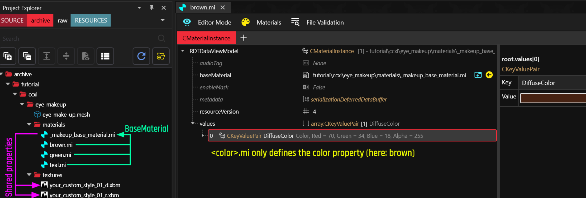
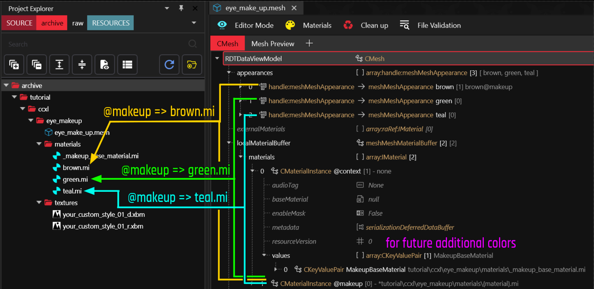

# CCXL Theory: Scopes and extensions

## Summary

**Published:** March 12 2025 by [manavortex](https://app.gitbook.com/u/NfZBoxGegfUqB33J9HXuCs6PVaC3 "mention")\
**Last documented edit:** March 12 2025 by [manavortex](https://app.gitbook.com/u/NfZBoxGegfUqB33J9HXuCs6PVaC3 "mention")

This page explains how ArchiveXL expansions work in the context of the character creator. It is currently a work in progress.

## Hair materials

The full list of hair style materials as supported by CCXL extension:

| material for chunkmask | parameter name in @context |
| ---------------------- | -------------------------- |
| `@beard`               | `BeardBaseMaterial`        |
| `@braid`               | `BraidBaseMaterial`        |
| `@cap`                 | `CapBaseMaterial`          |
| `@cap01`               | `CapBaseMaterial`          |
| `@curls`               | `CurlsBaseMaterial`        |
| `@dread`               | `DreadBaseMaterial`        |
| `@long`                | `LongBaseMaterial`         |
| `@short`               | `ShortBaseMaterial`        |
| `@brows`               | `BrowsBaseMaterial`        |
| `@lashes`              | `LashesBaseMaterial`       |


While `@cap01` falls back to CapBaseMaterial, this is how you can define an extra hair cap texture for `cyberware_01`.&#x20;


## Material colour extensions

Material colour extension makes use of both [mesh-appearance-auto-expansion.md](../mesh-appearance-auto-expansion.md "mention") and [archivexl-resource-patching.md](../archivexl-resource-patching.md "mention").

First, you require an intermediary layer of .mi files that define individual properties, for example **colours**. All of these need to derive from a common ancestor, which defines all other properties.

<figure><figcaption></figcaption></figure>

You can make use of  [mesh-appearance-auto-expansion.md](../mesh-appearance-auto-expansion.md "mention") to use the correct .mi files, while allowing auto-extendability for future patching via the `@context`.&#x20;


You can find another example for this under [ccxl-hairs.md](ccxl-hairs.md "mention")&#x20;


<figure><figcaption></figcaption></figure>


Defining multiple make-up styles in one mesh will break extensibility (read below). To be extensible, you need one mesh per style.


To define multiple different make-up stypes in one mesh, you can put the textures directly into the local material - e.g. `@makeup`, `@makeup_02`.

