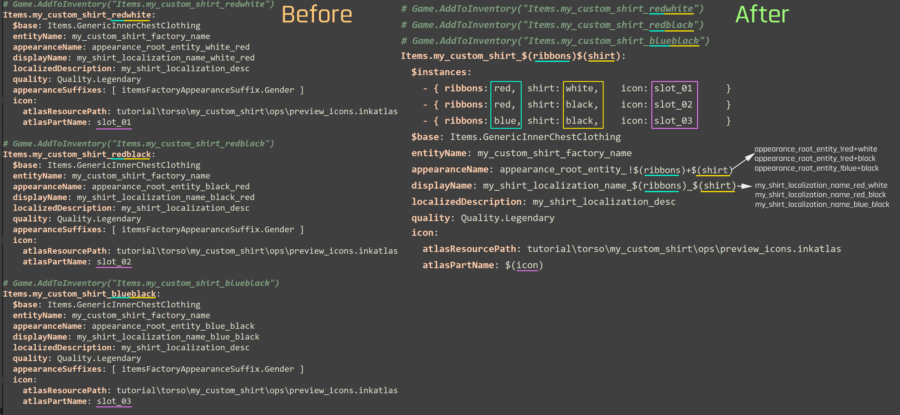
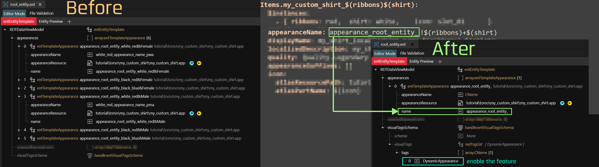
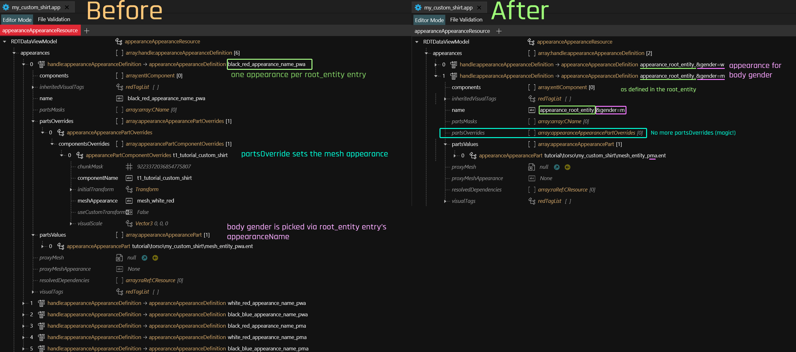
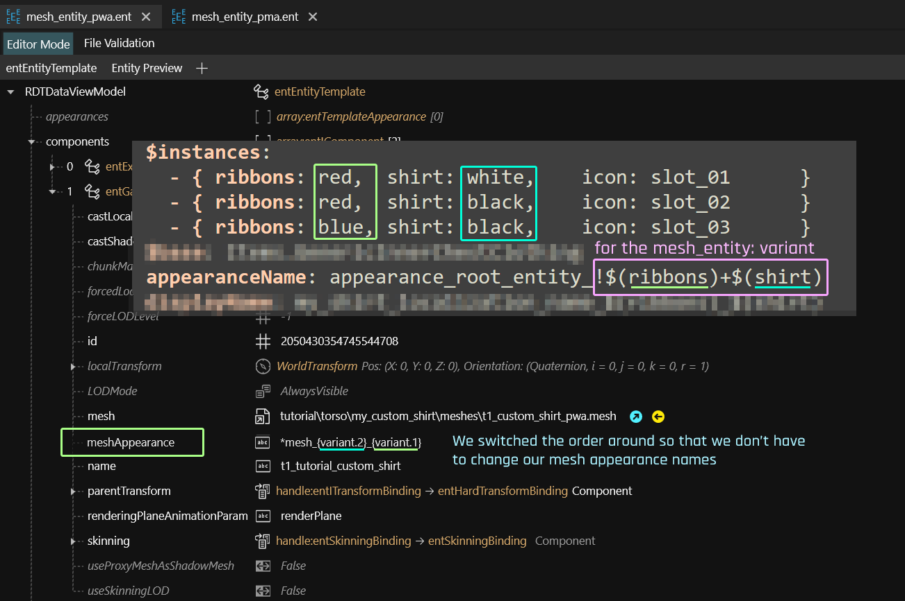
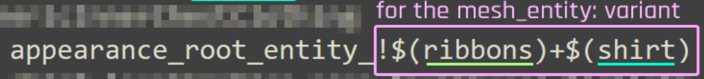
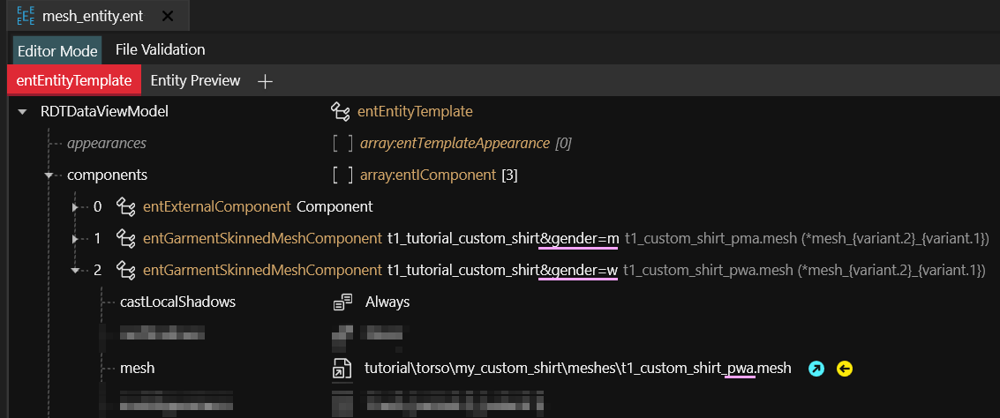
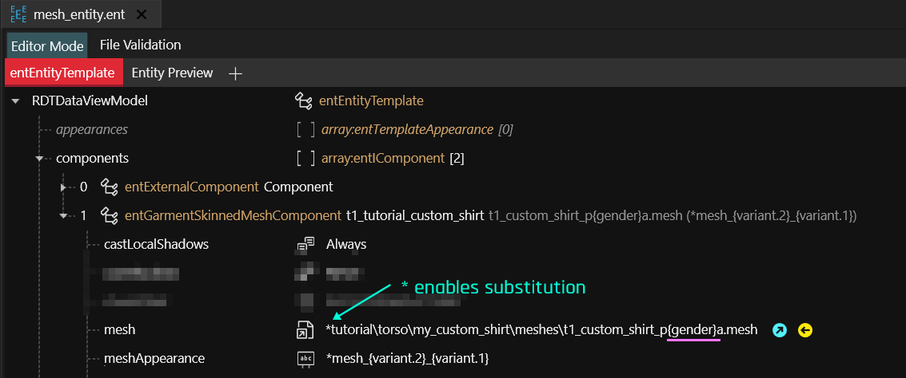

# ArchiveXL: Dynamic conversion guide

## Summary

**Published:** June 30 2024 by [manavortex](https://app.gitbook.com/u/NfZBoxGegfUqB33J9HXuCs6PVaC3 "mention")\
**Last documented update:** June 30 2024 by [manavortex](https://app.gitbook.com/u/NfZBoxGegfUqB33J9HXuCs6PVaC3 "mention")

This page will teach you how to convert your existing ArchiveXL mod to the "new" system.

## Prerequisites

* An ArchiveXL mod that you want to convert

We will go through the process step-by-step. I'll explain what I'm doing as I go along.

## Step 0: The .yaml

Instead of one entry per **item variant**, we only need one entry per **item**.&#x20;

Our variants are defined via `$instances` and generated via substitutions. Let's take a look at this:

<figure><figcaption></figcaption></figure>


You'll notice that the `displayName`s are different now. I could prevent that by writing `my_shirt_localization_name_$(shirt)_$(ribbons)`, but this is a great chance to clean up the historically-grown mess.


### What did we do here?

* We **deleted** the `appearanceSuffixes` (we'd only need them for [gendered-preview-icons.md](../../../modding-guides/custom-icons-and-ui/adding-items-preview-images/gendered-preview-icons.md "mention"), and we can't be arsed with that)
* We defined a list of `$instances`, which will generate all of our different appearances
* We replaced all parts that are different with the corresponding key from `$instances`. The rest will be magic.

### And that !+ stuff?

Defines the variants — you'll get a gold star for paying attention, but we're getting to that later ([#step-3-the-mesh-entity](archivexl-dynamic-conversion-guide.md#step-3-the-mesh-entity "mention"))

## Step 1: The root entity

Instead of one entry **per variant and gender**, we only need one entry **in total**.&#x20;

Our appearance's `name` must still match the `.yaml`, but only up to the variant separator: we're going with `appearance_root_entity_`.&#x20;

<figure><figcaption></figcaption></figure>


By leaving the `appearanceName` blank, we're telling ArchiveXL to re-use `name`.  If you want to use a specific appearance name (or if you don't want `appearance_root_entity_` in your .app), you can put something different here.


### What did we do here?

* We added the `DynamicAppearance` tag to enable the feature
* We deleted all appearances but one
* We deleted everything variant-related from the appearance
* We deleted the appearanceName, so that ArchiveXL will re-use `name` for the .app

## Step 2: The .app

Instead of one appearance per **variant and gender**, we will squash everything down so that we have only one appearance per gender. In [#lets-simplify-this-even-further](archivexl-dynamic-conversion-guide.md#lets-simplify-this-even-further "mention"), I will teach you how to reduce that even further, but for now, we'll be going step by step.

<figure><figcaption></figcaption></figure>

### What did we do here?

* We deleted all but one appearance per gender
* We added the condition `&gender=w` and `&gender=m`
* We deleted the `partsOverrides`

Gender matching now happens via condition. The different meshes for male and female body gender are loaded in the different mesh entity files.


For a full list of conditions, see [archivexl-suffixes-and-substitutions.md](archivexl-suffixes-and-substitutions.md "mention")


### But that will always load the default appearance!

Right! You've been paying attention! Let's take a look at that next.

## Step 3: The mesh entity

We will only change a single field (`meshAppearance`).&#x20;

Before, it was `mesh_white_red` (the default appearance), and each appearance overwrote it via `partsOverride`. We're now changing it to `dynamic`:

<figure><figcaption></figcaption></figure>

Old: `mesh_white_red`\
New:  `*mesh_{variant.2}_{variant.1}`


This is where file validation currently stops working (as of June 2024). If you make any mistakes here, you will always see the first mesh appearance.


### What did we just do?

* By adding a leading `*`, we told ArchiveXL that this field is involved in magic (substitution in this case)
* By replacing `white` with `{variant.2}`, we're using the second parameter from the yaml's `appearanceName` (shirt).  &#x20;
* By replacing `red` with `{variant.1}`, we're using the first parameter from the yaml's `appearanceName` (ribbons).  &#x20;

### Parameters? Variants? What?

Let's unpack this.

In this example, we have the following mesh appearances:&#x20;

* `mesh_white_red`
* `mesh_black_red`
* `mesh_black_blue`

By using `!` in the `appearanceName`, we're telling ArchiveXL that everything after is part of the mesh appearance definition:

<figure><figcaption></figcaption></figure>


This is the reason why we've used only `appearance_root_entity_` as the appearanceName, and not the whole ordeal.


The `+` in the `variant` **splits it up**. If we didn't have it, we couldn't use `variant_1` and `variant_2`.

#### How would that look?

Let's compare our setup ( `*mesh_{variant.2}_{variant.1}`)  to the alternative.

yaml:&#x20;

```yaml
appearanceName: appearance_root_entity!$(shirt)_$(ribbons)
```

Our `meshAppearance` would be `*mesh_{variant}`.


Without the split, we need to make sure to pass the variant `exactly as expected`.


## Recap

Unless you got hopelessly lost, this should have taken no more than ten minutes, and your mod just works(tm).&#x20;

You now have one `root_entity` entry,  two `appearanceAppearanceDefinition`s in your `.app`, and one `mesh_entity` per body gender.

## Let's simplify this even further.

Currently, we have two mesh\_entities:&#x20;

```
tutorial\torso\my_custom_shirt\mesh_entity_pwa.ent
tutorial\torso\my_custom_shirt\mesh_entity_pma.ent
```

Each of them points at a different mesh:

```
tutorial\torso\my_custom_shirt\meshes\t1_custom_shirt_pwa.mesh
tutorial\torso\my_custom_shirt\meshes\t1_custom_shirt_pma.mesh
```

Delete one of the mesh entities and rename the other:

```
tutorial\torso\my_custom_shirt\mesh_entity.ent
```

### The .app file

Delete one of your appearances, and strip the suffix name from the other, leaving only `appearance_root_entity_`.

Change the path of your `partsValue` to the only remaining mesh entity, and save the file.


This will only load one body gender (the one you defined in the `mesh_entity`).


## The mesh\_entity: Round 2

### Method 1: Conditional Components


You should use the other approach where possible; this is only documented here for the sake of completeness.


Just like with appearances, you can also use [#conditions](archivexl-suffixes-and-substitutions.md#conditions "mention") with component names.

**Pro:** Especially with many body mods, you can just put all the logic into the components

**Cons:** All of these components will be added to the player entity, even if half of them will be hidden. This is bad for performance, especially if everyone does it.


If you want several different body mods or feet state to use the same mesh, you can use [archivexl-resource-linking.md](archivexl-resource-linking.md "mention") instead.


<figure><figcaption></figcaption></figure>

### Method 2: Component substitution

The best way of dealing with multiple meshes is to have a single component and let ArchiveXL handle all the heavy lifting by using substitutions in the path:

<figure><figcaption></figcaption></figure>

This is our mesh's depot path:

```
*tutorial\torso\my_custom_shirt\meshes\t1_custom_shirt_p{gender}a.mesh
```

A combination of&#x20;

