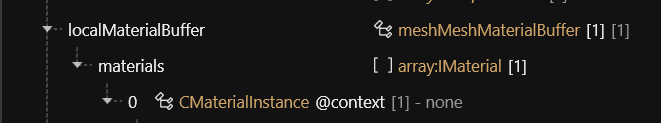
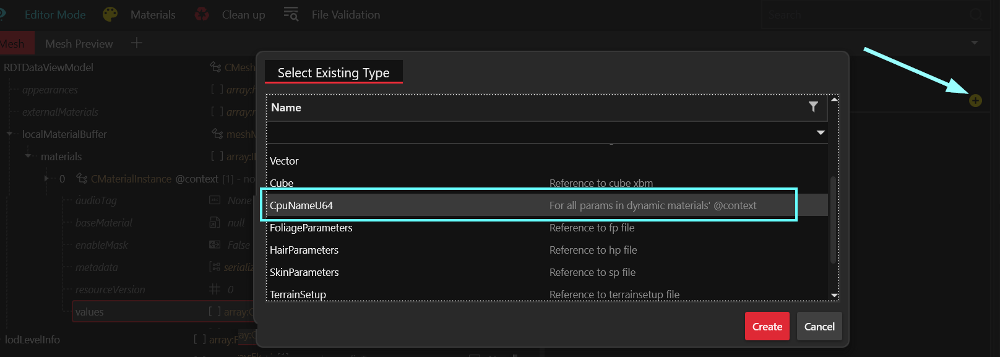
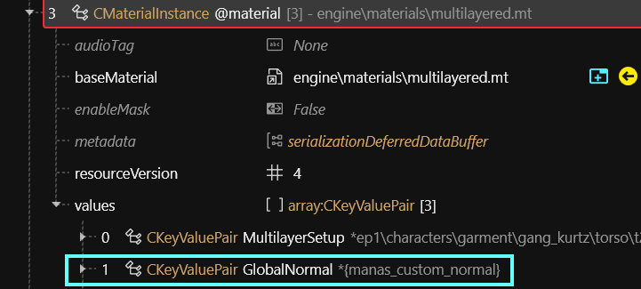

# ArchiveXL: Resource patching

## Summary

**Published:** May 18 2024 by [mana vortex](https://app.gitbook.com/u/NfZBoxGegfUqB33J9HXuCs6PVaC3 "mention")\
**Last documented update:** July 23 2024 by [Zhincore](https://app.gitbook.com/u/OsI9JXgCSSbt40hb327iBDif7Xv1 "mention")


The example below uses **mesh materials**, but these aren't even the tip of the iceberg. By using this technique, we can re-work everything, from CDPR's messed-up material paths up to the character creator.&#x20;

You can find a guide under [archivexl-patching-appearances.md](../../../../modding-guides/items-equipment/editing-existing-items/archivexl-patching-appearances.md "mention")


This page explains **resource patching,** a very powerful ArchiveXL feature that lets you modify resources **without conflicting** with other mods or even game updates. \
Also allows you to reuse e.g. material definitions in multiple meshes, possibilities are endless!


For the most efficient way to define multiple materials, check out [archivexl-dynamic-materials.md](../../../../modding-guides/textures-and-luts/archivexl-dynamic-materials.md "mention")!


## Why do I need this?

While [archivexl-body-mods-and-refits](../archivexl-body-mods-and-refits/ "mention") has solved one problem, it introduced a new one. You now have a bunch of meshes inside your .archive, and you have to copy the materials across each of them.

Not only does resource patching fix that issue, it also allows multiple mods to modify the same resource without conflicts! Now you can have multiple mods add appearances to the same weapon and more.

## How do I use this?

In general, have a file that contains your changes (and only your changes), this is your "patch file". And you should know what file you want to patch, the "target file". Add the following code to your `.xl` file:

```yaml
resource:
  patch:
    <source_file_path_1>:
      - <target_file_path_1>
      - <target_file_path_2>
    <source_file_path_2>:
      - <target_file_path_3>
```

You can patch multiple files with the same or different files, as many as you'd like. (Don't duplicate the first two lines)

**Example:** If you have many meshes and want to share materials between them, don't define materials in your mesh files, instead have another mesh file with just the materials! Then add the following lines to your `.xl` file:

```yaml
resource:
    patch:        
        tutorial\archive_xl\your_new_item\materials.mesh: # relative path to your material mesh
            - tutorial\archive_xl\your_new_item\pwa.mesh  # paths to the target meshes
            - tutorial\archive_xl\your_new_item\pma.mesh
```

And just like that, it will work. All your meshes will have the materials you defined in your material mesh and any change to it will propagate to the patched meshes.

## What else can I patch?

You can patch pretty much any `.ent`, `.app` or `.mesh` file! Give it a try via `.xl` file.&#x20;

## What is the minimal patching level?

### .mesh file

appearances (added/replaced appearances use materials from patch mesh)

```
original_mesh:                          patch_mesh:
  appearances:                            appearances:
    appearance_black:                        appearance_black:
      - black_material                          - black_material
      - black_material                          - black_material
    appearance_black_2:                      
      - black_material                       
      - black_material                       
  materials:                              materials:
    black_material: multilayered.mt         black_material: metal_base.remt
```

After patching, `appearance_black` would use `metal_base.remt`,  while `appearance_black_2` would still use `multilayered.mt`.

### .ent file

You can patch appearances, components, entity, visual tags

### .app file

You can patch **definitions** (components, parts values, parts overrides, visual tags)

## Distributed patching: Scopes

Some things are scattered across multiple files — for example, there are different player entities for first and third person. Fortunately, ArchiveXL solves this problem in the cradle by defining patchable scopes. You can find examples on the github repository:

* the [player ent](https://github.com/psiberx/cp2077-archive-xl/blob/main/bundle/source/resources/PlayerBaseScope.xl)
* [player customization (e.g. appearances)](https://github.com/psiberx/cp2077-archive-xl/blob/main/bundle/source/resources/PlayerCustomizationScope.xl)
* [photomode .ent files](https://github.com/psiberx/cp2077-archive-xl/blob/main/bundle/source/resources/PhotoModeScope.xl)

### Including scopes:

```yaml
resource:
    patch:
        tutorial\archive_xl\player_patch.ent:
          - !include player.ent # or player_ma.ent / player_wa.ent
```

This will _include_ all the needed files for patching without the need to specify each of them manually.

### Adding entries to scopes:

```yaml
photo_mode.character.altPoses: *AddPosesF
```

This will add the list `&AddPosesF` to the list of `photo_mode.character.altPoses`.\
Photo mode scopes were added in version 1.19

### Expanding scopes

If it becomes necessary, you can expand scopes and add your own files to them. For example:

```yaml
resource:
  scope:
    player_customization.app:
      - your_modder_name\patches\your_custom.app
```


You can't overwrite scopes, and you can't remove anything from them. Only appending is possible!


## Partial templates: @Context&#x20;

### Different parameters per .mesh

What if you need to customize your template further? For example, everything uses the same `.mlsetups`, but you need different normal maps?

That's where `@context` comes in.


This only works for **dynamic** materials — e.g. `@material`!


### Adjusting the target mesh

This is for the mesh that you will be patching.

1. Create a material entry called `@context`.  This must be the first material in your list:

<figure><figcaption></figcaption></figure>

2. In the `values` array, create a `CpuNameU64`:

<figure><figcaption></figcaption></figure>

3. Give it a custom name (like `ManasCustomNormal`), and set the depot path of your normal map as its`Value`.
4. Do the same for any other mesh(es) that you want to patch and which should use a custom texture.

### Adjusting the patch mesh

Any dynamic material inside your patch mesh can now **resolve substitution** for the parameter you just defined (the name will be converted to **`camel case`**):

<figure><figcaption></figcaption></figure>

... and that's it. Depending on your defined parameters, the material will now have a different normal map per mesh (or fall back to the default parameter if it can't be resolved).

