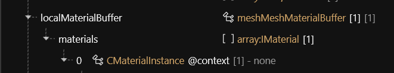
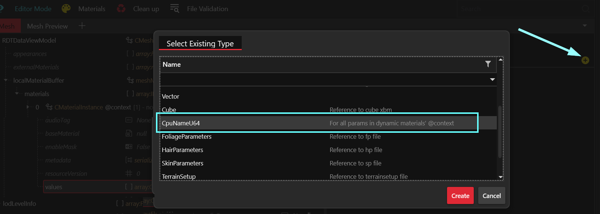
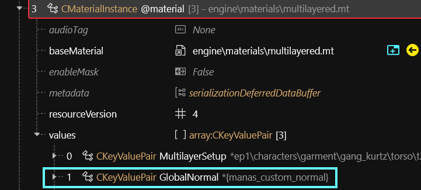

# ArchiveXL: Resource patching

## Summary

**Published:** May 18 2024 by [mana vortex](https://app.gitbook.com/u/NfZBoxGegfUqB33J9HXuCs6PVaC3 "mention")\
**Last documented update:** July 23 2024 by [Zhincore](https://app.gitbook.com/u/OsI9JXgCSSbt40hb327iBDif7Xv1 "mention")


The example below uses **mesh materials**, but these aren't even the tip of the iceberg. By using this technique, we can re-work everything, from CDPR's messed-up material paths up to the character creator.

You can find a guide under [archivexl-patching-appearances.md](archivexl-patching-appearances.md "mention")


This page explains **resource patching,** a very powerful ArchiveXL feature that lets you modify resources **without conflicting** with other mods or even game updates.\
Also allows you to reuse e.g. material definitions in multiple meshes, possibilities are endless!


For the most efficient way to define multiple materials, check out [archivexl-dynamic-materials.md](../archivexl-dynamic-materials.md "mention")!


## Why do I need this?

While [archivexl-body-mods-and-refits](../archivexl-body-mods-and-refits/ "mention") has solved one problem, it introduced a new one. You now have a bunch of meshes inside your .archive, and you have to copy the materials across each of them.&#x20;

Originally, you can only expand other peoples' mods by **overwriting their files** — this can be done only once. With resource patching, everyone can add appearances to an item, without conflicts.

## How do I use this?

In general, have a file that contains your changes (and only your changes), this is your "patch file". And you should know what file you want to patch, the "target file". Add the following code to your `.xl` file:

```yaml
resource:
  patch:
    <source_file_path_1>:
      - <target_file_path_1>
      - <target_file_path_2>
    <source_file_path_2>:
      - <target_file_path_3>
```

You can patch multiple files with the same or different files, as many as you'd like.&#x20;


See [resource-patching-scopes.md](resource-patching-scopes.md "mention") for how to handle multiple files more conveniently.


### **Example: All mesh materials in one place**

**Problem:** Thanks to refits, your mod has 10 different torso meshes. Now you want to add a new appearance.

**Solution:** You can put all materials into a single mesh, and then use ArchiveXL to patch them into the empty meshes.

**A**dd the following lines to your `.xl` file:

```yaml
resource:
    patch:        
        tutorial\archive_xl\your_new_item\materials.mesh: # relative path to your material mesh
            - tutorial\archive_xl\your_new_item\pwa.mesh  # paths to the target meshes
            - tutorial\archive_xl\your_new_item\pma.mesh
```

And just like that, it will work. All your meshes will have the materials you defined in your material mesh and any change to it will propagate to the patched meshes.

## What else can I patch?

You can patch pretty much any `.ent`, `.app` or `.mesh` file! Give it a try via `.xl` file.

## What is the minimal patching level?

### .mesh file

You can only patch **appearances** - it is not possible to overwrite materials or material definitions.

Example: You want to change a material

```
original_mesh:                                patch_mesh:
   appearances:                                  appearances:
       appearance_black:                            appearance_black:
          - black_material                              - black_material_patch
          - black_material                              - black_material_patch
       appearance_black_2:                            
          - black_material                             
          - black_material_2                     

       materials:                                    materials:
          - black_material:   multilayered.mt             - black_material_patch: metal_base.remt
          - black_material_2: multilayered.mt               
```

After patching, `appearance_black` would use `metal_base.remt`, while `appearance_black_2` would still use `multilayered.mt`.&#x20;

### .ent file

You can patch `appearances`, `components`, `entity`, `visualTags`

### .app file

You can patch `components`, `partsValues`, `visualTags`.&#x20;

You **cannot** patch `partsOverrides` - look into [#conditional-component-un-loading](../archivexl-tags.md#conditional-component-un-loading "mention") to show or hide submeshes.

## Partial templates: @Context

What if you need to customize your template further?&#x20;


This only works for **dynamic** materials — e.g. `@material`!


### Different parameters per .mesh

For example, everything uses the same `.mlsetups`, but you need different normal maps?

That's where `@context` comes in.


If an @context parameter can't be resolved, ArchiveXL will **ignore** it. For example, if you define a custom `GlobalNormal` and forget to define it in one of your meshes, it will fall back to the baseMaterial's `GlobalNormal` property.


### Adjusting the target mesh

This is for the mesh that you will be patching.

1. Create a material entry called `@context`. This must be the first material in your list:

<figure><figcaption></figcaption></figure>

2. In the `values` array, create a `CpuNameU64`:

<figure><figcaption></figcaption></figure>

3. Give it a custom name (like `ManasCustomNormal`), and set the depot path of your normal map as its `Value`.
4. Do the same for any other mesh(es) that you want to patch and which should use a custom texture.

### Adjusting the patch mesh

Any dynamic material inside your patch mesh can now **resolve substitution** for the parameter you just defined (the name will be converted to **`snake_case`**):

<figure><figcaption></figcaption></figure>

... and that's it. Depending on your defined parameters, the material will now have a different normal map per mesh (or fall back to the default parameter if it can't be resolved).
