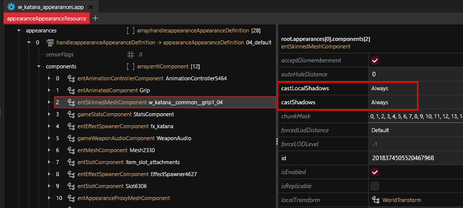
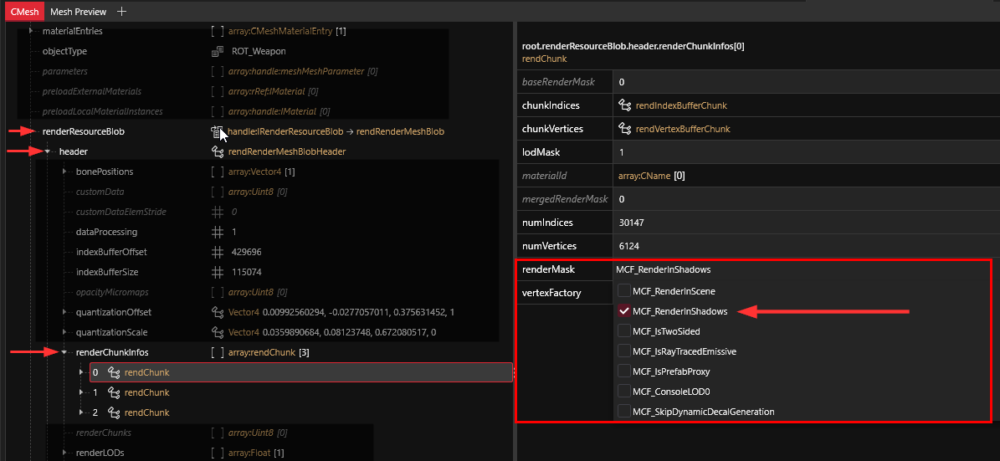

# Meshes, Shadows, and Shadow Meshes

## Summary

**Published**: Mar 02 2024 by [manavortex](https://app.gitbook.com/u/NfZBoxGegfUqB33J9HXuCs6PVaC3 "mention")\
**Last documented update**: Mar 02 2024 by [manavortex](https://app.gitbook.com/u/NfZBoxGegfUqB33J9HXuCs6PVaC3 "mention")

This page explains how meshes are casting shadows.&#x20;

### Wait, this is not what I want!

* Find information about shadows in the environment under [environment-shadows.md](../the-whole-world-.streamingsector/environment-shadows.md "mention")
* To learn more about [level-of-detail-lod.md](../level-of-detail-lod.md "mention"), check the corresponding wiki page.

## How to cast shadows

There are two different ways to cast shadows: **real-time** (generated) shadows, and **proxy** shadows.&#x20;


Most in-game items use both.


### Generated shadows: Component properties

Your mesh casts an actual shadow.&#x20;


The real-time shadow will be extremely detailed, but it can impact **performance**, and it can glitch out or cause spectacular raytracing bugs. [#proxy-shadows-shadow-mesh](meshes-shadows-and-shadow-meshes.md#proxy-shadows-shadow-mesh "mention")es avoid these issues.


You activate real-time shadows by checking the following properties in your [mesh component](../components/documented-components/#equipment-hair) (which you can find in your [.app](../appearance-.app-files/#components) or [.ent](../entity-.ent-files/#mesh-component-entity-simple-entity) file):

<figure><figcaption></figcaption></figure>

### Proxy shadows: Shadow mesh

The proxy shadow, by contrast, will use an **invisible mesh** to cast a shadow (the `shadow mesh`). It has a lower [Level of Detail](../level-of-detail-lod.md) than the original and often features a simplified geometry or even a [proxy mesh](../level-of-detail-lod.md#proxy-meshes).

Due to the less complex geometry, a shadow mesh is much less prone to raytracing glitches, and it will be much eaiser on performance.

Shadow meshes are usually added as `entMeshComponents`.

#### Configuring a shadow mesh

Your average shadow mesh has only one default material with a blank local instance of `engine\materials\metal_base.remt`.  If the shadow mesh is loaded in a scene, it will lead to white, marshmallow-y overlays.

To make sure that it's only used for shadow generation, check the `renderMask`:

<figure><figcaption></figcaption></figure>

## Creating shadow meshes

To create a low-poly mesh, you can build a cage, subdivide it a few times and use a **Shrinkwrap** **modifier** to shape it like your mesh. Then, you can reduce the poly count by **decimating**.



## Troubleshooting

### My shadow mesh is always visible!

Check [#configuring-a-shadow-mesh](meshes-shadows-and-shadow-meshes.md#configuring-a-shadow-mesh "mention") and make sure that `RenderInScene` is unchecked.

<figure><figcaption>
The shadow is a marshmallow
</figcaption></figure>
