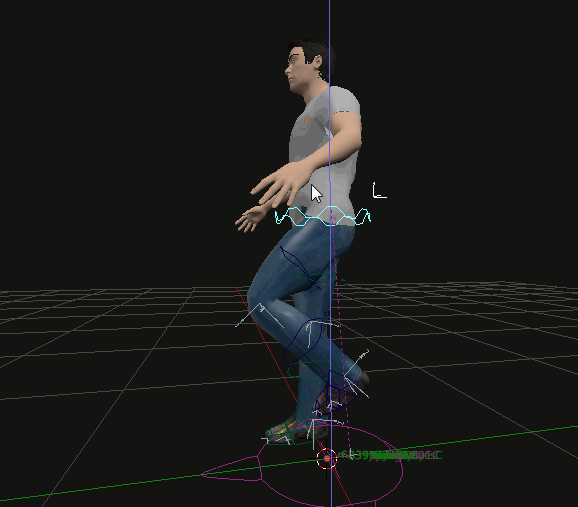

# Animations: IK and FK

## Forward Kinematics

Armatures are rigged from the top down: moving a bigger bone (e.g. a hip joint) makes all smaller bones follow:

<figure><figcaption></figcaption></figure>

## Inverse Kinematics

Armatures are rigged from the bottom up. Moving a small bone (e.g. the collarbone) makes all bigger bones follow:

<figure><figcaption></figcaption></figure>
