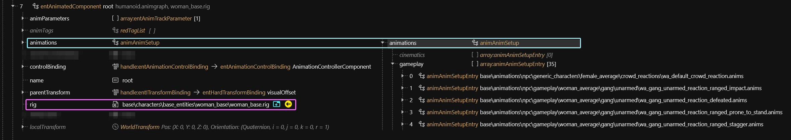
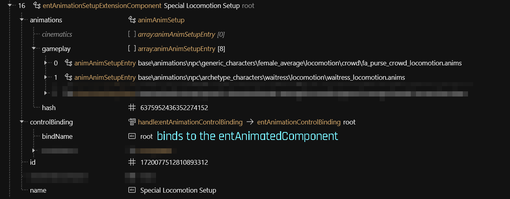

# NPC animations

## Summary

Created: Jan 02 2025 by [nutboy](https://app.gitbook.com/u/y772Qw4Ul9cmqXiuTKkTpLxDVzQ2 "mention")\
Last documented update: Jan 02 2025 by [nutboy](https://app.gitbook.com/u/y772Qw4Ul9cmqXiuTKkTpLxDVzQ2 "mention")

This page will explain how NPC animations are selected and connected within the files.

### Wait, this is not what I want!

* For a guide on creating a custom NPC, check [amm-custom-npcs](../../../modding-guides/npcs/amm-custom-npcs/ "mention")
* For a guide on creating an even more custom NPC, check [npv-v-as-custom-npc](../../../modding-guides/npcs/npv-v-as-custom-npc/ "mention")

## entAnimatedComponent

The very base for any animations is the entAnimatedComponent with the name of `root`. \
You can usually find it insde the [root entity's](../entity-.ent-files/#root-entity) `components` array:

<figure><figcaption></figcaption></figure>

`animations.gameplay` animations does...&#x20;

(we needed to put those, or no photo mode animations. Where are they read? Why aren't they overwritten by SetupExtensionComponents?)

### entAnimatedSetupExtensionComponent

One or more extensions to the [#entanimatedcomponent](npc-animations.md#entanimatedcomponent "mention") for different contexts. \
You can usually find them insde the [root entity's](../entity-.ent-files/#root-entity) `components` array:

<figure><figcaption></figcaption></figure>

As of January 2025, we don't exactly know what they do and where they are read. Maybe ask psi at some point.

