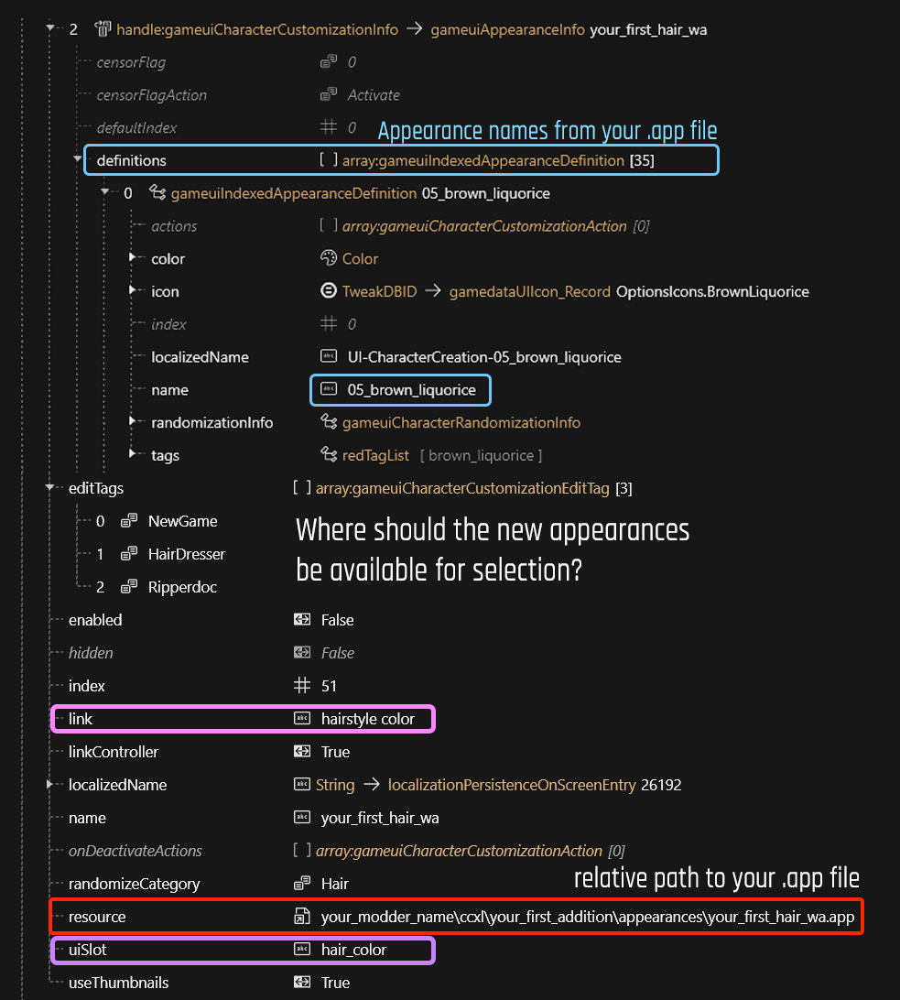

# .inkcharactercustomization: CC options

## Summary

Published: Jan 22 2025 by [manavortex](https://app.gitbook.com/u/NfZBoxGegfUqB33J9HXuCs6PVaC3 "mention") and [IslandDancer](https://app.gitbook.com/u/s8gktWvqEZWGRxQIsePwOnEI2Mo2 "mention")\
Last documented edit: Jan 22 2025 by [manavortex](https://app.gitbook.com/u/NfZBoxGegfUqB33J9HXuCs6PVaC3 "mention")

This page will tell you how `.inkcharactercustomization` files are used to populate the character creator.

### Wait, this is not what I want!

* If you want to add things to the character creator instead, check [archivexl-character-creator-additions](../../core-mods-explained/archivexl/archivexl-character-creator-additions/ "mention")



## gameuiAppearanceInfo

<figure><figcaption></figcaption></figure>

### Attributes

#### definitions

Adds the appearance definitions from the [#resource](.inkcharactercustomization-cc-options.md#resource "mention")&#x20;

#### link

`link` is used to sync currently selected value across multiple options (e.g. hair colour also influences the beard). It can be used at the same time as `uislot`.

#### resource

The relative path to your `.app` file

#### uislot

`uiSlot` is used to show/hide options. It can be used at the same time as `link`.

### gameuiAppearanceInfo: Merging with ArchiveXL

If your option has a name:

* If another option with the same `name` already exists, your option is merged with existing one
* If no option with the same name `name` exists, your option is added to the the final `.inkcc` as a new one

If your option doesn't have a name:

* if your option has `uiSlot`, it will be merged with all existing options with the same `uiSlot`
* if your option has `link`, it will be merged with all existing options with the same link
