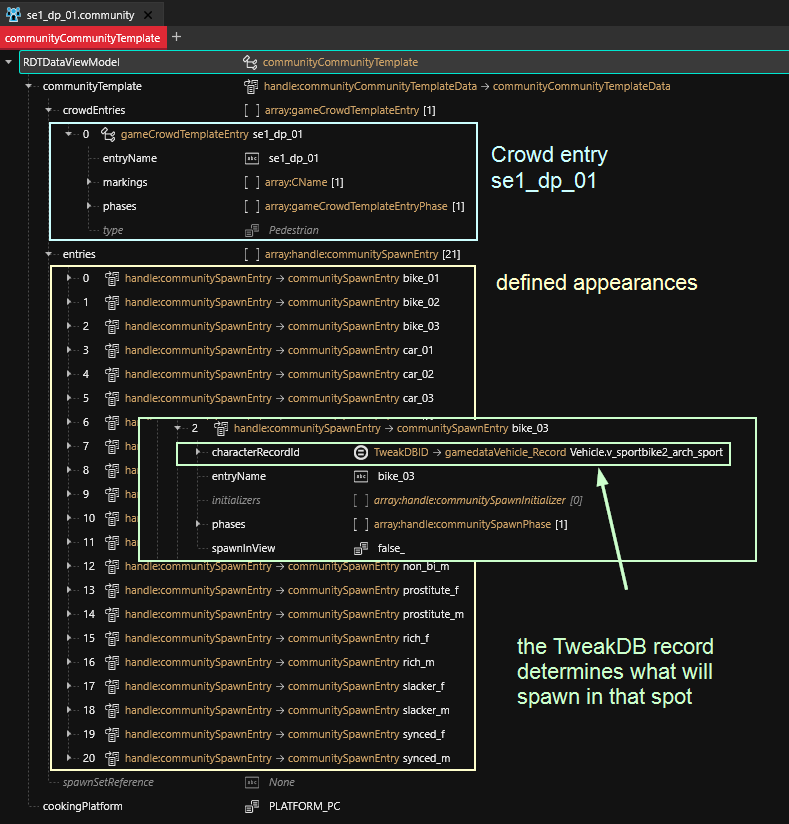

# Crowds: random NPCs

Inside the communityTemplate, this file defines appearances for **crowd pools:**

<figure><figcaption></figcaption></figure>

## How can I find a specific file?

You can use `Find Files Using This` from the context menu of the corresponding .app or .ent file and follow the daisy chain until you find the .community file.

&#x20;(as of October 02 2032, this is still broken)

#### Is there another way?

As of 8., Wolvenkit only lets you search **for** files, not **in** them. For that reason, we'll have to use a workaround.&#x20;


I have completed step 1 -3  for you and put the results on my [Mega](https://mega.nz/file/2QNmkIba#xAKtk0uM1ya0dJpY85wPRvNpb5k1anLBeRaYw6o7QDM).


1. add [all `.community` files](https://app.gitbook.com/s/-MP\_ozZVx2gRZUPXkd4r/wolvenkit-app/usage/wolvenkit-search-finding-files) to your project
2. [export them to json](https://app.gitbook.com/s/-MP\_ozZVx2gRZUPXkd4r/wolvenkit-app/usage/import-export/import-export-as-json#export-as-json)
3. Delete the original .community files (you'll re-add them later)
4. Use Notepad++ to search inside the directory for your appearance name
   * If nothing shows up, try partial matches
5. Note the names of the files under `.raw`
6. search for the file name in Wolvenkit, then add it back and make your edits

## How can I change a spawn?

