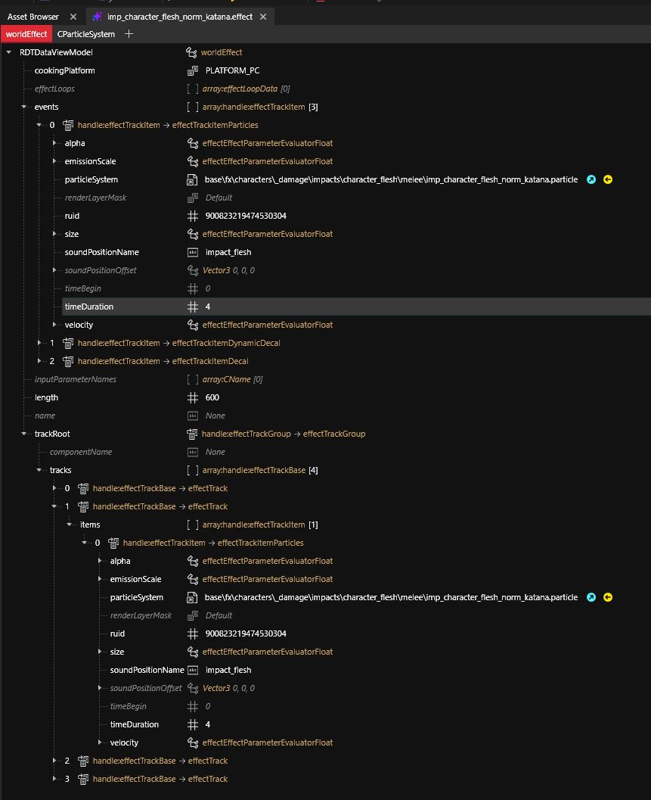
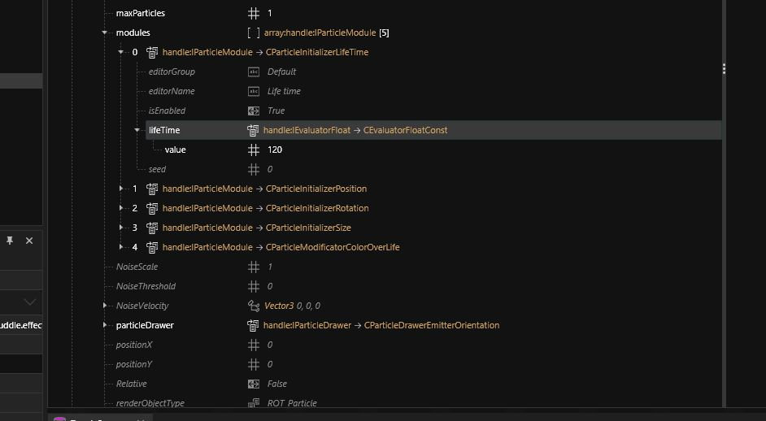

# Effects and particles

## Summary

**Published**: Feb 11 2024 by [manavortex](https://app.gitbook.com/u/NfZBoxGegfUqB33J9HXuCs6PVaC3 "mention")\
**Last documented edit**: Feb 11 2024 by [manavortex](https://app.gitbook.com/u/NfZBoxGegfUqB33J9HXuCs6PVaC3 "mention")

### Wait, this is not what I want!

* See [effects-modding.md](../../modding-guides/everything-else/effects-modding.md "mention") for a hands-on list of changing effects in Cyberpunk
* See [effect-components.md](components/documented-components/effect-components.md "mention") for effect explanations by component
* See [fx-material-properties.md](../materials/configuring-materials/fx-material-properties.md "mention") for animated _materials_
* While explosions are definitely effects, lights are something else => [lights-explained.md](lights-explained.md "mention")
* To **position** effects, see [amm-light-components.md](../core-mods-explained/amm/custom-props/amm-light-components.md "mention") -> [#placing-your-light-components](../core-mods-explained/amm/custom-props/amm-light-components.md#placing-your-light-components "mention")


This page is a stub, but this wiki is a community project! Please [sign up](https://app.gitbook.com/invite/-MP5ijqI11FeeX7c8-N8/H70HZBOeUulIpkQnBLK7) and [start editing](#user-content-fn-1)[^1], we'd love to have you!


## Effect registry

All effect files are registered in `static_effects.csv`.  Since that file can only be edited once, you have to merge your own .es files by script.

For instructions on how to do that, check [Scripting Cyberpunk](https://app.gitbook.com/o/-MP5ijqI11FeeX7c8-N8/s/fwsaoju1TBAUvMpI6NIw/ "mention") -> [Effects](https://app.gitbook.com/s/fwsaoju1TBAUvMpI6NIw/how-do-i/effects "mention")

## Effect duration

An effect's **duration** is defined in the .effects file:

<figure><figcaption></figcaption></figure>

## Particle lifetime

You can find a particle's lifetime for the individual entries in the `modules` array:

These are probably (?) overwritten by effect durations?

<figure><figcaption></figcaption></figure>

[^1]: Don't worry, you can't break anything. Each change has to be reviewed by an admin before it is merged back.

