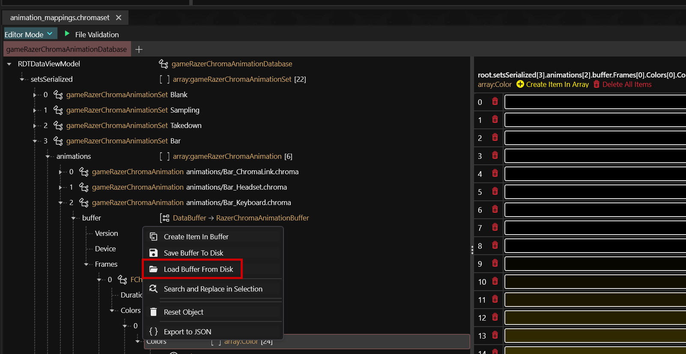

# Razer Chroma integration: .chromaset

## Summary

Published: Nov 20 2024 by Seberoth\
Last documented edit: Nov 20 2024 by [manavortex](https://app.gitbook.com/u/NfZBoxGegfUqB33J9HXuCs6PVaC3 "mention")

This page contains ínformation about `base\razer_chroma\animation_mappings.chromaset`&#x20;


Please note that as of now, this supported on the technical side, but has not yet been tested.


## Importing buffers

In theory, it should be possible to import regular `.chroma` files into a buffer:&#x20;

<figure><figcaption></figcaption></figure>

## Editing buffers

When changing the Device type of an entry, these frames need to be adjusted:

<table><thead><tr><th width="230">Type of device</th><th>Value that needs to be used</th></tr></thead><tbody><tr><td>1D devices (1 Row)</td><td> <code>FChromaSDKColorFrame1D</code> </td></tr><tr><td>2D devices (> 1 Row)</td><td><code>FChromaSDKColorFrame2D</code></td></tr></tbody></table>

### Buffer values

| Device               | Rows | Colors |
| -------------------- | ---- | ------ |
| DE\_ChromaLink       | 1    | 5      |
| DE\_Headset          | 1    | 5      |
| DE\_Keyboard         | 6    | 22     |
| DE\_Keypad           | 4    | 5      |
| DE\_Mouse            | 9    | 7      |
| DE\_Mousepad         | 1    | 15     |
| DE\_KeyboardExtended | 8    | 24     |
