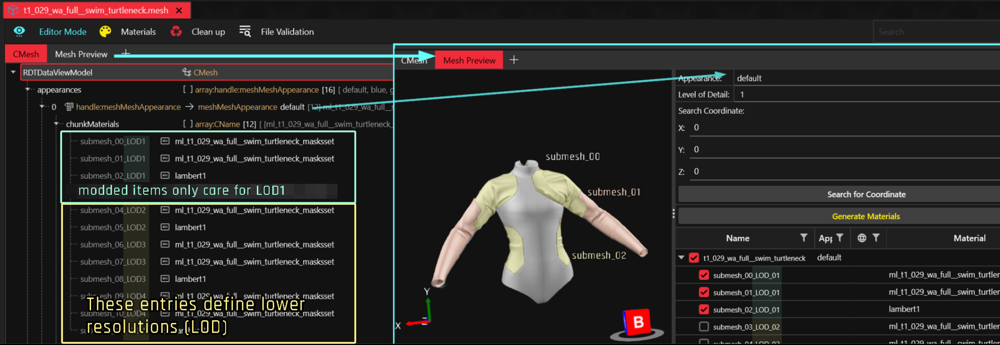
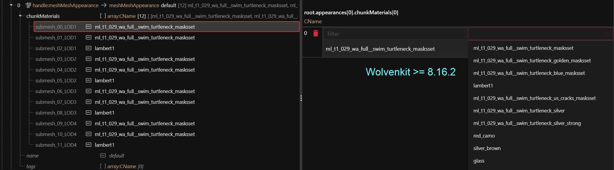
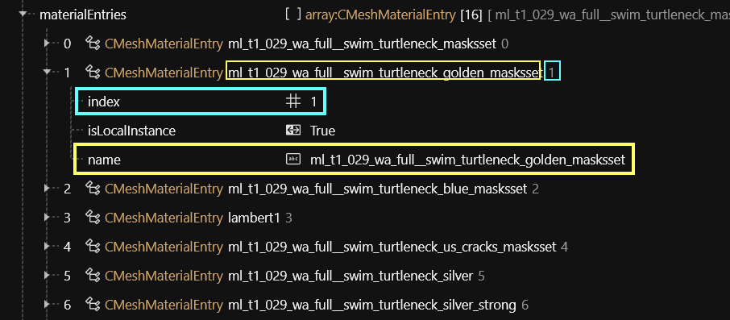
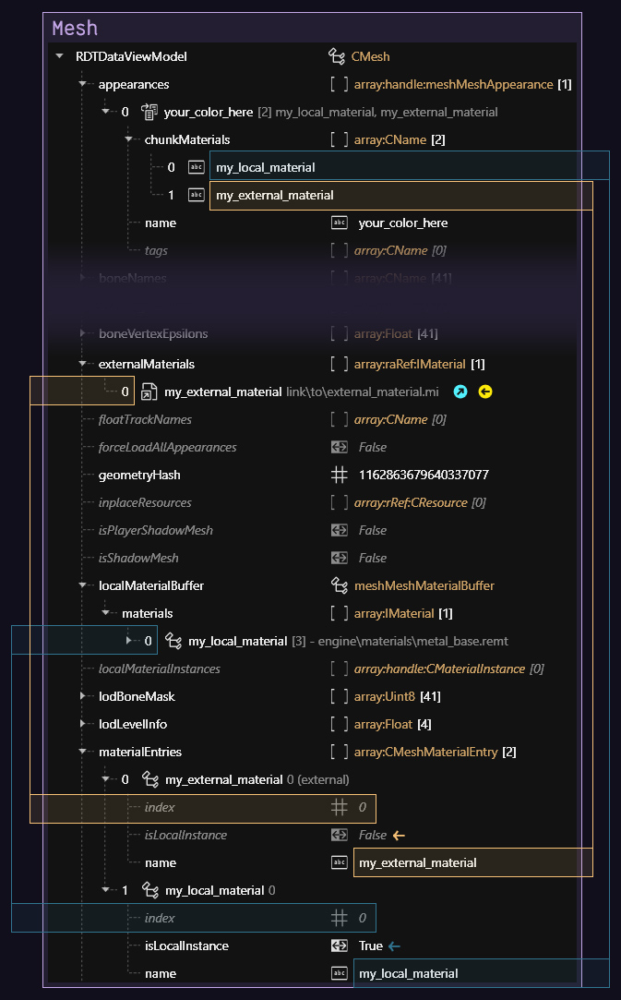

# 3d objects: .mesh files

## Summary

**Published:** ??? by [mana vortex](https://app.gitbook.com/u/NfZBoxGegfUqB33J9HXuCs6PVaC3 "mention")\
**Last documented edit:** Sep 19 2024 by [mana vortex](https://app.gitbook.com/u/NfZBoxGegfUqB33J9HXuCs6PVaC3 "mention")

This page contains information on .mesh files, such as what they are, how the game loads them, and how their appearances are defined and selected.

### Wait, that's not what I want!

* To export/import meshes, see [wkit-blender-plugin-import-export.md](../../../modding-tools/wolvenkit-blender-io-suite/wkit-blender-plugin-import-export.md "mention") -> [#meshes](../../../modding-tools/wolvenkit-blender-io-suite/wkit-blender-plugin-import-export.md#meshes "mention")&#x20;
* To stop copy-pasting so much, check [archivexl-dynamic-materials.md](../../../../modding-guides/textures-and-luts/archivexl-dynamic-materials.md "mention") or [re-using-materials-.mi.md](../materials/re-using-materials-.mi.md "mention")
* To edit a mesh's appearance, check [changing-materials-colors-and-textures](../../../../modding-guides/items-equipment/editing-existing-items/changing-materials-colors-and-textures/ "mention")
  * If you just want to use a textured material, check [using-a-textured-material.md](../../../../modding-guides/items-equipment/editing-existing-items/changing-materials-colors-and-textures/using-a-textured-material.md "mention")
  * For a guided exercise, see [textured-items-and-cyberpunk-materials.md](../../../../modding-guides/textures-and-luts/textured-items-and-cyberpunk-materials.md "mention")
* To hide parts of a mesh under different circumstances, check [submeshes-materials-and-chunks.md](submeshes-materials-and-chunks.md "mention") or [first-person-perspective-fixes.md](../../../../modding-guides/items-equipment/first-person-perspective-fixes.md "mention")

Let's get started.

## What's a mesh?

In the context of Cyberpunk, a mesh is the file that defines the topology[^1] and the materials[^2] of an object in the game world.

A mesh can have several **submeshes**, each of which has own material assignments. You can learn more about this on the sub-page for [submeshes-materials-and-chunks.md](submeshes-materials-and-chunks.md "mention").

Mesh files for inanimate objects also tend to contain extensive physics parameters governing their physical weight and general behavior.

## How the mesh is loaded

Meshes are loaded via [components](../../components/ "mention") (e.g. [#entgarmentskinnedmeshcomponent](../../components/documented-components/#entgarmentskinnedmeshcomponent "mention")). Components are defined either in [mesh entity](../../../../for-mod-creators/files-and-what-they-do/entity-.ent-files#mesh-component-entity-simple-entity) files or in an [.app file](../../../../for-mod-creators/files-and-what-they-do/appearance-.app-files), where each [appearance](../../../../for-mod-creators/files-and-what-they-do/appearance-.app-files#appearances) has its own [components](../../../../for-mod-creators/files-and-what-they-do/appearance-.app-files#components) array.

For more information on this, please check [submeshes-materials-and-chunks.md](submeshes-materials-and-chunks.md "mention") -> [#chunkmasks-partially-hiding-meshes](submeshes-materials-and-chunks.md#chunkmasks-partially-hiding-meshes "mention")

## Shadows

There are two ways of adding shadows to meshes:

### Component property

To make a mesh cast a real-time shadow, set the component's property `castShadows` to `Always`.


Depending on your geometry, this can impact performance.


### Shadow mesh

Many meshes have dedicated shadow meshes, which have a much lower level of detail and will be hidden by default. You can open any clothing item's mesh entity to see this in action.

## Mesh Preview

You can see which submesh is which in the `Mesh Preview` tab after opening the mesh file:

<figure><figcaption>
Materials must be defined for each LOD (<a href="../../level-of-detail-lod.md">level of detail</a> — most modded items only have one)
</figcaption></figure>

With the boxes in the right panel, you can toggle submeshes on and off.


Submesh numbers correspond directly to a component's [#chunkmask](../../components/#chunkmask "mention") property. Changes you make here are **not persistent** — to hide parts of an item, see [#chunkmasks-partially-hiding-meshes](submeshes-materials-and-chunks.md#chunkmasks-partially-hiding-meshes "mention").


## Material assignment

This section describes how you tell the game exactly how your mesh should look — the technical term for this is "material assignment". This section will hopefully remove all confusion about where those textures go, and how those pesky t-shirt appearances work.


Understanding this will save you a lot of trouble in the long term, so grab a coffee or tea and understand the theory section. If you have questions, feel free to hit us up on [Discord](https://discord.com/invite/redmodding) in `#mod-development` or `#textures-and-models`.


* If you just want to know how to assign or add a new material, skip ahead to [#practice](./#practice "mention")
* This page only contains mesh-specific information. Find more details on materials under [materials](../../../materials/ "mention")
* To learn more about submeshes and chunkmasks, check [submeshes-materials-and-chunks.md](submeshes-materials-and-chunks.md "mention")

### Theory

#### Appearances

A mesh file has one or more **appearances**, which are used by [components](../../components/) to define how a thing looks. Think of an appearance as a skin for any given object: this shirt is black, it has red stitches, and there's an Arasaka logo on it.&#x20;


If a Netrunner sits next to an explosion, we simply change their suit's appearance from `netrunner_suit_clean` to `netrunner_suit_dirty` and call it a day.


The base game does **not** change these appearances after they have been set up.&#x20;

#### Appearance definitions

Each appearance is defined by an entry in the `appearances` array at the top of the file.&#x20;

A meshMeshAppearance has one or more `chunkMaterials,` which correspond to the item's individual `submeshes` (the different parts it has in Blender).  These entries are selected by **name**.

<figure><figcaption>
The dropdown menu was added in Wolvenkit 8.16.2. If that hasn't released yet, you can install a <a href="https://app.gitbook.com/s/-MP_ozZVx2gRZUPXkd4r/getting-started/download/the-wolvenkit-nightly">Nightly</a>.
</figcaption></figure>

To see your chunks and their materials, you can switch to the **Mesh Preview** tab. Here is how it looks:

<figure><figcaption>
You have seen this picture before ( <a data-mention href="./#mesh-preview">#mesh-preview</a>)
</figcaption></figure>

More examples

Our random example file `t1_029_wa_full__swim_turtleneck.mesh` has 16 appearances: `default`, `blue`, `golden`...

Each of these appearances has three chunks per LOD. We'll look at the first three:

**Blue**

submesh\_00: ml\_t1\_029\_wa\_full\_\_swim\_turtleneck\_blue\_masksset\
submesh\_01: ml\_t1\_029\_wa\_full\_\_swim\_turtleneck\_blue\_masksset\
submesh\_02: lambert1

**Golden**

submesh\_00: ml\_t1\_029\_wa\_full\_\_swim\_turtleneck\_golden\_masksset\
submesh\_01: ml\_t1\_029\_wa\_full\_\_swim\_turtleneck\_golden\_masksset\
submesh\_02: lambert1

The first two layers are different, the third one has&#x20;

Now, how are the materials getting into the dropdown menu?

#### Definitions

These materials are **defined** in the `materialEntries` list:

<figure><figcaption></figcaption></figure>

Each `materialEntry` holds the following properties:

* the material's name (which you can use to assign **chunkMaterials**),
* whether this is a **local** or an **external** material (more about this in [#material-instances](./#material-instances "mention") below!),
* the index of the material instance in the corresponding list

You will have noticed by now that these entries **do not hold materials**. They are only **definitions** — the actual information is somewhere else.

#### Material instances

A **material instance** holds the things you are actually interested in: how the mesh should look. They define the following properties:

* `baseMaterial`:  which [shader template](../../../materials/shaders/) (`.mt`/`.remt`) will be used. Sometimes, this happens through a `.mi` file — this is an **external material** (more about this below)
* `values`: a list of properties which pass information to the shader, for example which **diffuse texture** to use, or that the entire t-shirt should be [tinted red](../../../materials/configuring-materials/tinting-textures-in-wolvenkit.md).&#x20;


Properties you define in the `values` array will always overwrite properties from the baseMaterial - if your base material is blue and the mesh says that it should be red, then the item will be red.


Material instances come in two flavours (that's what the `isLocalInstance` checkbox in the material definition is for):

#### Local materials

These are right there in your .mesh file, and you can edit them directly. You'll find them either in `localMaterialBuffer.materials`, or in `preloadMaterialInstances`.


If `preloadMaterialInstances` is empty, the list will be hidden in the easy [editor mode](https://app.gitbook.com/s/-MP_ozZVx2gRZUPXkd4r/wolvenkit-app/editor/file-editor/editor-difficulty-mode).


#### External materials

This is the same as a local material **inside an external file** so they can be used in multiple places.

If a material is defined as external, it will be pulled in via **file path** through either `externalMaterials` or `preloadExternalMaterials`. For an example of this, take a look at hairs (e.g. `ep1\characters\common\hair\hh_201_wa__dawn\hh_121_wa__dawn.mesh`) — they do not use local materials at all. &#x20;

You can also use these [`.mi` files](../materials/re-using-materials-.mi.md) as a base material and overwrite their properties in the **values** array. This process is called **daisy chaining** and can save you a lot of work.

#### Mesh file: diagram

Here's an overview:

<figure><figcaption>
Example: A mesh with two materials, one of them a local instance, one of them an external .mi file
</figcaption></figure>

### Practice

Now that you've learned how everything hangs together, let's take an actual look at this.

#### TL;DR: I just want to add a new material!


Summary:&#x20;

1. **Register** a material in `materialEntries`. Here's where you give it a name.
2. **Define** the material in either `localMaterialInstances.materials` or `externalMaterials`
3. **Assign** material for submesh in appearance -> chunkMaterials


#### Step 1: Appearances

An `appearance` is the entry point into a mesh.

One `appearance` has a number of `chunkMaterials`, which tell Cyberpunk how they are supposed to look:

<figure><figcaption></figcaption></figure>

Wolvenkit will follow these entries to materialEntries, where they are **defined**:

<figure><figcaption></figcaption></figure>

The **`index`** property in materialEntries will finally point at the material's instance, where you can find its properties. Depending on `isLocalInstance`, that can be one of several places — find a list in [#step-3-material-definition](./#step-3-material-definition "mention").

#### ChunkMaterials


You can find more information on this under [submeshes-materials-and-chunks.md](submeshes-materials-and-chunks.md "mention").


You assign materials based on the "chunks" (the individual submeshes) inside a mesh. Open the mesh file in Wolvenkit and open the "appearances" array, then make sure that each of your submeshes has an entry inside the array.

<figure><figcaption>
You may have to create additional entries in "chunkMaterials": Either duplicate an existing entry from the right-click menu, or select the array and use the yellow (+) in the side panel.
</figcaption></figure>

#### Step 2: Material registry

Materials are **registered** in the array **`materialEntries`** inside your mesh:

<figure><figcaption>
For a detailed example, see <a href="../materials/re-using-materials-.mi.md#maximally-lazy-external-materials">re-using materials</a>
</figcaption></figure>


While you can mix external and local materials, you can not mix preloaded and non-preloaded ones. For details, see [below](./#preload...-what).


<table><thead><tr><th width="202">Property</th><th>Description</th></tr></thead><tbody><tr><td>index</td><td><strong>numerical index</strong> of corresponding material in target list (as defined by <code>isLocalInstance</code>)</td></tr><tr><td>isLocalInstance</td><td>Selects the material target list. <strong>True:</strong> <a href="./#materialinstance-the-local-material">local material</a> in <code>localMaterialBuffer.materials</code> or <code>preloadLocalMaterialInstances</code> <strong>False:</strong> <a href="./#material-reference-a-material-somewhere-else">material reference</a> in<code>externalMaterials</code> or <code>preloadExternalMaterials</code>  For more information on this, see the page for <a href="../materials/re-using-materials-.mi.md#maximally-lazy-external-materials">local/external materials</a>.</td></tr><tr><td>name</td><td><strong>unique</strong> name of material, used to select the material via <code>chunkMaterial</code></td></tr></tbody></table>

#### Preload… what?

Many of CDPR's early meshes use `preloadLocalMaterialInstances` instead of `localMaterialBuffer.materials`. As far as we are concerned, you can use the two interchangeably, **but**:

If you are using **a mix of local and external materials**, you **must** use the corresponding lists:

| local                           | external                   |
| ------------------------------- | -------------------------- |
| `localMaterialBuffer.materials` | `externalMaterials`        |
| `preloadLocalMaterialInstances` | `preloadExternalMaterials` |

If you mix the two, the materials outside of `preload`… will appear as transparent the first 1-2 times you trigger your item's appearance.

#### Step 3: Material definition

A material's actual definition (instance) can be in a `CMaterialInstance` inside the mesh or in a [`.mi` file](../materials/re-using-materials-.mi.md) in the project. Wolvenkit will display material names as defined in the `materialEntries`, making it easier for you to see what's what.

For more details on material instances, check [materials](../../../materials/ "mention") -> [#definition-material](../../../materials/#definition-material "mention")

#### MaterialInstance: The local material

The materials themselves are inside the array `localMaterialBuffer.materials` (or `preloadLocalMaterials` in case of older meshes).


You can't go wrong by using those. However, if you don't have any properties that are unique to your mesh or appearance (for example a custom normal map), you might consider [creating and using an external material instead](../materials/re-using-materials-.mi.md).


A material instance looks like this:

<figure><figcaption>
baseMaterial picks the material (shader), while "values" contains <a href="./#checking-material-properties">properties</a> to adjust it.
</figcaption></figure>


You can find a guide about [texture editing](../../../../modding-guides/items-equipment/editing-existing-items/changing-materials-colors-and-textures/) and [adding custom textures](../../../../modding-guides/items-equipment/editing-existing-items/changing-materials-colors-and-textures/#step-4-optional-custompathing) in the **Modding Guides** section.

For an overview of existing materials, check [here](../../../references-lists-and-overviews/cheat-sheet-materials.md).

For how to find out which properties a material has, check [here](../../../materials/#checking-material-properties).


#### Material reference: [reusing materials](../materials/re-using-materials-.mi.md#maximally-lazy-external-materials)

A relative path to an external material, usually encapsulated in a [.mi file](../materials/re-using-materials-.mi.md#.mi-files-to-the-rescue). Use this if you don't need to add extra properties.

[^1]: vertices, edges – everything that makes up the 3d object's surface information

[^2]: the surface shader and its properties
