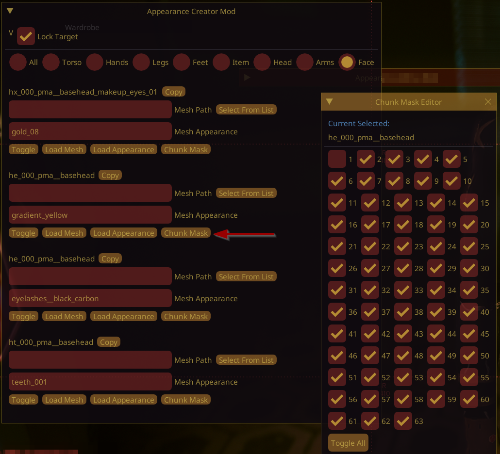

# Submeshes, Materials and Chunks

## Summary

Published: January 06 2024 by [mana vortex](https://app.gitbook.com/u/NfZBoxGegfUqB33J9HXuCs6PVaC3 "mention")\
Last documented update: Aug 08 2025 by [mana vortex](https://app.gitbook.com/u/NfZBoxGegfUqB33J9HXuCs6PVaC3 "mention")

This page explains the relationship between submeshes (parts of a mesh), materials ("skins" for any given part of a mesh) and chunks (submeshes as seen from the outside).

### Wait, this is not what I want!

* Check the parent page [.](./ "mention") for more general informatiton
  * In [#material-assignment](./#material-assignment "mention")you will get a general introduction and practical instructions
  * Check the [#mesh-preview](./#mesh-preview "mention") tab to see a preview of the mesh

## Why are submeshes?

A mesh consists out of multiple **parts** — you might have noticed this in Blender and wondered why CDPR split up their items like this. The reason is that each **submesh** can have a different **material** assigned, and that it is possible to hide and show them under different circumstances.

At first, this seems a bit counter-intuitive, but keep in mind that Cyberpunk's entire material system is geared for **flexibility**. By altering **a single submesh material**, a black Arasaka helmet with red lights and a Hello Kitty hologram can become a black Militech helmet with red lights and a Hello Kitty hologram!

<figure><figcaption></figcaption></figure>

To learn how materials work, check the parent page: [.](./ "mention") -> [#material-assignment](./#material-assignment "mention")

Example: the more detailed explanation

Our fictional helmet appearance uses the materials `helmet_mlsetup_black`, `visor_dark`, `hologram_hellokitty`, `decals_arasaka` and `emissive_tubes_red`. There are at least three more materials / variants defined for every possible slot, but the default appearance is a black helmet with red lights, Arasaka decals, and a Hello Kitty face projected on its black visor. Or in short: major-league professional tactical gear.

**Submesh 0** is the main body of the helmet. It uses a multilayered material (something incredibly cool and tech-y, no doubt). The default helmet is black, but by re-using the same [.mlmask](../../../materials/multilayered/#what-is-the-mlmask), different colour schemes can easily be created with different [.mlsetup](../../../materials/multilayered/#what-is-the-mlsetup)s.

**Submesh 1** is the visor. It uses a glass shader. There's also a transparent version, but this appearance isn't using it.

**Submesh 2** is a decal — a hologram projected on the visor. This one uses hello\_kitty. Alternative appearances use Venom and Pacman. (Or whatever else you can dream of)

**Submesh 3** are the regular decals - for this appearance, Arasaka style.&#x20;

**Submesh 4** are emissive tubes — they come in red, white, and blue.

## Submeshes in Blender

In Blender, our helmet would look like this:

<figure><figcaption></figcaption></figure>

You can create more submeshes by splitting off parts of a mesh, and incrementing the submesh index.&#x20;

#### Example:

You want red and blue glowing tubes on the example helmet.

1. [Split](../../../../modding-guides/textures-and-luts/textured-items-and-cyberpunk-materials.md#splitting-off-submeshes-mildly-advanced) parts of `submesh_04_LOD_1` into `submesh_04_LOD_1.001`
2. Re-name `submesh_04_LOD_1.001` to `submesh_05_LOD_1`
3. [Export](../../../modding-tools/wolvenkit-blender-io-suite/wkit-blender-plugin-import-export.md#exporting-from-blender) the new geometry and import it into Wolvenkit
4. Your mesh will now have **six** submeshes instead of its previous **five**
5. For each **appearance** that you have defined, add a chunkMaterial entry. \
   &#xNAN;_&#x49;f you skip this step, the new submesh will have no material assigned, and be invisible._ [_File Validation_](https://app.gitbook.com/s/-MP_ozZVx2gRZUPXkd4r/wolvenkit-app/file-validation) _will warn you about this._

## Chunkmasks: partially hiding meshes


To hide parts of the body, you can also use ArchiveXL tags. See [#base-game-tags-and-archivexl-tags-visual-guides](../../../../for-mod-creators/core-mods-explained/archivexl/archivexl-tags.md#base-game-tags-and-archivexl-tags-visual-guides "mention") and the corresponding wiki page for more information.


Imagine you want to hide the helmet's glowing parts (because you are being stealthy). You could just define another appearance where the glowing tubes are turned off — but you would have to add one for every variant you make. `arasaka_hellokitty_glow` and `arasaka_hellokitty_noglow`, the same for Militech, NightCorps and NCPD… ain't nobody got time for this.

That's why CDPR came up with **chunkmasks**.

The mesh is loaded via [**component**](../../components/) in an [.ent](../entity-.ent-files/#mesh-component-entity-simple-entity) or [.app](../appearance-.app-files/#components) file. Here, you will find the `chunkMask` attribute, which looks like this:

<figure><figcaption>
Set this to 0 to completely hide all parts of a mesh.
</figcaption></figure>

The numbers in the dropdown correspond to the submeshes: unchecking an entry will **hide** it, **regardless of the assigned materials**.


You can only use chunkMasks to **hide** submeshes. If you want to conditionally **show** them, you have to use custom ArchiveXL tags (see [archivexl-tags.md](../../../../for-mod-creators/core-mods-explained/archivexl/archivexl-tags.md "mention") -> [#adding-custom-tags](../../../../for-mod-creators/core-mods-explained/archivexl/archivexl-tags.md#adding-custom-tags "mention"))


To use this on **other items**, check out [#partsoverrides-changing-other-meshes](../../../../modding-guides/items-equipment/influencing-other-items.md#partsoverrides-changing-other-meshes "mention").

## How to see chunkmasks in-game?

You have two options, [ACM ](#user-content-fn-1)[^1]\(for NPCs, including V) and RedHotTools.

### ACM


You can download [Appearance Creator Mod](https://www.nexusmods.com/cyberpunk2077/mods/10795) on Nexus. It requires [Cyber Engine Tweaks](https://www.nexusmods.com/cyberpunk2077/mods/107), [Codeware](https://www.nexusmods.com/cyberpunk2077/mods/7780), and all of its requirements.


With ACM installed, make sure that the target is under the cursor in the middle of the screen (you can use photo mode to look at V). Then, find the correct mesh/component in the UI and click on the correct button:

<figure><figcaption>
Finding a component's chunkmask with Appearance Creator Mod
</figcaption></figure>

### RedHotTools

Find [redhottools](../../../modding-tools/redhottools/ "mention") -> [#installation-guide](../../../modding-tools/redhottools/#installation-guide "mention") for instructions on how to install this.&#x20;

See [#world-inspector-watch-the-player](../../../modding-tools/redhottools/rht-the-world-inspector.md#world-inspector-watch-the-player "mention") for a guide.

## Level Of Detail (LOD)

If a submesh name does not end in LOD1, that means it's intended for **lower resolutions** (for example, if an object is far away).&#x20;

By default, Wolvenkit [removes](https://app.gitbook.com/s/-MP_ozZVx2gRZUPXkd4r/wolvenkit-app/usage/import-export/models#lod-filter-default) these low-resolution meshes on export, since you don't normally want them for modded characters or items.


Under [the-whole-world-.streamingsector](../the-whole-world-.streamingsector/ "mention"), you can find an explanation of how cyberpunk handles world sector Level of Detail (LOD).


[^1]: AppearanceCreatorMod, an AMM addon
