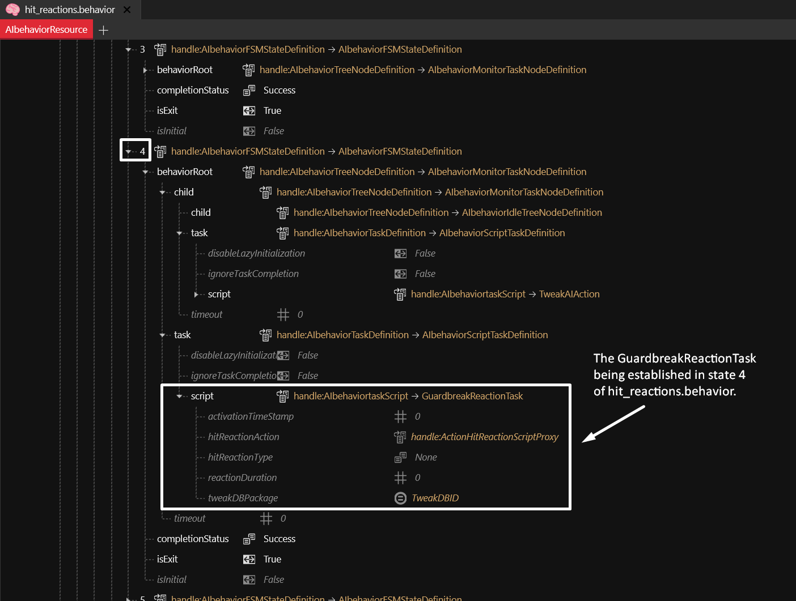
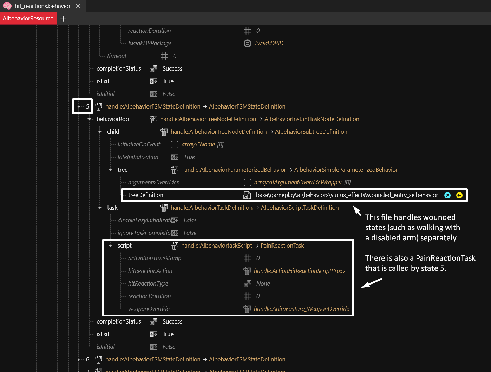
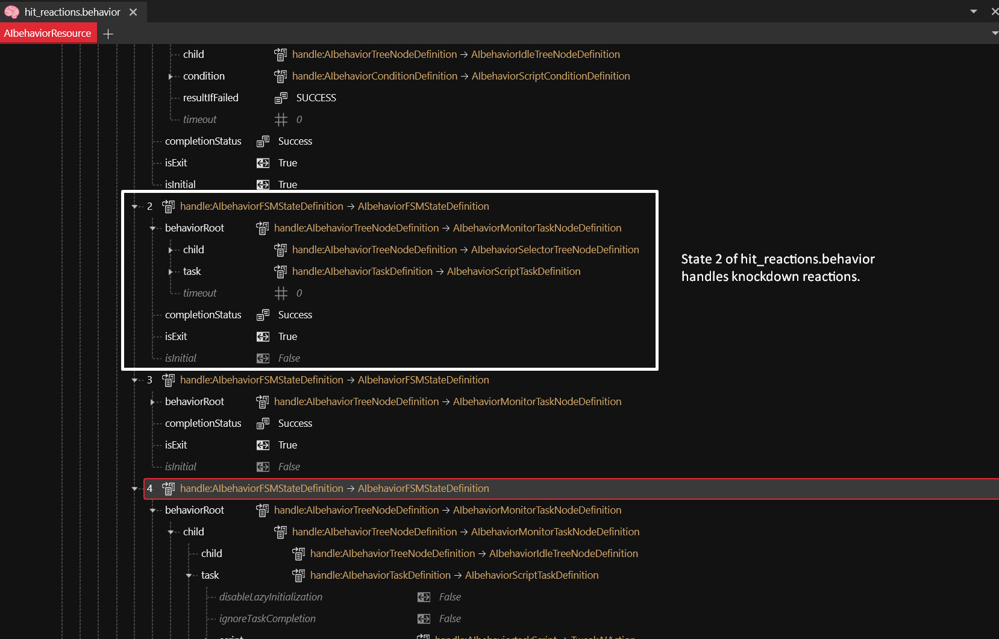
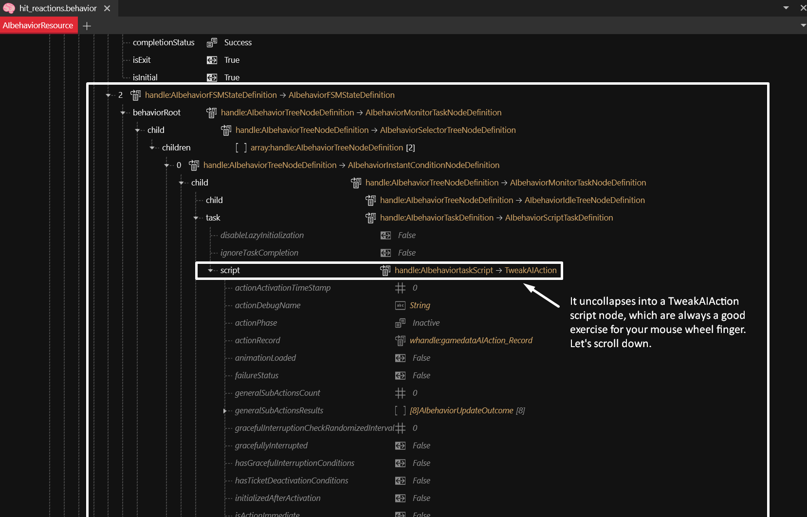
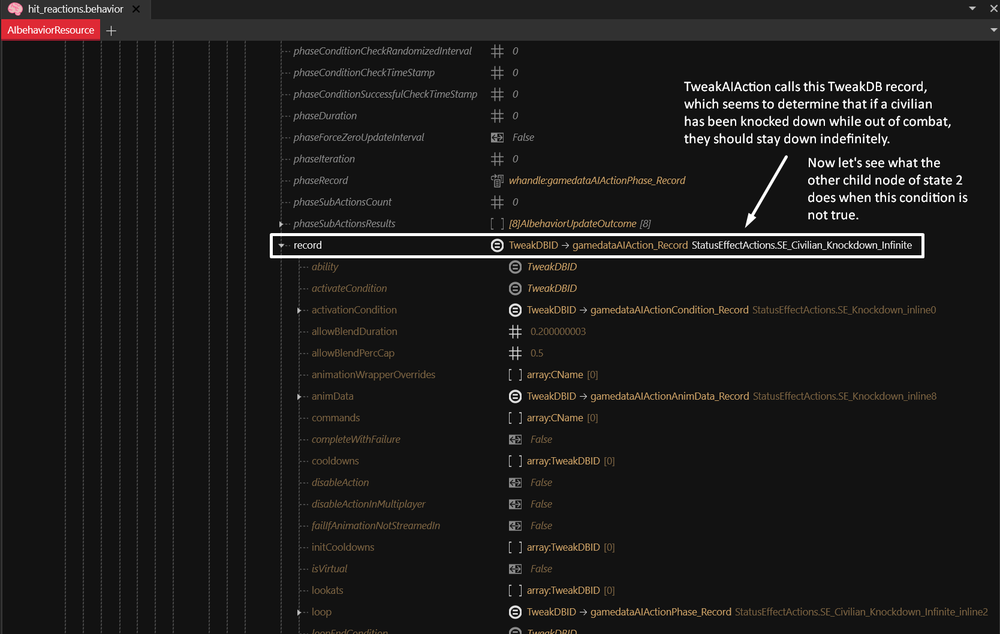
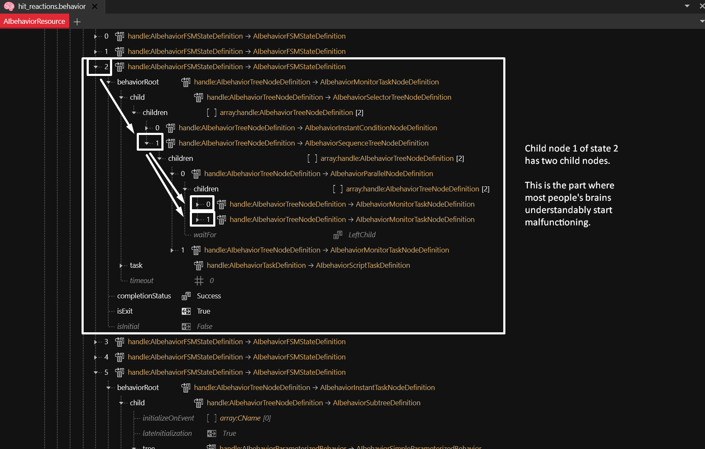

# Behaviors: .behavior files


The functionality of .behavior files is still being studied so the information below may contain some errors.


**Behavior files** are node graphs (currently browsable only in list form) responsible for determining A.I. responses to various stimuli based on specific conditions. For instance, the **hit\_reaction.behavior** file works in tandem with other files to establish how NPCs react to certain kinds of hits, and determines which NPC types are excluded from which behaviors.

Here is an example of the GuardbreakReactionTask node being established in state 4 of **hit\_reactions.behavior**.

<figure><figcaption>
Source file: hit_reactions.behavior
</figcaption></figure>

That node can be replaced with any other node compatible with the script slot, so you can make something else happen, or make the game crash, or an exciting combination of both.

The .behavior files can also point to different .behavior files. Here we see state 5 of **hit\_reactions.behavior** referencing **wounded\_entry\_se.behavior**, which details some of the wounded actions such as walking with an injured arm. State 5 also calls the PainReactionTask script:

<figure><figcaption>
Source file: hit_reactions.behavior
</figcaption></figure>

Navigating these files in list form can be confusing, so let's go step-by-step into state 2, which is the Knockdown state:

<figure><figcaption>
Source file: hit_reactions.behavior
</figcaption></figure>

This goes down quite a few layers. The task node is what happens in that particular layer, and the child nodes take you into the deeper layers. In this case, the knockdown animation is being cached for potential ragdoll. Here's what that looks like:

<figure><figcaption>
Source file: hit_reactions.behavior
</figcaption></figure>

When the child node is uncollapsed, it shows its own nodes, which may contain a condition for its task to occur:

<figure><figcaption>
Source file: hit_reactions.behavior
</figcaption></figure>

This particular condition calls a TweakAIActionCondition node, which connects to a TweakDB record. The record being used checks if the victim of the knockdown is a civilian not currently engaged in combat. Remember that conditions may be set _inverted_, so that the opposite condition is what triggers the task. TweakDB records may also contain their own conditions inside them, inverted or uninverted, so it's good to uncollapse them and take a look.

<figure><figcaption>
Source file: hit_reactions.behavior
</figcaption></figure>

When you open the child node affected by this condition (above it), it uncollapses into a TweakAIAction node which connects to a TweakDB record. The actual record requires that you scroll down quite a bit to get to it. You will come to hate this node.

<figure><figcaption>
Source file: hit_reactions.behavior
</figcaption></figure>

The record seems to determine that if a civilian is knocked down while out of combat, they should stay down indefinitely, which is consistent with how it works in the game:

<figure><figcaption>
Source file: hit_reactions.behavior
</figcaption></figure>

You may have noticed that the record itself contains an **activationCondition** entry. That's one place in which you'll find conditions set by TweakDB records, so again, you should verify those on every TweakDB record you see, regardless of whether it is under a task node or a condition node. And remember to also check if any of those conditions are inverted, and if there are sub-conditions elsewhere in the record. This is your life now.

Now we go back to the other child node of state 2, which determines what happens if the knocked-down NPC is anyone other than an out-of-combat civilian. When this child node is uncollapsed, it disgorges two more child nodes, and the Inception theme starts playing.

<figure><figcaption>
Source file: hit_reactions.behavior
</figcaption></figure>

The first of these great-grandchild nodes just calls the KnockdownReactionTask, which you can replace with any other compatible task to see what happens.

<figure><figcaption>
Source file: hit_reactions.behavior
</figcaption></figure>

The other great-grandchild node is another TweakAIAction node. The TweakDB record it connects to is seemingly what makes armed NPCs shoot aimlessly during the knockdown animation. This record has several other conditions inside it with sub-conditions so let's not make the mistake of uncollapsing it.

<figure><figcaption>
Source file: hit_reactions.behavior
</figcaption></figure>

Instead let's go back one layer, because there was still one child node next to the child node whose child node we were just checking. The following image will hopefully clarify that cursed sentence:

<figure><figcaption>
Source file: hit_reactions.behavior
</figcaption></figure>

This child node, which is mercifully the last of its dynasty in state 2, leads to a TweakAIAction node. If you scroll down to about the depths of the Mariana Trench, you will find the TweakDB record it's connected to. It deals with how NPCs stand up from being knocked down.

<figure><figcaption>
Source file: hit_reactions.behavior
</figcaption></figure>

Out-of-combat civilians are excluded from this behavior, tragically condemned to remain forever horizontal should they be sucker-punched by a player wanting to test their new gorilla arms. This exclusion was determined in the first child node of state 2, in case you understandably forgot by now.

It is important to note that .behavior files do not exist in isolation; the hit reaction system, for instance, is reliant on multiple files and functions. This synergy has to be taken into consideration when editing or replacing nodes in .behavior files, and the conditions established in these nodes or in the TweakDB records they use must be verified. They may, for example, exclude bosses from certain behaviors, so deleting those nodes can cause considerable issues.
