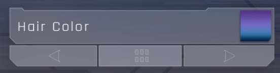

# Character Creator: .inkcc

## Summary

Published: Jan 17 2025 by [manavortex](https://app.gitbook.com/u/NfZBoxGegfUqB33J9HXuCs6PVaC3 "mention") and [IslandDancer](https://app.gitbook.com/u/s8gktWvqEZWGRxQIsePwOnEI2Mo2 "mention")\
Last documented edit: Jan 22 2025 by [manavortex](https://app.gitbook.com/u/NfZBoxGegfUqB33J9HXuCs6PVaC3 "mention")

This page will tell you how the character creator works (as far as we understand it).

### Wait, this is not what I want!

* If you want to add things to the character creator instead, check [archivexl-character-creator-additions](../../../core-mods-explained/archivexl/archivexl-character-creator-additions/ "mention")
* For details on how the file structure works, see [.inkcharactercustomization-cc-options.md](.inkcharactercustomization-cc-options.md "mention")

## The Switcher

The switcher component contains every `appearanceInfo` registered in [.incharactercustomization](.inkcharactercustomization-cc-options.md) files. The currently selected appearance has the attribute `selected` set to `true`, the others to `false`.

<figure><figcaption></figcaption></figure>


To make a switcher entry use an icon rather than text, set the `useThumbnails` property to true.


