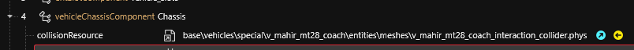
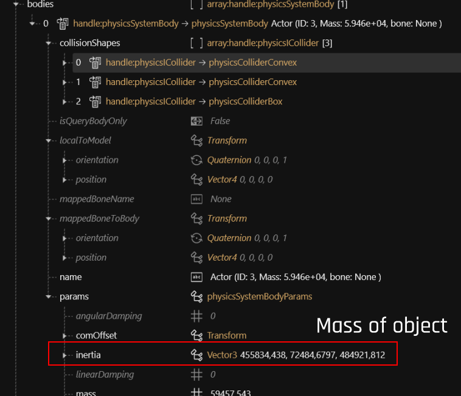

# Collision



Colliders are added via .phys files. For cars, those get added by the chassis component:&#x20;

<figure><figcaption></figcaption></figure>

For more information on car collision, see [interaction-collider-.phys-files.md](../../../../modding-guides/vehicles/boe6s-guide-new-car-from-a-to-z/interaction-collider-.phys-files.md "mention")

<figure><figcaption></figcaption></figure>
