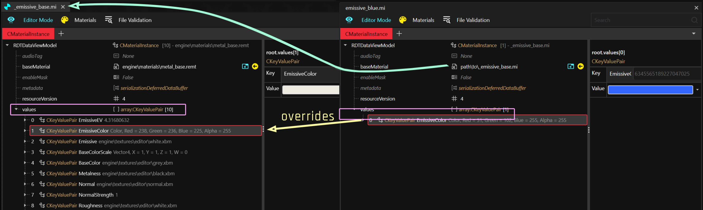
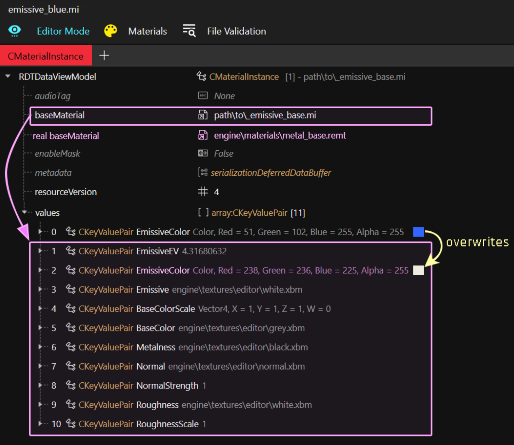
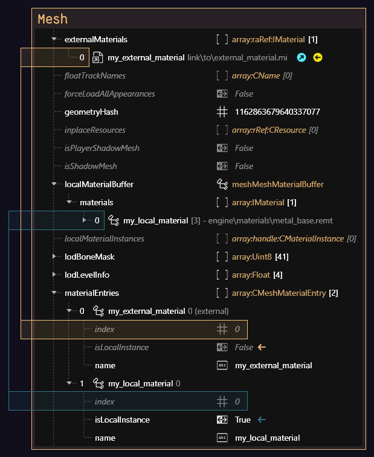

# Re-using materials: .mi

## Summary

**Published**: Apr 5 2023 by [mana vortex](https://app.gitbook.com/u/NfZBoxGegfUqB33J9HXuCs6PVaC3 "mention")        **Last documented update**: Aug 12 2025 by [mana vortex](https://app.gitbook.com/u/NfZBoxGegfUqB33J9HXuCs6PVaC3 "mention")

This guide will teach you how you can use `.mi` files to re-use materials across multiple meshes. By combining this with [archivexl-dynamic-materials.md](../../../../modding-guides/textures-and-luts/archivexl-dynamic-materials.md "mention"), this mechanic allows **maximum flexibility**.

### Wait, this is not what I want!

* To learn how materials work in the first place, check [3d-objects-.mesh-files](../3d-objects-.mesh-files/ "mention") -> [#material-assignment](../3d-objects-.mesh-files/#material-assignment "mention")&#x20;
* You can find [configuring-materials](../../../materials/configuring-materials/ "mention") documented in their own wiki section
* For examples of `.mi` files in action, check the player's [skin materials](../../../references-lists-and-overviews/cheat-sheet-head/#skin-tones-by-index)

## What is a material instance?

A .mi file **encapsulates** a material in a **reusable** template file, which you can use a .mi file as `base material` in  [#material-instances](../3d-objects-.mesh-files/#material-instances "mention").

It is possible to use multiple .mi files in a row. For an example of this, check the player's [skin materials](../../../references-lists-and-overviews/cheat-sheet-head/#skin-tones-by-index).

<figure><figcaption><p>The technical term for doing this is "daisy chaining". (Image: Wikimedia commons). Caution: Cyclic dependencies <em>will</em> crash your game!</p></figcaption></figure>

For more information of this, you can look at [shaders](../../../materials/shaders/ "mention") -> [#the-daisy-chain](../../../materials/shaders/#the-daisy-chain "mention")

## Why do I need this?

Put yourself in the shoes of a hypothetical modder.

* You are creating a mod that offers multiple versions of the same item (e.g. toy props or hair)
* You have created a base material
* You duplicate and re-duplicate the material for each of your variants, changing the properties that defines the colour
* You wish that there was less copy-pasting involved

<figure><figcaption><p>You only change 2 of 6 properties, but you always have to copy all of them!!</p></figcaption></figure>

### .mi files to the rescue

Take any of them from the game, move them to your custom directory, and group all the properties that you keep copy-pasting into the .mi.

Then, in your material, you can now use your .mi file as `baseMaterial`, and only change the properties that are actually different!


For a collection of example .mi files, check [manavortex's MEGA](https://mega.nz/folder/KJ8DnBhK#VG0KzRhedBMRRsfd0Cdc0A).


Instead of copy-pasting six properties, you now copy-paste only two.

<figure><figcaption><p>Only add the properties that you want to change in relation to the .mi file</p></figcaption></figure>

## The Daisy Chain illustrated

Look at this example of two chained .mi files:

<figure><figcaption></figcaption></figure>

### Step 1: \_emissive\_base.mi

This file is an **external material instance** of `metal_base.remt`. Any [configuring-materials](../../../materials/configuring-materials/ "mention") that are **not defined** will take the default values from the **`shader template`**.

* No `BaseColor` attribute is defined - the default value is `engine\textures\editor\grey.xbm`
* `EmissiveEV > 0` makes the material **glow**
* A white texture as the `Emissive` mask means that **all of the material** glows
* A white [`BaseColorScale`](../../../materials/configuring-materials/tinting-textures-in-wolvenkit.md) makes the glow's color white

TL;DR: Anything using this material will look like a **white** neon tube.

### Step 2: emissive\_blue.mi

This file is an **external material instance** of `_emissive_base.mi`. Any properties that are **not defined** will  use the defautl values from the **.mi file**.

* No `EmissiveEV` is defined, so it will use the baseMaterial's value of `4.31680632`
* No `Emissive` mask is defined, so it will take `engine\textures\editor\white.xbm` from the `.mi`
* A  blue [`BaseColorScale`](../../../materials/configuring-materials/tinting-textures-in-wolvenkit.md) overwrites the white glow from the .mi file, changing the glow colour

TL;DR: Anything using this material will look like a <mark style="color:blue;">**blue**</mark> neon tube.

In other words, this is how `emissive_blue.mi` actually looks:

<figure><figcaption><p>... and everything else that's <a href="../../../materials/configuring-materials/#checking-material-properties">defined inside</a> metal_base.remt</p></figcaption></figure>


## Making material templates

Let's take it another step further – we can make a bunch of different colours to re-use across your files. An example for this are hair files, or the plastic materials I've used in my [toy prop pack](https://www.nexusmods.com/cyberpunk2077/mods/7391).

<figure><figcaption></figcaption></figure>

For this, I first created a `plastic_base.mi` with all the common properties, and then created one additional .mi file for each shade of plastic, **setting plastic\_base.mi as baseMaterial**, leaving me with the following folder structure:

```
- materials
  - plastic
    - _plastic_base.mi   << baseMaterial for all materials below
    - plastic_black.mi
    - plastic_yellow.mi
    - plastic_red.mi
    - plastic_green.mi
    - plastic_purple.mi
    - plastic_pink.mi
    - plastic_orange.mi
    - plastic_blue.mi
```

If I decide that my plastic is too shiny, I can edit `_plastic_base.mi` instead of touching every template individually. Pretty neat, isn't it?

And if one of my items happens to have a custom normal map and/or texture, then I just add them in the `values` array of my material and call it a day.

## Maximally lazy: external materials

But we can take this approach even further! If you **don't** have any properties, your mesh doesn't even need materials! You can simply use the `externalMaterials` list instead. You do this by unticking the isLocal property in the materialEntries definition:

<figure><figcaption><p>material entries and indices</p></figcaption></figure>

## Warning

You can of course mix and match local and external materials! Just make sure that the materialEntries indices are pointing at the correct material.

However:


If you are using `preloadLocalMaterials`, you need to use `preloadExternalMaterials` instead of `externalMaterials.`

