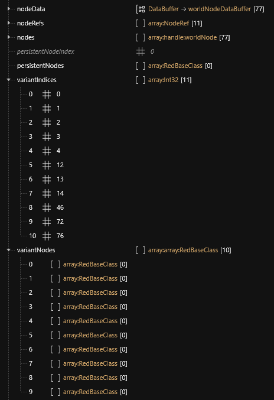

# The whole world: .streamingsector

## Summary

**Last documented update**: January 80, 2025 by [manavortex](https://app.gitbook.com/u/NfZBoxGegfUqB33J9HXuCs6PVaC3 "mention")

This page will tell you what .streamingsector files do and how they do it.

### Wait, this is not what I want!

* If you would rather edit streamingsector files, check out our [world-editing](../../../../modding-guides/world-editing/ "mention") guides
* If you're looking for a certain streaming sector, see [here](../../../references-lists-and-overviews/reference-world-sectors/places.md) or check out [redhottools](../../../modding-tools/redhottools/ "mention") -> [#world-inspector](../../../modding-tools/redhottools/#world-inspector "mention")
* For a list of interesting locations, see [here](../../../references-lists-and-overviews/reference-world-sectors/)
* For a (partial) list of node types and what they are, see [reference-.streamingsector-node-types.md](../../../references-lists-and-overviews/reference-world-sectors/reference-.streamingsector-node-types.md "mention")

## What are streamingSectors?

This is where the world of Cyberpunk is defined.

Other than the world environment, streaming sector files can also define

* navigation
* sound
* collision
* illumination

as there are several types.


If you create a mod with sectors, you need to create a [streamingblock](.streamingblock-sector-definitions-and-variants.md)&#x20;


### Sector splitting

CDPR auto-generates these files from a much larger dataset. For that reason, cutoffs are sometimes arbitrary, and locations are scattered across multiple streamingsectors.

In addition, different LODs also have different sector files. For more information, check the expendable box under [#lod-level-of-detail-data-and-grid-sizes](./#lod-level-of-detail-data-and-grid-sizes "mention")

## World data


Node and nodeData indices may change every time CDPR updates their game.


### nodeData

This list tells the engine where to put the data from [#nodes](./#nodes "mention").&#x20;

Via the `NodeIndex` property, each entry points an element inside the [#nodes](./#nodes "mention") array.

One node can have multiple associated `nodeData` entries.

#### nodeData properties

You can find some info in **`<Cyberpunk 2077>\tools\redmod\metadata.json`**&#x20;

The actual class name of `worldNodeData` is `worldCompiledNodeInstanceSetupInfo`&#x20;

|                        | data type                    | explanation                                            |
| ---------------------- | ---------------------------- | ------------------------------------------------------ |
| `QuestPrefabRefHash`   | `globalNodeId`               | should be defined in nodeRefs block                    |
| `MaxStreamingDistance` | `secondaryRefPointDistance`  |                                                        |
| `streamingDistance`    | `UkFloat1`                   |                                                        |
| `Pivot`                | `secondaryRefPointPosition`  |                                                        |
| `Bounds.Min`           | `streamingRefPoint`          |                                                        |
| `Bounds.Max`           | not listed                   | Seems there's no box/bounds, but two different vectors |

### nodes

This list defines the assets that make up the sector — everything from the list of objects around you and their interactions, to the locations of light, sounds, and effects, to the NPCs, the minimap, and almost everything else.

Each entry is a `worldNode` object with a number of [#nodedata](./#nodedata "mention") entries. These nodes can do wildly different things, depending on their types and properties.

For a (partial) list of node types and what they are, see [reference-.streamingsector-node-types.md](../../../references-lists-and-overviews/reference-world-sectors/reference-.streamingsector-node-types.md "mention")

### nodeRef

This list contains linked quests that are triggered via scene files. You can find more information under [noderefs.md](noderefs.md "mention") (this is not yet fully explored)

### variantIndices

contains as many values as **ranges** are needed (at least one default range). Each range is mapped on entries in `nodeData` starting at `index`, and stops before (excludes) the index of the following range.

The default variant index is 0.


Node entries in this default range are always enabled, **regardless of variant state**.


Example

&#x20;Only the first node (nodeData?) with the index `0` is always enabled.

If we look at variant index #7, the range starts at 14 (included) and ends at 46 (excluded).

### variantNodes

`variantNodes` contains as many empty arrays as variants (in this case, 10).


TODO: FAFO\
Do they have to be empty? What if they aren't? What even goes there?


## Theory

Streaming Sectors contain the world's data, holding a node tree that includes all its models and entities.&#x20;

LOD (Level of Detail) Data and grid sizes

The information below used to be the only way to find sectors. However, as this has gotten much easier via [redhottools](../../../modding-tools/redhottools/ "mention") -> [#world-inspector](../../../modding-tools/redhottools/#world-inspector "mention"), the information below has been preserved for posterity.

***

The world is broken up into a grid, with several sizes of squares available (bit like graph paper with major and minor grid lines). The size of the grid in use is dependent on the Level of Detail (LOD) of the sector file your looking at, which is the last digit of the filename.&#x20;

Chunk sizes are as below.

| LOD | Interior | Exterior |
| --- | -------- | -------- |
| 0   | 32       | 64       |
| 1   | 64       | 128      |
| 2   | 128      | 256?     |

\
For every location, there can be multiple overlapping levels of LOD sectors with progressively more detail as you go down the levels.&#x20;

For instance, Lizzies bar is located at approximately -1200, 1562, 22:

Filenames are structured as `sectortype_X_Y_Z.streamingsector` . If you preview a sector in wkit, the axes are shown as Z=-Y and Y=Z.

#### Calculating the files

I've left the detail of the process below for record, but if you just want a list of sectors I've created a python script to find the ones that a set of co-ordinates are in. You can find it [HERE](https://mybinder.org/v2/gh/Simarilius-uk/sectorStuff/5b8a8f5536002ec2d33c16103f79c53b6b93bd8e?urlpath=lab%2Ftree%2FAllBlocks.ipynb). Simply enter the co-ordinates in the player\_loc dict in block 3 then run all blocks. You'll be given 2 lists containing of all the interior and exterior sectors which contain the co-ords within their bounding boxes. The list also shows the distance from the centre of the sectors to the co-ords given.

From those co-ordinates we can calculate the sector files for interior/exterior sectors by dividing by the grid size for the LOD and rounding. (ie 1200/32=38 etc)

| LOD | Interior   | Exterior   |
| --- | ---------- | ---------- |
| 0   | -38\_49\_0 | -19\_24\_0 |
| 1   | -19\_24\_0 | -9\_12\_0  |
| 2   | -9\_12\_0  | -5\_6\_0   |

At the level 0 files the whole building isn't covered by 1 sector, so you end up needing 4, conversely the exterior level 2 is several city blocks.&#x20;

For example, the **loft apartment** uses these files:&#x20;

`interior_-24_-16_1_1.streamingsector`: inner walls, floors, collision

`interior_-48_-31_2_0.streamingsector`: interior decoration, clutter

Note that the numbers are simply duplicated and rounded down. \
&#xNAN;_&#x4E;o, I don't know how you round down 2\*16 to 31 either._

Some locations are partially defined in **quest sectors**, where parts of the location are locked away behind story triggers (for example half of V's apartment, as a lot of decoration will only be shown after completing quests). The exact process isn't fully understood as of May 2023.

***

## Different sector states

A steamingsector can split its nodes into ranges called variants. A variant is used to display/enable an amount of nodes in a specific situation (like during or after a quest). All sectors and their variants need to be declared somewhere; this place is the [streamingblock](.streamingblock-sector-definitions-and-variants.md).

For more information on how to trigger variants, see [switching-between-sector-states.md](../../../../modding-guides/world-editing/archived-guides/switching-between-sector-states.md "mention") in the [world-editing](../../../../modding-guides/world-editing/ "mention") section.

