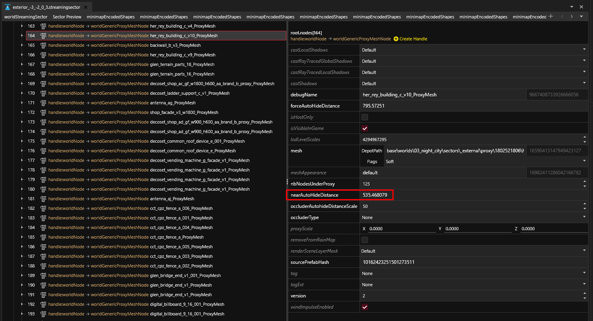

# Environment: Level of Detail

## Summary

**Published**: Mar 02 2024 by [manavortex](https://app.gitbook.com/u/NfZBoxGegfUqB33J9HXuCs6PVaC3 "mention")\
**Last documented update**: Mar 02 2024 by [manavortex](https://app.gitbook.com/u/NfZBoxGegfUqB33J9HXuCs6PVaC3 "mention")

This page explains how the level of detail is handled in environment files.

### Wait, this is not what I want!

* To learn how components (equipment) casts shadows, check [meshes-shadows-and-shadow-meshes.md](../3d-objects-.mesh-files/meshes-shadows-and-shadow-meshes.md "mention")

## Auto-hiding

Many world objects are automatically hidden if you move away from them, freeing the engine resources that had been used to render them.


Hiding an object will also hide its shadows and occluders.


The distance at which this happens is controlled by the `forceAutoHideDistance` property of each world node:

<figure><figcaption></figcaption></figure>

This probably corresponds directly to the `nearAutoHideDistance` in the proxy mesh ndoes below?

## Proxy meshes

There is a specialized node type for world proxy meshes: the `worldGenericProxyMeshNode`.  (Which raises the question if there are specialized / extended `worldXXProxyMeshNodes?)`

<figure><figcaption></figcaption></figure>
