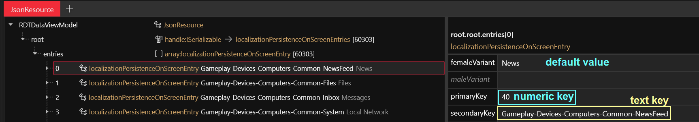

# Translation files: .json

## Summary

**Created:** Oct 06 2025 by [mana vortex](https://app.gitbook.com/u/NfZBoxGegfUqB33J9HXuCs6PVaC3 "mention")\
**Last documented update:** Oct 06 2025 by [mana vortex](https://app.gitbook.com/u/NfZBoxGegfUqB33J9HXuCs6PVaC3 "mention")

This page explains how the game uses .json files, how they are used for localization, and how you can use localization files to add your own translations

### Wait, this is not what I want!

* For a more detailed guide, check [how-to-translate-a-mod.md](../../../modding-guides/everything-else/how-to-translate-a-mod.md "mention")

## What's a JSON file, precious?

This file type is where CDPR keep their lookup tables. Basically, any entries that need to be looked up at runtime get chucked into a json file and kept around for later.


## JSON for translations

You can find the translation entries under the following paths:

```
base/localization/<language>/
ep1/localization/<language>/
```

The default example to look at is `base\localization\en-us\onscreens\onscreens.json`.

<figure><figcaption></figcaption></figure>

A `localizationPersistenceOnScreenEntry` has four properties:&#x20;

<table><thead><tr><th width="205.3333740234375"></th><th></th></tr></thead><tbody><tr><td>femaleVariant</td><td>Default text</td></tr><tr><td>maleVariant</td><td>Special text for masc variant (e.g. for gendered languages), you can leave this empty unless you need it</td></tr><tr><td>primaryKey</td><td>The numeric key the game uses to look up translation entries. If you add entries, set this to 0 and let ArchiveXL handle it.</td></tr><tr><td>secondaryKey</td><td>The textual key the game uses to look up translation entries. Must be unique.</td></tr></tbody></table>

### Adding translations with ArchiveXL

To add your own translations, you need to create an [.xl file](https://app.gitbook.com/s/-MP_ozZVx2gRZUPXkd4r/wolvenkit-app/menu#new-file) in your project's [resources](https://app.gitbook.com/s/-MP_ozZVx2gRZUPXkd4r/wolvenkit-app/editor/project-explorer#resources) folder. Open it with a text editor of your choice, and put the following:

```yaml
localization:  
  onscreens:  
    en-us: 
      - path\to\your\file\with\translation_strings.json
```



#### Overwriting existing entries

Make sure that the **secondary key** of your translation entry is identical with the one from the entry you want to replace.&#x20;

#### Adding multiple entries

One line per entry:

```yaml
localization:  
  onscreens:  
    en-us: 
      - file1
      - file2
```

#### Adding multiple languages

One block per language:&#x20;

```yaml
localization:  
  onscreens:  
    en-us: 
      - path\to\your\file\with\en-en\translation_strings.json
    jp-jp:
      - path\to\your\file\with\jp-jp\translation_strings.json
```

You can see the available languages in the [game files](translation-files-.json.md#json-for-translations) as folder names.
