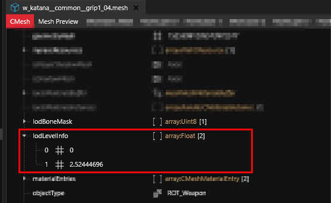
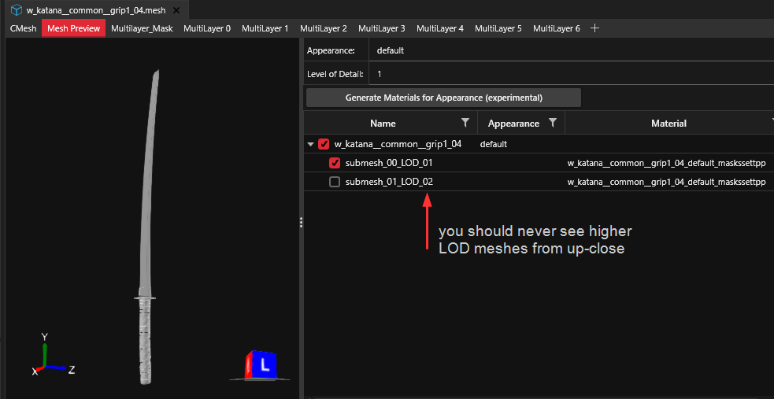
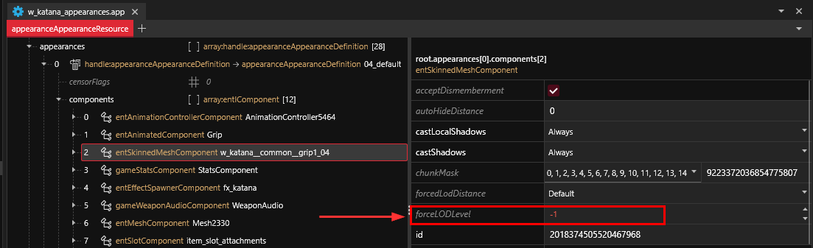

# Level of Detail (LoD)

## Summary

**Published**: Mar 02 2024 by [manavortex](https://app.gitbook.com/u/NfZBoxGegfUqB33J9HXuCs6PVaC3 "mention")\
**Last documented update**: Mar 02 2024 by [manavortex](https://app.gitbook.com/u/NfZBoxGegfUqB33J9HXuCs6PVaC3 "mention")

This page explains what **Level of Detail** is and how it works.

### Wait, this is not what I want!

* To learn more about [proxy-appearances.md](appearance-.app-files/proxy-appearances.md "mention"), check the corresponding wiki page.

## Level of Detail


A high-detail mesh has a low Level of Detail, and vice versa. This is both intuitive and obvious, which is why there's an info box telling you about it.


The further away something is, the higher it's LOD will be (the less detail you will actually see, and the less detail will be rendered).&#x20;

### What controls LOD?

.streamingsector: forceAutoHideDistance


### But my modded items only have LOD0!

That is due to Wolvenkit: the [LOD filter](https://app.gitbook.com/s/-MP\_ozZVx2gRZUPXkd4r/wolvenkit-app/usage/import-export/models#lod-filter) property will drop any submeshes for lower resolutions.&#x20;

For **equipment and weapons**, that is completely fine, because you don't need them (melee weapons aside, read on).

For [NPVs](../../modding-guides/npcs/npv-v-as-custom-npc/), you'll want to get rid of proxy appearances as well — we really can't be arsed to create custom ones.

### So let's get rid of all these high LOD submeshes!

**Please don't.**&#x20;

First of all, the high LODs occasionally store other properties. For **melee weapons**, they are used to [calculate the hitbox](../../modding-guides/items-equipment/adding-new-items/weapons/#editing-weapon-meshes) (or so we think, Mar 2024). For **vehicles**, they're needed for [damage deforms](../../modding-guides/vehicles/boe6s-guide-new-car-from-a-to-z/3d-body-modeling-import-export-meshes.md#add-the-proxy-mesh-to-the-project).

And second of all, without proxy meshes, your GPU will **catch fire** if you look at Night City's skyline. Yes, even the Tesseract.

### lodLevelInfo

As of May 2024, we don't know for certain what the numeric properties stand for (maybe the distance from player at which the level of detail gets activated?).&#x20;


LODs corresponds to `renderLOD`s. LODs without an entry in `renderLOD` will never load.


<figure><figcaption></figcaption></figure>

You can see submeshes and their LODs in the [Mesh Preview](https://app.gitbook.com/s/-MP\_ozZVx2gRZUPXkd4r/wolvenkit-app/editor/file-editor/preview#mesh-preview):

<figure><figcaption></figcaption></figure>

## Proxy meshes


To learn more about [proxy-appearances.md](appearance-.app-files/proxy-appearances.md "mention"), check the corresponding wiki page.


A proxy mesh is used as an extremely low-level stand-in to be loaded for distant objects. They will almost always have `proxy` in their path or file name, and use a [PBR material](../references-lists-and-overviews/cheat-sheet-materials.md#pbr-material) such as metal\_base with low-resolution textures.

Example: Take a look at Johnny's proxy mesh under

```
base\characters\appearances\main_npc\proxy\silverhand_default\silverhand_default.mesh
```

## Shadow meshes

Shadow meshes are used to generate shadows at low performance cost. You can find more detailed documentation on the page about [meshes-shadows-and-shadow-meshes.md](3d-objects-.mesh-files/meshes-shadows-and-shadow-meshes.md "mention").

## Component property: forceLODLevel

This lets you override the level of detail&#x20;

<figure><figcaption><p>You can set this property in the <a href="components/documented-components/#equipment-hair">component</a> </p></figcaption></figure>

