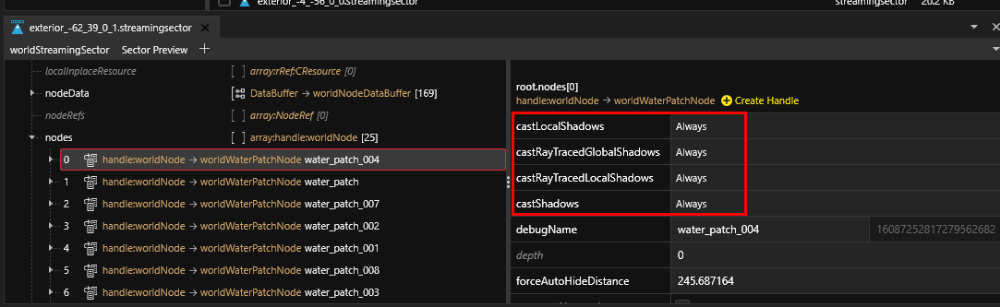

# Environment: Shadows

## Summary

**Published**: Mar 02 2024 by [manavortex](https://app.gitbook.com/u/NfZBoxGegfUqB33J9HXuCs6PVaC3 "mention")\
**Last documented update**: Mar 02 2024 by [manavortex](https://app.gitbook.com/u/NfZBoxGegfUqB33J9HXuCs6PVaC3 "mention")

This page explains how shadows are configured for nodes in streamingsectors.&#x20;

### Wait, this is not what I want!

* To learn how components (equipment) casts shadows, check [meshes-shadows-and-shadow-meshes.md](../3d-objects-.mesh-files/meshes-shadows-and-shadow-meshes.md "mention")

## Shadows

The shadow properties of the environment are configured in the properties of each node inside the `.streamingsector` file:

<figure><figcaption></figcaption></figure>

Shadows are only cast as long as a mesh is visible.

### Global and local shadows

A global shadow will not render small details — these will only be included if the castLocalShadows property is active.

