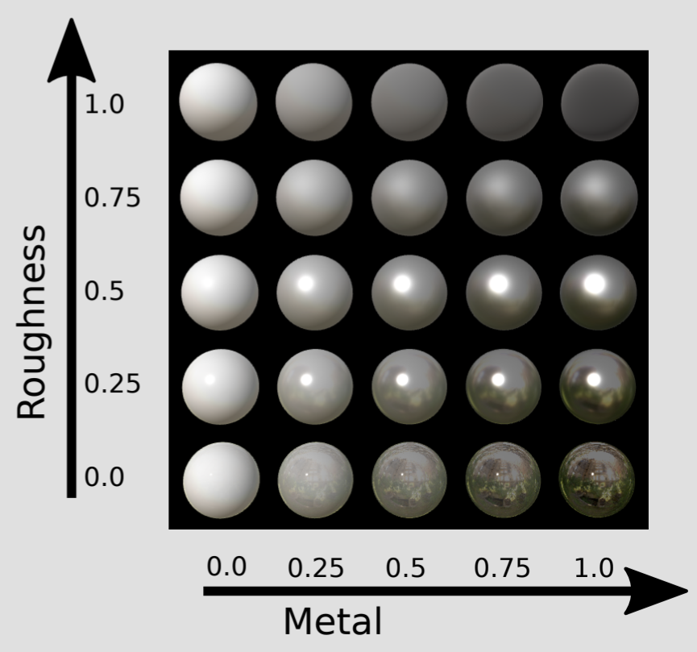

# Material properties

## Summary

**Last documented update:** Apr 20 2024 by [manavortex](https://app.gitbook.com/u/NfZBoxGegfUqB33J9HXuCs6PVaC3 "mention")

This page gives an explanation and overview about material properties. For more detailed explanation of a specific kind of material, please check the nested pages in the wiki's file tree, or check the "next" link at the bottom of the page.

* If you want to see a list of materials grouped by class, check [cheat-sheet-materials.md](../../references-lists-and-overviews/cheat-sheet-materials.md "mention")
* If you want to learn how material assignments work on the object, check [3d-objects-.mesh-files](../../files-and-what-they-do/3d-objects-.mesh-files/ "mention")
* If you want to understand reusable material templates, please check [re-using-materials-.mi.md](../../files-and-what-they-do/materials/re-using-materials-.mi.md "mention")
* The **Modding Guides** section has multiple guides on editing materials, e.g. [changing-materials-colors-and-textures](../../../modding-guides/items-equipment/editing-existing-items/changing-materials-colors-and-textures/ "mention") or [textured-items-and-cyberpunk-materials.md](../../../modding-guides/textures-and-luts/textured-items-and-cyberpunk-materials.md "mention")

## Material properties

The properties of a material (or a shader) are defined in its shader file. Those files have the extension `.mt` or `.remt` and are widely used and extended.&#x20;


You should **never** replace a `.mt` or `.remt` — this will affect every single thing using the material. \
If you want to change specific surfaces, look out for the right `.mi` file and change that, or create one and [start custompathing](../../../modding-guides/items-equipment/custompathing-assets.md).


## Checking material properties


You can find a wiki page with an overview of shaders under [shader-docs.md](../shaders/shader-docs.md "mention"), but it needs expanding. Maybe you'd like to contribute?


You can see a material's default properties by opening the `.(re)mt` file in WolvenKit and inspecting the parameters array.&#x20;


To find a shader template, use the [Wolvenkit Search](https://app.gitbook.com/s/-MP\_ozZVx2gRZUPXkd4r/wolvenkit-app/usage/wolvenkit-search-finding-files) (you can copy the query):&#x20;

`yourMaterialType > .remt|.mt`


Any properties that you don't overwrite by adding them to your CMaterialInstance or .mi file will take the default properties specified in the file.

<figure><figcaption></figcaption></figure>

Here, you can also see what value a shader template will use if you don't give it any properties.

### What do these mean?

The interesting bit is on the right side of the arrow in the picture above, since it specifies the type of parameter:

<table><thead><tr><th width="261">Type: CMaterialParameter…</th><th width="137">CKeyValue</th><th>explanation</th></tr></thead><tbody><tr><td><code>Vector</code></td><td>Vector4</td><td>A vector with X, Y, Z, W (coordinates and space). This is also used for colour values (Wolvenkit usually supports those).</td></tr><tr><td><code>Texture</code></td><td>RRef:Texture</td><td>A texture (.xbm) via DepotPath</td></tr><tr><td><code>Color</code></td><td>Color</td><td>A color (RGB/color picker)</td></tr><tr><td><code>MultilayerMask</code></td><td>RRef:MultilayerMask</td><td>a <a href="../multilayered/#what-is-the-mlmask">multilayerMask</a> (<code>.mlmask</code>) via depotPath</td></tr><tr><td><code>MultilayerSetup</code></td><td>RRef:MultilayerSetup</td><td>a <a href="../multilayered/#what-is-the-mlsetup">multilayerSetup</a> (<code>.mlsetup</code>) via depotPath</td></tr><tr><td><code>Scalar</code></td><td>CFloat/CDouble</td><td>a numeric value with decimals. Float has 7 decimals, Double has 15</td></tr><tr><td><code>TextureArray</code></td><td>???</td><td>a texarray via depotPath</td></tr><tr><td><code>StructBuffer</code></td><td>???</td><td></td></tr><tr><td><a data-footnote-ref href="#user-content-fn-1"><code>HairProfile</code></a></td><td>RRef:<code>.hp</code></td><td>A hair profile (<a href="../../modding-tools/wolvenkit-blender-io-suite/wkit-blender-plugin-import-export.md#hair-profiles-.hp">.hp</a>) via depotPath</td></tr></tbody></table>

## Transparency

Whether or not a material can be transparent depends on the shader. Transparency can be switched on/off via the `EnableMask` property, or clamped via `AlphaThreshold` (see [#shared-properties](./#shared-properties "mention")).

## Glow / Light

Whether or not a material emits light depends on the shader, e.g. `metal_base.remt` supports this via the `Emissive` texture property. \
For a documentation of this, see [emissive-material-properties.md](emissive-material-properties.md "mention").

## Shared properties

This section will list properties that are common to many materials and give a short explanation of what they do.

Not all materials use all of these properties.


The same parameters can be named differently across different shaders (e.g the base texture can be called `BaseColor`, `Diffuse`, or `Albedo`).&#x20;

Properties with texture paths can end in Texture, e.g. `BaseColorTexture` instead of `BaseColor`.

As this is a horrible mess, it is easiest to [look up the properties in the shader](./#checking-material-properties) if you're not certain.


<table><thead><tr><th width="236">Property name(s)</th><th>Explanation</th></tr></thead><tbody><tr><td>LayerTile LayerScale</td><td>Material scaling (zoom on surface) > 1 zooms in, >1 zooms out</td></tr><tr><td>Roughness Rough</td><td>Whether a surface is rough or smooth. <strong>White</strong>: full, <strong>Black</strong>: none</td></tr><tr><td>Metalness Metallic</td><td>Whether a surface is metallic or not. <strong>White</strong>: full, <strong>Black</strong>: none</td></tr><tr><td>Normal GlobalNormal</td><td>A material's <a href="../../../modding-guides/textures-and-luts/self-made-normal-maps/">bump map</a>. Yellow normal maps are called <em>swizzled</em>.</td></tr><tr><td>BaseColor Diffuse Albedo</td><td>A material's base colour value. This is usually a colour, but it can also be a vector4. Wolvenkit usually supports this, but if you don't see a colour picker, please <a href="https://github.com/WolvenKit/WolvenKit/issues">write a ticket</a> (and use the <a href="../../../_resources_and_assets/blender/xyz_color_picker_for_cyberpunk.zip">color picker .blend</a>)</td></tr><tr><td>AlphaThreshold</td><td>Clamps transparency. (TODO: how exactly?)</td></tr><tr><td>EnableMask</td><td>Should the material enable masking? (will use the diffuse texture's alpha channel)</td></tr><tr><td>Mask</td><td>A mask (transparency) texture (like a layer mask in Photoshop)</td></tr></tbody></table>

## Roughness/Metalness

<figure><figcaption></figcaption></figure>

<figure><figcaption>
A roughness/metalness preview. Yes, it's not a sphere. 
</figcaption></figure>

[^1]: 
