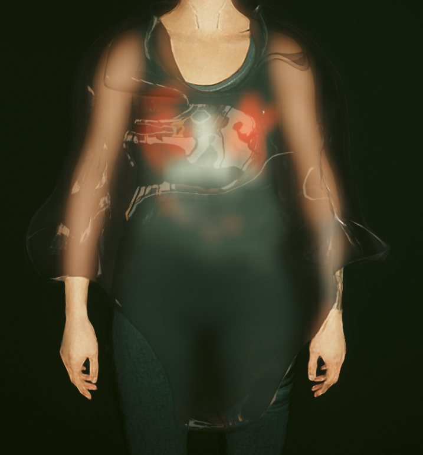

# Transparent material properties

## Summary

**Created:** Jan 14 2024 by [manavortex](https://app.gitbook.com/u/NfZBoxGegfUqB33J9HXuCs6PVaC3 "mention")\
**Last documented update:** Jan 14 2024 by [manavortex](https://app.gitbook.com/u/NfZBoxGegfUqB33J9HXuCs6PVaC3 "mention")

This page documents glass shaders and their properties.&#x20;

* For an **overview** of glass shaders, see [cheat-sheet-materials.md](../../references-lists-and-overviews/cheat-sheet-materials.md "mention")-> [#glass](../../references-lists-and-overviews/cheat-sheet-materials.md#glass "mention")
* For an **explanation** of material properties and further links, see [.](./ "mention")


To turn on material transparency, the `EnableMask` property must be set to `True`!


## Glass

Cyberpunk's glass material, such as `base\materials\glass_onesided.mt`


All glass materials can consider the vertex color attribute, which you can edit [directly in Blender](https://all3dp.com/2/blender-vertex-paint-simply-explained/).&#x20;


<table><thead><tr><th width="291"></th><th></th></tr></thead><tbody><tr><td>Opacity</td><td>float, <code>0.0 - 1.0</code>: Controls glass transparency. </td></tr><tr><td>GlassTint</td><td>A texture to tint your glass. (TBD: Does it work as a mask?)</td></tr><tr><td>TintColor</td><td>Glass tint as RGB (copy from e.g. <code>mi_neokitsch_fridge_z_emissive.mi</code>). </td></tr><tr><td>IOR</td><td><a href="https://pixelandpoly.com/ior.html">Index of refraction</a> as float, <code>1.0-2.0:</code> The refraction properties of your material. (Water > glass > air)</td></tr><tr><td>Refraction Depth</td><td>float <code>0.0-10.0:</code> Control refraction depth here. You can turn your ray into a curve that way!</td></tr><tr><td>FresnelBias</td><td>float, <code>0.0 - 2.0</code>: How much does the glass behave like a lens (that is, warp the picture behind it)?</td></tr><tr><td>BlurRadius</td><td>float, <code>0.0 - 1.0</code>: Blur amount when looking through the glass</td></tr><tr><td>VertexColorTint</td><td>float, <code>0.0 - 1.0</code>: Transparency of vertex colour tint</td></tr></tbody></table>

Find a ready-to-use bottle glass .mi [here](https://mega.nz/file/XJshBTxT#OLiUH1UbZEBJG2izMX2egRxq7vVYzqjg9Tbj-7o2bYQ).&#x20;

### Non-warping glass

For a glass material without view distortion and warping, use `base\vehicles\common\materials\glass_windshield_tinted_black.mi`

<table><thead><tr><th width="291"></th><th></th></tr></thead><tbody><tr><td>Opacity/OpacityBackFace</td><td>float, <code>0.0 - 5.0</code>: Controls glass transparency. OpacityBackFace will only affect inside-facing normals.</td></tr><tr><td>FrontFacesReflectionPower / BackFacesReflectionPower</td><td>float, <code>0.0-10.0</code>: How strongly should the glass reflect?</td></tr><tr><td>TintColor/TintSurface</td><td>Surface and refraction color as RGB (copy from e.g. <code>mi_neokitsch_fridge_z_emissive.mi</code>). </td></tr></tbody></table>

Find a ready-to use glass .mi file [here](https://mega.nz/file/3UkRgJRJ#o8uHKkr1-LaHQ6eUwmbs9A08ZAE-pxYvlseQru9EGhg)&#x20;

### Half-transparent glass

`base\environment\decoration\electronics\devices\device_neokitsch\textures\device_neokitsch_glass_black.mi`

### Device screen glass

`base\fx\shaders\parallaxscreen.mt`

<table><thead><tr><th width="226"></th><th></th></tr></thead><tbody><tr><td>ParalaxTexture</td><td>Texture that your screen should display, e.g. <code>base\materials\placeholder\black.xbm</code></td></tr><tr><td>LayersSeparation</td><td>1</td></tr><tr><td>ScanlinesIntensity</td><td>0</td></tr><tr><td>ScanlinesDensity</td><td>0</td></tr><tr><td>Emissive</td><td>0</td></tr><tr><td>Roughness</td><td>0.200000003</td></tr><tr><td>Metalness</td><td>0</td></tr></tbody></table>

Find a ready-to-use example of a turned-off screen [here](https://mega.nz/file/mMsWlDja#QlZ-jsSHuIJ-E8jYmXRbzrk5wstsDOJXTK3pe7XP89I).

### Note: tinting glass

* There are a number of ways you can colorize your glass. GlassTint is the texture used to determine glass color. TintColor is procedural color. TintFromVertexPaint value determines how much vertex color affects the glass color. GlassTint seemingly has the highest priority, as in it will override other color parameters. Below is a test result from the process of making a glass wing.

<figure><figcaption>
How glass color is affected by different parameters
</figcaption></figure>

## Example materials

### Transparent plastic

<figure><figcaption>
You can tweak the parameters to your heart's content
</figcaption></figure>

Download the [.mi file](../../../\_example\_mods\_and\_templates/material\_templates/transparent/transparent\_plastic\_or\_glass.mi) here&#x20;

<table><thead><tr><th width="317">Parameter name</th><th>Value</th></tr></thead><tbody><tr><td>baseMaterial</td><td><code>base\materials\glass_onesided.mt</code></td></tr><tr><td>TintColor</td><td>white (220, 220, 220, 0)</td></tr><tr><td>IOR</td><td>0.100000001</td></tr><tr><td>NormalStrength</td><td>5.74905014</td></tr><tr><td>Roughness</td><td>base\materials\placeholder\black.xbm</td></tr><tr><td>GlassRoughnessBias</td><td>0</td></tr><tr><td>BlurRadius</td><td>1</td></tr></tbody></table>

### See-through cloth


You can see the material in action on mana's [Barong Tagalog](https://www.nexusmods.com/cyberpunk2077/mods/13447) mod, or download the .mi file from the [resource repository](../../../\_example\_mods\_and\_templates/material\_templates/transparent/transparent\_cloth.mi)


<table><thead><tr><th width="211">Property</th><th width="217">Value</th><th></th></tr></thead><tbody><tr><td>baseMaterial</td><td><code>base\materials\glass_onesided.mt</code></td><td></td></tr><tr><td>enableMask </td><td>true</td><td></td></tr><tr><td>TintColor</td><td>RGB</td><td>colours the material</td></tr><tr><td>IOR</td><td>0.300000012</td><td>Index of refraction</td></tr><tr><td>Opacity</td><td>1</td><td>the material's transparency will be determined by the mask texture</td></tr><tr><td>NormalStrength</td><td>2.74905014</td><td></td></tr><tr><td>MaskTexture</td><td>texture (black/white)</td><td>black parts of the mask will not be affected by this material</td></tr><tr><td>Roughness</td><td>texture (black/white)</td><td>use <code>base\materials\placeholder\white.xbm</code> for maximum roughness</td></tr><tr><td>Normal</td><td>texture (normal map)</td><td><code>path\to\your\normal_n01.xbm</code></td></tr><tr><td>GlassRoughnessBias</td><td>0</td><td>???</td></tr><tr><td>MaskOpacity</td><td>0.629999995</td><td>0 - 1, controls glass opacity</td></tr><tr><td>BlurRadius</td><td>0</td><td>will blur the things behind the glass</td></tr></tbody></table>
