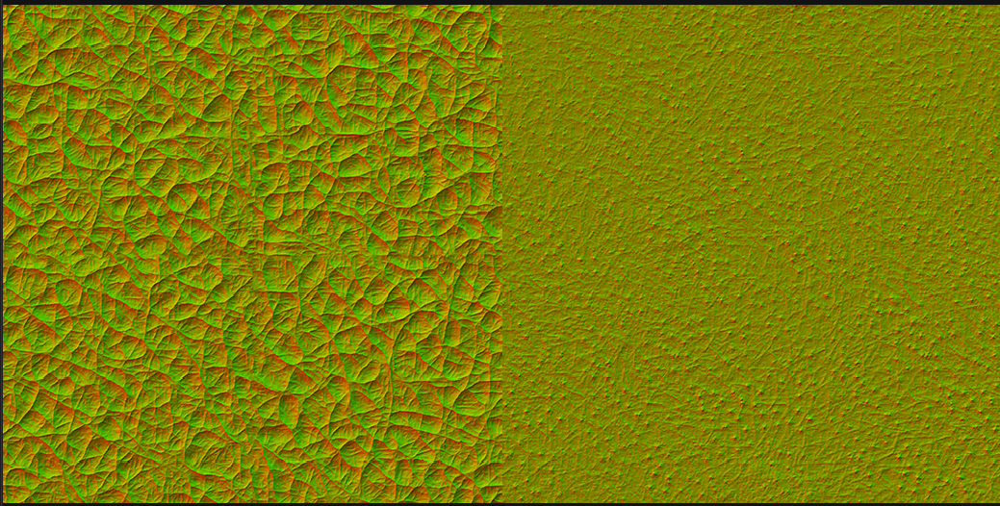
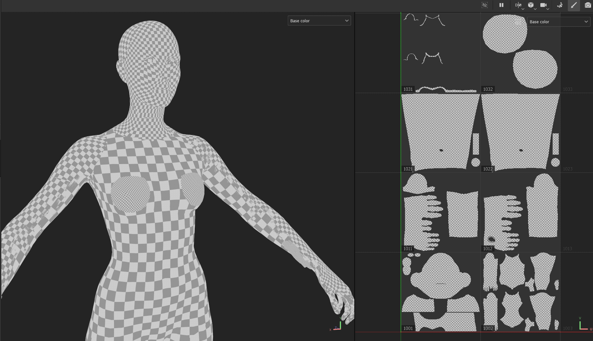

# Hair and skin material properties

## Summary

Published: Apr 05 2024 by [mana vortex](https://app.gitbook.com/u/NfZBoxGegfUqB33J9HXuCs6PVaC3 "mention")\
Last documented edit: Apr 05 2024 by [mana vortex](https://app.gitbook.com/u/NfZBoxGegfUqB33J9HXuCs6PVaC3 "mention")

This page gives an explanation of properties for the hair and skin shaders.&#x20;

### Wait, that's not what I want!

* You can look up different hairstyles and -colours under [hair.md](../../references-lists-and-overviews/cheat-sheet-head/hair.md "mention")
* You can look up information about skin under [cheat-sheet-body.md](../../references-lists-and-overviews/cheat-sheet-body.md "mention") and [cheat-sheet-head](../../references-lists-and-overviews/cheat-sheet-head/ "mention")
* For more information on how the hair shader works with reflection, see [vertex-color-and-hair.md](../../3d-modelling/hair-modeling-beginner-tutorial/vertex-color-and-hair.md "mention")
* Or you can learn more about [custom-tattoos-and-scars](../../../modding-guides/npcs/custom-tattoos-and-scars/ "mention")
* Or you can learn how to make a [custom hair profile](../../modding-tools/wolvenkit-blender-io-suite/wkit-blender-plugin-import-export.md#hair-profiles-.hp) with the [wolvenkit-blender-io-suite](../../modding-tools/wolvenkit-blender-io-suite/ "mention")

## Hair material

<table><thead><tr><th width="248"></th><th></th></tr></thead><tbody><tr><td>Strand_ID</td><td>Texture - Paths to an identity map (<code>.xbm</code>).  This is a greyscale texture where every masked hair strand has a single, unique greyscale value. <code>gradientEntriesID</code> colour gradient in hair profile (<code>.hp</code>) is mapped to this texture.</td></tr><tr><td>Strand_Gradient</td><td>Texture - Paths to a root map (<code>.xbm</code>). This is a greyscale texture with a vertical black to white gradient from root to tip. <code>gradientEntriesRootToTip</code> colour gradient in hair profile (<code>.hp</code>) is mapped to this texture.</td></tr><tr><td>Strand_Alpha</td><td>Texture - Paths to an opacity mask texture (<code>.xbm</code>). Black = fully transparent. White = fully opaque.</td></tr><tr><td>RoughnessScale</td><td>
Scalar with a decimal value between 0 and 1.0. Determines how rough or smooth hair material look. 0 = least rough (high specular, shiny reflection characteristics). 1.0 = most rough (high diffuse, matte reflection characteristics). Hair will look unnatural if this is too low (shiny).

See<a data-mention href="./#roughness-metalness">#roughness-metalness</a> for a picture
</td></tr><tr><td>RoughnessBias</td><td>Scalar with a decimal value between 0 and 1.0 that is applied between min and max <code>RoughnessScale</code>, which changes the suddenness of its onset.</td></tr><tr><td>AlphaCutoff</td><td></td></tr><tr><td>Flow</td><td>Texture - Paths to an anisotropic rotation map (<code>.xbm</code>). Anisotropy is a reflection characteristic of materials with fine grooves/ridges predominately following the same direction. The reflection will become blurred and stretched perpendicular to the direction of the grooves.</td></tr><tr><td>FlowStrength</td><td>Scalar with a decimal value between 0 and 1.0. Anisotropic materials have unique reflection characteristics as a result of their grooved/ridged surface. The more anisotropic a material is, the more its reflection is influenced (stretched/blurred) by the direction of its grooves/ridges. 0 = fully isotropic. 1.0 = fully anisotropic. Hair should have high or full anisotropy.</td></tr><tr><td>VertexColorStrength</td><td>Scalar with a decimal value between 0 and 1.0. Determines how much influence vertex colour has in the material. Vertex colour is a mesh attribute (colour, red channel). Cyberpunk hair meshes are vertex coloured red on the cap mesh and the innermost layer of hair clumps. They fade to black at the outermost layer of hair clumps. RGB 255, 0, 0 = max dull/dark. RGB 0, 0, 0 = max bright/glossy.</td></tr><tr><td>Scattering</td><td>Scalar with a decimal value between 0 and 1.0. Effect is not well understood at this time. Related to some internal light scattering function in hair shader. It affects the colour and reflection characterics of hair materials. There is some interaction between this and advanced game options for hair rendering. Specifically AlphaShifts R, TT, TRT (light scattering modes), single scattering and multiple scattering. Default values can be overridden with CET console commands. e.g. <code>GameOptions.SetFloat("Editor/Characters/Hair/AlphaShifts", "TRT", 0.375000</code></td></tr><tr><td>ShadowStrength</td><td></td></tr><tr><td>ShadowMin</td><td></td></tr><tr><td>ShadowMax</td><td></td></tr><tr><td>ShadowRoughness</td><td></td></tr><tr><td>DebugHairColor</td><td></td></tr><tr><td>HairProfile</td><td>HairParameters - Paths to a hair profile or <code>.hp</code> file. Hair profiles contain 2x arrays named <code>gradientEntriesID</code> and <code>gradientEntriesRootToTip</code>. Each array contains a set of colour values and gradient stop positions.  They are mapped to the greyscale identity and root maps respectively, which are blended to form the hair material's base colour. Cheap method to create a large variety of editable hair colour variations without the need to use large, colour textures.</td></tr></tbody></table>

## Skin material

<table><thead><tr><th width="263"></th><th></th></tr></thead><tbody><tr><td>Albedo</td><td>Texture - Paths to an albedo texture (<code>.xbm</code>). This texture is used to determine the base colour of skin. Most skin albedo maps are pale/caucasian and tinted darker tones via <code>TintColor.</code></td></tr><tr><td>SecondaryAlbedo</td><td>Texture - Paths to a secondary albedo texture  (<code>.xbm</code>) with alpha transparency, which is blended with <code>Albedo</code>. Intended for secondary colour details like freckles. Commonly used by texture frameworks to blend tattoos with <code>Albedo</code>.</td></tr><tr><td>SecondaryAlbedoInfluence</td><td></td></tr><tr><td>Normal</td><td>Texture - Paths to a primary global normal map (<code>.xbm</code>).</td></tr><tr><td>DetailNormal</td><td>Texture - Paths to a secondary global normal map (<code>.xbm</code>).  This is typically used for muscle/vein definition and is blended with primary normal.</td></tr><tr><td>Roughness</td><td>Scalar with a decimal value between 0 and 1.0. Determines how wet/shiny or dry/matte skin material appears. 0 = least rough (most wet/shiny). 1.0 = most roughness (most dry/matte). See <a data-mention href="./#roughness-metalness">#roughness-metalness</a> for a picture</td></tr><tr><td>DetailRoughnessBiasMin</td><td></td></tr><tr><td>DetailRoughnessBiasMax</td><td></td></tr><tr><td>MicroDetailUVScale01</td><td>Scalar - UV scale compensation factor for <code>microdetail_n01.xbm</code>.  See Fig. 1. Value is an integer between 0 and 100. A particular value is required for this detail normal map to tile seamlessly depending on the UV scale of the body part mesh. See Fig. 2.</td></tr><tr><td>MicroDetailUVScale02</td><td>Scalar - UV scale compensation factor for <code>microdetail_n02.xbm</code>. See Fig. 1. Value is an integer between 0 and 100. A particular value is required for this detail normal map to tile seamlessly depending on the UV scale of the body part mesh. See Fig. 2.</td></tr><tr><td>MicroDetail</td><td>Texture - Paths to a microdetail texture (<code>.xbm</code>). See Fig. 1. This is a tileable detail normal map, typically used for pore structures. There are 3x by default (<code>microdetail_n01.xbm</code>, <code>microdetail_n02.xbm</code> and a 2:1 combination of the two textures called <code>microdetail_n.xbm)</code>.</td></tr><tr><td>MicroDetailInfluence</td><td>Scalar with a decimal value between 0 and 1.0. Determines normal strength of <code>microdetail_n01</code> and <code>microdetail_n02</code>. See Fig 1.</td></tr><tr><td>TintColorMask</td><td></td></tr><tr><td>TintColor</td><td>Color - RGB uint8 colour value multiplied with the per pixel colour of <code>Albedo</code> and <code>SecondaryAlbedo</code> texture. Used to make all of the skin tone options in character creator (ca_almond, ca_senna, bl_dark etc).</td></tr><tr><td>TintScale</td><td></td></tr><tr><td>SkinProfile</td><td></td></tr><tr><td>Detailmap_Stretch</td><td></td></tr><tr><td>EmissiveMask</td><td></td></tr><tr><td>EmissiveEV</td><td></td></tr><tr><td>Detailmap_Squash</td><td></td></tr><tr><td>CavityIntensity</td><td></td></tr><tr><td>Bloodflow</td><td>Texture - Path to a bloodflow (vein) texture (<code>.xbm</code>).</td></tr><tr><td>BloodColor</td><td></td></tr><tr><td>DetailNormalInfluence</td><td></td></tr></tbody></table>

### Fig. 1 - Microdetail \_n.xbm

<figure><figcaption>
Left: Tiled by MicroDetailUVScale01 Right: Tiled by MicroDetailUVScale02
</figcaption></figure>

<figure><figcaption>
Player female average meshes with checkboard material showing differences in UV scale between body parts.
</figcaption></figure>
