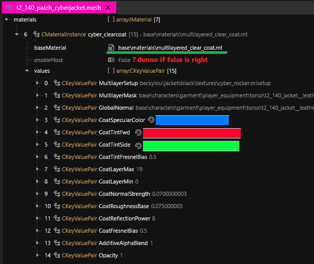
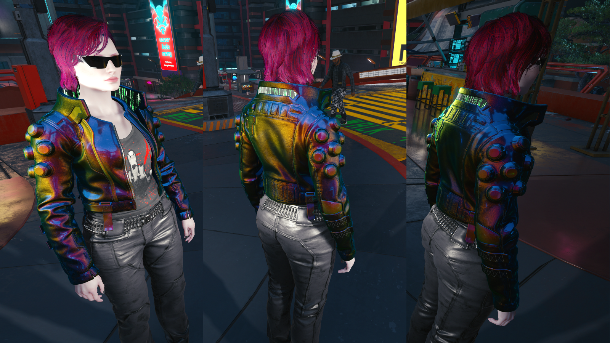
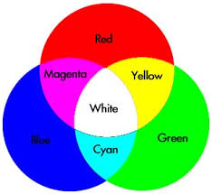

# Multilayered Material Properties

## Summary

**Created:** Jan 14 2024 by [manavortex](https://app.gitbook.com/u/NfZBoxGegfUqB33J9HXuCs6PVaC3 "mention")\
**Last documented update:** Apr 07 2024 by [manavortex](https://app.gitbook.com/u/NfZBoxGegfUqB33J9HXuCs6PVaC3 "mention")

This page documents multilayered shader properties.&#x20;

* For an **overview** of glass shaders, see [cheat-sheet-materials.md](../../references-lists-and-overviews/cheat-sheet-materials.md "mention")-> [#multilayered](../../references-lists-and-overviews/cheat-sheet-materials.md#multilayered "mention")
* For an **explanation** of material properties and further links, see [.](./ "mention")


If a layer with a greyscale mask is invisible, set MicroblendContrast in the `.mlsetup` to 1!


## Multilayered Material

For a full documentation, check the corresponding [page](../multilayered/).&#x20;

To set it up, use these keys for the "values" array of your material:

|                 |                                                                                                                        |
| --------------- | ---------------------------------------------------------------------------------------------------------------------- |
| GlobalNormal    | path\to\normal.xbm                                                                                                     |
| MultilayerMask  | path\to\mask.mlmask ([white file](../../references-lists-and-overviews/cheat-sheet-materials.md#white-multilayermask)) |
| MultilayerSetup | path\to\material.mlsetup                                                                                               |

<figure><figcaption>
an example multilayered material
</figcaption></figure>

## Material properties

### colorScale

Sets a color from within the [mltemplate](multilayered-material-properties.md#what-is-the-mltemplate) file. Hex codes corresponds to rows and columns in substance painter.

### material

Depot path to the base material [mltemplate](multilayered-material-properties.md#what-is-the-mltemplate) from which the surface inherits its properties (lightbreaking, subsurface scattering…).&#x20;

Example values:\
`base\surfaces\materials\paint\car_paint\car_paint_metallic_01.mltemplate`\
`base\surfaces\materials\metal\enameled_hq\enameled_hq_01_30.mltemplate`

### matTile

**Scaling** (tiling multiplier) of the material across the mesh. The higher the value, the smaller it is.

### metalLevelsIn

Clamps metalness **input** levels. This value corresponds to a (generated?) greyscale texture across the entire mesh.

### metalLevelsOut

Clamps metalness **output** levels. This value corresponds to a (generated?) greyscale texture across the entire mesh.

### normalStrength

Applies or ignores the base mesh's normal map to this layer. This value can be greater than 1!

### offsetU

For logos: X-offset on the texture. Used for e.g. targeting a certain label.

### offsetV

For logos: Y-offset on the texture. Used for e.g. targeting a certain label.

### opacity

Transparency of the layer, 0 means that it isn't displayed, 1 means that it's fully visible.

### roughLevelsIn

TODO

### roughLevelsOut

Determines the roughness of a material

<figure><figcaption>
How roughness affects a material (the colour was not changed)
</figcaption></figure>

## Microblend properties


You can only use microblends if this layer's mask is not fully white.


### mbTile

Like [#mattile](multilayered-material-properties.md#mattile "mention"), this determines the scaling of the microblend. The higher the value, the smaller it is.

### microblend

Depot path to the base microblend texture (xbm), a seamless pattern which will be projected on the surface. Think of an extra normal map that tiles across a layer.

### microblendContrast

A crossfade between the layer mask and the microblend mask (the black parts of the microblend texture). If you set this to >=1, then the layer will be blocked out where the microblend texture is black.

This requires the xbm's AlphaChannel (transparency) to be set up.

### microblendNormalStrength

Like [#normalstrength](multilayered-material-properties.md#normalstrength "mention") for the microblend.

### microblendOffsetU

X-offset for the microblend texture.&#x20;

### microblendOffsetV

Y-offset for the microblend texture

## multilayered\_clear\_coat.mt

Discovered and shared by [Rebecca](https://discord.com/channels/717692382849663036/1082772930892664943/1358835907905589431), thanks a tonne!

Using ClearCoat lets you put additional hues over an mlsetup:&#x20;

<figure><figcaption></figcaption></figure>

<figure><figcaption></figcaption></figure>

Please note that this uses light colour mixing!

<figure><figcaption></figcaption></figure>
