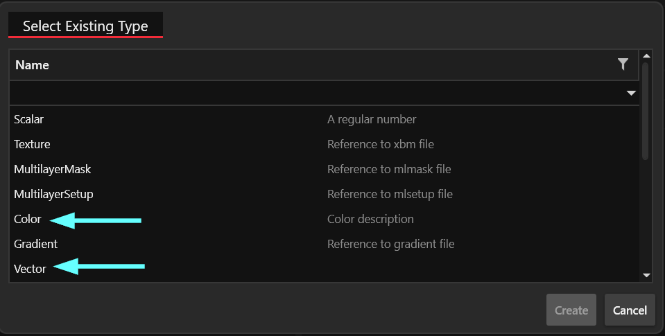

# Tinting textures in Wolvenkit

## Summary

**Created:** Jul 18 2025 by [mana vortex](https://app.gitbook.com/u/NfZBoxGegfUqB33J9HXuCs6PVaC3 "mention")\
**Last documented update:** Jul 18 2025 by [mana vortex](https://app.gitbook.com/u/NfZBoxGegfUqB33J9HXuCs6PVaC3 "mention")

This page will show you how to create colour variants of textured materials without recolouring textures.

## The problem

Who doesn't know it? You have a textured shirt, and you want to create multiple colour variants.&#x20;

Most game engines "solve" this by including a different-coloured texture. This leads to huge mod files and [bad performance](../../3d-modelling/on-4k-textures-and-high-poly-meshes.md#texture-resolution-and-visual-return) and thus, we do not like it.

Fortunately, Cyberpunk materials are smarter than this.

## The solution

Many shaders offer a parameter to **tint** textures on-the-fly by setting a material property:

<figure><figcaption>
<code>base\characters\garment\player_equipment\torso\t2_115_jacket__military\t2_115_pma_jacket__military.mesh</code>
</figcaption></figure>

As you can see, both materials are using the same textures — the tinting happens via `BaseColorScale` parameter. You can use that to avoid texture duplication.

See [#supporting-materials](tinting-textures-in-wolvenkit.md#supporting-materials "mention") for a list.

### How to add the parameter

1. Select the material's **values** array&#x20;
2. In the panel on the right, click the yellow + button
3. In the "Select Existing Type" popup, select Vector or Color

<figure><figcaption></figcaption></figure>

4. If your parameter is a vector, **change its name** to `BaseColorScale` or `HSV_Mod`, then re-select the node in Wolvenkit to see the colour editor

## Supporting materials

### Paramter: BaseColorScale

<table><thead><tr><th width="530.3333740234375">Material</th><th>Parameter type</th></tr></thead><tbody><tr><td>cyberware_animation</td><td>Color</td></tr><tr><td>device_diode</td><td>Color</td></tr><tr><td>devide_diode_multi_state</td><td>Color</td></tr><tr><td>metal_base_alpha_animated</td><td>Vector</td></tr><tr><td>metal_base_atlas_animation</td><td>Color</td></tr><tr><td>metal_base_glitter</td><td>Color</td></tr><tr><td>blackwall_blendable_metal_base</td><td>Vector</td></tr><tr><td>3d_map_cubes</td><td>Color</td></tr><tr><td>3d_map_terrain</td><td>Color</td></tr><tr><td>cable</td><td>Vector</td></tr><tr><td>cloth_mov</td><td>Vector</td></tr><tr><td>cloth_tarps_pbr</td><td>Color</td></tr><tr><td>cloth_tarps_pbr_no_vat</td><td>Color</td></tr><tr><td>cloth_wind_proxy</td><td>Vector</td></tr><tr><td>decal_forward</td><td>Color</td></tr><tr><td>decal_terrain_projected</td><td>Vector</td></tr><tr><td>earth_globe</td><td>Color</td></tr><tr><td>emissive_control</td><td>Color</td></tr><tr><td>glass_cracked_edge</td><td>Vector</td></tr><tr><td>ice_ver_mov_translucent</td><td>Color</td></tr><tr><td>lights_interactive</td><td>Vector</td></tr><tr><td>metal_base_bink</td><td>Color</td></tr><tr><td>metal_base_det</td><td>Vector</td></tr><tr><td>metal_base_det_dithered</td><td>Vector</td></tr><tr><td>metal_base_dithered</td><td>Vector</td></tr><tr><td>metal_base_gradientmap_recolor</td><td>Vector</td></tr><tr><td>metal_:base_parallax</td><td>Vector</td></tr><tr><td>metal_base_trafficlight_proxy</td><td>Vector</td></tr><tr><td>neon_parallax</td><td>Vector</td></tr><tr><td>presimulated_particles</td><td>Color</td></tr><tr><td>proxy_ad</td><td>Color</td></tr><tr><td>q116_mikoshi_floor</td><td>Color</td></tr><tr><td>q202_lake_surface</td><td>Color</td></tr><tr><td>road_debug_grid</td><td>Color</td></tr><tr><td>speedtree_3d_v8_onesided_gradient_recolor</td><td>Vector</td></tr><tr><td>spline_deformed_metal_base</td><td>Color</td></tr><tr><td>vehicle_lights</td><td>Vector</td></tr><tr><td>ver_mov</td><td>Color</td></tr><tr><td>ver_skinned_mov</td><td>Color</td></tr><tr><td>ver_skinned_mov_parade</td><td>Color</td></tr><tr><td>windows_parallax_interior_proxy_buiffer</td><td>Color</td></tr><tr><td>window_very_long_distance</td><td>Color</td></tr><tr><td>worldspace_grid</td><td>Color</td></tr></tbody></table>

### Parameter: HSV\_Mod

<table><thead><tr><th width="529.3333129882812">Material name</th><th>Parameter type</th></tr></thead><tbody><tr><td>metal_base_blackbody</td><td>Vector</td></tr><tr><td>parallaxscreen</td><td>Vector</td></tr><tr><td>fx_mesh_decal__blackbody</td><td>Vector</td></tr></tbody></table>
