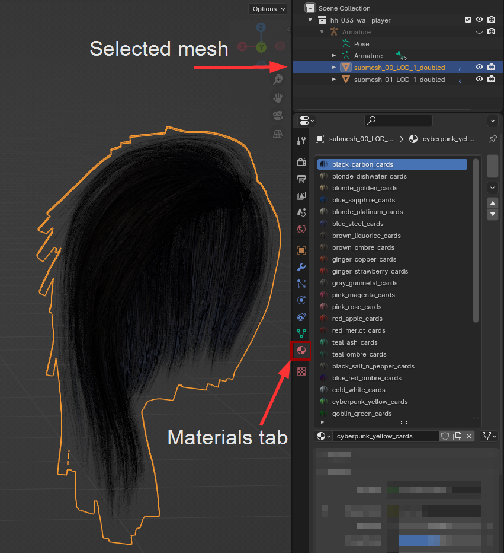
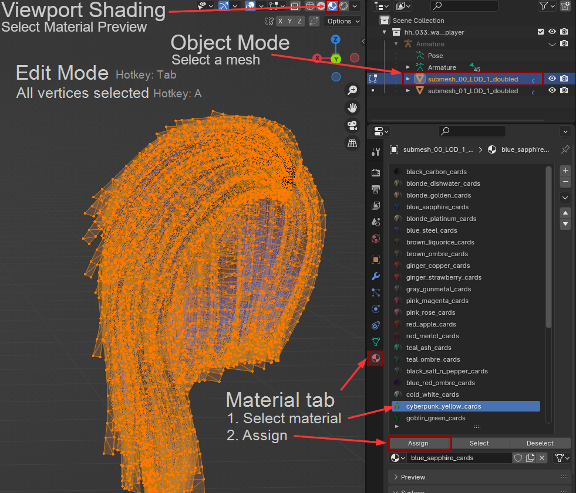

# Cyberpunk Shaders in Blender

#### Summary

**Published:** Jan 20 2024 by [manavortex](https://app.gitbook.com/u/NfZBoxGegfUqB33J9HXuCs6PVaC3 "mention")\
**Last documented update:** Feb 19 2025 by [manavortex](https://app.gitbook.com/u/NfZBoxGegfUqB33J9HXuCs6PVaC3 "mention")

This page will teach you how to get Cyberpunk materials into Blender, **baking** the materials to textures. You can use the results for e.g. porting the items to Unreal Engine (these steps won't be covered here).

### Wait, this is not what I want!

* If this is your first time in Blender, check out [blender-getting-started](../3d-modelling/blender-getting-started/ "mention")

## How to get Cyberpunk Shaders into Blender?

Most Cyberpunk shaders are procedurally generated from [mlsetups](multilayered/#what-is-the-mlsetup) and [mlmasks](multilayered/#what-is-the-mlmask). As such, there aren't any textures that you can import.&#x20;

So how is everyone doing it?

This is where the [wolvenkit-blender-io-suite](../modding-tools/wolvenkit-blender-io-suite/ "mention") comes in:&#x20;

* On [export](../modding-tools/wolvenkit-blender-io-suite/wkit-blender-plugin-import-export.md#export-from-wolvenkit), Wolvenkit creates a `.material.json` file containing the `.mesh` file's [material setup](../files-and-what-they-do/file-formats/3d-objects-.mesh-files/#material-assignment) in a machine-readable form.&#x20;
* When [importing a .glb](../modding-tools/wolvenkit-blender-io-suite/wkit-blender-plugin-import-export.md#importing-into-blender) into Blender, the plugin reads this file and automatically generates a list of materials. After selecting a mesh, you can see all available options in the Materials tab:

<figure><figcaption>
You need to select a mesh first
</figcaption></figure>

## Blender: Changing the appearance

To change the assigned material, complete the following steps:

1. Select a mesh in Object mode
2. Switch to Edit Mode (hotkey: `Tab`)
3. Select all vertices (hotkey: `A`)
4. In the list on the material tab, select the appearance that you want to display
5. Under the list, click "Apply"
6. Be sure to select "Material Preview" as the Viewport Shading Method (see the screenshot below)

<figure><figcaption></figcaption></figure>

## Blender: Baking Cyberpunk Shaders

### Video guide


by Simarilius, thank you <3&#x20;



by island dancer, thank you <3


## Troubleshooting: I can't import my materials!

Please see the [wkit-blender-plugin-troubleshooting.md](../modding-tools/wolvenkit-blender-io-suite/wkit-blender-plugin-troubleshooting.md "mention") page.
