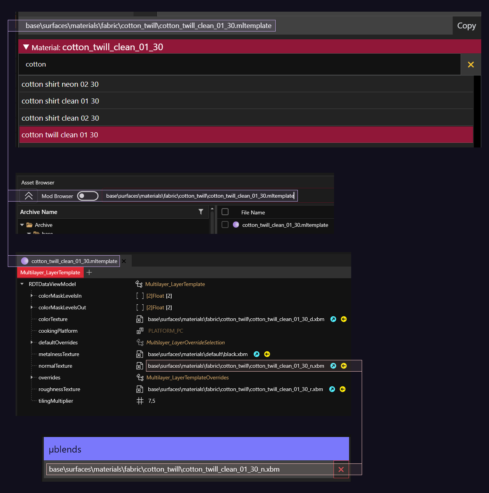

# Blending materials for more gooder colours

## The Problem

The selection of materials and the available colours for each material in Cyberpunk 2077 is very limited and often underwhelming. The colours the game offers by default lack saturation and are usually either too light or too dark. The way of getting around this is layering different materials of different colours at varying opacity.

## The Preparation

**The Tools**

* [WolvenKit ](https://github.com/WolvenKit/Wolvenkit/)- setup instructions [here](https://wiki.redmodding.org/wolvenkit/getting-started/download)
* [MLSETUP Builder](https://github.com/Neurolinked/MlsetupBuilder) - setup instructions [here](https://wiki.redmodding.org/cyberpunk-2077-modding/for-mod-creators/modding-tools/mlsetup-builder), from here on out referred to as MLSB
* [Red Hot Tools](https://github.com/psiberx/cp2077-red-hot-tools/) - setup instructions [here](https://wiki.redmodding.org/cyberpunk-2077-modding/for-mod-creators/modding-tools/redhottools)
* [Equipment-EX](https://www.nexusmods.com/cyberpunk2077/mods/6945)
* [Photoshop](https://www.adobe.com/products/photoshop.html) (or another image editor of your choice if you need to edit an `.mlmask`)
* [Blender](https://www.blender.org/) (if you want to create an `.mlmask` from scratch)

For this to work properly, you need two layers inside the `.mlmask`, each of which needs to cover the same part of your `.mesh` you want to change. The lower layer needs to be pure white, the other one on top of that at 50% grey (`rgb(50%,50%,50%)`). This way, the materials of each layer will blend into each other allowing _much_ greater control over shade, brightness, saturation, and shininess.

If your blue denim lacks saturation, slap a second layer on top of it. Give that second layer the same material and colour and both will amplify each other.

The default `.mlmask` found inside your `.mesh` might already contain the layers described above. If not, you'll likely get away with editing the layers in Photoshop. To learn more about `.mlmask` files go [here](https://wiki.redmodding.org/cyberpunk-2077-modding/for-mod-creators/materials/multilayered#what-is-the-mlmask) and to learn how to create one yourself using Blender, go [here](https://wiki.redmodding.org/cyberpunk-2077-modding/for-mod-creators/modding-guides/textures-and-luts/custom-multilayermasks).

## The Colour

For a specific example, we'll try to get yellow to look nice as I find yellow to be one of the more finicky colours to get to look "correct" within Cyberpunks shader. Here, I'm using `velvet_clean_01_30` with `rgb(77%,22%,8%)` as the base and `latex_neon_01_30` with `rgb(100%,100%,0%)` on top of it. By itself,`velvet_clean_01_30` lacks saturation and its selection of yellows is very limited. `latex_neon_01_30` on the other hand includes a pretty decent shade of yellow, but also lacks saturation—even though the name implies the opposite. I find that Cyberpunks shader often renders yellows to be more green than I'd expect them to be. Which is why I'm using an orange base layer.

<table data-full-width="false"><thead><tr><th align="center">velvet_clean_01_30 by itself</th><th align="center">latex_neon_01_30 by itself</th><th align="center">together</th></tr></thead><tbody><tr><td align="center"></td><td align="center"></td><td align="center"></td></tr></tbody></table>

## The Texture

This method of layering materials unfortunately drastically reduces the effect of the `normals` of each material. `normals` become "filled in" the more of them you stack. A workaround is to mis-appropriate a materials `normals` as a `microblend` for another material.

1. Copy the path of the `.mltemplate` of a material whose texture you want to use from MLSB.
2. Paste the path into WolvenKits Asset Browser and hit `Enter` to search.
3. Right click on the `.mltemplate` and select "Open without adding to project".
4. Copy the `DepotPath` of the `normalTexture` and paste it into the `µblends` field in MLSB.
5. In the µblends Parameters box, you can mess around with its size (`Tiles`, higher number means smaller texture—it gets tiled more often across the same surface area), opacity (`contrast`) and intensity (`normals`, can be higher than `1`).

<figure><figcaption>
using cotton_twill_clean_01_30_n.xbm as a microblend
</figcaption></figure>

<figure><figcaption>
cotton_twill_clean_01_30_n.xbm in-game
</figcaption></figure>

`normals` of `µblends` can also be inverted by setting their intensity to a negative number. this will, for example, turn a relief from pointing outwards to pointing inwards. This is sometimes necessary when using the `normals` from an `mltemplate` as a `µblend`, but creative choice takes precendence, of course.

| µblend normals at 1.0                                            | µblend normals at -1.0                                           |
| ---------------------------------------------------------------- | ---------------------------------------------------------------- |
|                |                |
|  |  |

## The Opacity

Cyberpunk allows layers in your `mlsetup` to exceed `Opacity 1.0`. What this does is amplify your current layer. This is very useful for camouflage materials such as `denim_camo_01_30`. This material looks faint and lacks saturation by default. This can be mitigated by setting the `Opacity` to `3.0`. For `denim_camo_01_30` I'd also recommend using olive green as the base colour for your camo layer in the `mlsetup`.

<figure><figcaption>
denim_camo_01_30 at Opacity 3 to enhance colour and pattern. Normals set to undefined. Texture intensity is controlled via µblend.
</figcaption></figure>

| ↓ Green base, opacity 3.0                          | ↓ Green base, opacity 1.0                          |
| -------------------------------------------------- | -------------------------------------------------- |
|  |  |
| ↓ Grey base, opacity 3.0                           | ↓ Grey base, opacity 1.0                           |
|   |   |

## The Shininess

This tutorial won't go into the technical details of how reflections and roughness work (mainly because I don't get it myself), but for more information, see [here](https://wiki.redmodding.org/cyberpunk-2077-modding/for-mod-creators/materials/configuring-materials#shared-properties). Shininess is mainly controlled through the Rough Out value in MLSB. The dropdown contains a list of properties inherent to each material.

<figure><figcaption></figcaption></figure>

If you want your material to be matte, pick a value where the two numbers are roughly equal. For `velvet_clean_01_30` this would be `0.502,0.498`. This might end up looking a bit flat though. An alternative with more depth would be `0.1569,0.8431`.

<table data-full-width="false"><thead><tr><th align="center">velvet_clean_01_30 @ 0.502,0.498</th><th align="center">velvet_clean_01_30 @ 0.1569,0.8431</th></tr></thead><tbody><tr><td align="center"></td><td align="center"></td></tr></tbody></table>

If you want your material to be very shiny, pick a value where the first number is low, and the second is zero.

<figure><figcaption>
velvet_clean_01_30 with Roughness Out set to 0.1373,0.0
</figcaption></figure>

Confusingly, the opposite might be true, as well. In the following example, `0.6667,0.3333` is shinier than `0.3333,0.6667`. It's quite illustrative of the interaction between the two numbers because they're the exact opposites.

|                velvet\_clean\_01\_30 @ 0.6667,0.3333                |                velvet\_clean\_01\_30 @ 0.3333,0.6667                |
| :-----------------------------------------------------------------: | :-----------------------------------------------------------------: |
|  |  |

## The Versatility

Most of my `mlsetups` bascially exclusively contain layers of `velvet_clean_01_30` or a similar cloth material with different `µblends`. Exceptions are `latex_neon_01_30` for anything yellow as described above, and any metals. Although you can colourise those with an additional layer of `velvet_clean_01_30`.

| Item                                                                  | MLSB Screenshot                                                  |
| --------------------------------------------------------------------- | ---------------------------------------------------------------- |
|  |  |
|  |  |
|  |  |

## The Outro

Once you've found material-colour-texture-shininess combinations you like, I'd recommend writing them down somehwere to be re-used across your mods. Good starting points for base materials are `velvet_clean_01_30`, `spandex_clean_01_30`, and `nylon_metallic_01_30`. All of these are very versatile because they offer a broad range of colours and levels of shininess. The first two of those also work very well as materials to be used on the top layer. `canvas_clean_01_30` and `denim_clean_01_30` have lovely textures. For reference, [this page](https://wiki.redmodding.org/cyberpunk-2077-modding/for-mod-creators/materials/multilayered/multilayered-previews) contains previews for _all_ materials available in Cyberpunks shader. There's also a downloadable `.zip` in there which is useful to keep on hand when you're messing with materials.


If you create your own material combinations, expect a lot of trial and error and bring a lot of patience.


## The Addendum

To quickly check how your changes look in-game, you can use [Red Hot Tools](https://github.com/psiberx/cp2077-red-hot-tools/).

1. Create an outfit using your item, save it with [Equipment-EX](https://www.nexusmods.com/cyberpunk2077/mods/6945) and **un-equip** it
2. Enter Photo Mode, `Alt + Tab` over to MLSB, and make some changes.
3. Export the `.json` and import the `.mlsetup` in WolvenKit. Click on "Hot Reload" in the toolbar.
4. Switch back to the game and, while still in Photo Mode, switch to your saved outfit.
5. Your changes should show up on your item. Switch back to **no outfit** again, make more changes in MLSB, export, import, Hot Reload, rinse and repeat.
