# Multilayered: Previews

## 3D Rendered Previews

@jato on the [Cyberpunk 2077 Modding Community Discord server](https://discord.gg/Epkq79kd96) has created 3D rendered previews as `.jpeg` files of all the `.mlsetups` in the game. Original post can be found [here](https://discord.com/channels/717692382849663036/1021790625265369218). The following list has been generated from these previews. A `.zip` is also [hosted](https://github.com/CDPR-Modding-Documentation/Cyberpunk-Modding-Docs/blob/main/.gitbook/assets/MLTEMPLATE_previews.zip) on this Wiki.


More accurate previews rendered in-game (check [below](./#assorted-misc)) can be created with the [Material Preview AMM Prop](https://www.nexusmods.com/cyberpunk2077/mods/10515).


|                            aluminium\_annodised                            |                             aluminium\_bare\_01\_300                             |                               aluminium\_brushed\_01\_300                              |
| :------------------------------------------------------------------------: | :------------------------------------------------------------------------------: | :------------------------------------------------------------------------------------: |
| 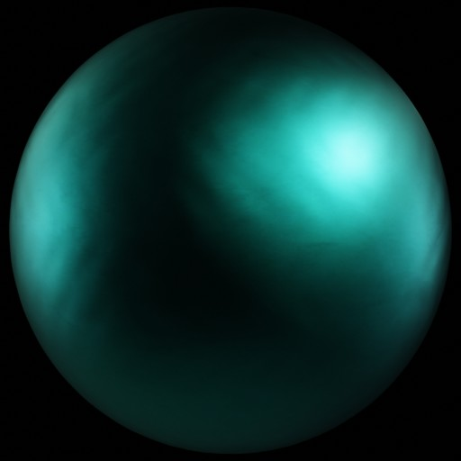 | 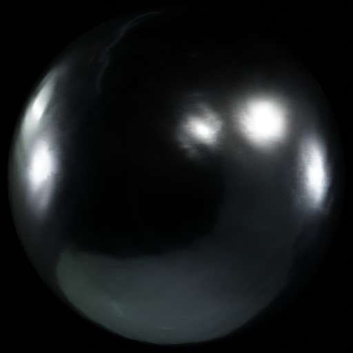 | 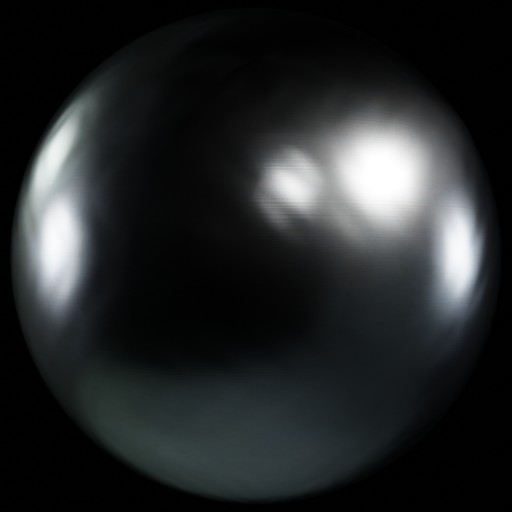 |

|                             aluminium\_old\_01\_300                            |                               aluminium\_polished\_01\_300                               |                                aluminium\_rolled\_annodised                               |
| :----------------------------------------------------------------------------: | :--------------------------------------------------------------------------------------: | :---------------------------------------------------------------------------------------: |
| 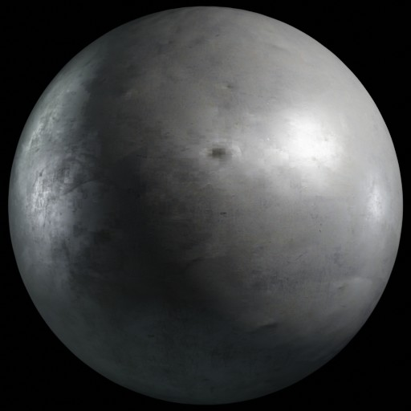 | 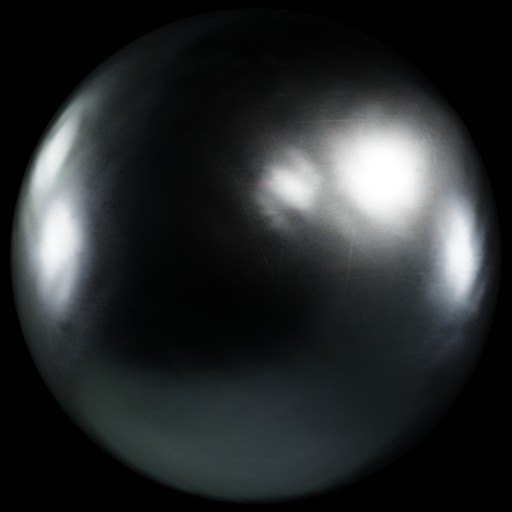 |  |

|                                 aluminium\_rolled\_bare\_01\_300                                |                                 aluminium\_rolled\_rough\_01\_300                                 |                              aluminium\_rough\_01\_300                             |
| :---------------------------------------------------------------------------------------------: | :-----------------------------------------------------------------------------------------------: | :--------------------------------------------------------------------------------: |
| 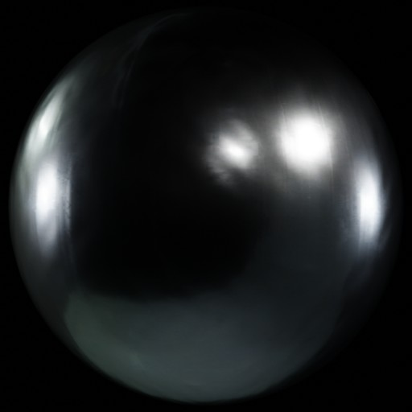 | 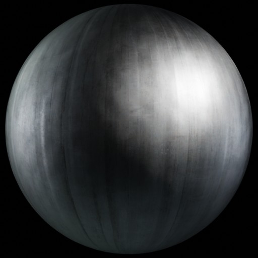 | 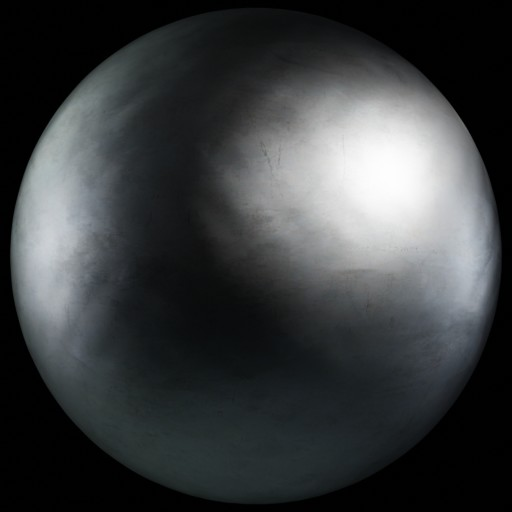 |

|                            asphalt\_old\_01\_300                           |                                 asphalt\_old\_fractured\_01\_300                                |                                asphalt\_old\_patches\_01\_300                               |
| :------------------------------------------------------------------------: | :---------------------------------------------------------------------------------------------: | :-----------------------------------------------------------------------------------------: |
| 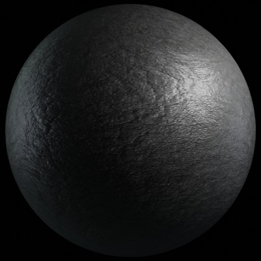 | 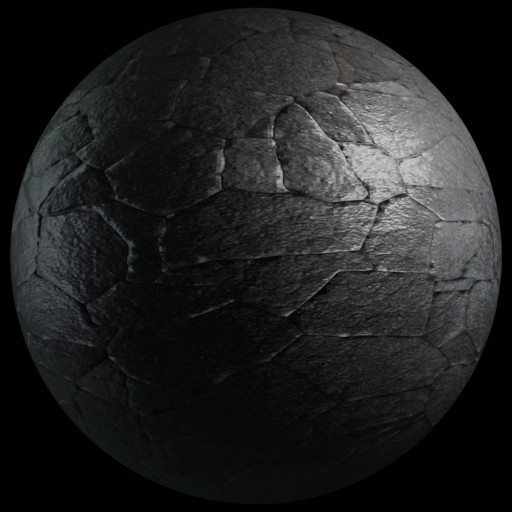 | 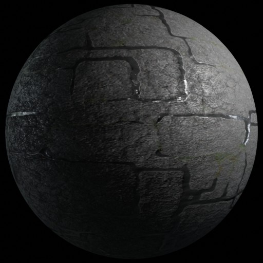 |

|                             asphalt\_paint\_01\_300                            |                            asphalt\_road\_01\_300                            |                                asphalt\_road\_damaged\_01\_300                                |
| :----------------------------------------------------------------------------: | :--------------------------------------------------------------------------: | :-------------------------------------------------------------------------------------------: |
| 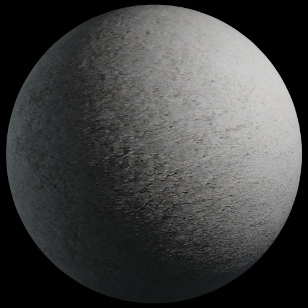 | 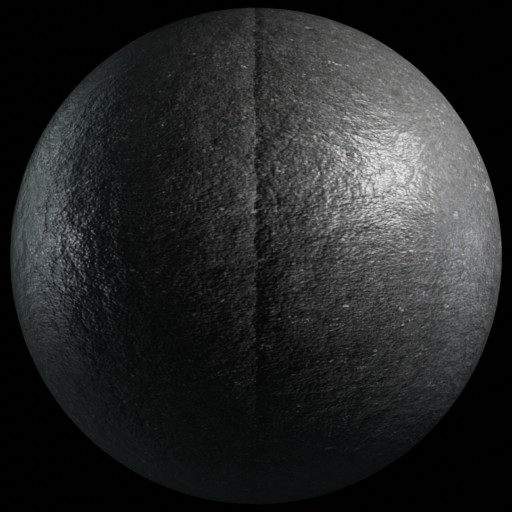 | 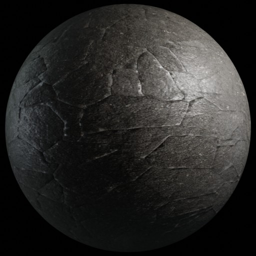 |

|                              asphalt\_road\_new\_01\_300                              |                              asphalt\_road\_old\_01\_300                              |                             asphalt\_tires\_01\_300                            |
| :-----------------------------------------------------------------------------------: | :-----------------------------------------------------------------------------------: | :----------------------------------------------------------------------------: |
| 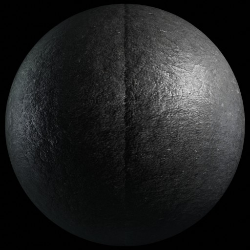 | 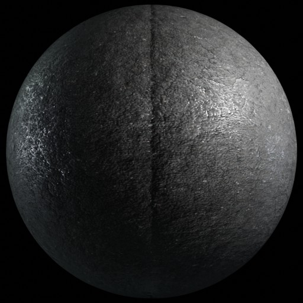 | 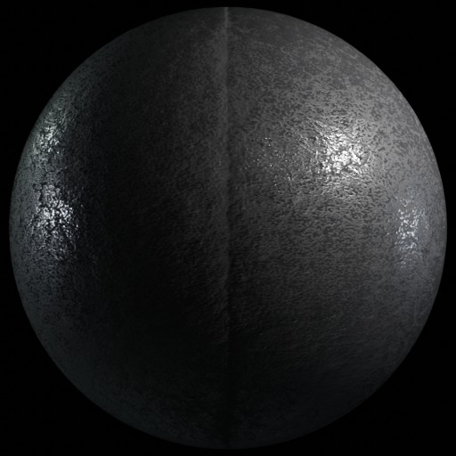 |

|                           blood\_smooth\_1\_30                           |                           brass\_bare\_01\_300                           |                             brass\_brushed\_01\_300                            |
| :----------------------------------------------------------------------: | :----------------------------------------------------------------------: | :----------------------------------------------------------------------------: |
| 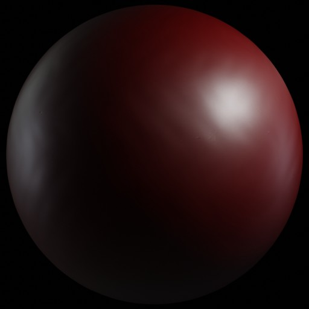 | 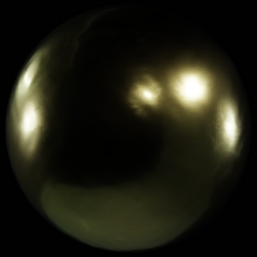 |  |

|                           brass\_old\_01\_300                          |                             brass\_polished\_01\_300                             |                               brass\_rolled\_bare\_01\_300                              |
| :--------------------------------------------------------------------: | :------------------------------------------------------------------------------: | :-------------------------------------------------------------------------------------: |
|  | 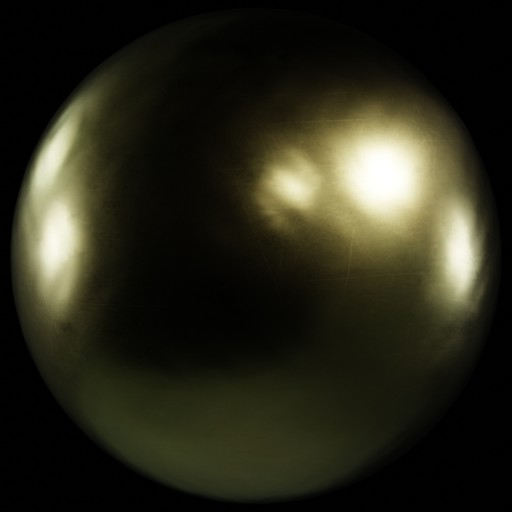 | 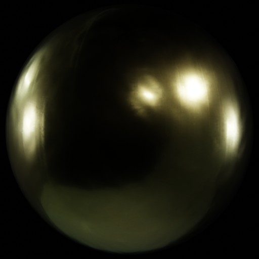 |

|                               brass\_rolled\_rough\_01\_300                               |                            brass\_rough\_01\_300                           |                               bricks\_old\_damaged\_01\_200                               |
| :---------------------------------------------------------------------------------------: | :------------------------------------------------------------------------: | :---------------------------------------------------------------------------------------: |
| 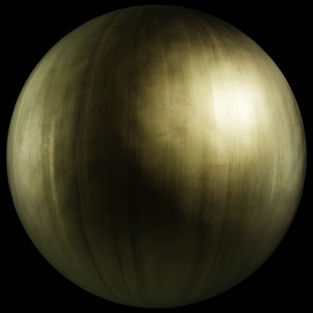 | 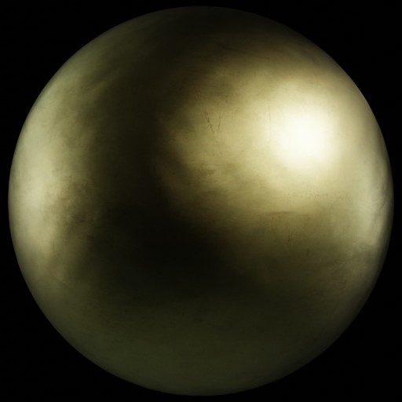 |  |

|                               bricks\_old\_painted\_01\_200                               |                              bricks\_old\_rough\_01\_200                              |                            bronze\_bare\_01\_300                           |
| :---------------------------------------------------------------------------------------: | :-----------------------------------------------------------------------------------: | :------------------------------------------------------------------------: |
| 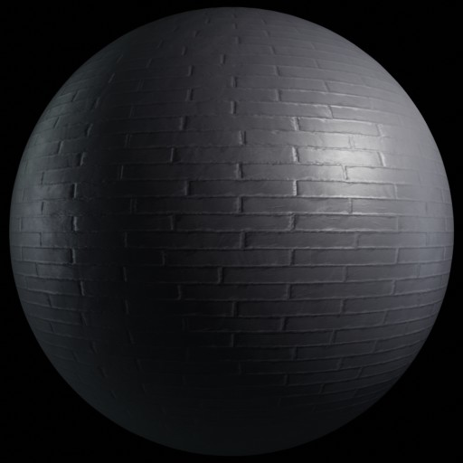 | 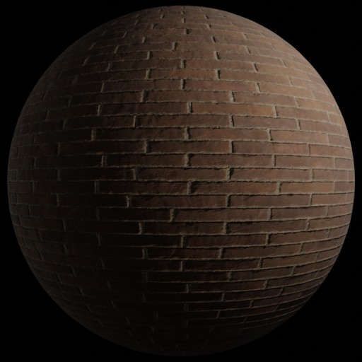 |  |

|                           bronze\_old\_01\_300                           |                              bronze\_polished\_01\_300                             |                                 bronze\_roof\_tile\_bare\_01\_300                                |
| :----------------------------------------------------------------------: | :--------------------------------------------------------------------------------: | :----------------------------------------------------------------------------------------------: |
| 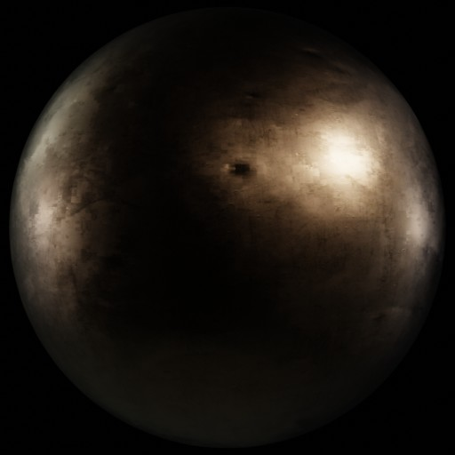 |  | 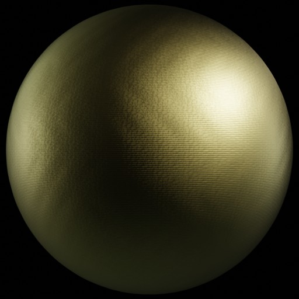 |

|                            bronze\_rough\_01\_300                            |                            canvas\_clean\_01\_30                           |                             car\_paint\_metallic\_01                             |
| :--------------------------------------------------------------------------: | :------------------------------------------------------------------------: | :------------------------------------------------------------------------------: |
| 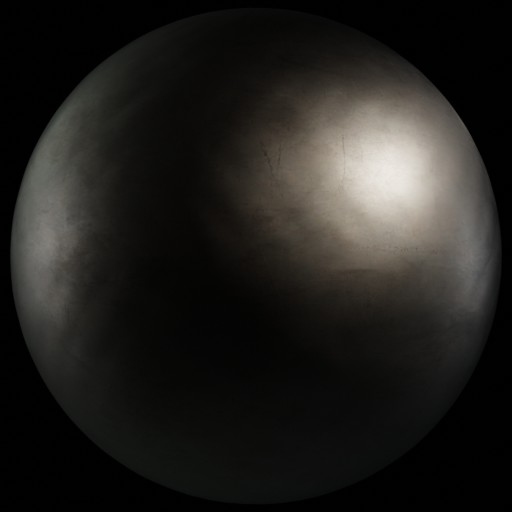 | 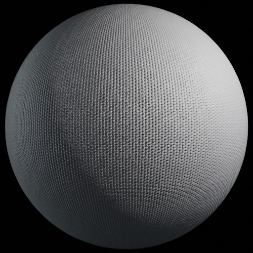 | 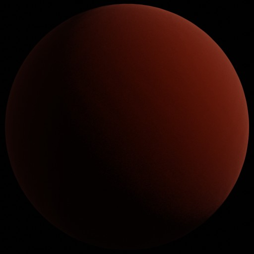 |

|                            carbon\_fiber\_01\_30                           |                                  carpet\_office\_felt\_clean\_01\_300                                  |                                carpet\_ribbed\_clean\_01\_300                               |
| :------------------------------------------------------------------------: | :----------------------------------------------------------------------------------------------------: | :-----------------------------------------------------------------------------------------: |
| 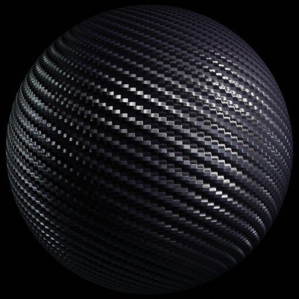 | 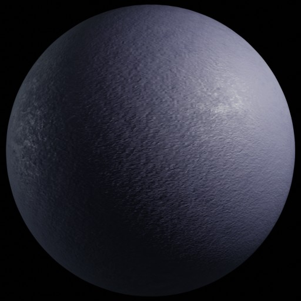 | 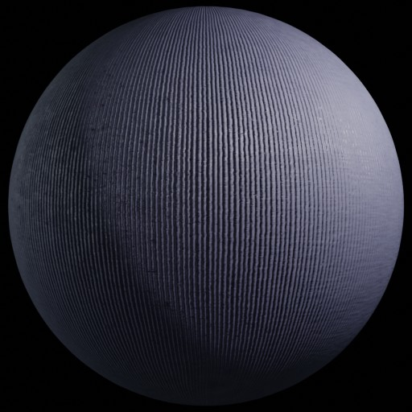 |

|                               carpet\_thick\_clean\_01\_300                               |                                carpet\_underlay\_old\_01\_300                               |                            ceramic\_6x6\_01\_300                           |
| :---------------------------------------------------------------------------------------: | :-----------------------------------------------------------------------------------------: | :------------------------------------------------------------------------: |
|  | 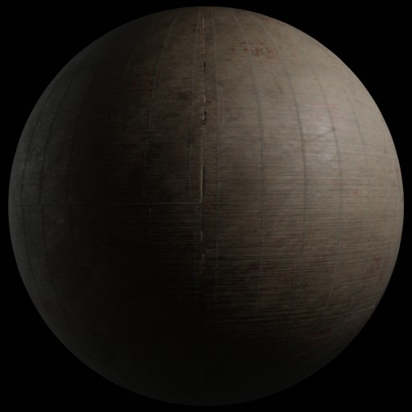 | 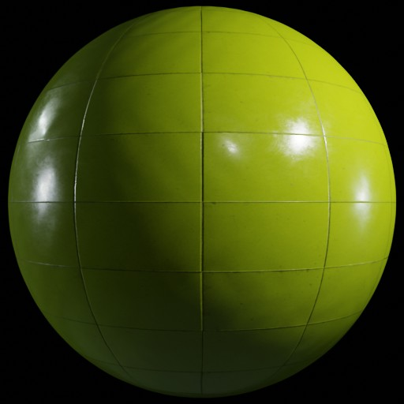 |

|                                ceramic\_6x6\_damaged\_01\_300                               |                            ceramic\_6x12\_01\_300                            |                                ceramic\_6x12\_damaged\_01\_300                                |
| :-----------------------------------------------------------------------------------------: | :--------------------------------------------------------------------------: | :-------------------------------------------------------------------------------------------: |
|  | 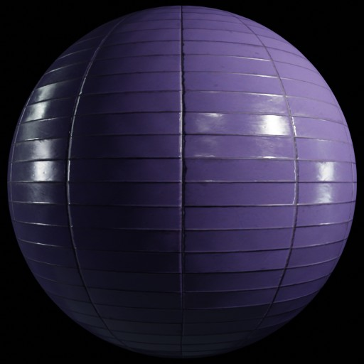 |  |

|                             ceramic\_16x16\_01\_300                            |                                ceramic\_16x16\_01\_metal\_300                               |                                ceramic\_16x16\_dirty\_01\_300                               |
| :----------------------------------------------------------------------------: | :-----------------------------------------------------------------------------------------: | :-----------------------------------------------------------------------------------------: |
| 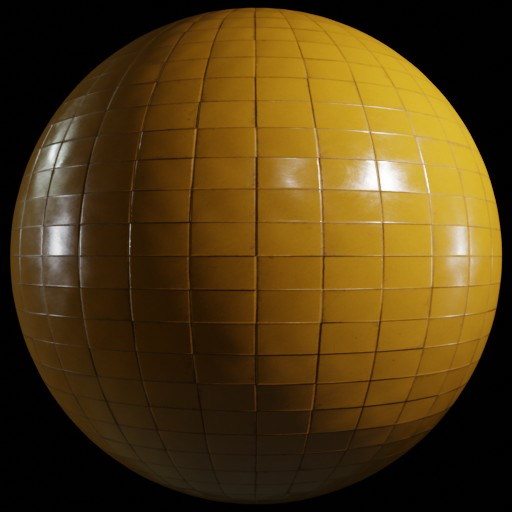 | 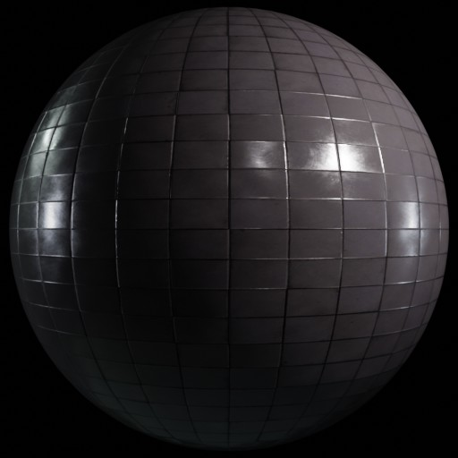 |  |

|                                 ceramic\_16x16\_missing\_01\_300                                |                            cinderblock\_01\_300                           |                                cinderblock\_painted\_01\_300                               |
| :---------------------------------------------------------------------------------------------: | :-----------------------------------------------------------------------: | :----------------------------------------------------------------------------------------: |
| 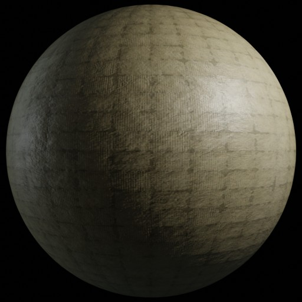 | 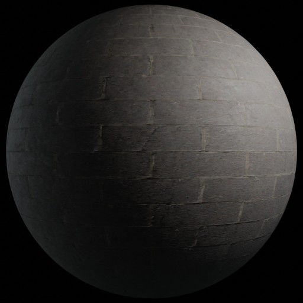 | 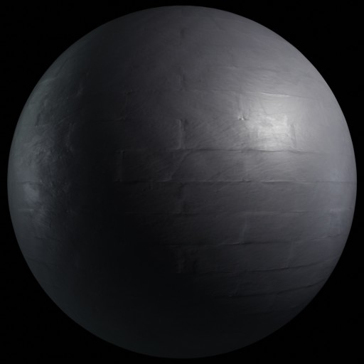 |

|                            circuit\_board\_01\_30                            |                         cliff\_rock\_01                         |                         cliff\_rock\_02                         |
| :--------------------------------------------------------------------------: | :-------------------------------------------------------------: | :-------------------------------------------------------------: |
| 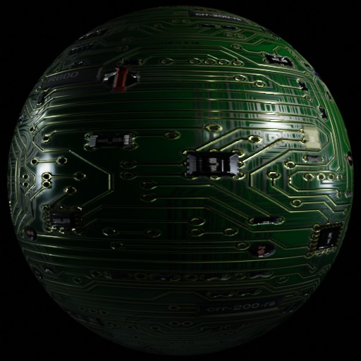 | 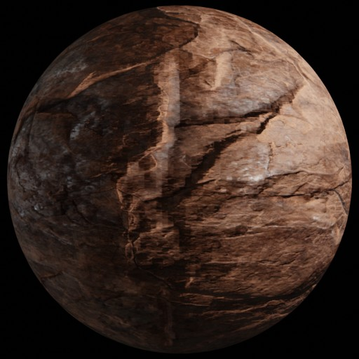 | 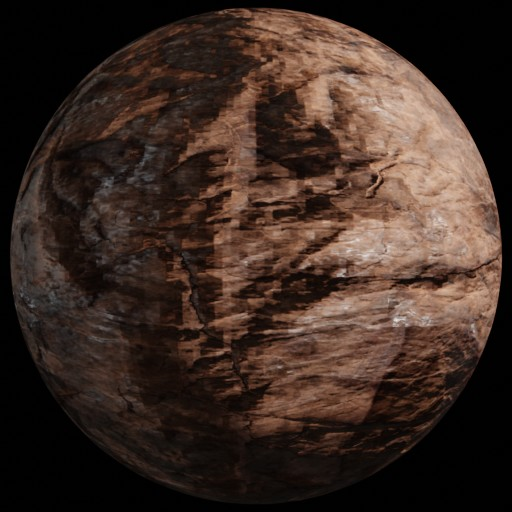 |

|                         cliff\_rock\_03                         |                                colour\_checker\_plastic\_tech                                |                                concrete\_cast\_rough\_01\_300                               |
| :-------------------------------------------------------------: | :------------------------------------------------------------------------------------------: | :-----------------------------------------------------------------------------------------: |
| 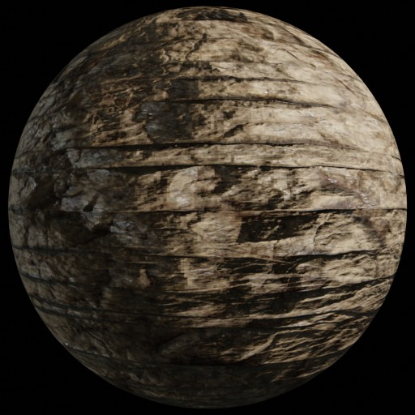 | 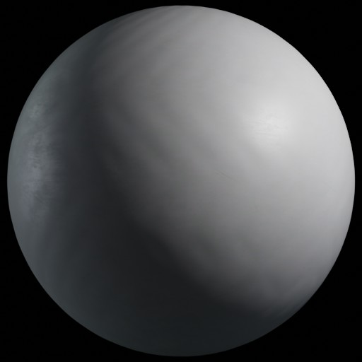 | 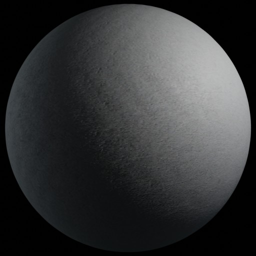 |

|                                  concrete\_cast\_rough\_dyed\_01\_300                                  |                               concrete\_new\_clean\_01\_300                               |                                  concrete\_new\_clean\_dyed\_01\_300                                 |
| :----------------------------------------------------------------------------------------------------: | :---------------------------------------------------------------------------------------: | :--------------------------------------------------------------------------------------------------: |
|  | 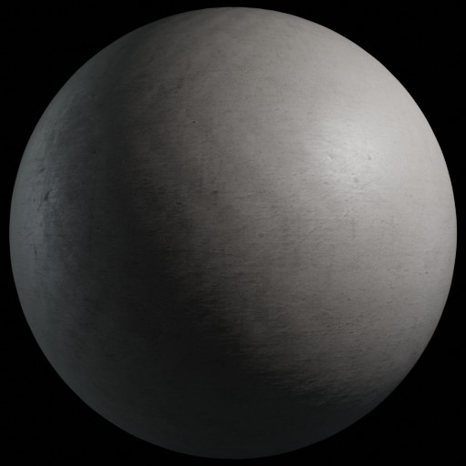 | 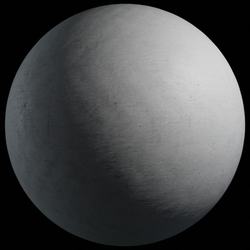 |

|                                concrete\_new\_cracked\_01\_300                                |                               concrete\_new\_dirty\_01\_300                               |                                concrete\_new\_painted\_01\_300                                |
| :-------------------------------------------------------------------------------------------: | :---------------------------------------------------------------------------------------: | :-------------------------------------------------------------------------------------------: |
| 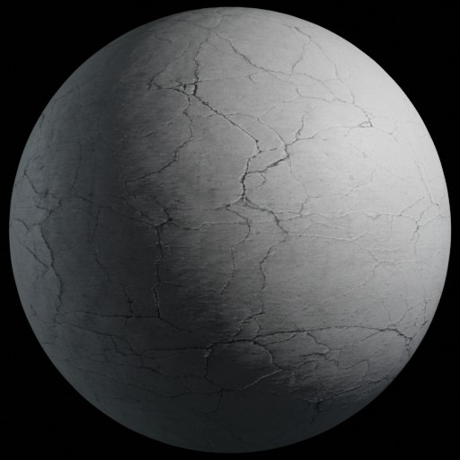 | 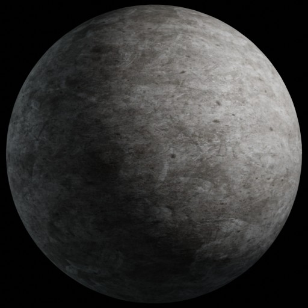 | 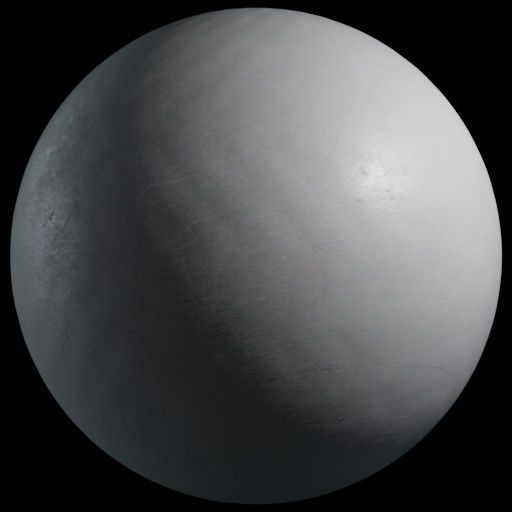 |

|                                   concrete\_new\_painted\_matte\_01\_300                                   |                               concrete\_new\_rough\_01\_300                               |                                  concrete\_new\_rough\_dyed\_01\_300                                 |
| :--------------------------------------------------------------------------------------------------------: | :---------------------------------------------------------------------------------------: | :--------------------------------------------------------------------------------------------------: |
|  | 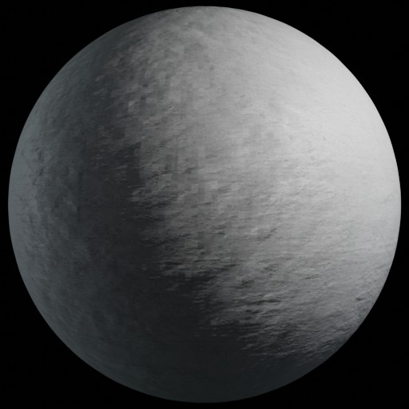 |  |

|                                concrete\_old\_damage\_01\_300                               |                                   concrete\_old\_damage\_rebar\_01\_300                                  |                                concrete\_old\_panels\_01\_300                               |
| :-----------------------------------------------------------------------------------------: | :------------------------------------------------------------------------------------------------------: | :-----------------------------------------------------------------------------------------: |
| 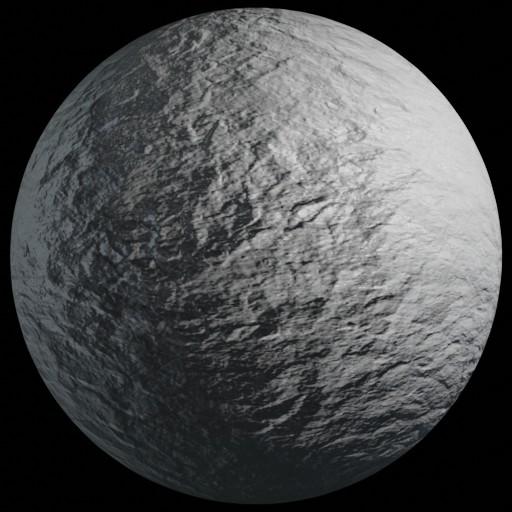 | 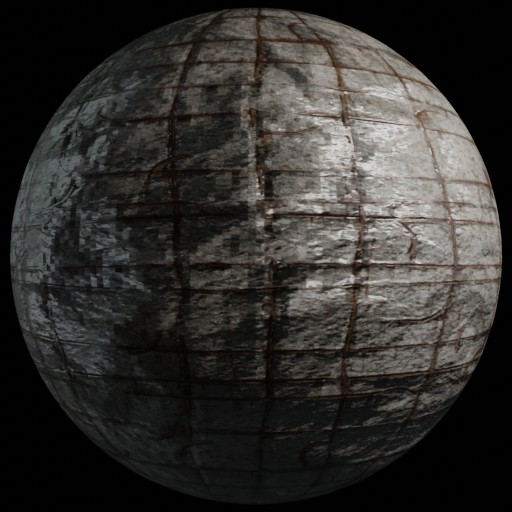 | 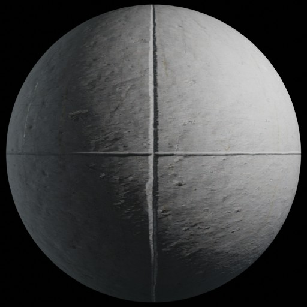 |

|                                   concrete\_old\_panels\_cracks\_01\_300                                   |                                     concrete\_old\_panels\_horizontal\_01\_300                                     |                                         concrete\_old\_panels\_horizontal\_cracks\_01\_300                                        |
| :--------------------------------------------------------------------------------------------------------: | :----------------------------------------------------------------------------------------------------------------: | :-------------------------------------------------------------------------------------------------------------------------------: |
| 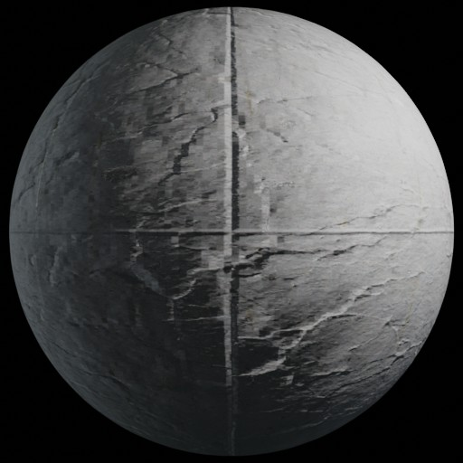 | 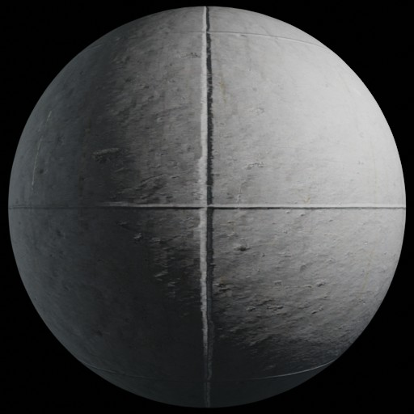 | 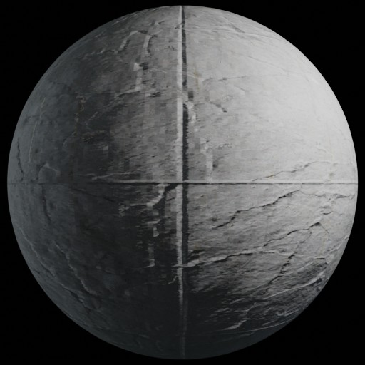 |

|                                   concrete\_old\_panels\_leaks\_01\_300                                  |                                 concrete\_old\_shuttered\_01\_300                                 |                                     concrete\_old\_shuttered\_cracks\_01\_300                                    |
| :------------------------------------------------------------------------------------------------------: | :-----------------------------------------------------------------------------------------------: | :--------------------------------------------------------------------------------------------------------------: |
| 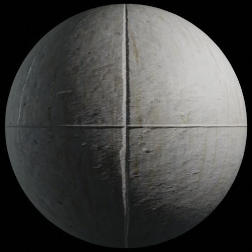 | 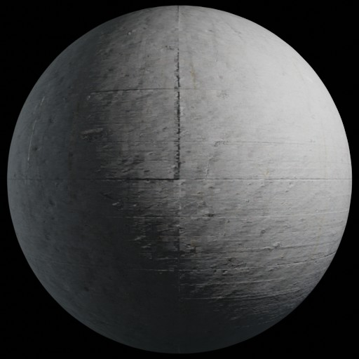 | 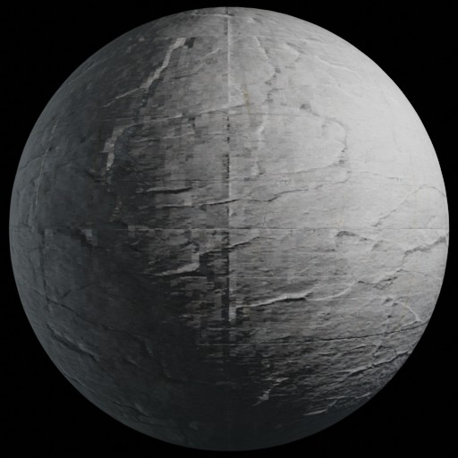 |

|                                    concrete\_old\_shuttered\_leaks\_01\_300                                    |                                     concrete\_old\_shuttered\_painted\_01\_300                                     |                             concrete\_road\_01\_300                            |
| :------------------------------------------------------------------------------------------------------------: | :----------------------------------------------------------------------------------------------------------------: | :----------------------------------------------------------------------------: |
| 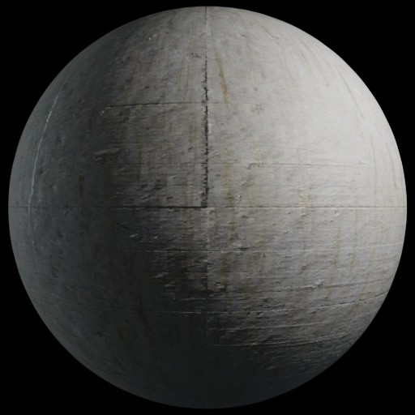 | 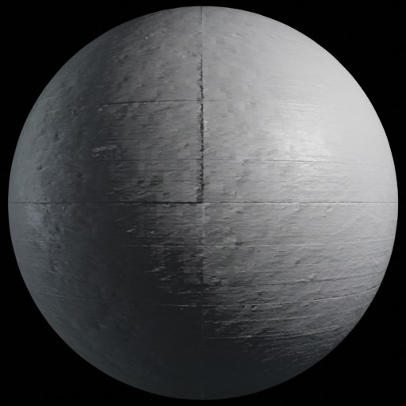 | 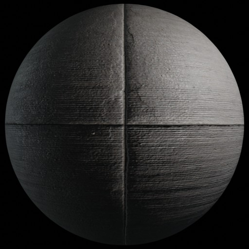 |

|                                 concrete\_road\_cracked\_01\_300                                |                                  concrete\_road\_fractured\_01\_300                                 |                                 concrete\_road\_painted\_01\_300                                |
| :---------------------------------------------------------------------------------------------: | :-------------------------------------------------------------------------------------------------: | :---------------------------------------------------------------------------------------------: |
| 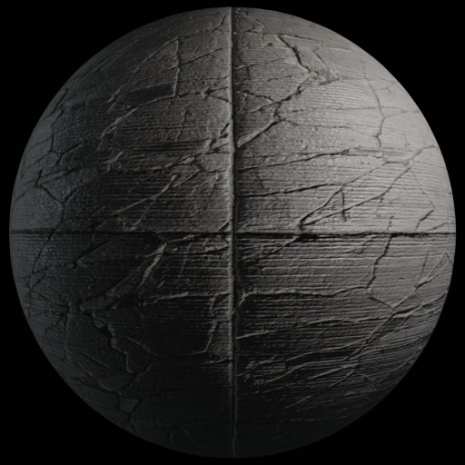 |  | 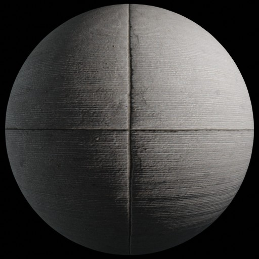 |

|                                concrete\_road\_tires\_01\_300                               |                             concrete\_rough\_01\_300                             |                                 concrete\_rough\_cracked\_01\_300                                 |
| :-----------------------------------------------------------------------------------------: | :------------------------------------------------------------------------------: | :-----------------------------------------------------------------------------------------------: |
| 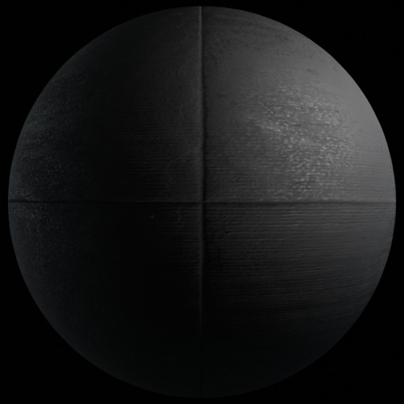 | 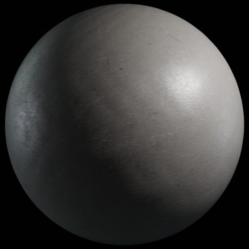 | 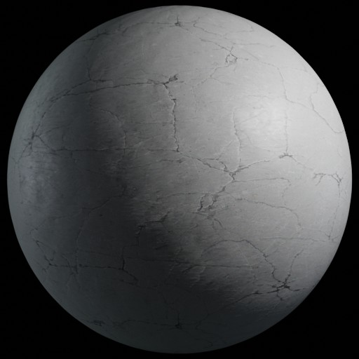 |

|                                 concrete\_rough\_damaged\_01\_300                                 |                                    concrete\_rough\_damaged\_rebar\_01\_300                                    |                                concrete\_rough\_leaks\_01\_300                                |
| :-----------------------------------------------------------------------------------------------: | :------------------------------------------------------------------------------------------------------------: | :-------------------------------------------------------------------------------------------: |
| 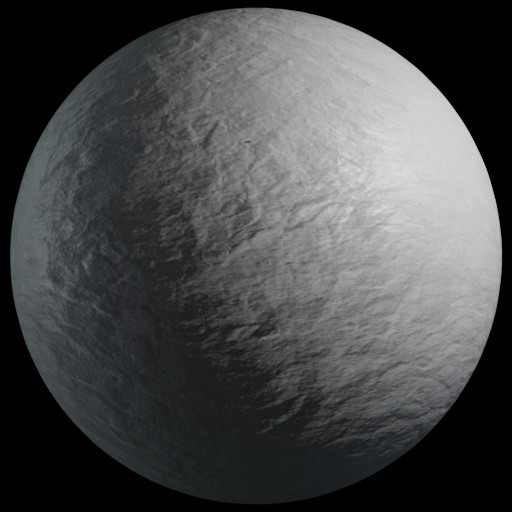 | 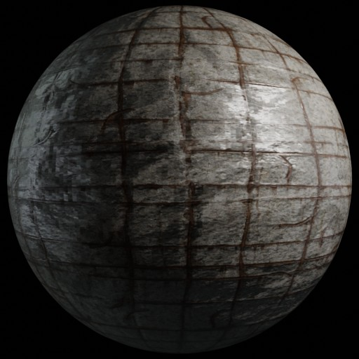 | 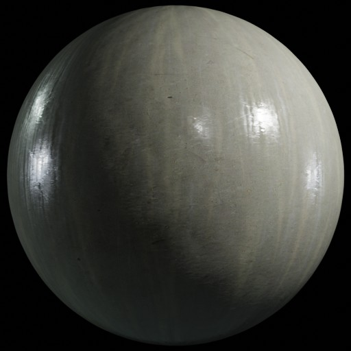 |

|                              concrete\_smooth\_01\_300                             |                                  concrete\_smooth\_cracked\_01\_300                                 |                                concrete\_smooth\_dyed\_01\_300                                |
| :--------------------------------------------------------------------------------: | :-------------------------------------------------------------------------------------------------: | :-------------------------------------------------------------------------------------------: |
| 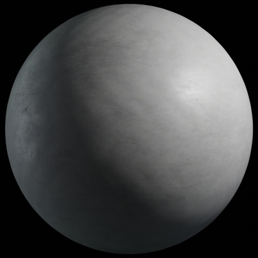 | 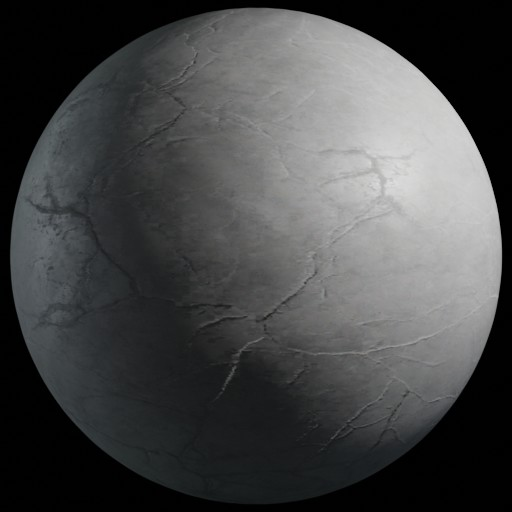 |  |

|                                     concrete\_smooth\_dyed\_polished\_01\_300                                    |                                concrete\_smooth\_old\_01\_300                               |                                  concrete\_smooth\_polished\_01\_300                                  |
| :--------------------------------------------------------------------------------------------------------------: | :-----------------------------------------------------------------------------------------: | :---------------------------------------------------------------------------------------------------: |
| 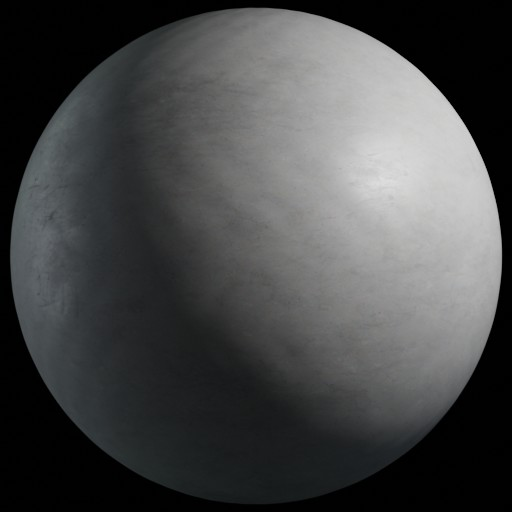 | 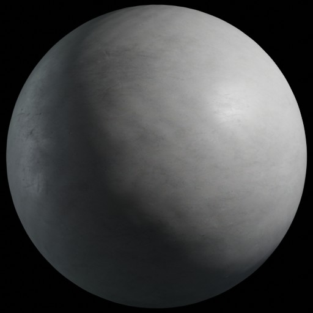 |  |

|                                    concrete\_smooth\_tile\_hex\_5x6\_01\_300                                    |                                       concrete\_smooth\_tile\_hex\_foil\_5x6\_01\_300                                      |                                       concrete\_smooth\_tile\_hex\_foil\_5x6\_02\_300                                      |
| :-------------------------------------------------------------------------------------------------------------: | :------------------------------------------------------------------------------------------------------------------------: | :------------------------------------------------------------------------------------------------------------------------: |
| 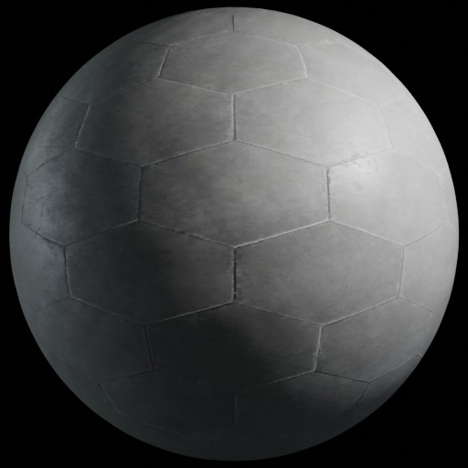 | 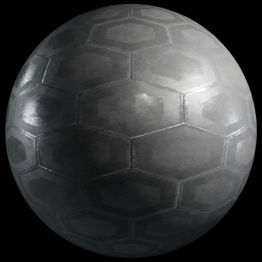 | 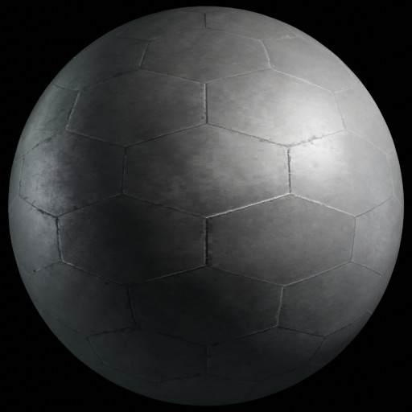 |

|                            copper\_bare\_01\_300                           |                             copper\_brushed\_01\_300                             |                           copper\_old\_01\_300                           |
| :------------------------------------------------------------------------: | :------------------------------------------------------------------------------: | :----------------------------------------------------------------------: |
|  | 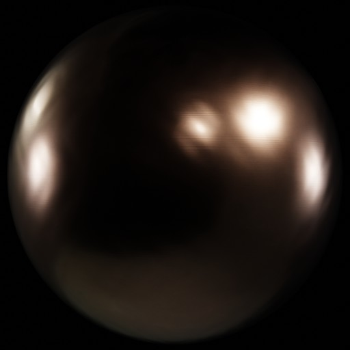 | 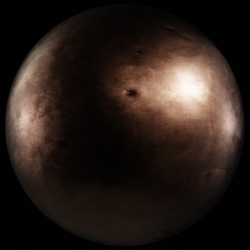 |

|                              copper\_polished\_01\_300                             |                               copper\_rolled\_bare\_01\_300                               |                                copper\_rolled\_rough\_01\_300                               |
| :--------------------------------------------------------------------------------: | :---------------------------------------------------------------------------------------: | :-----------------------------------------------------------------------------------------: |
|  | 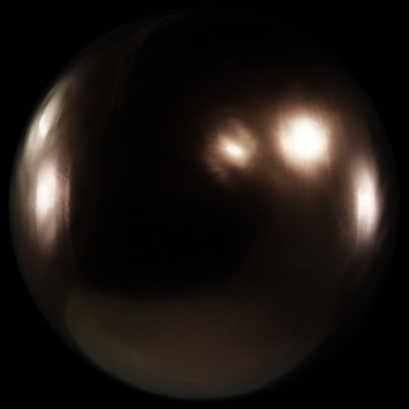 | 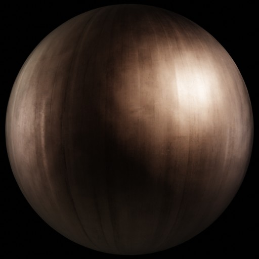 |

|                                 copper\_roof\_tile\_bare\_01\_300                                |                            copper\_rough\_01\_300                            |                             corduroy\_clean\_01\_30                            |
| :----------------------------------------------------------------------------------------------: | :--------------------------------------------------------------------------: | :----------------------------------------------------------------------------: |
| 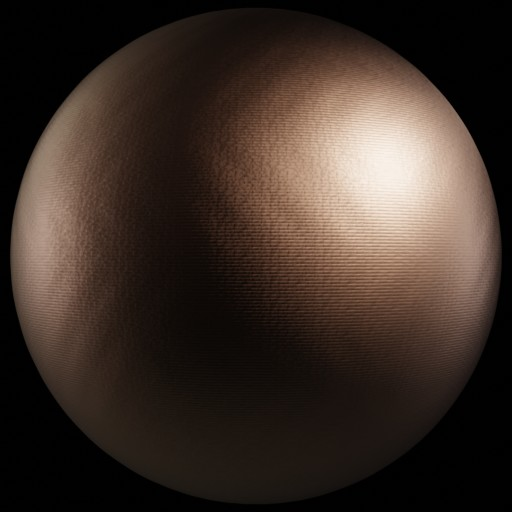 | 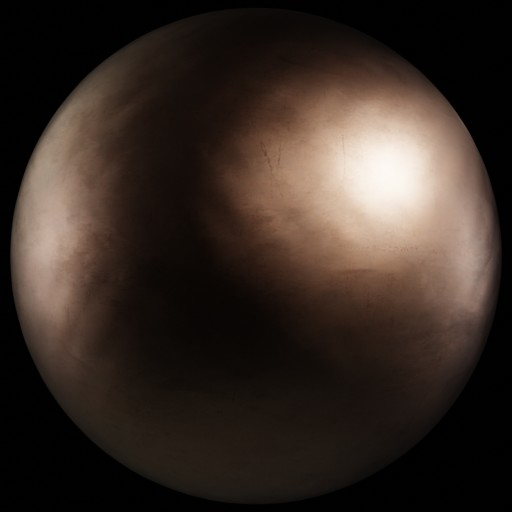 | 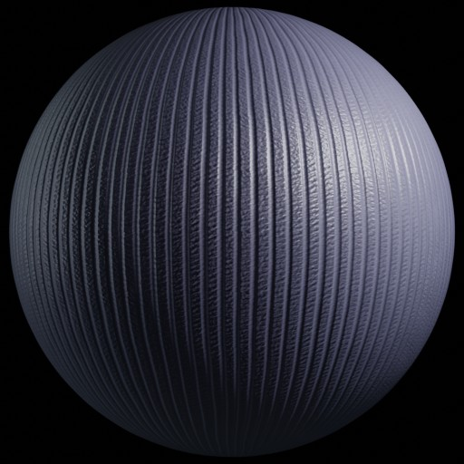 |

|                               cotton\_shirt\_clean\_01\_30                              |                               cotton\_shirt\_clean\_02\_30                              |                              cotton\_shirt\_neon\_02\_30                              |
| :-------------------------------------------------------------------------------------: | :-------------------------------------------------------------------------------------: | :-----------------------------------------------------------------------------------: |
| 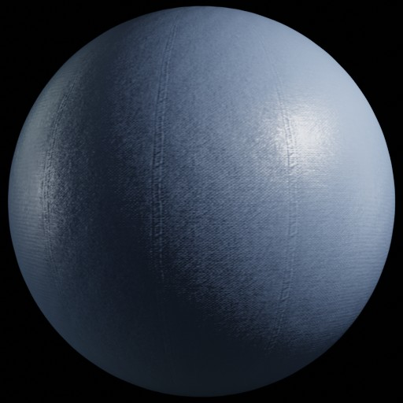 | 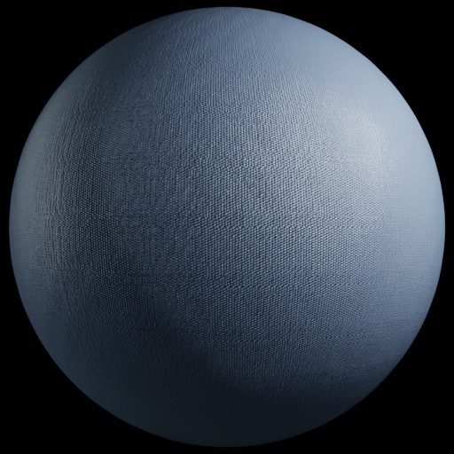 | 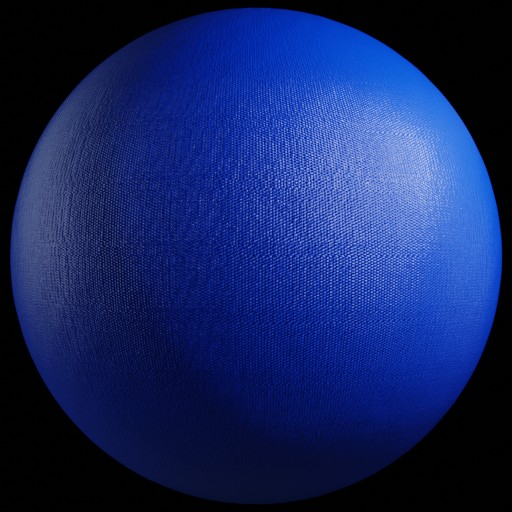 |

|                               cotton\_twill\_clean\_01\_30                              |                          debug\_outdated                         |                           debug\_parity\_test                           |
| :-------------------------------------------------------------------------------------: | :--------------------------------------------------------------: | :---------------------------------------------------------------------: |
| 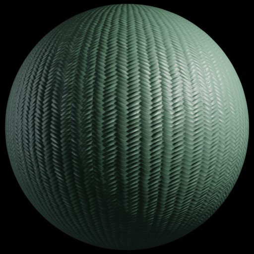 | 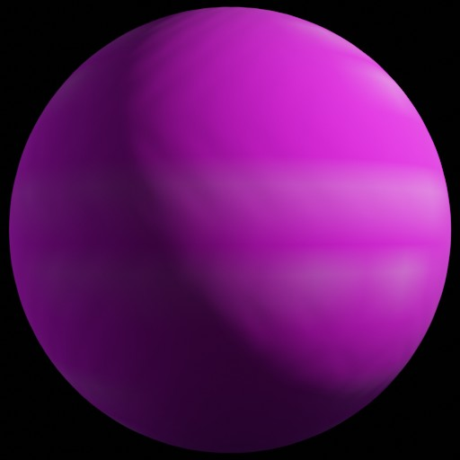 | 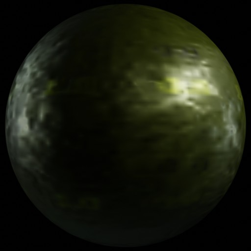 |

|                           debug\_uv\_testing                          |                         default\_gray                        |                           denim\_camo\_01\_30                          |
| :-------------------------------------------------------------------: | :----------------------------------------------------------: | :--------------------------------------------------------------------: |
| 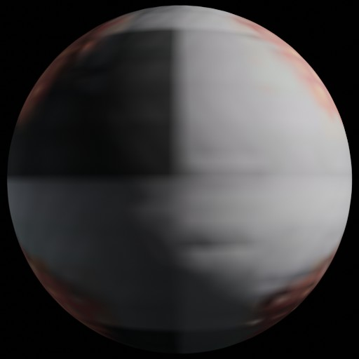 |  | 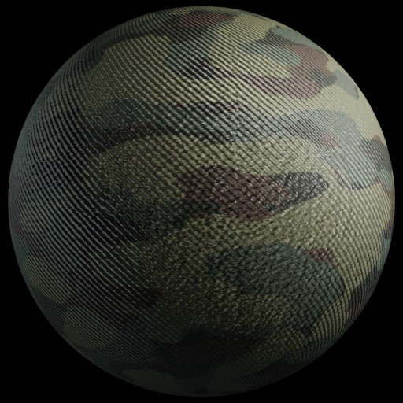 |

|                           denim\_clean\_01\_30                           |                          denim\_clean\_02                         |                           denim\_neon\_01\_30                          |
| :----------------------------------------------------------------------: | :---------------------------------------------------------------: | :--------------------------------------------------------------------: |
| 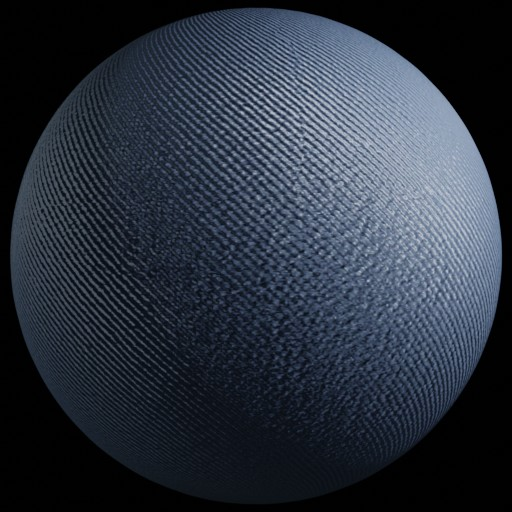 | 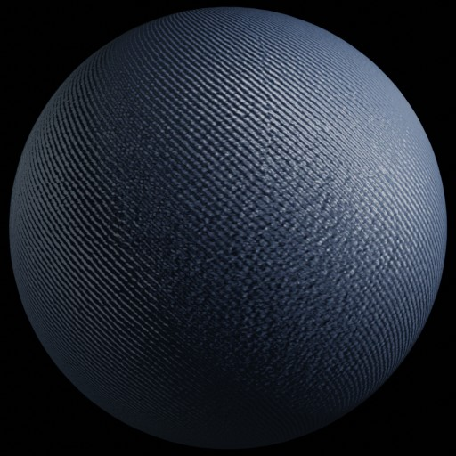 | 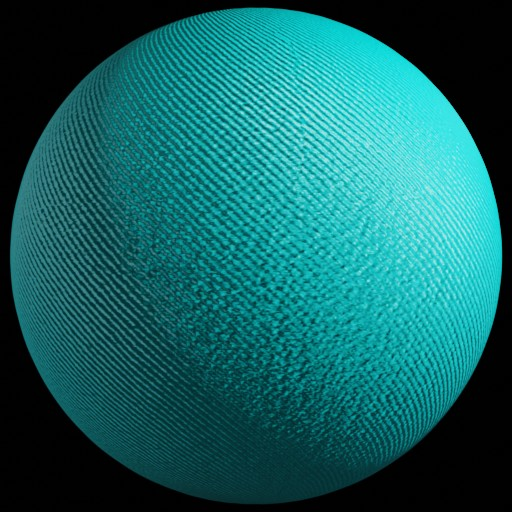 |

|                             dirt\_universal\_01\_300                             |                                duct\_tape\_characters\_01\_10                               |                             duct\_tape\_clean\_01\_10                             |
| :------------------------------------------------------------------------------: | :-----------------------------------------------------------------------------------------: | :-------------------------------------------------------------------------------: |
| 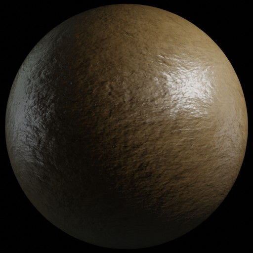 | 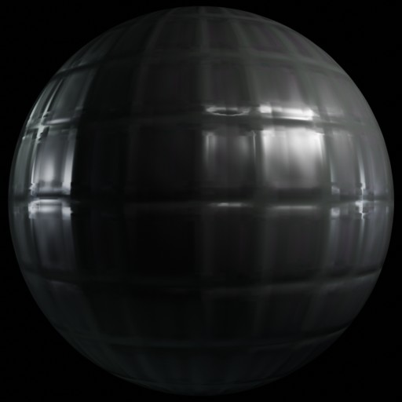 |  |

|                           dust\_light\_01\_50                          |                                ebony\_irregular\_bare\_01\_300                                |                                ebony\_irregular\_bare\_02\_300                                |
| :--------------------------------------------------------------------: | :-------------------------------------------------------------------------------------------: | :-------------------------------------------------------------------------------------------: |
| 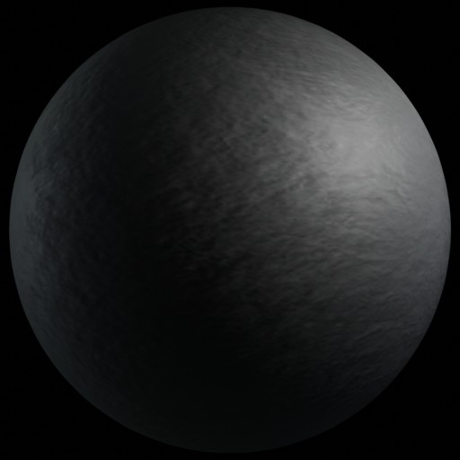 | 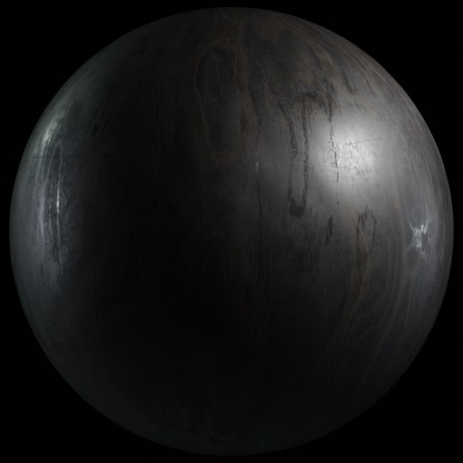 |  |

|                                  ebony\_irregular\_bare\_02\_hrz\_300                                  |                                  ebony\_irregular\_polished\_01\_300                                  |                                  ebony\_irregular\_polished\_02\_300                                  |
| :----------------------------------------------------------------------------------------------------: | :---------------------------------------------------------------------------------------------------: | :---------------------------------------------------------------------------------------------------: |
| 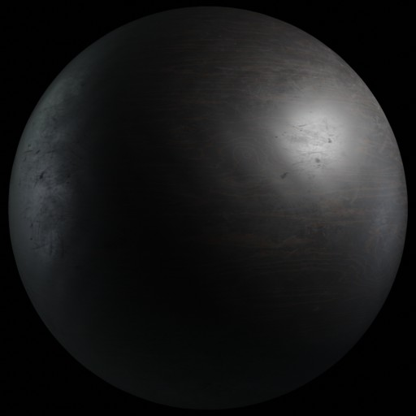 | 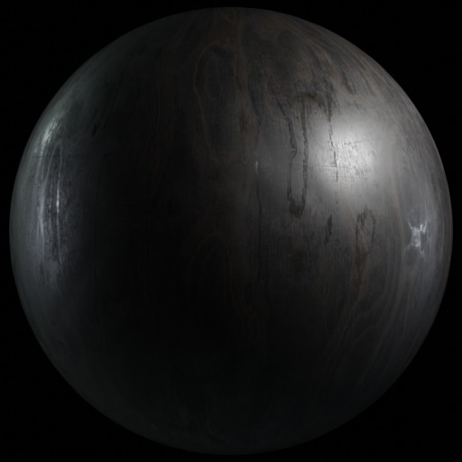 | 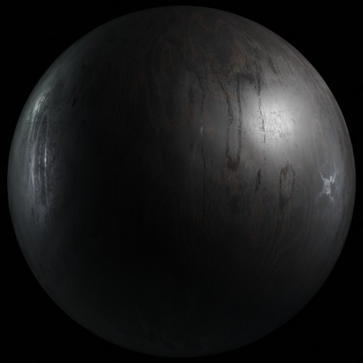 |

|                                ebony\_straight\_bare\_01\_300                               |                                ebony\_straight\_bare\_02\_300                               |                                  ebony\_straight\_polished\_01\_300                                 |
| :-----------------------------------------------------------------------------------------: | :-----------------------------------------------------------------------------------------: | :-------------------------------------------------------------------------------------------------: |
| 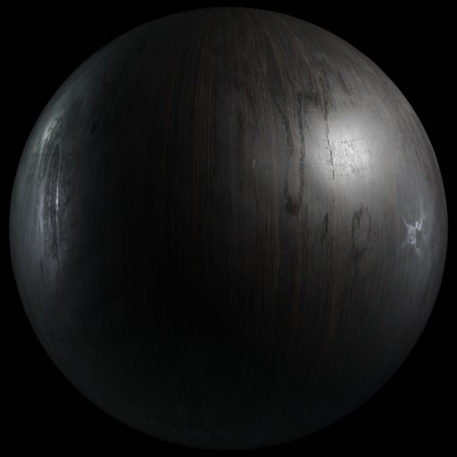 | 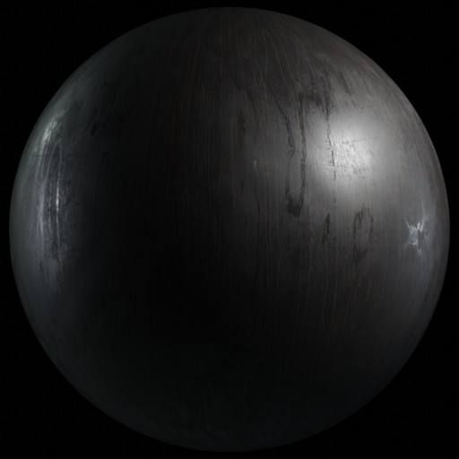 | 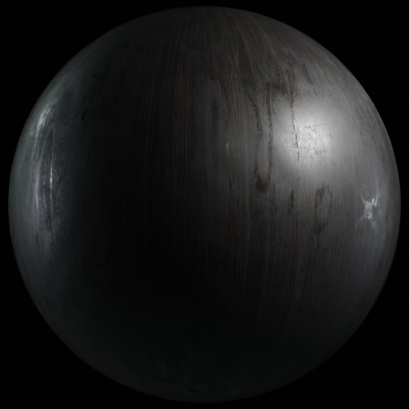 |

|                                  ebony\_straight\_polished\_02\_300                                 |                                    ebony\_straight\_polished\_02\_hrz\_300                                   |                                     ebony\_straight\_polished\_floor\_01\_300                                    |
| :-------------------------------------------------------------------------------------------------: | :----------------------------------------------------------------------------------------------------------: | :--------------------------------------------------------------------------------------------------------------: |
|  | 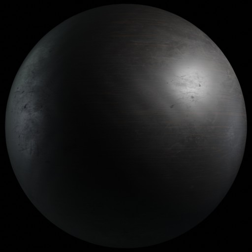 | 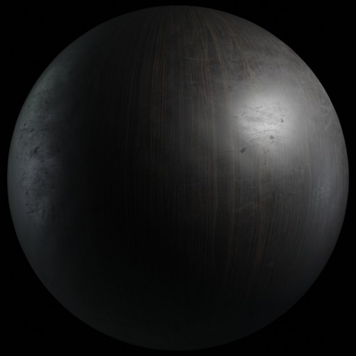 |

|                                     ebony\_straight\_polished\_floor\_02\_300                                    |                            elastic\_clean\_01\_30                            |                                elastic\_ribbed\_clean\_01\_30                               |
| :--------------------------------------------------------------------------------------------------------------: | :--------------------------------------------------------------------------: | :-----------------------------------------------------------------------------------------: |
| 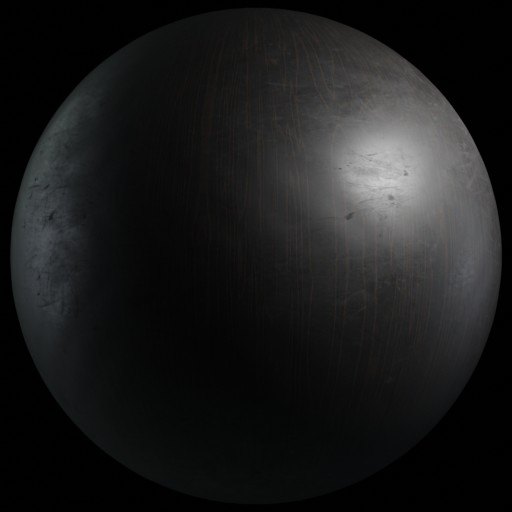 | 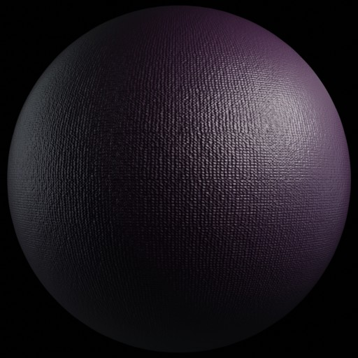 | 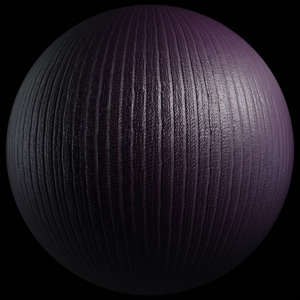 |

|                           enameled\_hq\_01\_30                           |                                enameled\_metal\_clean\_01\_30                               |                                  enameled\_metal\_weathered\_01\_30                                 |
| :----------------------------------------------------------------------: | :-----------------------------------------------------------------------------------------: | :-------------------------------------------------------------------------------------------------: |
| 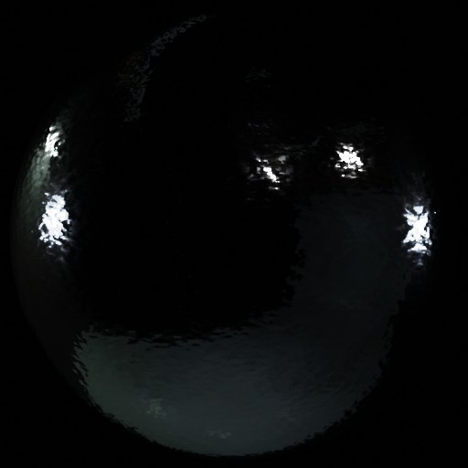 | 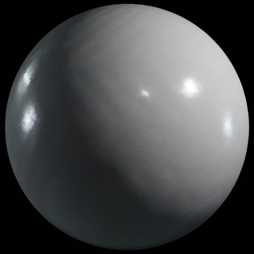 | 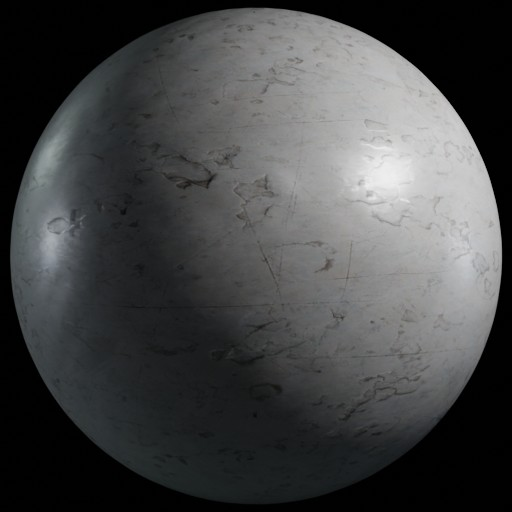 |

|                                 factory\_floor\_cracked\_01\_300                                |                                   factory\_floor\_cracked\_dyed\_01\_300                                   |                               factory\_floor\_old\_01\_300                              |
| :---------------------------------------------------------------------------------------------: | :--------------------------------------------------------------------------------------------------------: | :-------------------------------------------------------------------------------------: |
| 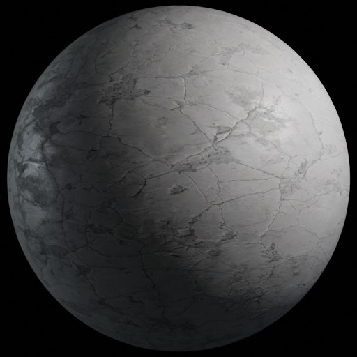 |  | 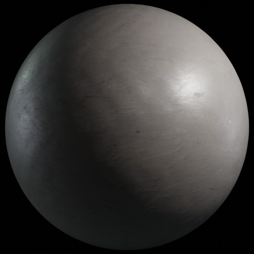 |

|                                 factory\_floor\_painted\_01\_300                                |                                   factory\_floor\_painted\_old\_01\_300                                  |                                factory\_floor\_rough\_01\_300                               |
| :---------------------------------------------------------------------------------------------: | :------------------------------------------------------------------------------------------------------: | :-----------------------------------------------------------------------------------------: |
|  |  | 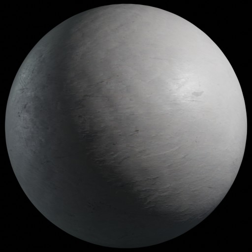 |

|                           felt\_clean\_01\_30                          |                        foam\_01\_100                        |                            foam\_pyramid\_01\_100                            |
| :--------------------------------------------------------------------: | :---------------------------------------------------------: | :--------------------------------------------------------------------------: |
| 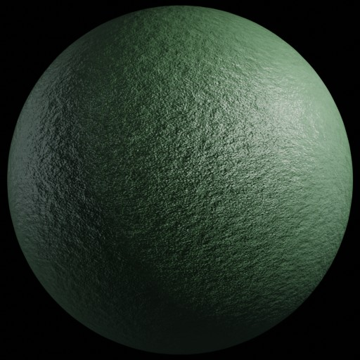 | 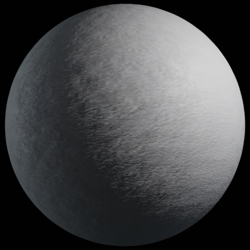 | 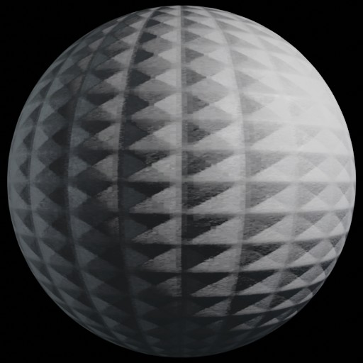 |

|                           gold\_bare\_01\_300                          |                            gold\_brushed\_01\_300                            |                          gold\_old\_01\_300                          |
| :--------------------------------------------------------------------: | :--------------------------------------------------------------------------: | :------------------------------------------------------------------: |
| 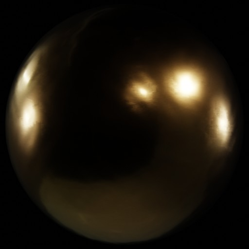 |  |  |

|                             gold\_polished\_01\_300                            |                           gold\_rough\_01\_300                           |                          graffiti\_01\_100                          |
| :----------------------------------------------------------------------------: | :----------------------------------------------------------------------: | :-----------------------------------------------------------------: |
| 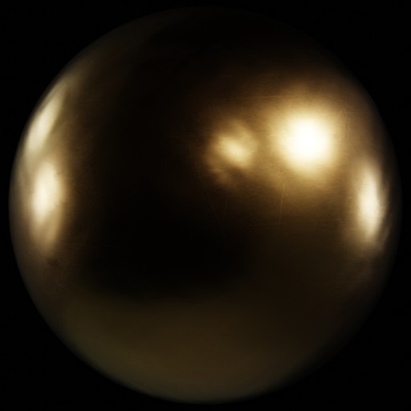 | 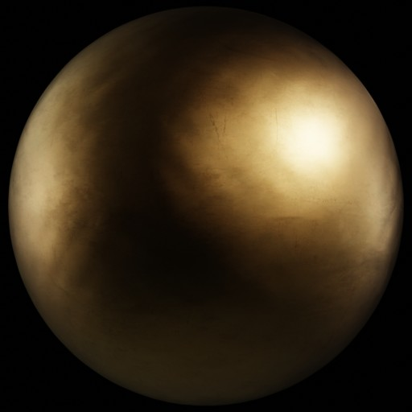 | 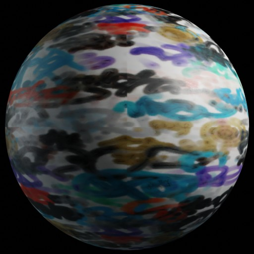 |

|                            graphics\_logos\_001                           |                            graphics\_logos\_002                           |                            graphics\_logos\_003                           |
| :-----------------------------------------------------------------------: | :-----------------------------------------------------------------------: | :-----------------------------------------------------------------------: |
| 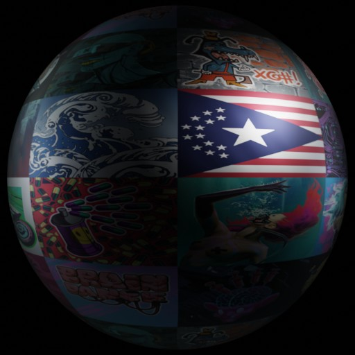 | 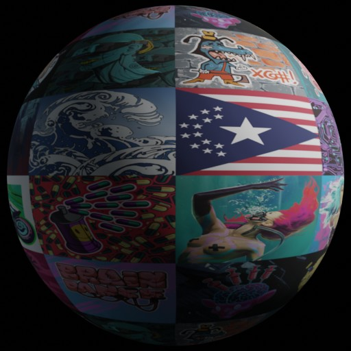 | 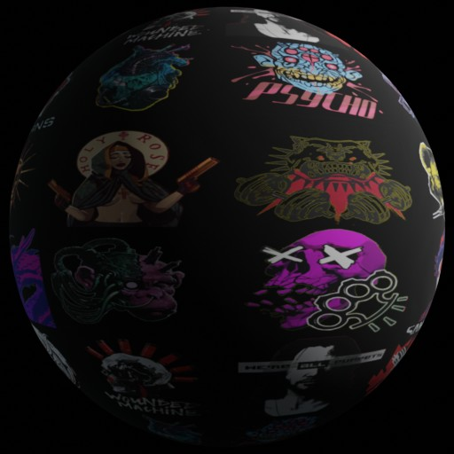 |

|                         grass\_dry\_01                        |                          grass\_green\_01                         |                          grass\_scrub\_01                         |
| :-----------------------------------------------------------: | :---------------------------------------------------------------: | :---------------------------------------------------------------: |
| 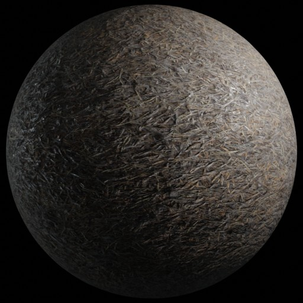 | 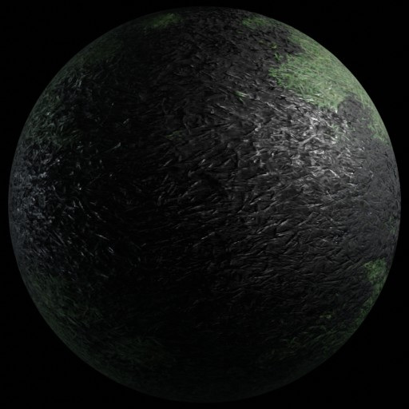 | 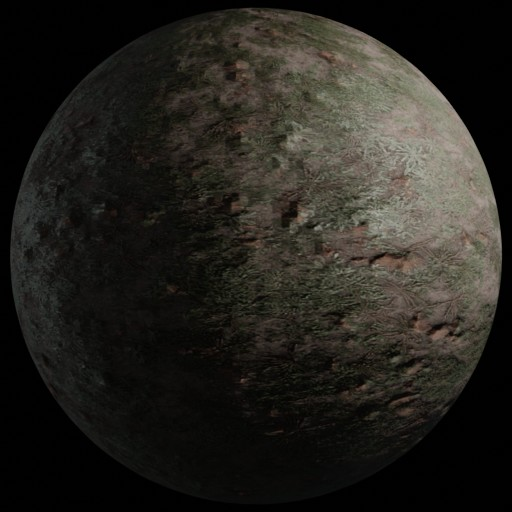 |

|                       gravel\_01                       |                           grime\_film\_01\_300                           |                              houndstooth\_clean\_01\_30                              |
| :----------------------------------------------------: | :----------------------------------------------------------------------: | :----------------------------------------------------------------------------------: |
|  | 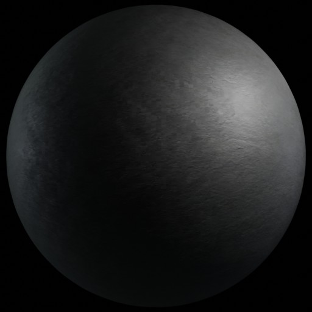 | 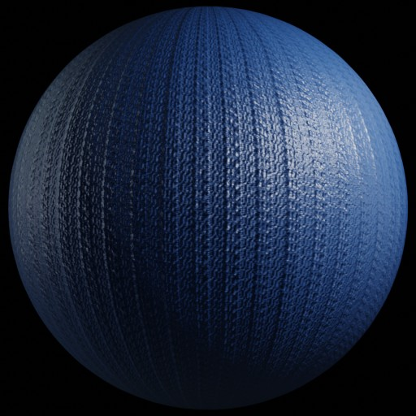 |

|                               insulation\_quilted\_01\_200                               |                           iron\_bare\_01\_300                          |                            iron\_brushed\_01\_300                            |
| :--------------------------------------------------------------------------------------: | :--------------------------------------------------------------------: | :--------------------------------------------------------------------------: |
| 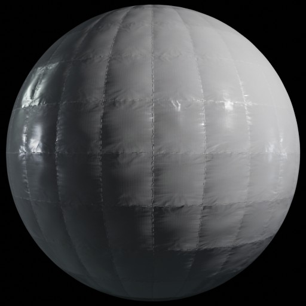 | 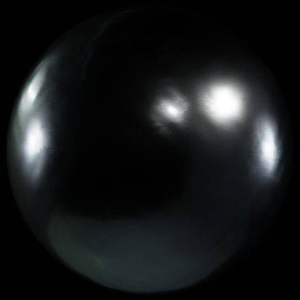 |  |

|                           iron\_cast\_01\_300                          |                               iron\_cast\_painted\_01\_300                              |                                  iron\_cast\_painted\_studs\_01\_300                                 |
| :--------------------------------------------------------------------: | :-------------------------------------------------------------------------------------: | :--------------------------------------------------------------------------------------------------: |
| 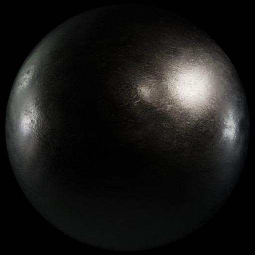 | 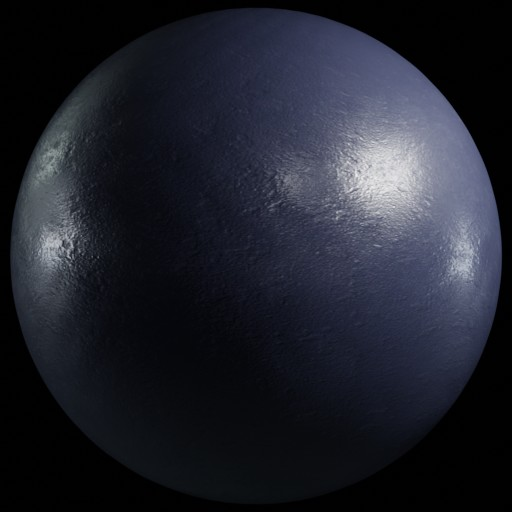 | 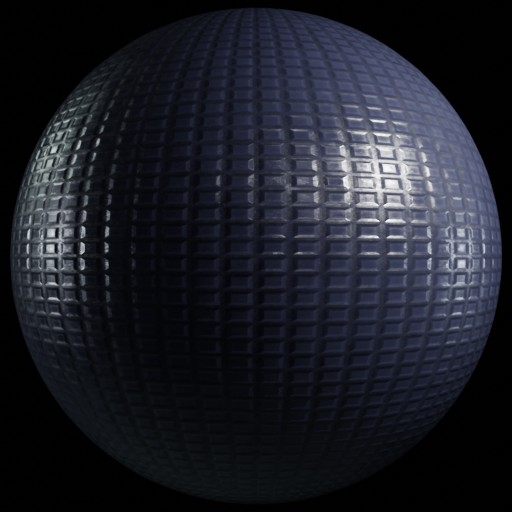 |

|                               iron\_cast\_polished\_01\_300                               |                              iron\_cast\_studs\_01\_300                             |                          iron\_old\_01\_100                          |
| :---------------------------------------------------------------------------------------: | :---------------------------------------------------------------------------------: | :------------------------------------------------------------------: |
| 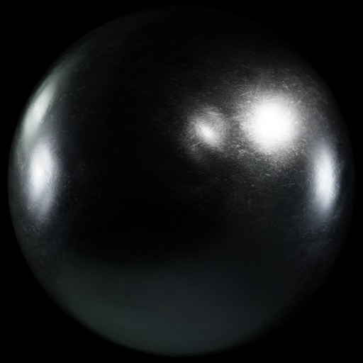 | 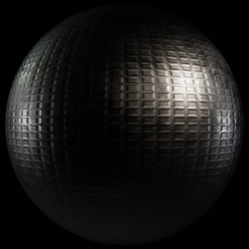 | 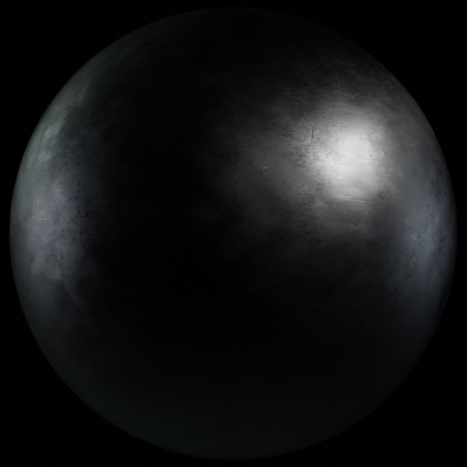 |

|                              iron\_old\_rusted\_01\_100                             |                             iron\_polished\_01\_300                            |                              iron\_rolled\_bare\_01\_300                              |
| :---------------------------------------------------------------------------------: | :----------------------------------------------------------------------------: | :-----------------------------------------------------------------------------------: |
| 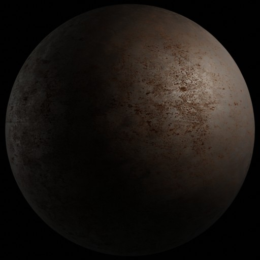 | 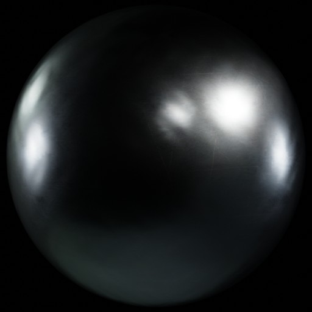 |  |

|                               iron\_rolled\_rough\_01\_300                              |                           iron\_rough\_01\_300                           |                            jersey\_clean\_01\_30                           |
| :-------------------------------------------------------------------------------------: | :----------------------------------------------------------------------: | :------------------------------------------------------------------------: |
| 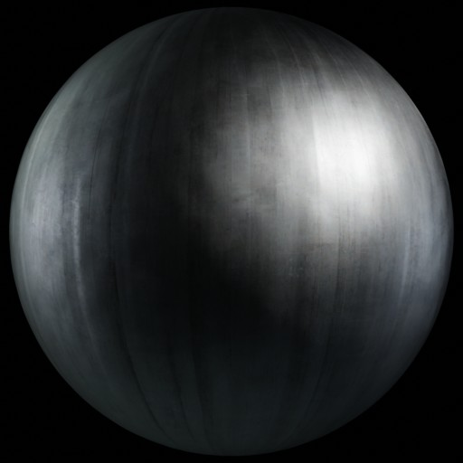 | 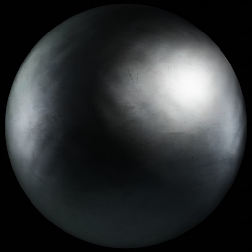 | 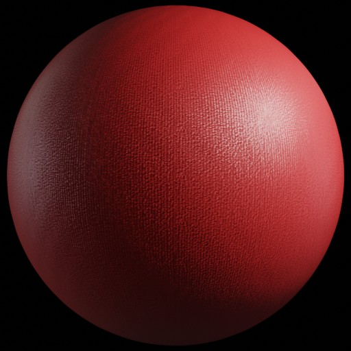 |

|                        latex\_01\_30                        |                           latex\_neon\_01\_30                          |                            leather\_bull\_01\_30                           |
| :---------------------------------------------------------: | :--------------------------------------------------------------------: | :------------------------------------------------------------------------: |
| 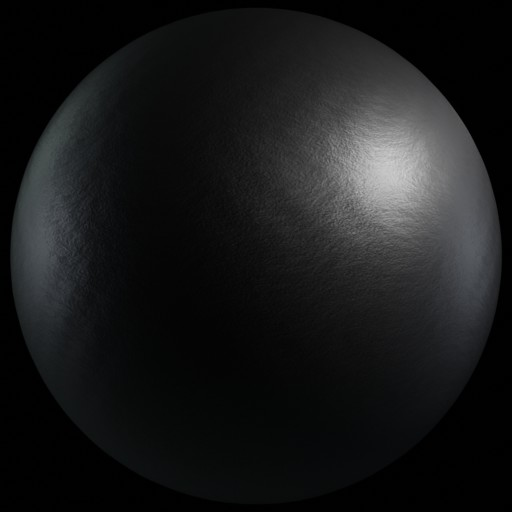 | 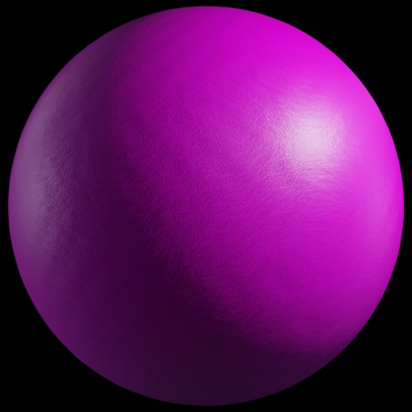 | 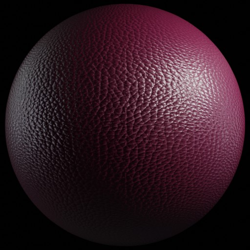 |

|                            leather\_croc\_01\_30                           |                            leather\_holes\_01\_30                            |                           leather\_old\_01\_30                           |
| :------------------------------------------------------------------------: | :--------------------------------------------------------------------------: | :----------------------------------------------------------------------: |
| 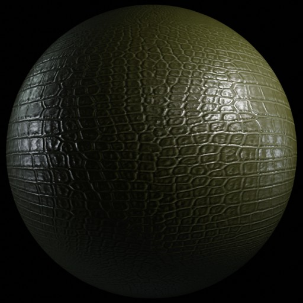 | 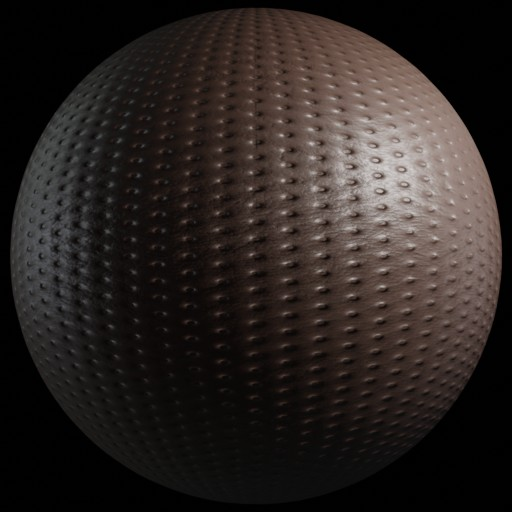 | 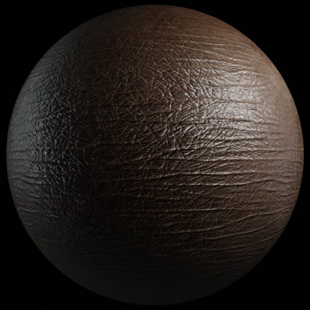 |

|                           leather\_old\_02\_30                           |                            leather\_rough\_01\_30                            |                                 leather\_standard\_clean\_01\_30                                |
| :----------------------------------------------------------------------: | :--------------------------------------------------------------------------: | :---------------------------------------------------------------------------------------------: |
| 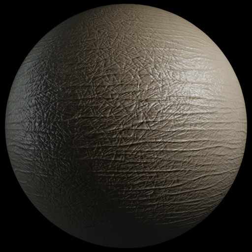 | 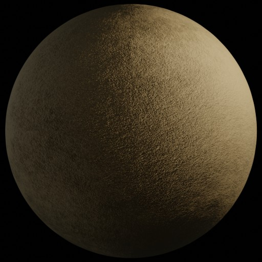 | 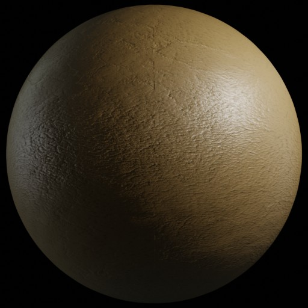 |

|                              led\_matrix\_16x16\_01\_16                             |                            linen\_burlap\_01\_30                           |                           linen\_clean\_01\_30                           |
| :---------------------------------------------------------------------------------: | :------------------------------------------------------------------------: | :----------------------------------------------------------------------: |
| 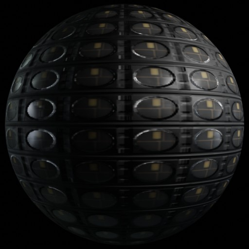 | 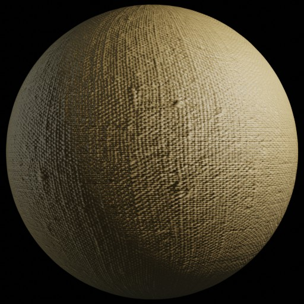 | 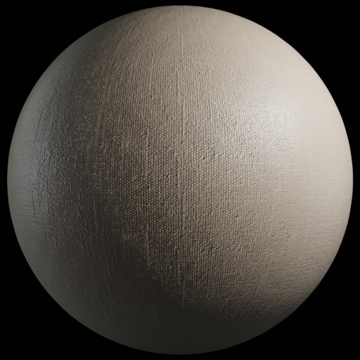 |

|                               linoleum\_floor\_6x6\_01\_300                               |                                  linoleum\_floor\_6x6\_worn\_01\_300                                 |                                   linoleum\_floor\_strip\_eggshell\_01                                  |
| :---------------------------------------------------------------------------------------: | :--------------------------------------------------------------------------------------------------: | :-----------------------------------------------------------------------------------------------------: |
| 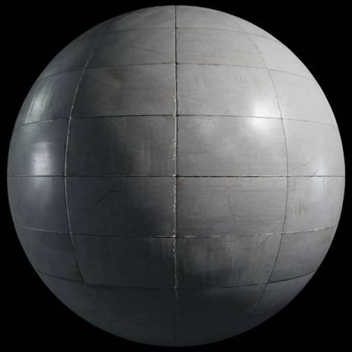 | 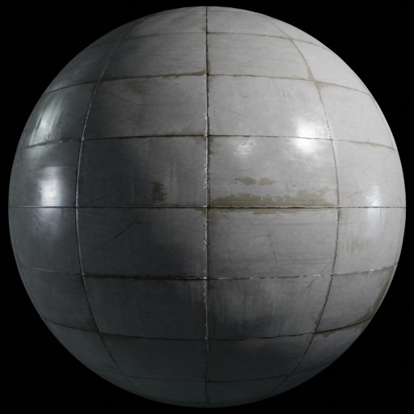 | 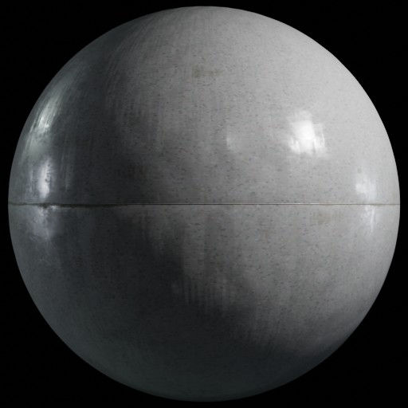 |

|                          marble\_plain\_01                          |                               marble\_plain\_polished\_01                              |                            marble\_plain\_raw\_01                            |
| :-----------------------------------------------------------------: | :------------------------------------------------------------------------------------: | :--------------------------------------------------------------------------: |
| 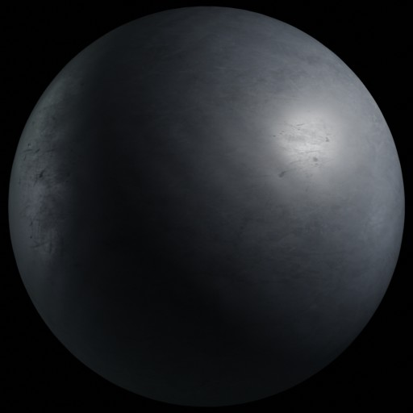 |  | 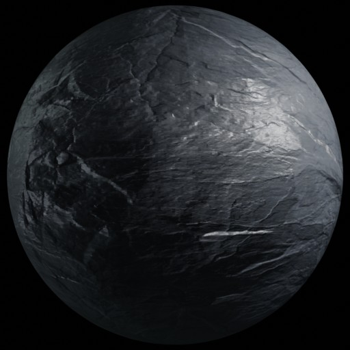 |

|                               metal\_floor\_dirty\_01\_100                              |                                   metal\_floor\_painted\_dirty\_01\_100                                  |                                metal\_generic\_cast\_hq\_01\_30                                |
| :-------------------------------------------------------------------------------------: | :------------------------------------------------------------------------------------------------------: | :--------------------------------------------------------------------------------------------: |
| 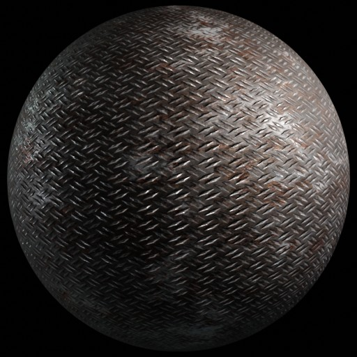 | 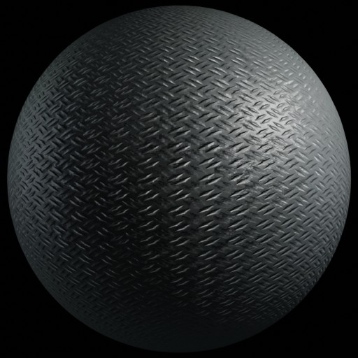 | 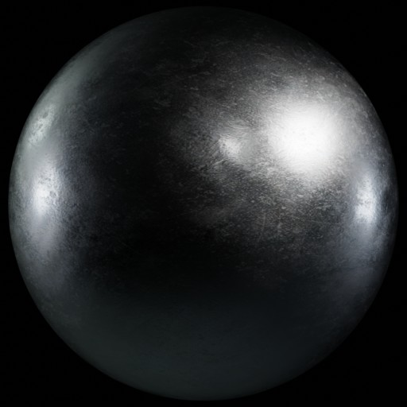 |

|                              metal\_generic\_hq\_01\_30                             |                         mirror\_01\_100                         |                      mud\_01                     |
| :---------------------------------------------------------------------------------: | :-------------------------------------------------------------: | :----------------------------------------------: |
| 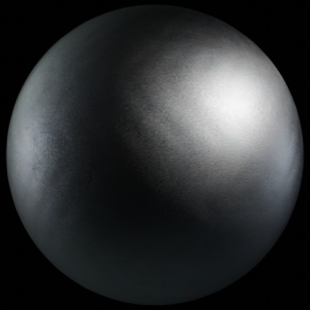 | 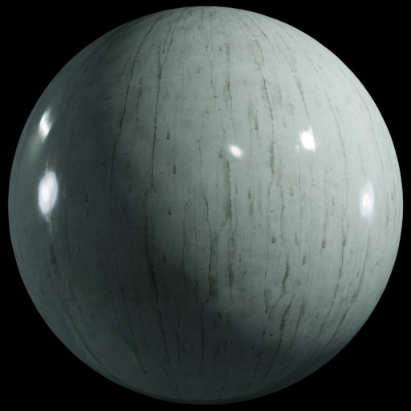 | 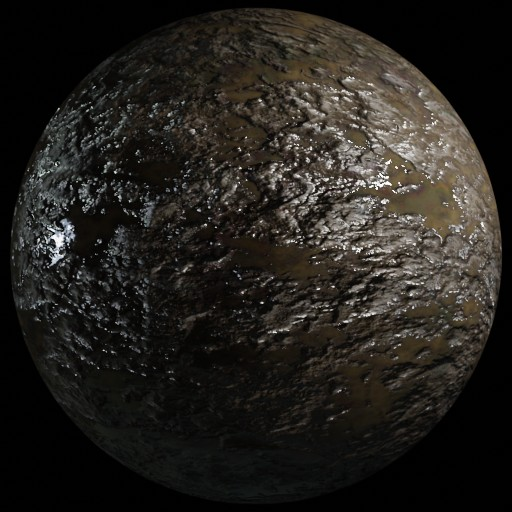 |

|                           multilayer\_debug                          |                            multilayer\_default                           |                           mylar\_clean\_01\_30                           |
| :------------------------------------------------------------------: | :----------------------------------------------------------------------: | :----------------------------------------------------------------------: |
| 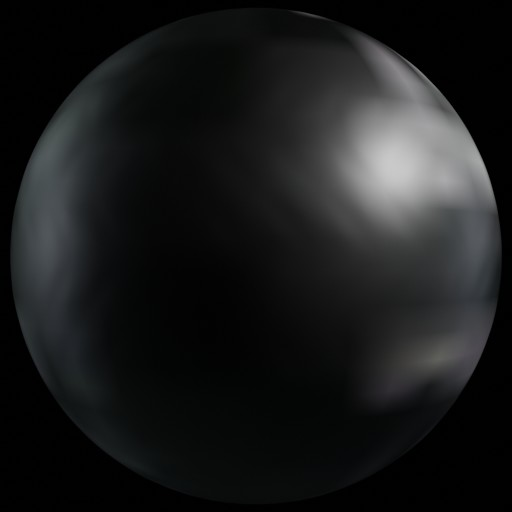 |  | 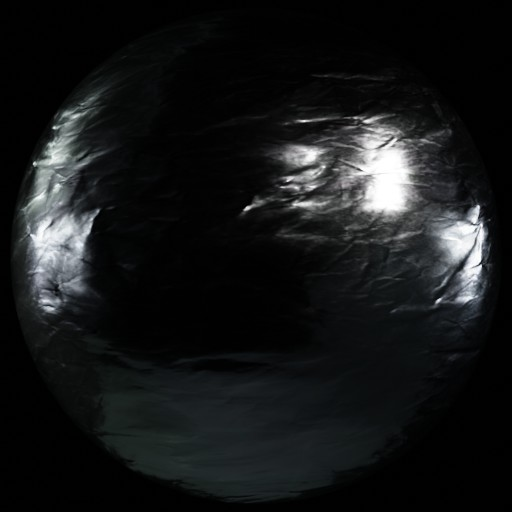 |

|                                   mylar\_insulation\_crumpled\_01\_200                                  |                                  mylar\_insulation\_quilted\_01\_200                                  |                        nylon\_01\_30                        |
| :-----------------------------------------------------------------------------------------------------: | :---------------------------------------------------------------------------------------------------: | :---------------------------------------------------------: |
| 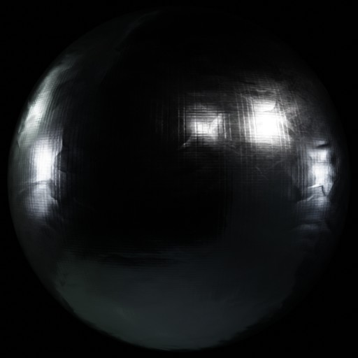 | 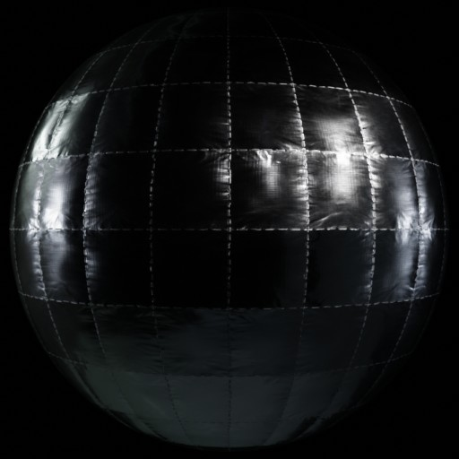 |  |

|                             nylon\_metallic\_01\_30                            |                           nylon\_strap\_01\_10                           |                           nylon\_strap\_02\_10                           |
| :----------------------------------------------------------------------------: | :----------------------------------------------------------------------: | :----------------------------------------------------------------------: |
| 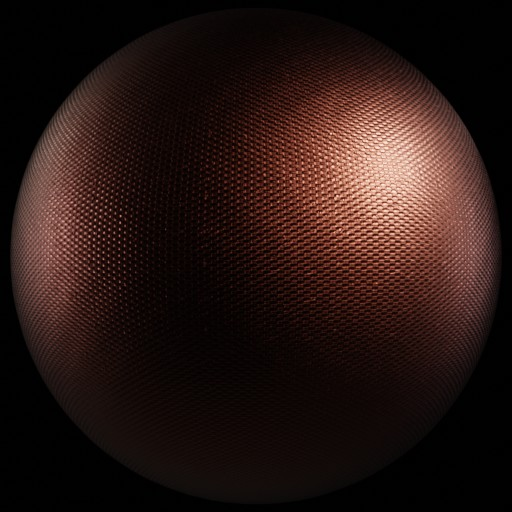 | 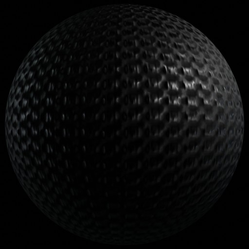 | 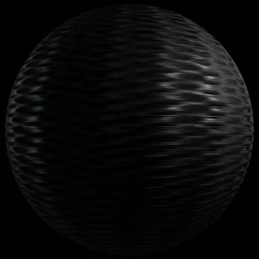 |

|                            oxford\_clean\_01\_30                           |                              paint\_fine\_clean\_01\_300                              |                                 paint\_fine\_clean\_matte\_01\_300                                 |
| :------------------------------------------------------------------------: | :-----------------------------------------------------------------------------------: | :------------------------------------------------------------------------------------------------: |
| 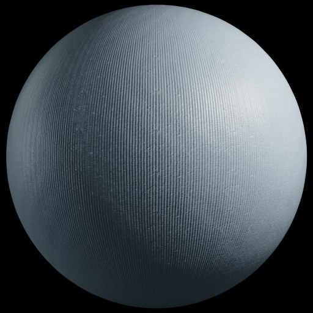 | 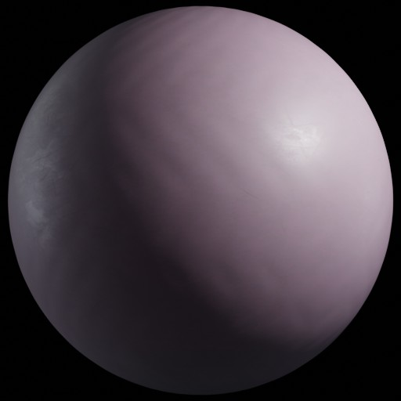 | 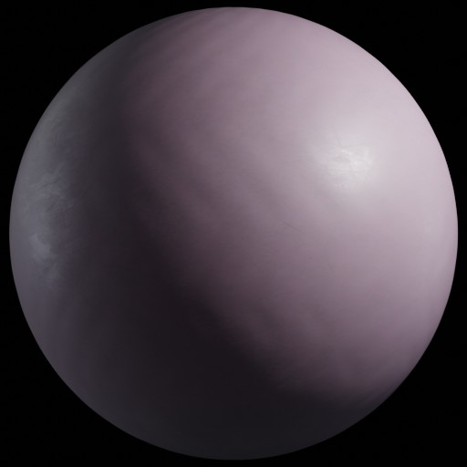 |

|                             paint\_fine\_old\_01\_300                             |                            paint\_thick\_01\_300                           |                                paint\_thick\_chequer\_01\_300                               |
| :-------------------------------------------------------------------------------: | :------------------------------------------------------------------------: | :-----------------------------------------------------------------------------------------: |
| 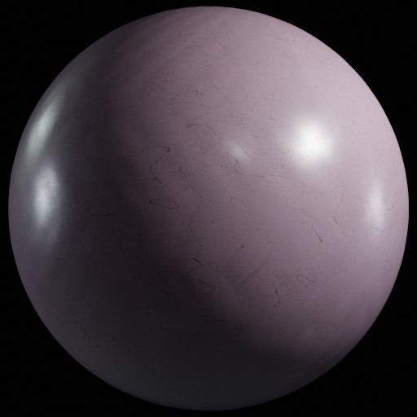 | 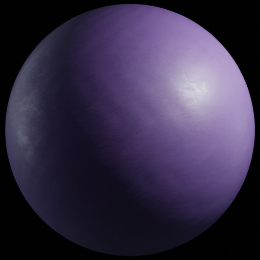 | 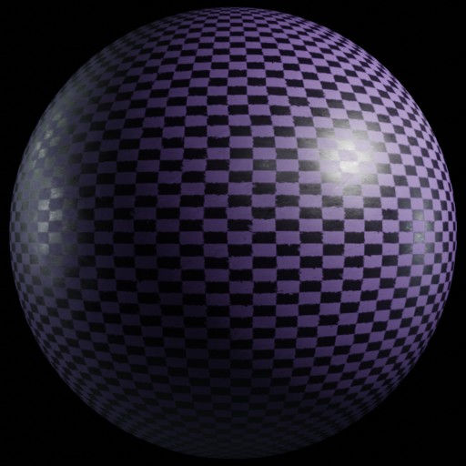 |

|                               paint\_thick\_hazard\_01\_300                               |                              paint\_thick\_old\_01\_300                             |                                paint\_thick\_peeling\_01\_300                               |
| :---------------------------------------------------------------------------------------: | :---------------------------------------------------------------------------------: | :-----------------------------------------------------------------------------------------: |
|  | 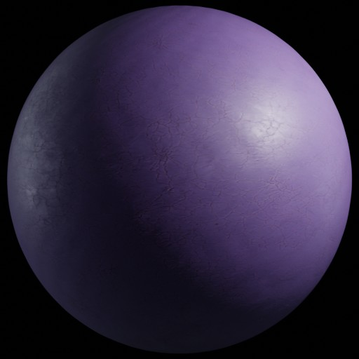 | 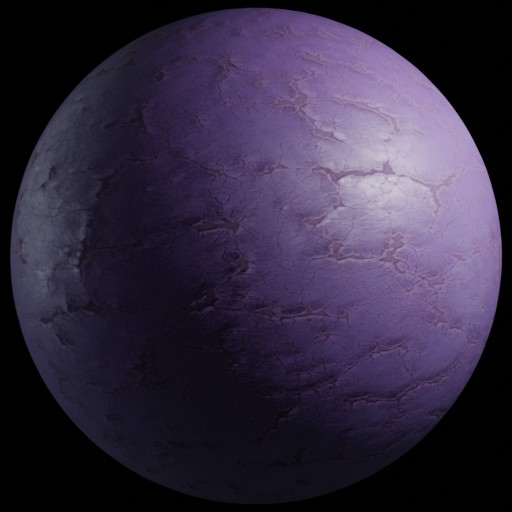 |

|                         patina\_01\_300                         |                              patina\_roof\_tile\_01\_300                              |                             pebbles\_smooth\_01\_200                             |
| :-------------------------------------------------------------: | :-----------------------------------------------------------------------------------: | :------------------------------------------------------------------------------: |
| 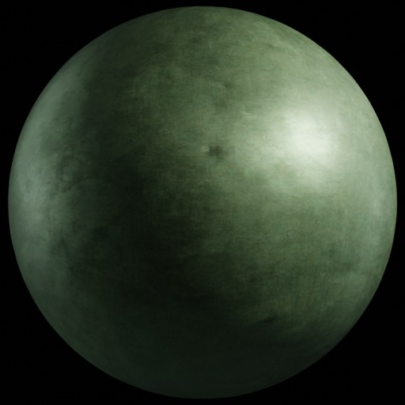 | 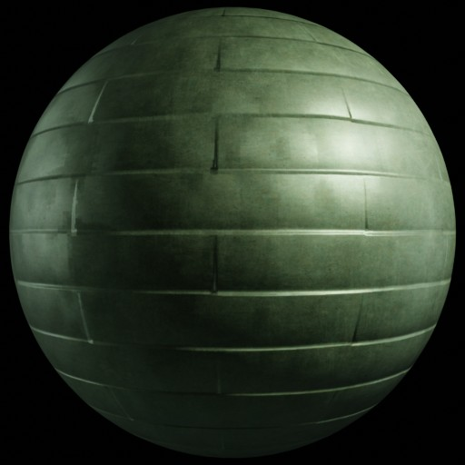 | 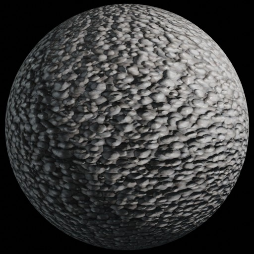 |

|                               photovoltaic\_cells\_01\_200                               |                           plaid\_clean\_01\_30                           |                           plaid\_clean\_02\_30                           |
| :--------------------------------------------------------------------------------------: | :----------------------------------------------------------------------: | :----------------------------------------------------------------------: |
| 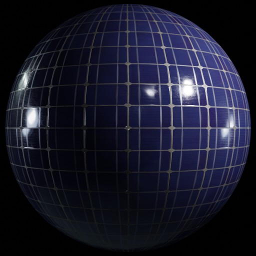 | 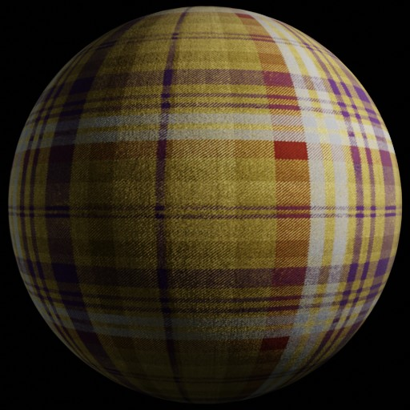 | 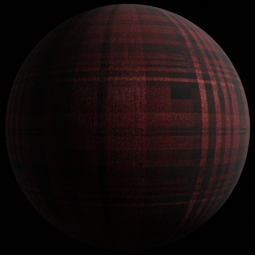 |

|                           plaid\_clean\_03\_30                           |                           plaid\_clean\_04\_30                           |                              plaster\_exterior\_01\_300                              |
| :----------------------------------------------------------------------: | :----------------------------------------------------------------------: | :----------------------------------------------------------------------------------: |
| 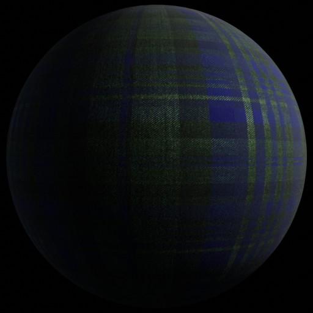 | 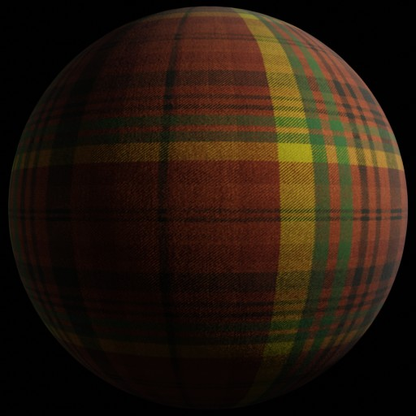 | 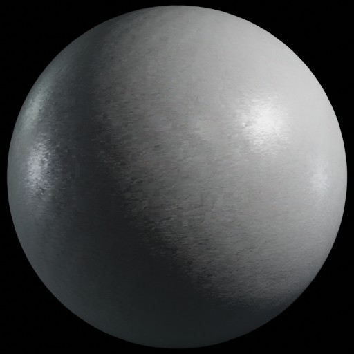 |

|                                 plaster\_exterior\_damp\_01\_300                                |                              plaster\_exterior\_damp\_neutral\_01\_300                              |                                  plaster\_exterior\_neutral\_01\_300                                  |
| :---------------------------------------------------------------------------------------------: | :-------------------------------------------------------------------------------------------------: | :---------------------------------------------------------------------------------------------------: |
| 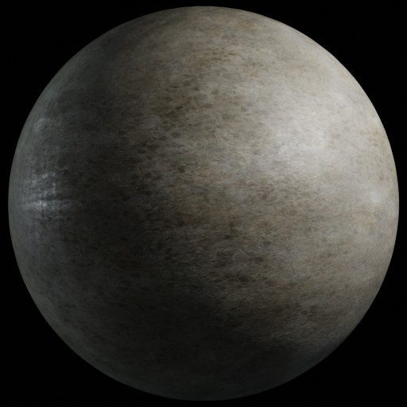 |  | 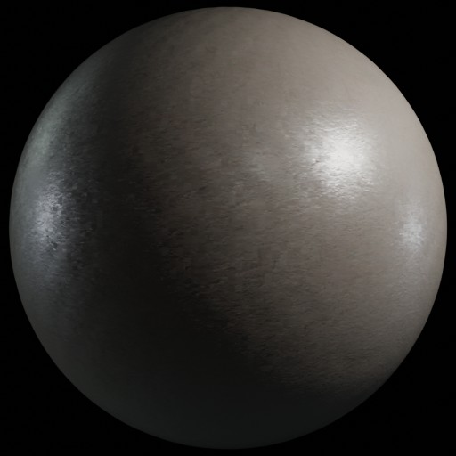 |

|                                  plaster\_exterior\_patched\_01\_300                                  |                                      plaster\_exterior\_patched\_neutral\_01\_300                                      |                                 plaster\_exterior\_rough\_01\_300                                 |
| :---------------------------------------------------------------------------------------------------: | :--------------------------------------------------------------------------------------------------------------------: | :-----------------------------------------------------------------------------------------------: |
| 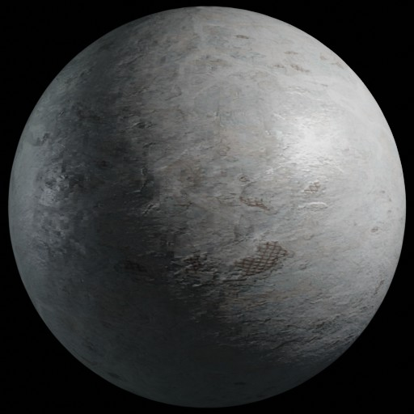 |  | 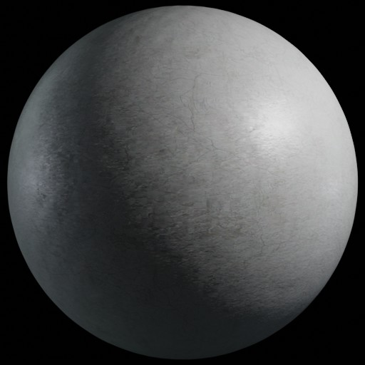 |

|                                        plaster\_exterior\_rough\_neutral\_01\_300\_copy                                       |                            plastic\_camo\_01\_30                           |                              plastic\_hard\_scratches                             |
| :---------------------------------------------------------------------------------------------------------------------------: | :------------------------------------------------------------------------: | :-------------------------------------------------------------------------------: |
| 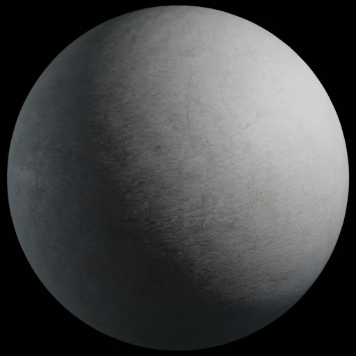 | 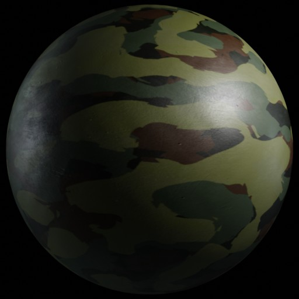 | 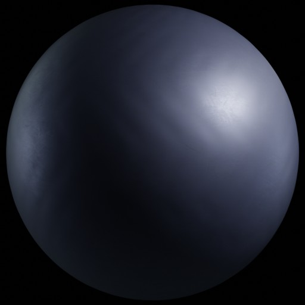 |

|                            plastic\_hard\_smooth                            |                               plastic\_lightcover\_01\_50                              |                                 plastic\_pattern\_bubble\_01\_30                                |
| :-------------------------------------------------------------------------: | :------------------------------------------------------------------------------------: | :---------------------------------------------------------------------------------------------: |
| 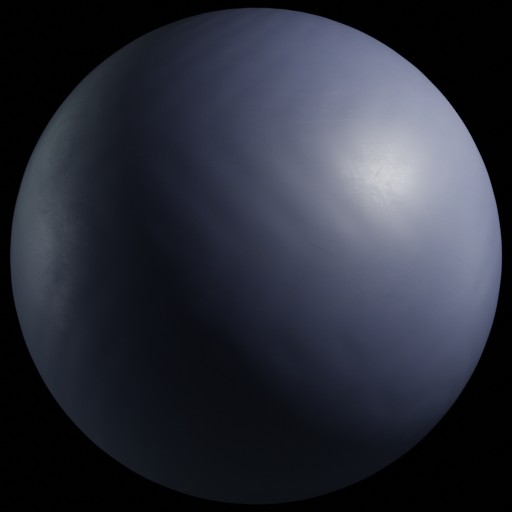 | 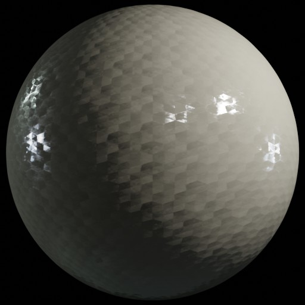 |  |

|                                 plastic\_pattern\_diamond\_01\_30                                 |                                 plastic\_pattern\_smooth\_01\_30                                |                                 plastic\_pattern\_square\_01\_30                                |
| :-----------------------------------------------------------------------------------------------: | :---------------------------------------------------------------------------------------------: | :---------------------------------------------------------------------------------------------: |
| 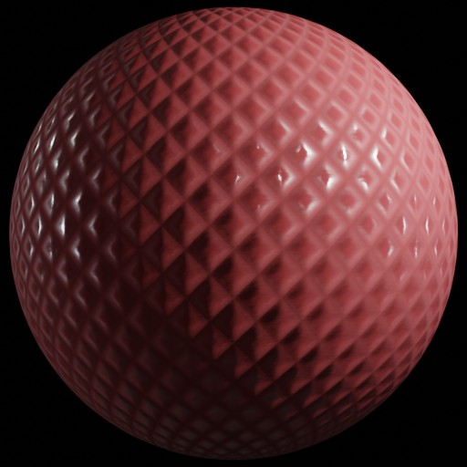 | 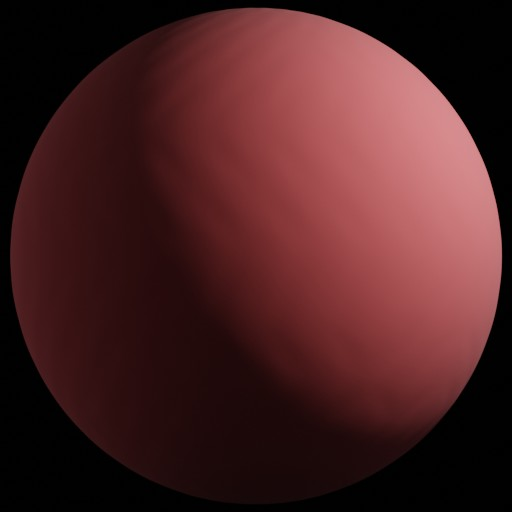 | 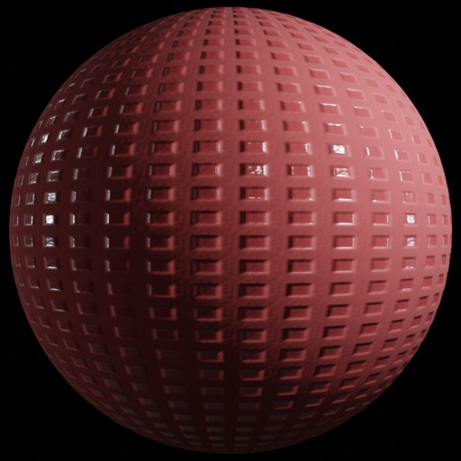 |

|                                  plastic\_pattern\_squiggle\_01\_30                                 |                              plastic\_scraped\_01\_300                             |                                 plastic\_scraped\_matte\_01\_300                                |
| :-------------------------------------------------------------------------------------------------: | :--------------------------------------------------------------------------------: | :---------------------------------------------------------------------------------------------: |
| 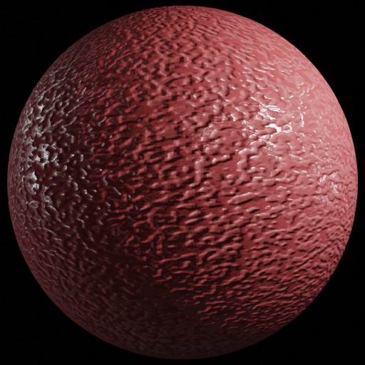 | 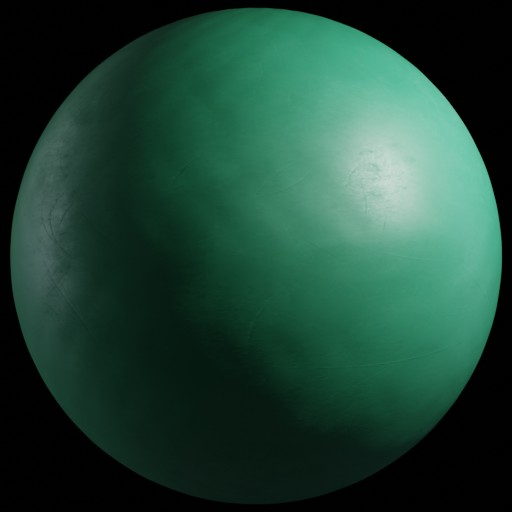 |  |

|                                     plastic\_scraped\_matte\_leopard\_01\_300                                    |                                    plastic\_scraped\_matte\_zebra\_01\_300                                   |                                plastic\_scraped\_old\_01\_300                               |
| :--------------------------------------------------------------------------------------------------------------: | :----------------------------------------------------------------------------------------------------------: | :-----------------------------------------------------------------------------------------: |
| 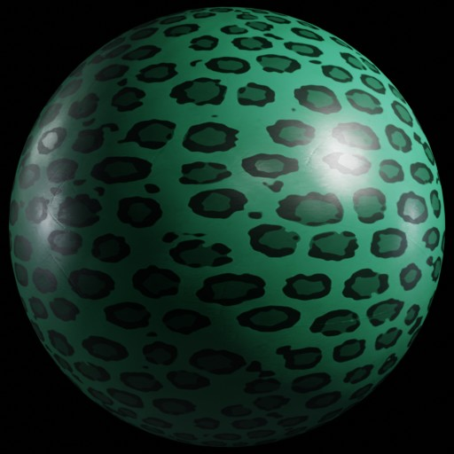 | 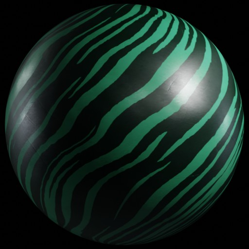 |  |

|                            plastic\_hard\_smooth                            |                               plastic\_lightcover\_01\_50                              |                                 plastic\_pattern\_bubble\_01\_30                                |
| :-------------------------------------------------------------------------: | :------------------------------------------------------------------------------------: | :---------------------------------------------------------------------------------------------: |
|  |  |  |

|                                 plastic\_pattern\_diamond\_01\_30                                 |                                 plastic\_pattern\_smooth\_01\_30                                |                                 plastic\_pattern\_square\_01\_30                                |
| :-----------------------------------------------------------------------------------------------: | :---------------------------------------------------------------------------------------------: | :---------------------------------------------------------------------------------------------: |
|  |  |  |

|                                  plastic\_pattern\_squiggle\_01\_30                                 |                              plastic\_scraped\_01\_300                             |                                 plastic\_scraped\_matte\_01\_300                                |
| :-------------------------------------------------------------------------------------------------: | :--------------------------------------------------------------------------------: | :---------------------------------------------------------------------------------------------: |
|  |  |  |

|                                     plastic\_scraped\_matte\_leopard\_01\_300                                    |                                    plastic\_scraped\_matte\_zebra\_01\_300                                   |                                plastic\_scraped\_old\_01\_300                               |
| :--------------------------------------------------------------------------------------------------------------: | :----------------------------------------------------------------------------------------------------------: | :-----------------------------------------------------------------------------------------: |
|  |  |  |

|                                  plastic\_scraped\_textured\_01\_300                                  |                                    plastic\_scraped\_textured\_hq\_01\_300                                   |                                 plastic\_scraped\_tread1\_01\_300                                 |
| :---------------------------------------------------------------------------------------------------: | :----------------------------------------------------------------------------------------------------------: | :-----------------------------------------------------------------------------------------------: |
|  | 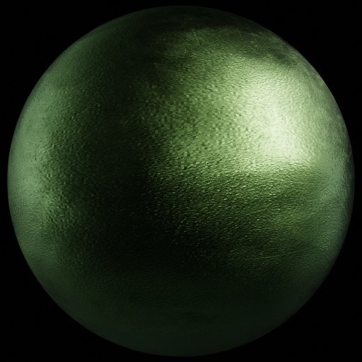 | 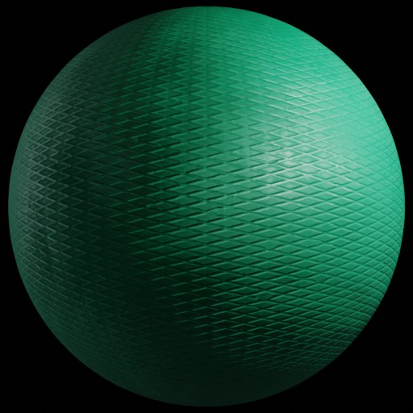 |

|                            plastic\_tarp\_01\_200                            |                            plastic\_tech\_01\_300                            |                               plastic\_tech\_dirty\_01\_300                               |
| :--------------------------------------------------------------------------: | :--------------------------------------------------------------------------: | :---------------------------------------------------------------------------------------: |
| 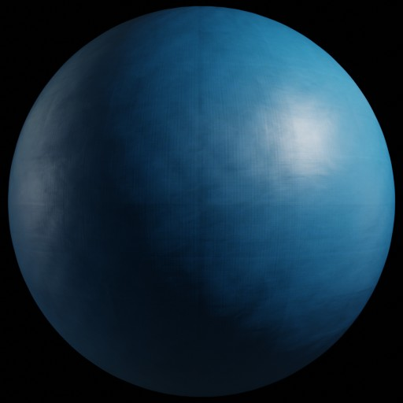 |  | 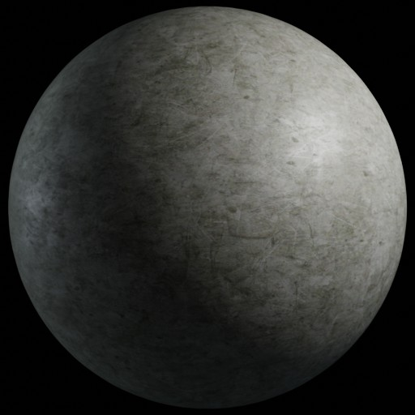 |

|                                plastic\_tech\_glossy\_01\_300                               |                             plastic\_tech\_hq\_01\_30                             |                               plastic\_tech\_neon\_01\_300                              |
| :-----------------------------------------------------------------------------------------: | :-------------------------------------------------------------------------------: | :-------------------------------------------------------------------------------------: |
|  | 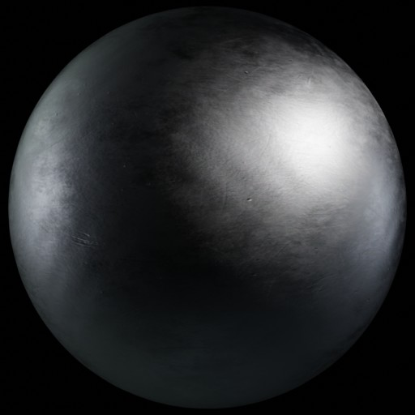 | 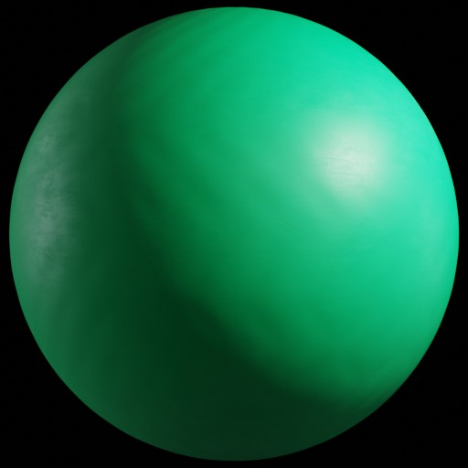 |

|                                  plastic\_tech\_threadplate\_01\_300                                  |                               plastic\_tech\_worn\_01\_300                              |                            player\_wa\_shirt\_01                           |
| :---------------------------------------------------------------------------------------------------: | :-------------------------------------------------------------------------------------: | :------------------------------------------------------------------------: |
| 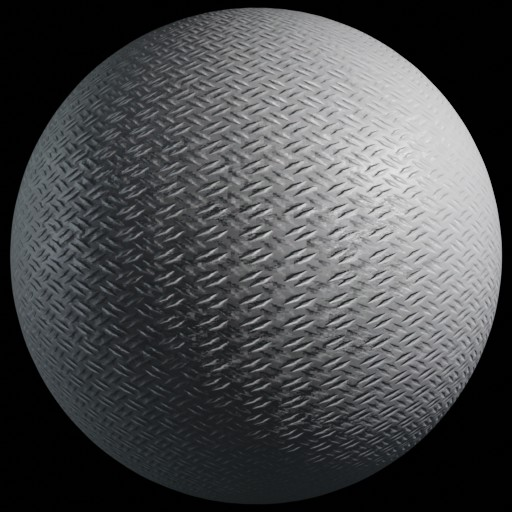 | 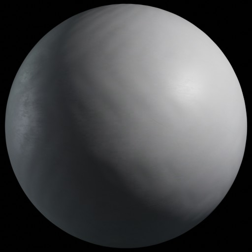 | 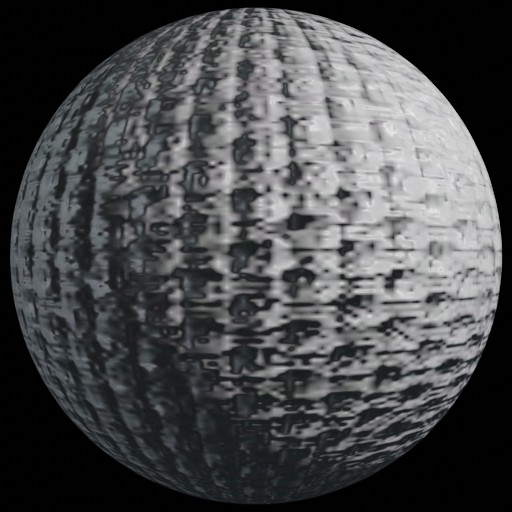 |

|                                polyester\_knit\_clean\_01\_30                               |                                polyester\_knit\_clean\_02\_30                               |                                polyester\_knit\_clean\_03\_30                               |
| :-----------------------------------------------------------------------------------------: | :-----------------------------------------------------------------------------------------: | :-----------------------------------------------------------------------------------------: |
| 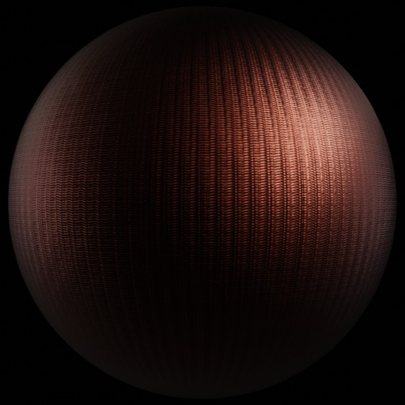 | 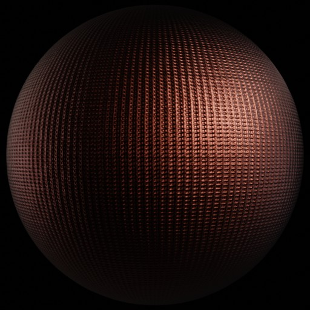 | 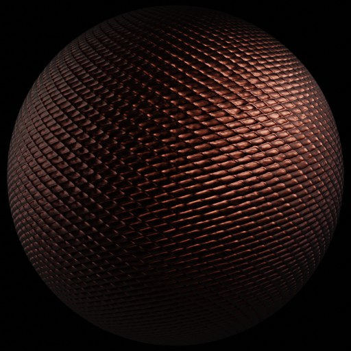 |

|                                 polyester\_knit\_metallic\_01\_30                                 |                              polythene\_sheet\_01\_200                             |                                 polythene\_sheet\_leaks\_01\_200                                |
| :-----------------------------------------------------------------------------------------------: | :--------------------------------------------------------------------------------: | :---------------------------------------------------------------------------------------------: |
| 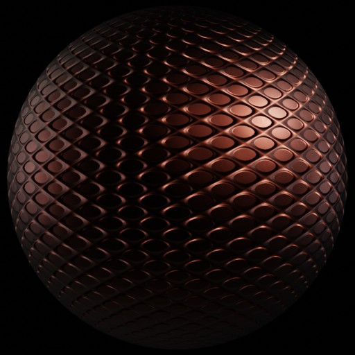 | 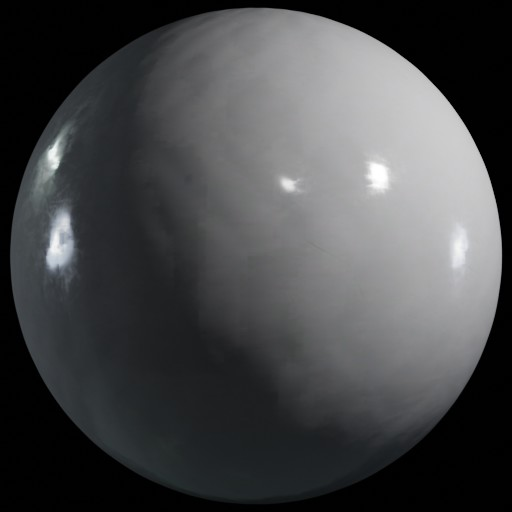 | 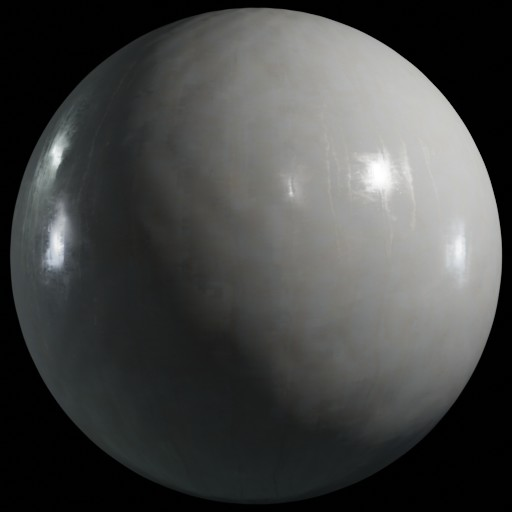 |

|                                  polythene\_sheet\_moisture\_01\_200                                  |                          rock\_debris\_01                         |                             rubber\_bumper\_01\_300                            |
| :---------------------------------------------------------------------------------------------------: | :---------------------------------------------------------------: | :----------------------------------------------------------------------------: |
| 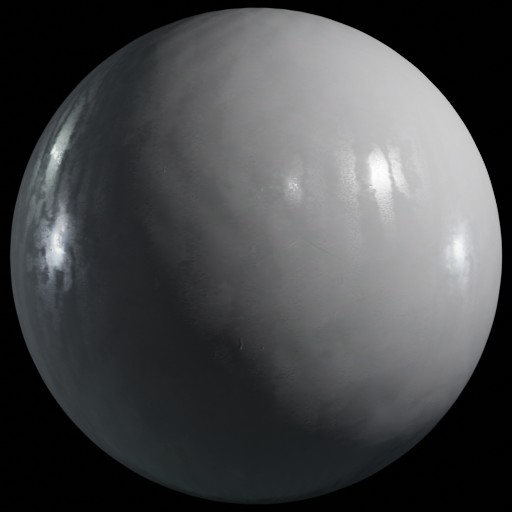 | 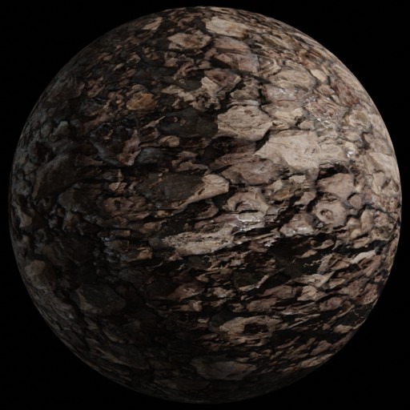 | 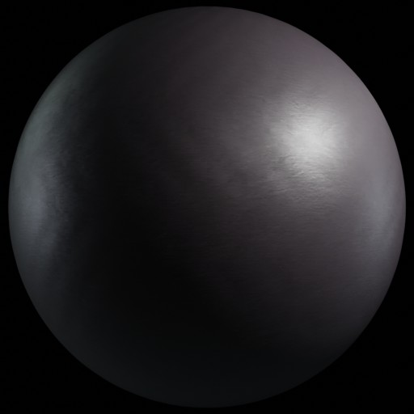 |

|                                 rubber\_bumper\_damaged\_01\_300                                |                             rubber\_clean\_hq\_01\_30                             |                               rubber\_simple\_clean\_01\_30                               |
| :---------------------------------------------------------------------------------------------: | :-------------------------------------------------------------------------------: | :---------------------------------------------------------------------------------------: |
| 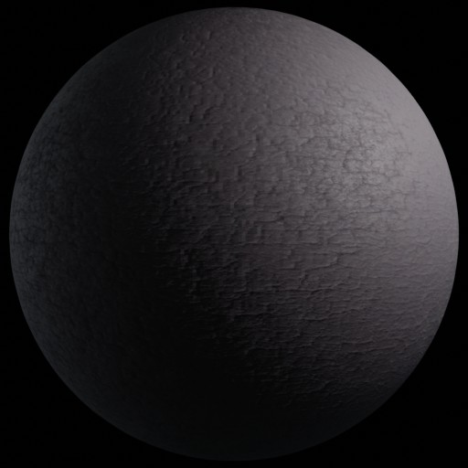 | 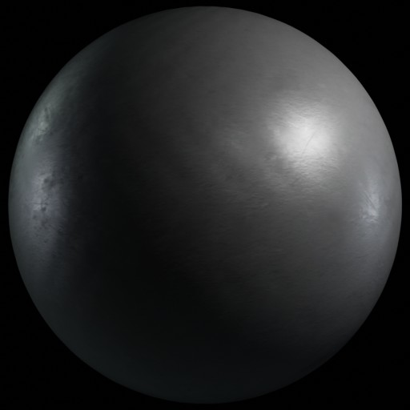 | 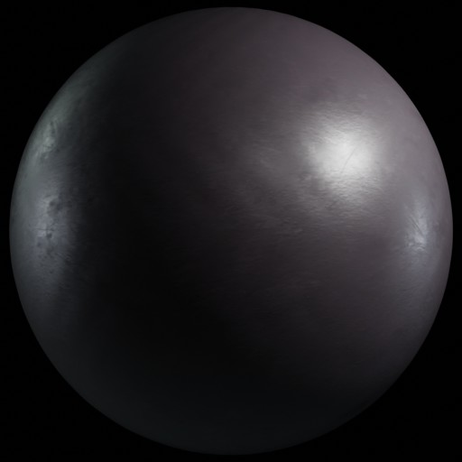 |

|                                 rubber\_simple\_weathered\_01\_30                                 |                              rust\_thick\_flaky\_01\_300                              |                              rust\_thick\_rough\_01\_300                              |
| :-----------------------------------------------------------------------------------------------: | :-----------------------------------------------------------------------------------: | :-----------------------------------------------------------------------------------: |
| 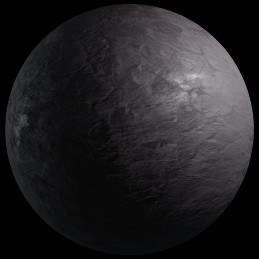 | 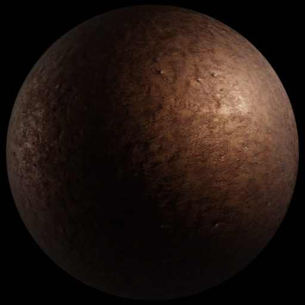 |  |

|                               rust\_thick\_smooth\_01\_300                              |                              rust\_thick\_spots\_01\_300                              |                            sand\_compressed\_01                           |
| :-------------------------------------------------------------------------------------: | :-----------------------------------------------------------------------------------: | :-----------------------------------------------------------------------: |
| 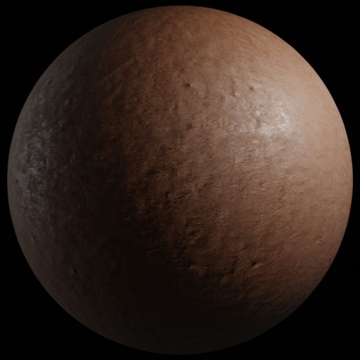 | 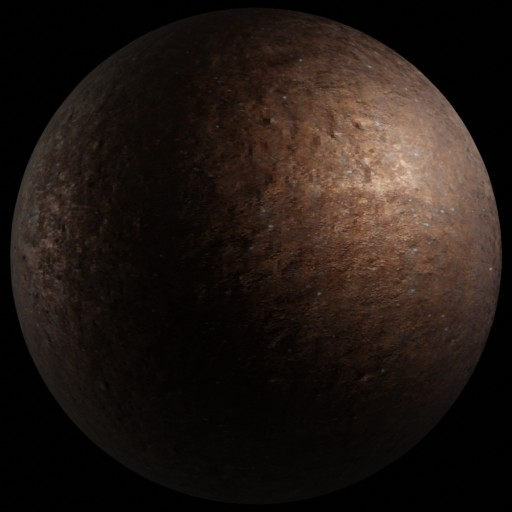 | 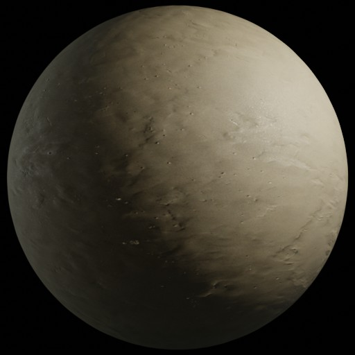 |

|                            sand\_dry\_cracked\_01                            |                         sand\_loose\_01                         |                            sequin\_clean\_01\_30                           |
| :--------------------------------------------------------------------------: | :-------------------------------------------------------------: | :------------------------------------------------------------------------: |
| 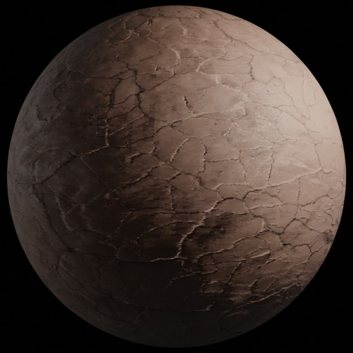 | 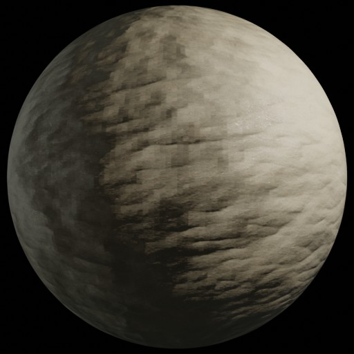 | 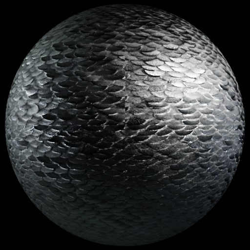 |

|                           silk\_clean\_01\_30                          |                            silver\_bare\_01\_300                           |                             silver\_brushed\_01\_300                             |
| :--------------------------------------------------------------------: | :------------------------------------------------------------------------: | :------------------------------------------------------------------------------: |
| 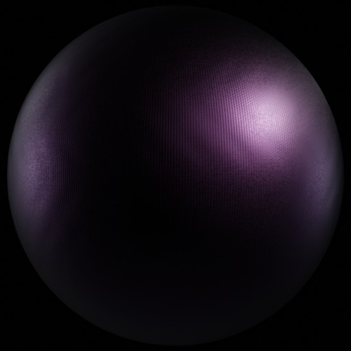 | 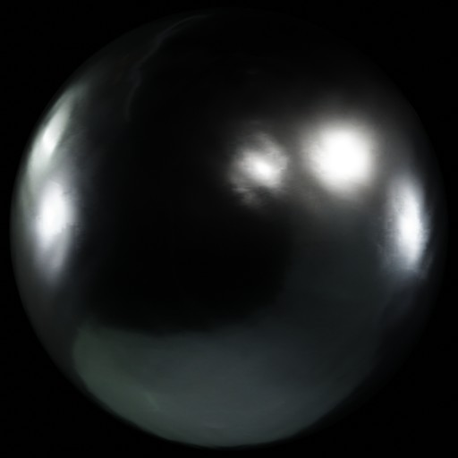 | 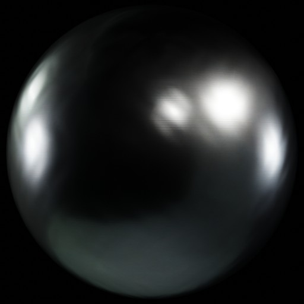 |

|                           silver\_old\_01\_300                           |                              silver\_polished\_01\_300                             |                            silver\_rough\_01\_300                            |
| :----------------------------------------------------------------------: | :--------------------------------------------------------------------------------: | :--------------------------------------------------------------------------: |
| 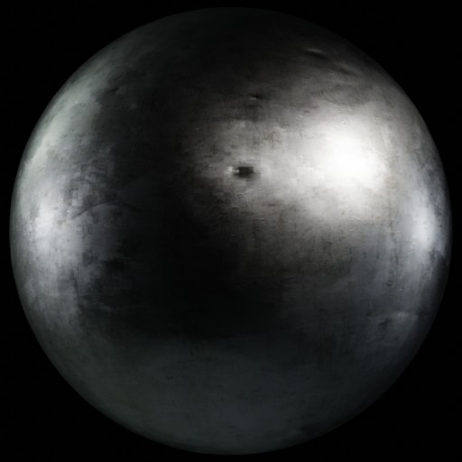 | 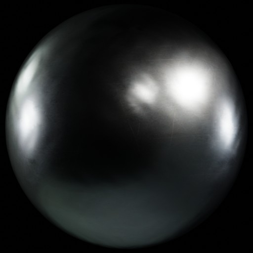 | 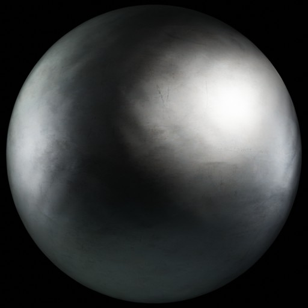 |

|                              soil\_peat\_coarse\_01\_100                              |                             soil\_peat\_fine\_01\_100                             |                         soil\_rocky\_01                         |
| :-----------------------------------------------------------------------------------: | :-------------------------------------------------------------------------------: | :-------------------------------------------------------------: |
| 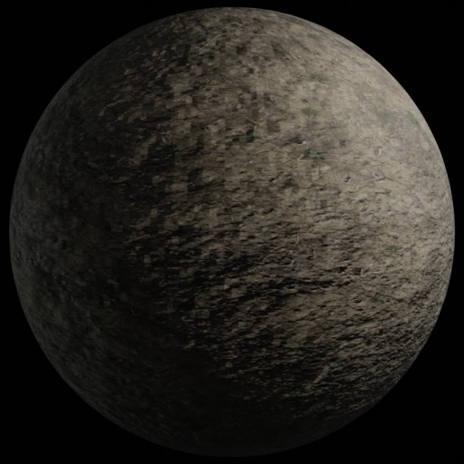 |  | 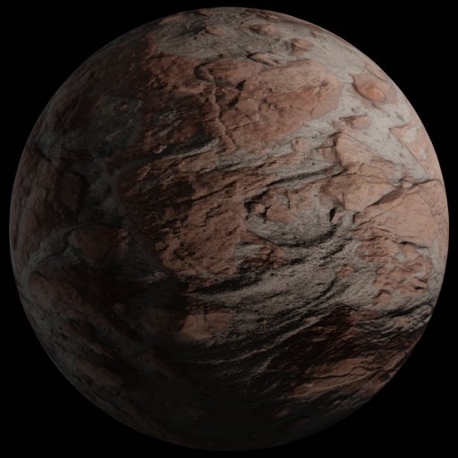 |

|                         soil\_rocky\_01                         |                         soil\_sandy\_01                         |                            spandex\_clean\_01\_30                            |
| :-------------------------------------------------------------: | :-------------------------------------------------------------: | :--------------------------------------------------------------------------: |
|  | 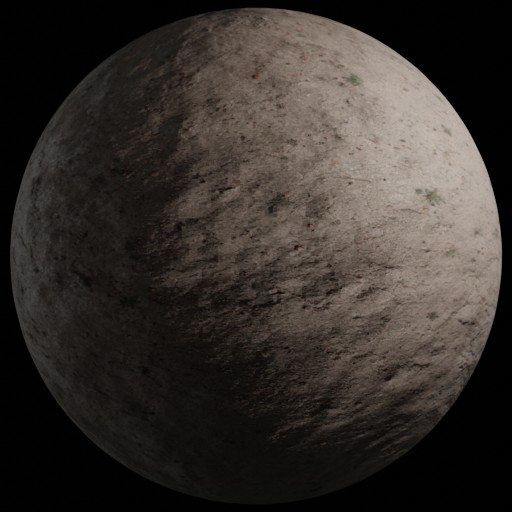 | 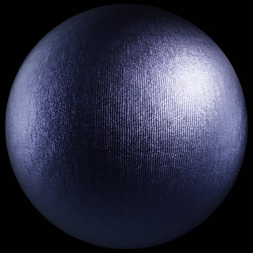 |

|                            spandex\_clean\_02\_30                            |                           stains\_oil\_01\_100                           |                           steel\_bare\_01\_300                           |
| :--------------------------------------------------------------------------: | :----------------------------------------------------------------------: | :----------------------------------------------------------------------: |
| 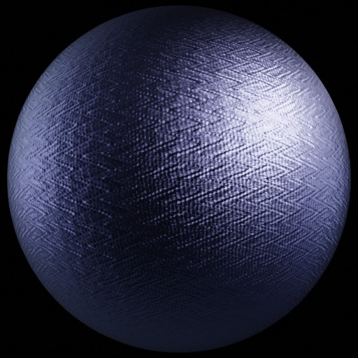 | 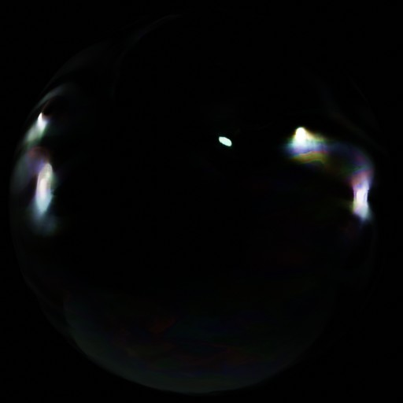 |  |

|                                steel\_bare\_annodised\_01\_300                                |                                 steel\_bare\_threadplate\_01\_300                                 |                            steel\_brushed\_01\_30                            |
| :-------------------------------------------------------------------------------------------: | :-----------------------------------------------------------------------------------------------: | :--------------------------------------------------------------------------: |
| 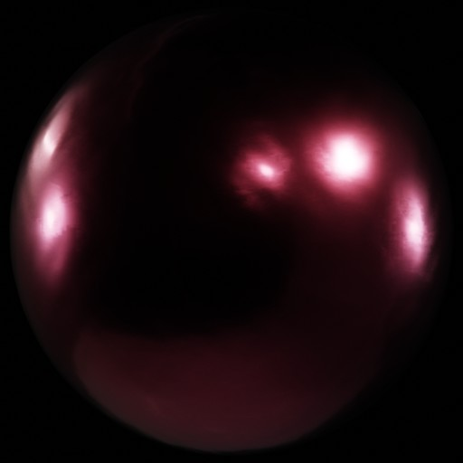 | 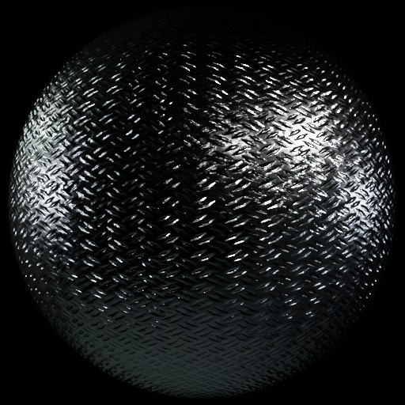 | 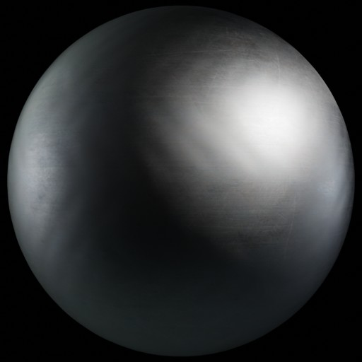 |

|                             steel\_brushed\_01\_300                            |                            steel\_dented\_01\_100                            |                                 steel\_dented\_annodised\_01\_100                                 |
| :----------------------------------------------------------------------------: | :--------------------------------------------------------------------------: | :-----------------------------------------------------------------------------------------------: |
| 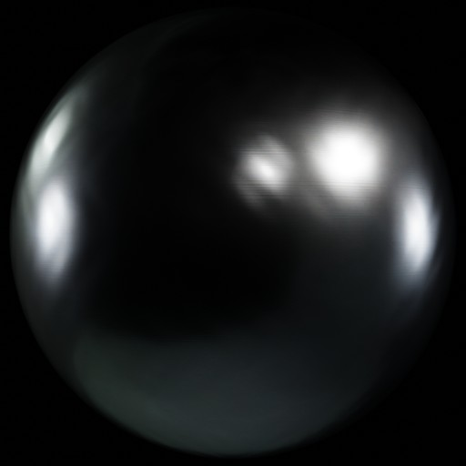 | 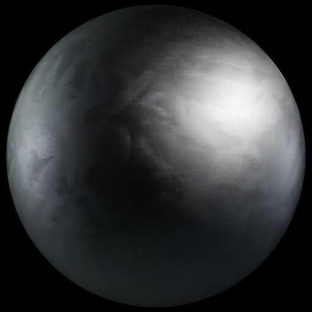 | 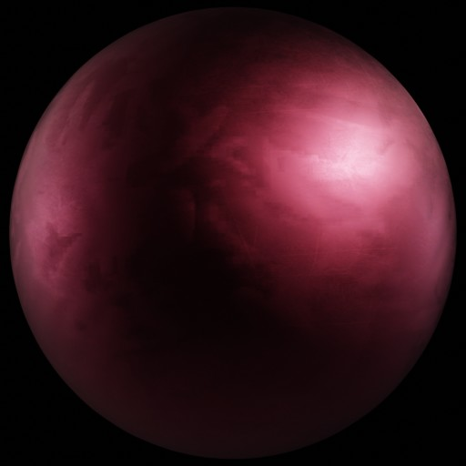 |

|                                steel\_dented\_coroded\_01\_100                                |                                steel\_dented\_coroded\_01\_100                                |                              steel\_galvanized\_01\_300                              |
| :-------------------------------------------------------------------------------------------: | :-------------------------------------------------------------------------------------------: | :----------------------------------------------------------------------------------: |
| 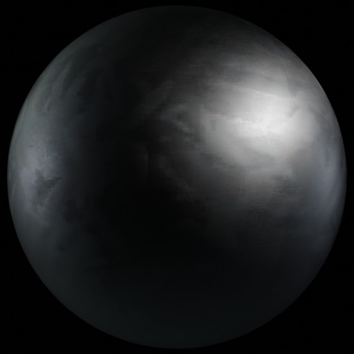 |  | 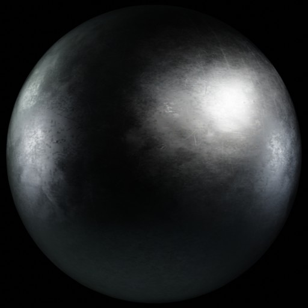 |

|                                    steel\_galvanized\_corrugated\_01\_300                                   |                                    steel\_galvanized\_corrugated\_02\_300                                   |                                        steel\_galvanized\_corrugated\_painted\_01\_300                                       |
| :---------------------------------------------------------------------------------------------------------: | :---------------------------------------------------------------------------------------------------------: | :--------------------------------------------------------------------------------------------------------------------------: |
| 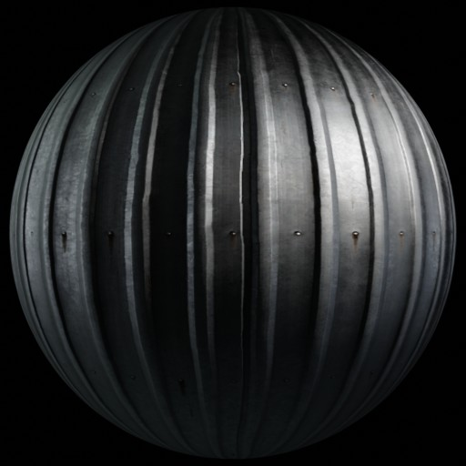 | 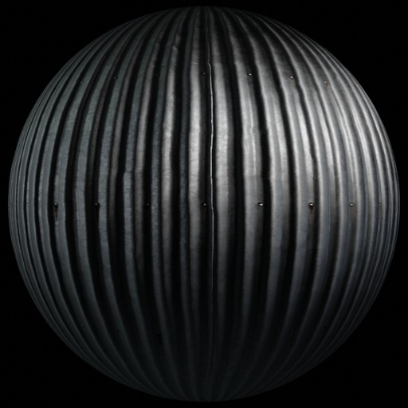 | 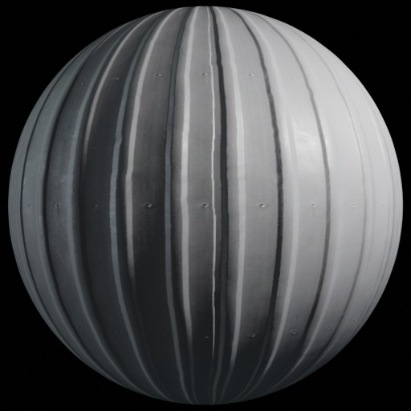 |

|                                        steel\_galvanized\_corrugated\_painted\_02\_300                                       |                                      steel\_galvanized\_corrugated\_rust\_01\_300                                      |                                      steel\_galvanized\_corrugated\_rust\_02\_300                                      |
| :--------------------------------------------------------------------------------------------------------------------------: | :--------------------------------------------------------------------------------------------------------------------: | :--------------------------------------------------------------------------------------------------------------------: |
| 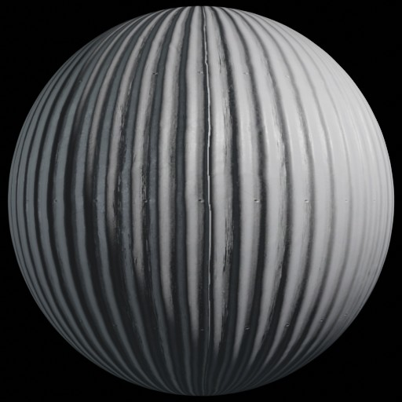 | 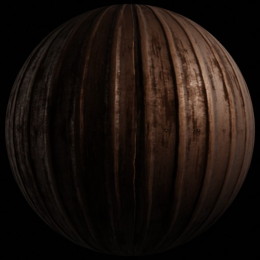 | 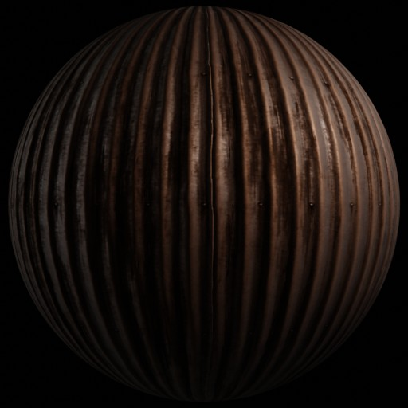 |

|                              steel\_hq\_brushed\_01\_10                             |                             steel\_hq\_milled\_01\_10                             |                             steel\_hq\_milled\_02\_10                             |
| :---------------------------------------------------------------------------------: | :-------------------------------------------------------------------------------: | :-------------------------------------------------------------------------------: |
| 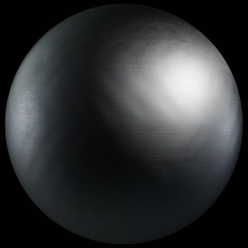 | 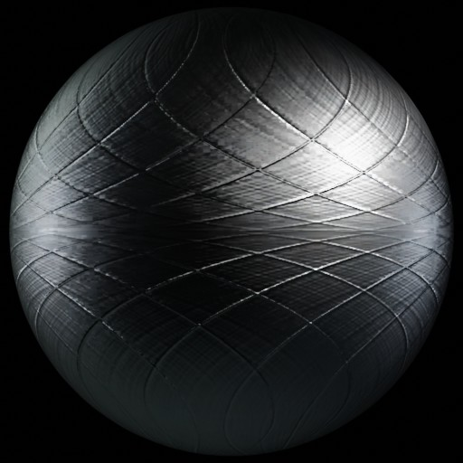 | 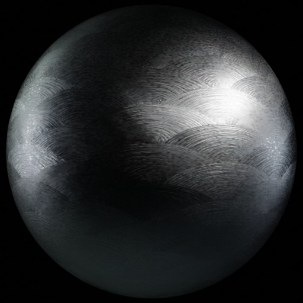 |

|                             steel\_hq\_noise\_01\_10                            |                           steel\_old\_01\_300                          |                              steel\_old\_rusty\_01\_300                             |
| :-----------------------------------------------------------------------------: | :--------------------------------------------------------------------: | :---------------------------------------------------------------------------------: |
| 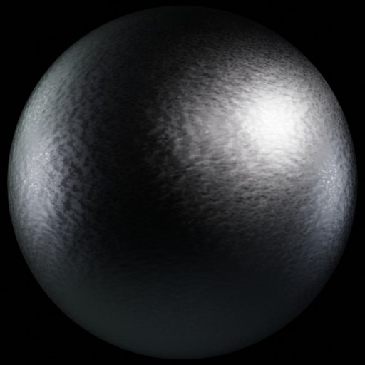 | 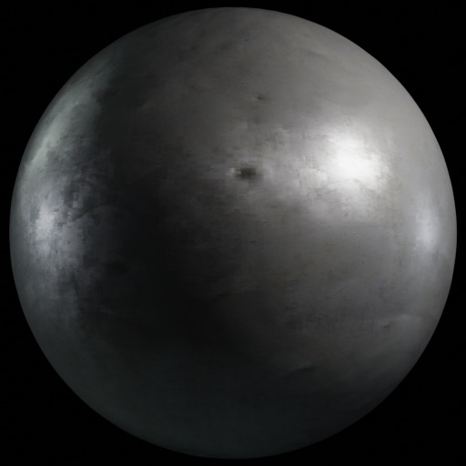 | 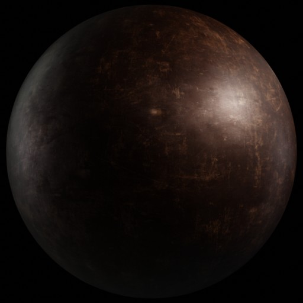 |

|                                    steel\_old\_rusty\_threadplate\_01\_300                                   |                               steel\_old\_scraped\_01\_300                              |                                 steel\_old\_threadplate\_01\_300                                |
| :----------------------------------------------------------------------------------------------------------: | :-------------------------------------------------------------------------------------: | :---------------------------------------------------------------------------------------------: |
| 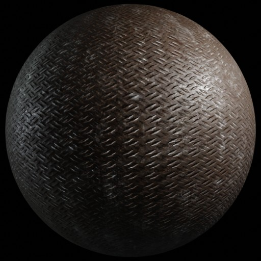 | 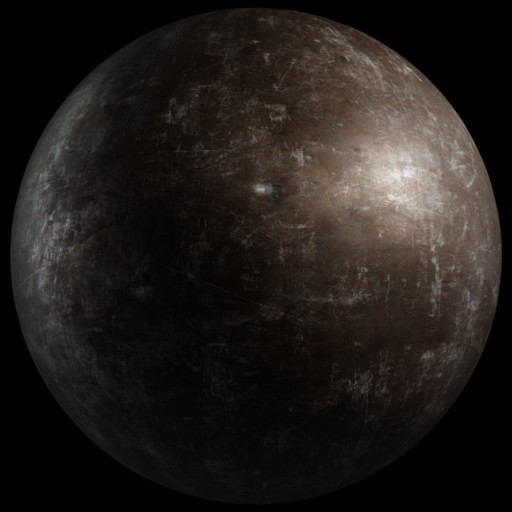 | 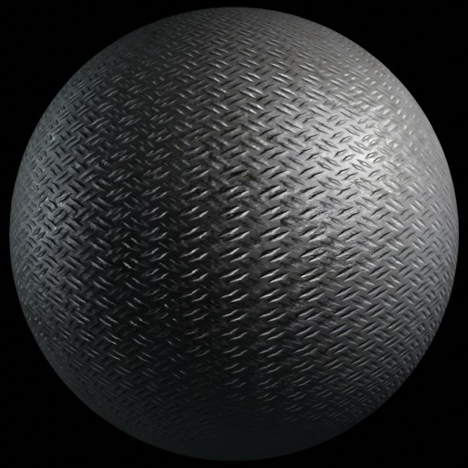 |

|                              steel\_perforated\_01\_100                              |                             steel\_polished\_01\_300                             |                           steel\_rebar\_01\_30                           |
| :----------------------------------------------------------------------------------: | :------------------------------------------------------------------------------: | :----------------------------------------------------------------------: |
| 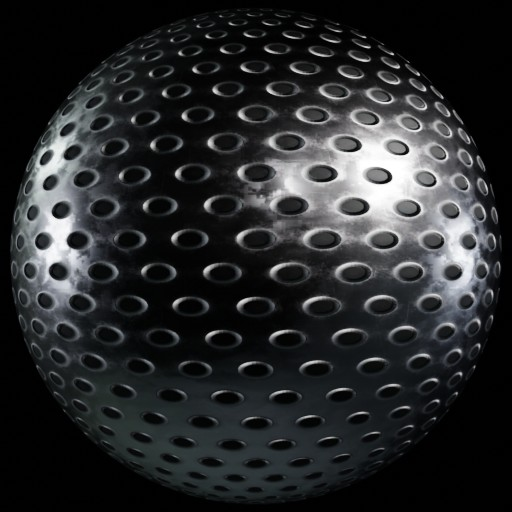 | 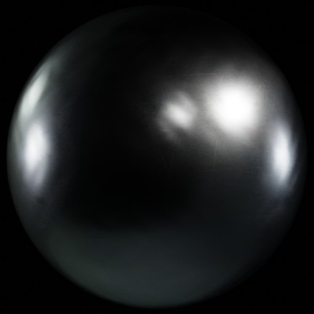 | 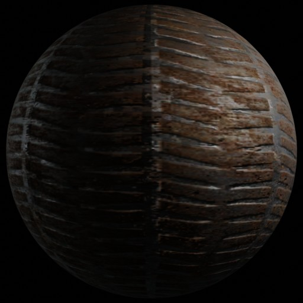 |

|                               steel\_rolled\_bare\_01\_300                              |                                    steel\_rolled\_bare\_annodised\_01\_300                                   |                               steel\_rolled\_rough\_01\_300                               |
| :-------------------------------------------------------------------------------------: | :----------------------------------------------------------------------------------------------------------: | :---------------------------------------------------------------------------------------: |
| 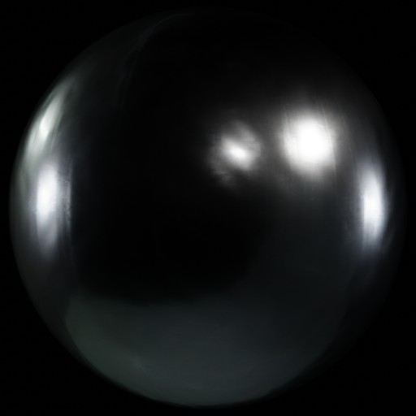 | 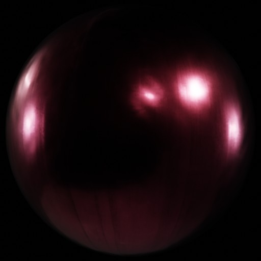 | 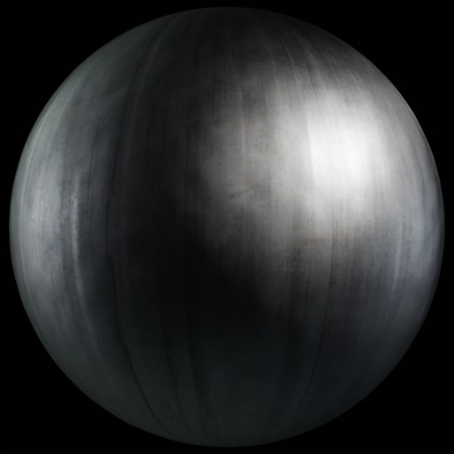 |

|                            steel\_rough\_01\_300                           |                                  steel\_rough\_threadplate\_01\_300                                 |                                steel\_tempered\_large\_01\_30                               |
| :------------------------------------------------------------------------: | :-------------------------------------------------------------------------------------------------: | :-----------------------------------------------------------------------------------------: |
| 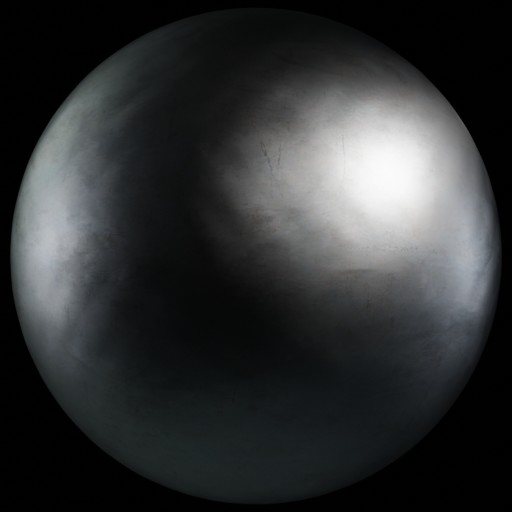 | 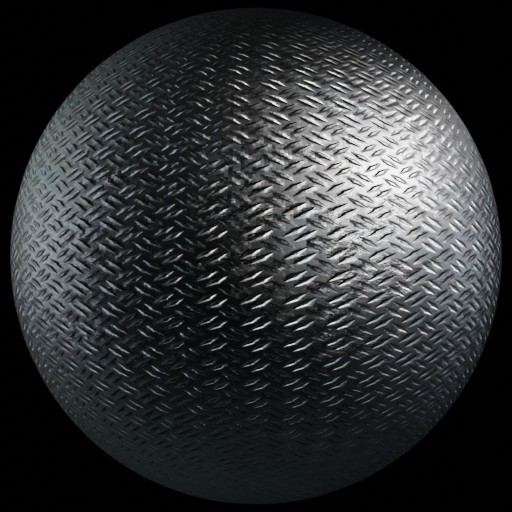 | 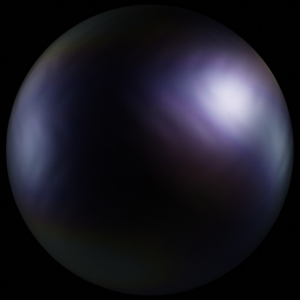 |

|                                steel\_tempered\_large\_02\_30                               |                                steel\_tempered\_medium\_01\_30                                |                                steel\_tempered\_small\_01\_30                               |
| :-----------------------------------------------------------------------------------------: | :-------------------------------------------------------------------------------------------: | :-----------------------------------------------------------------------------------------: |
| 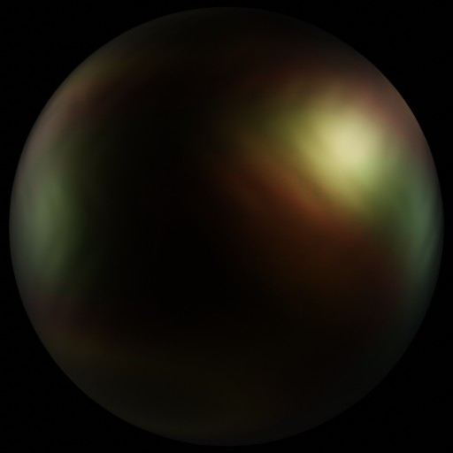 | 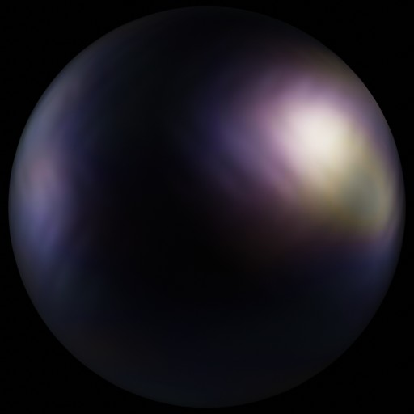 | 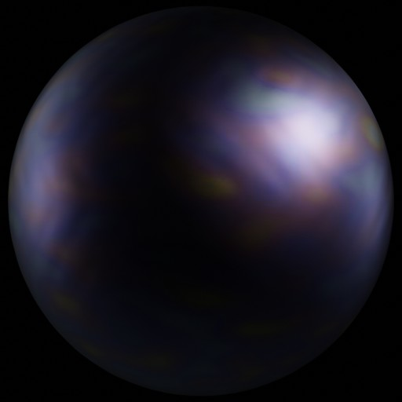 |

|                          sticker\_bomb\_01                          |                              terrain\_asphalt\_old\_01                             |                                   terrain\_asphalt\_old\_fractured\_01                                  |
| :-----------------------------------------------------------------: | :--------------------------------------------------------------------------------: | :-----------------------------------------------------------------------------------------------------: |
| 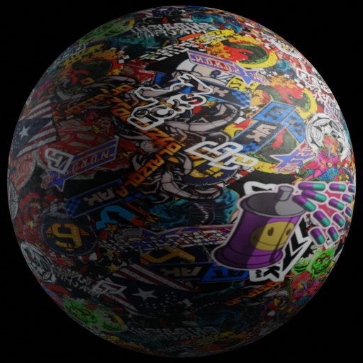 | 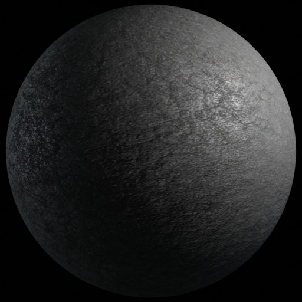 | 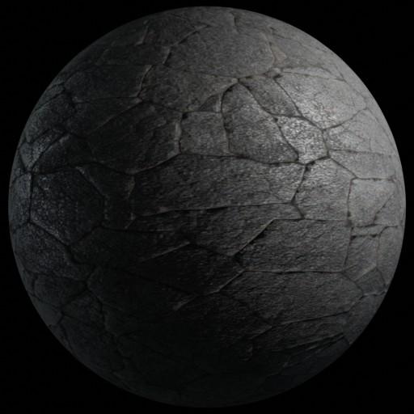 |

|                             terrain\_cliff\_rock\_01                             |                             terrain\_cliff\_rock\_02                             |                             terrain\_cliff\_rock\_03                             |
| :------------------------------------------------------------------------------: | :------------------------------------------------------------------------------: | :------------------------------------------------------------------------------: |
| 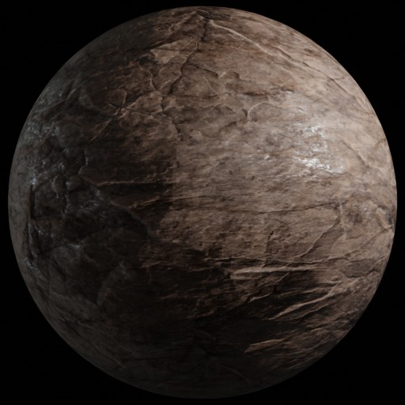 | 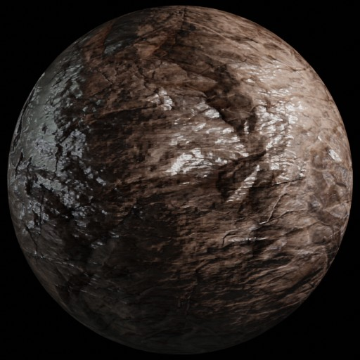 | 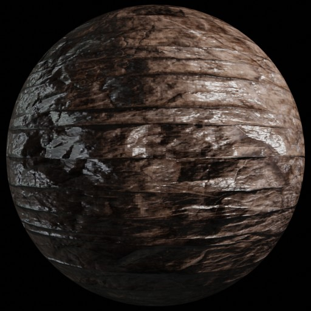 |

|                               terrain\_concrete\_road\_01                              |                                   terrain\_concrete\_road\_cracked\_01                                  |                             terrain\_grass\_dry\_01                            |
| :------------------------------------------------------------------------------------: | :-----------------------------------------------------------------------------------------------------: | :----------------------------------------------------------------------------: |
| 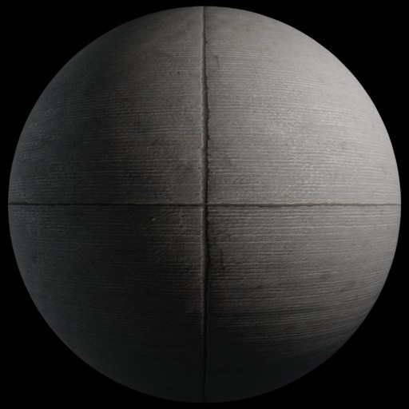 | 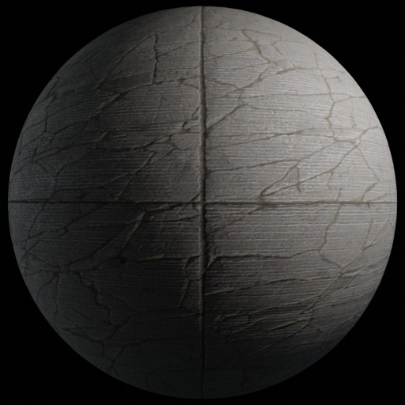 |  |

|                              terrain\_grass\_green\_01                             |                              terrain\_grass\_scrub\_01                             |                           terrain\_gravel\_01                           |
| :--------------------------------------------------------------------------------: | :--------------------------------------------------------------------------------: | :---------------------------------------------------------------------: |
|  | 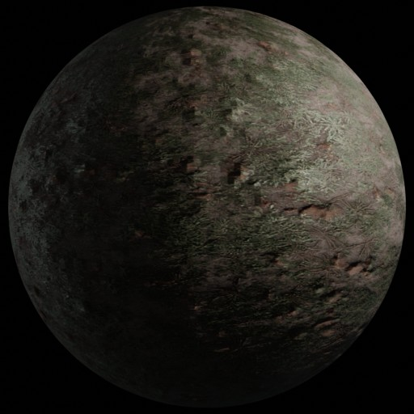 | 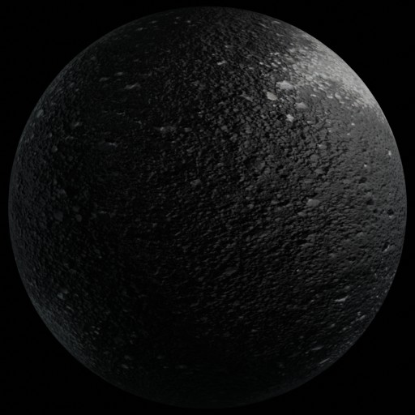 |

|                          terrain\_mud\_01                         |                              terrain\_rock\_debris\_01                             |                                terrain\_sand\_compressed\_01                               |
| :---------------------------------------------------------------: | :--------------------------------------------------------------------------------: | :----------------------------------------------------------------------------------------: |
| 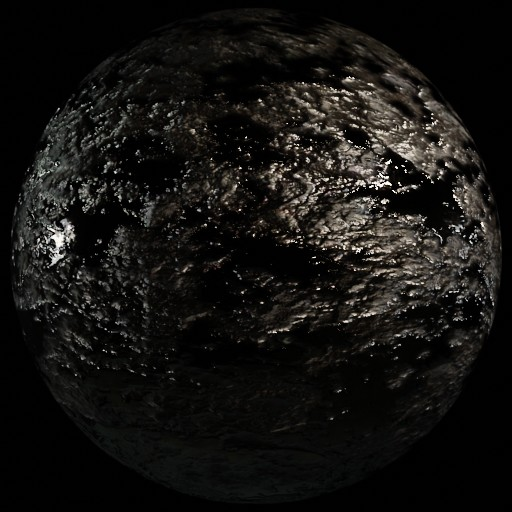 | 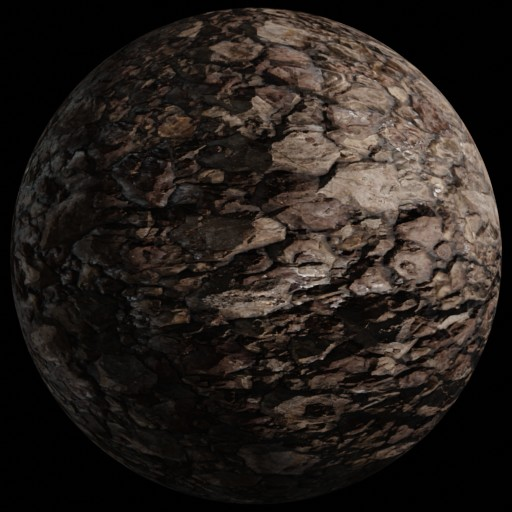 | 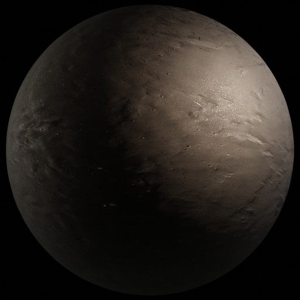 |

|                                terrain\_sand\_dry\_cracked\_01                                |                             terrain\_sand\_loose\_01                             |                             terrain\_soil\_rocky\_01                             |
| :-------------------------------------------------------------------------------------------: | :------------------------------------------------------------------------------: | :------------------------------------------------------------------------------: |
| 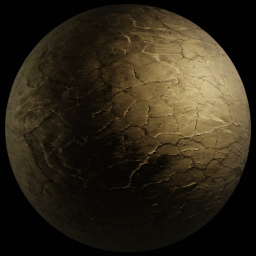 | 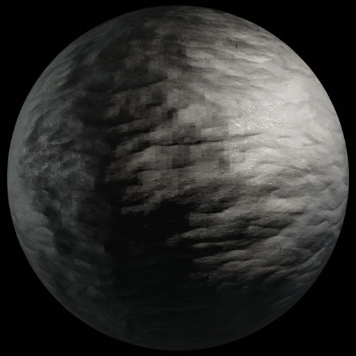 | 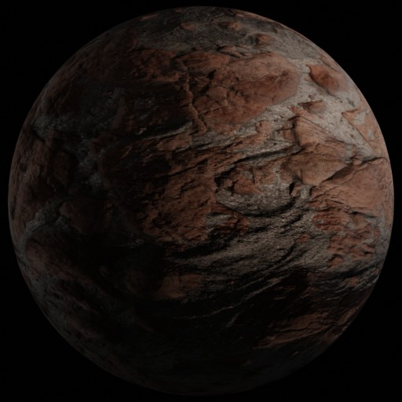 |

|                             terrain\_soil\_sandy\_01                             |                           terrain\_trash\_01                          |                             titanium\_bare\_01\_300                            |
| :------------------------------------------------------------------------------: | :-------------------------------------------------------------------: | :----------------------------------------------------------------------------: |
| 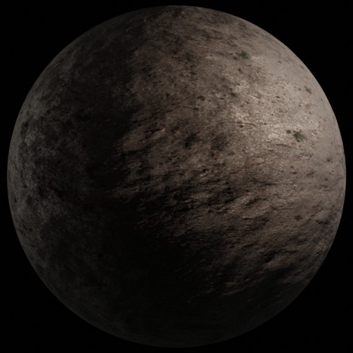 | 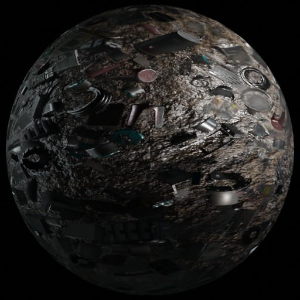 |  |

|                              titanium\_brushed\_01\_300                              |                            titanium\_old\_01\_300                            |                               titanium\_polished\_01\_300                              |
| :----------------------------------------------------------------------------------: | :--------------------------------------------------------------------------: | :------------------------------------------------------------------------------------: |
| 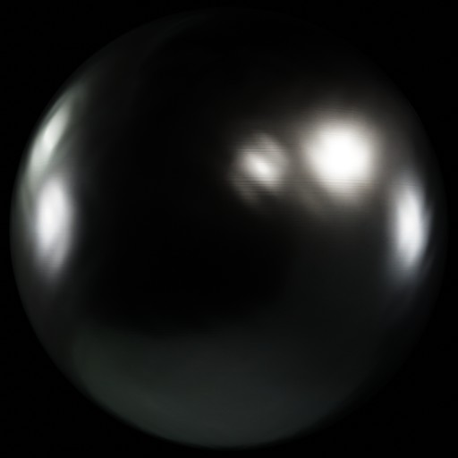 | 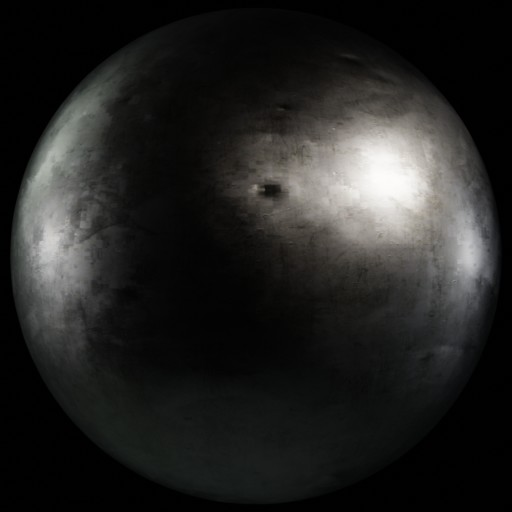 | 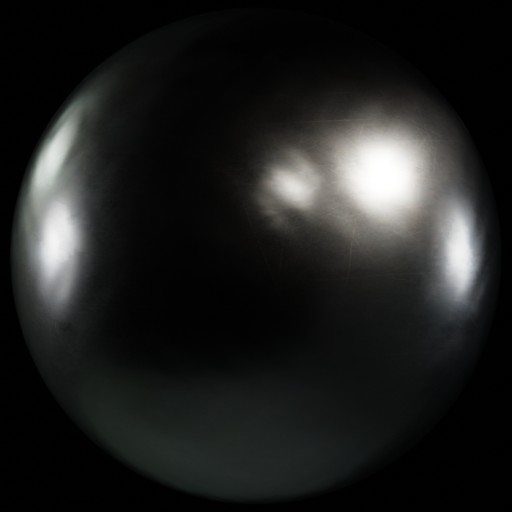 |

|                                titanium\_rolled\_bare\_01\_300                                |                                 titanium\_rolled\_rough\_01\_300                                |                             titanium\_rough\_01\_300                             |
| :-------------------------------------------------------------------------------------------: | :---------------------------------------------------------------------------------------------: | :------------------------------------------------------------------------------: |
| 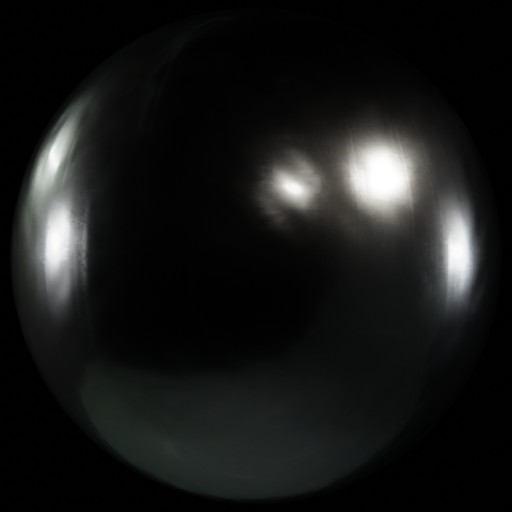 | 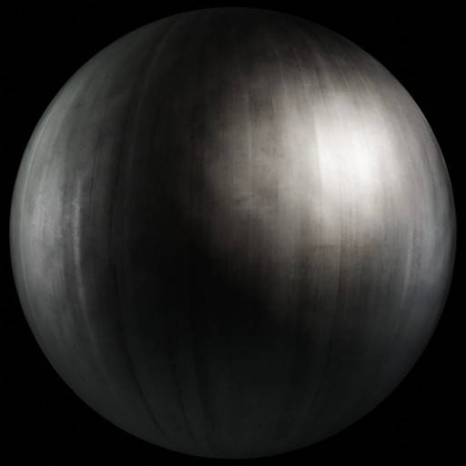 | 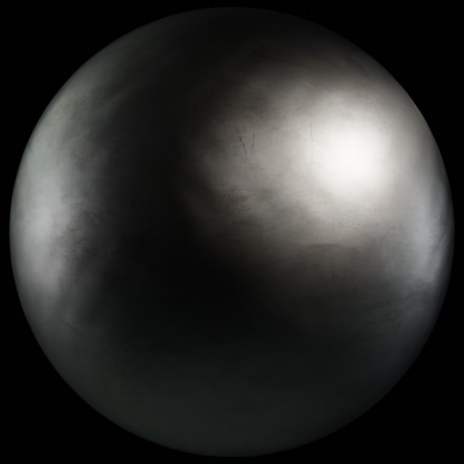 |

|                       trash\_01                      |                      unused                     |                            velvet\_clean\_01\_30                           |
| :--------------------------------------------------: | :---------------------------------------------: | :------------------------------------------------------------------------: |
| 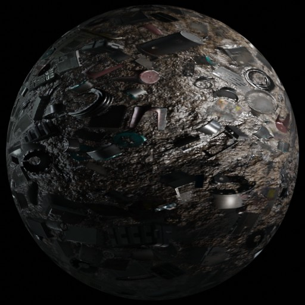 | 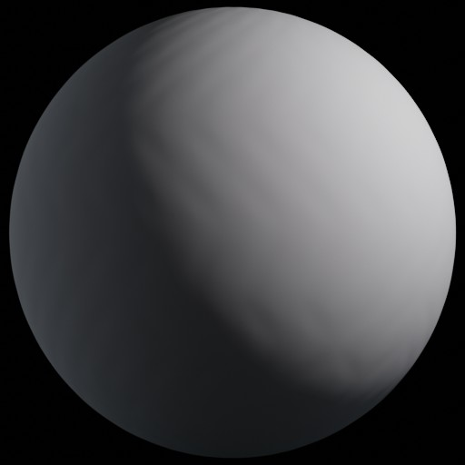 |  |

|                                  wallpaper\_pattern\_a\_old\_01\_300                                 |                              wallpaper\_plain\_01\_300                             |                                wallpaper\_plain\_damp\_01\_300                                |
| :--------------------------------------------------------------------------------------------------: | :--------------------------------------------------------------------------------: | :-------------------------------------------------------------------------------------------: |
| 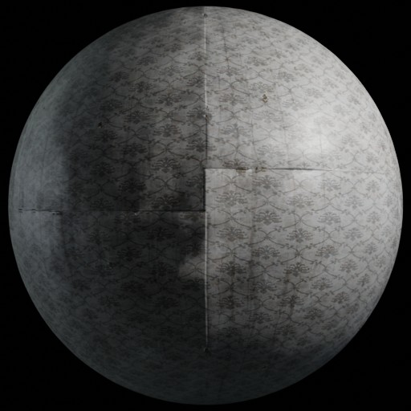 | 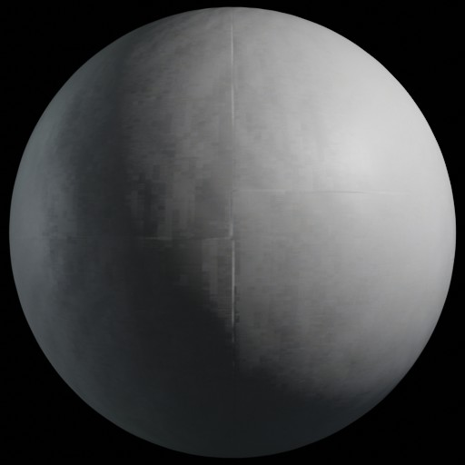 | 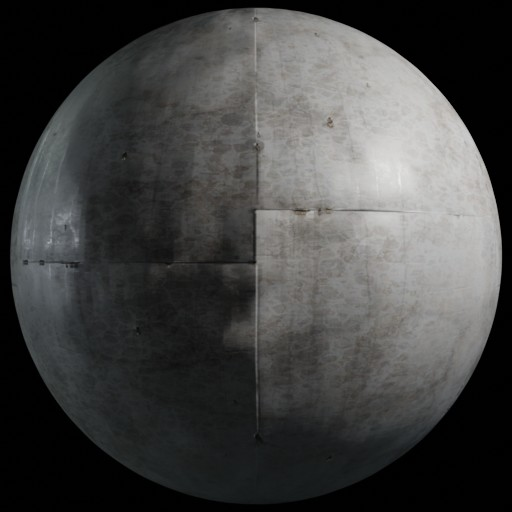 |

|                            water\_puddle\_01\_150                            |                             windows\_opaque\_01\_200                             |                                windows\_opaque\_foil\_01\_200                               |
| :--------------------------------------------------------------------------: | :------------------------------------------------------------------------------: | :-----------------------------------------------------------------------------------------: |
| 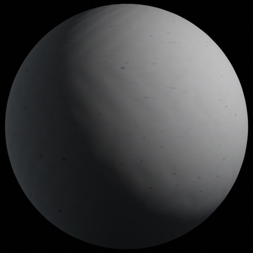 | 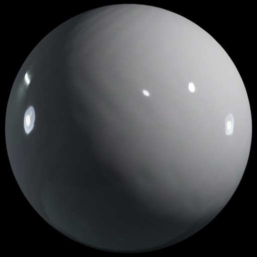 | 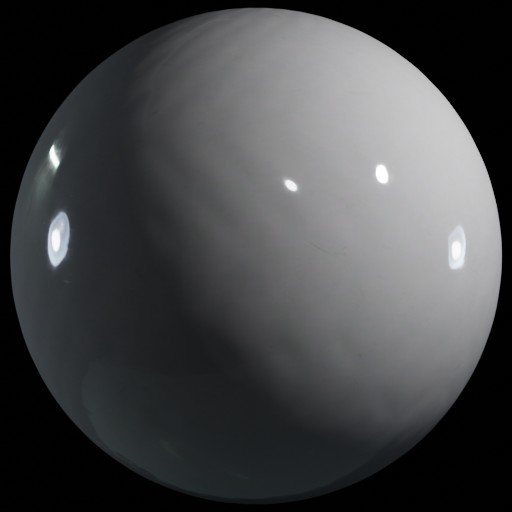 |

|                                    windows\_opaque\_foil\_streaky\_01\_200                                   |                                 windows\_opaque\_streaky\_01\_200                                 |                            wood\_hq\_burl\_01\_30                           |
| :----------------------------------------------------------------------------------------------------------: | :-----------------------------------------------------------------------------------------------: | :-------------------------------------------------------------------------: |
| 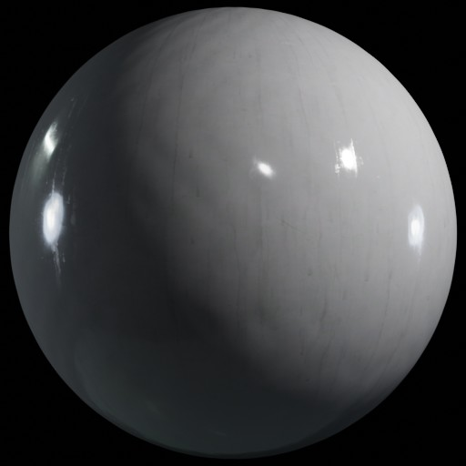 | 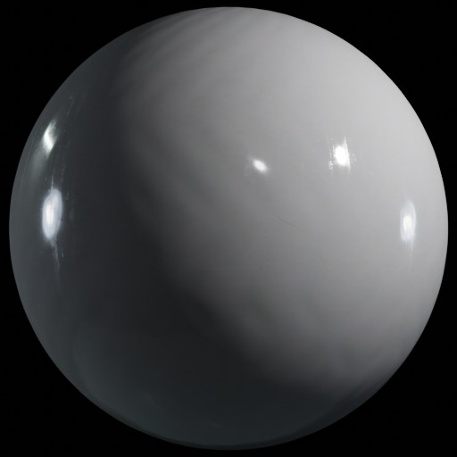 | 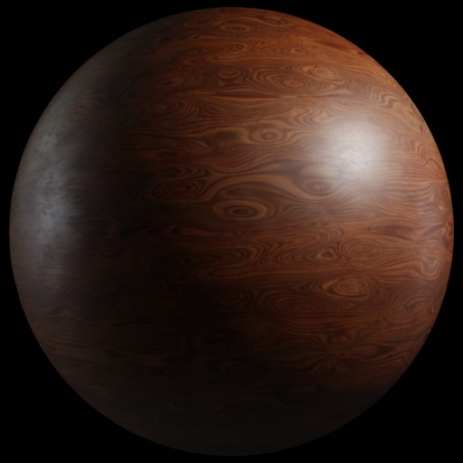 |

|                              wood\_plain\_beech\_01\_300                              |                                  wood\_plain\_beech\_stained\_01\_300                                  |                             wood\_plain\_oak\_01\_300                             |
| :-----------------------------------------------------------------------------------: | :----------------------------------------------------------------------------------------------------: | :-------------------------------------------------------------------------------: |
| 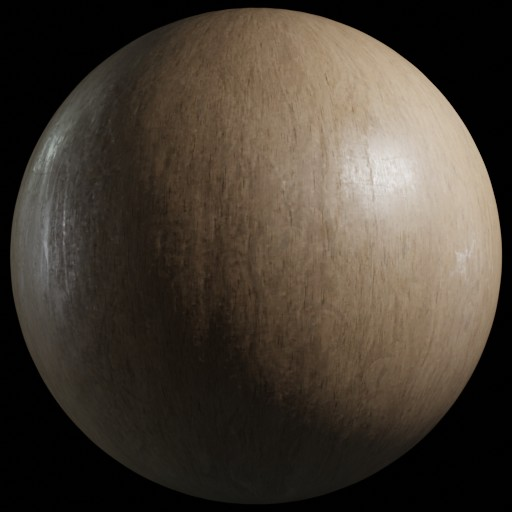 | 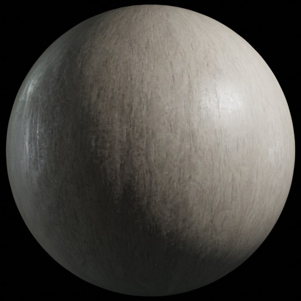 | 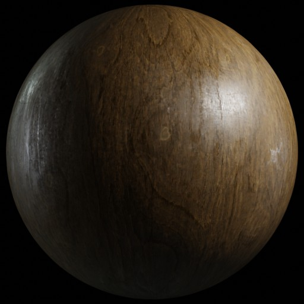 |

|                              wood\_plain\_pine\_01\_300                             |                                  wood\_plain\_pine\_polished\_01\_300                                  |                               wood\_plain\_plywood\_01\_300                               |
| :---------------------------------------------------------------------------------: | :----------------------------------------------------------------------------------------------------: | :---------------------------------------------------------------------------------------: |
| 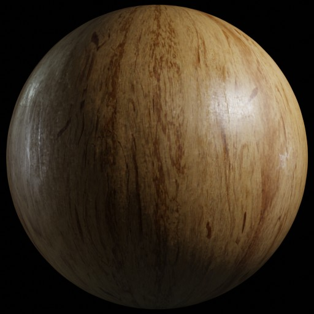 | 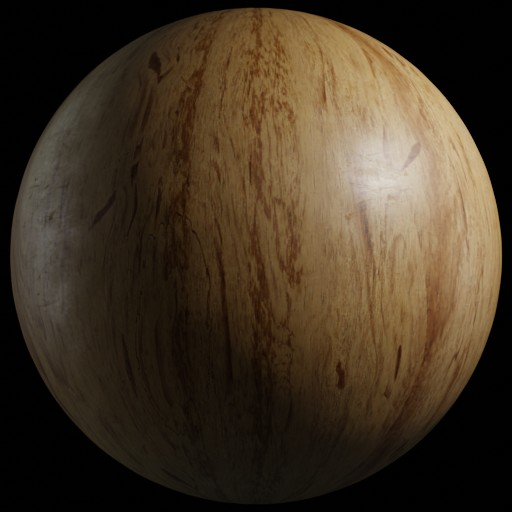 | 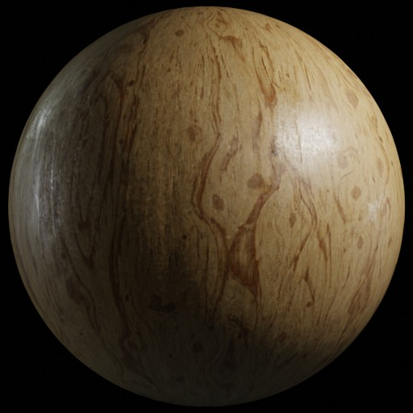 |

|                                wool\_crossknit\_clean\_01\_30                               |                             wool\_knit\_clean\_01\_30                             |                             wool\_knit\_clean\_02\_30                             |
| :-----------------------------------------------------------------------------------------: | :-------------------------------------------------------------------------------: | :-------------------------------------------------------------------------------: |
| 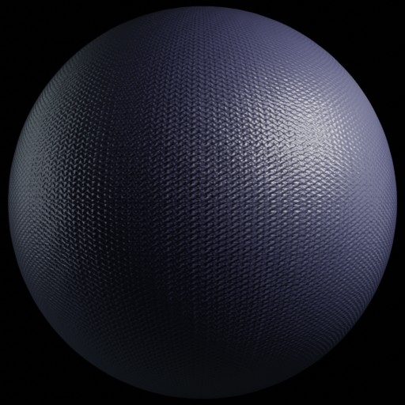 | 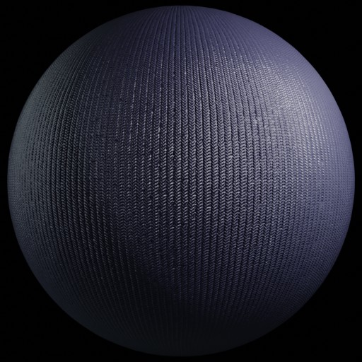 | 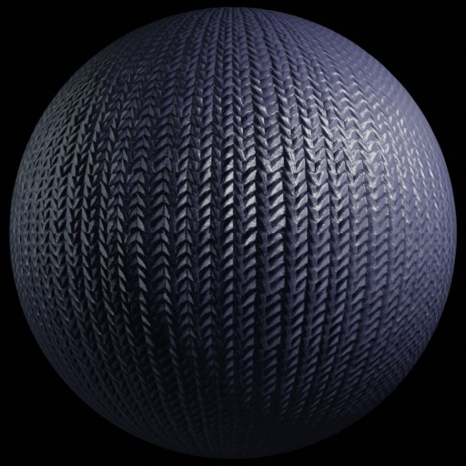 |

|                             wool\_knit\_clean\_03\_30                             |                             wool\_knit\_clean\_04\_30                             |
| :-------------------------------------------------------------------------------: | :-------------------------------------------------------------------------------: |
| 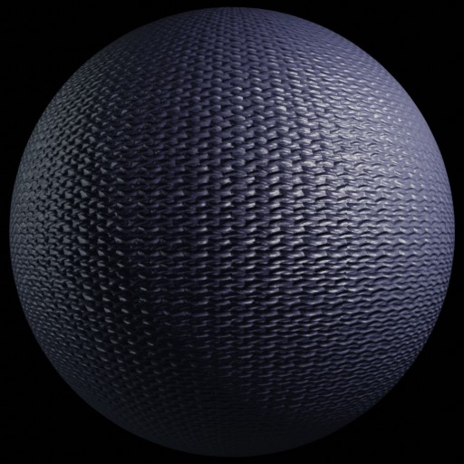 | 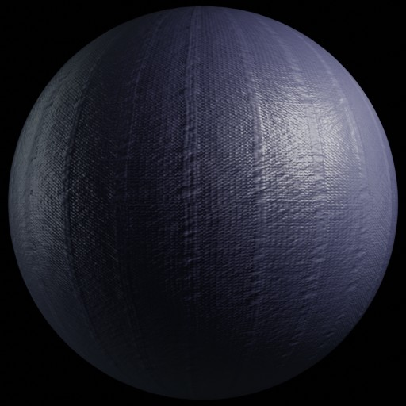 |

## Assorted Misc

ToDo: These need to be grouped (one picture per type), and then they need to be linked with nice headers. But I'd rather put them on here before they rot away on my disk for a few more months

### fabric materials

<figure>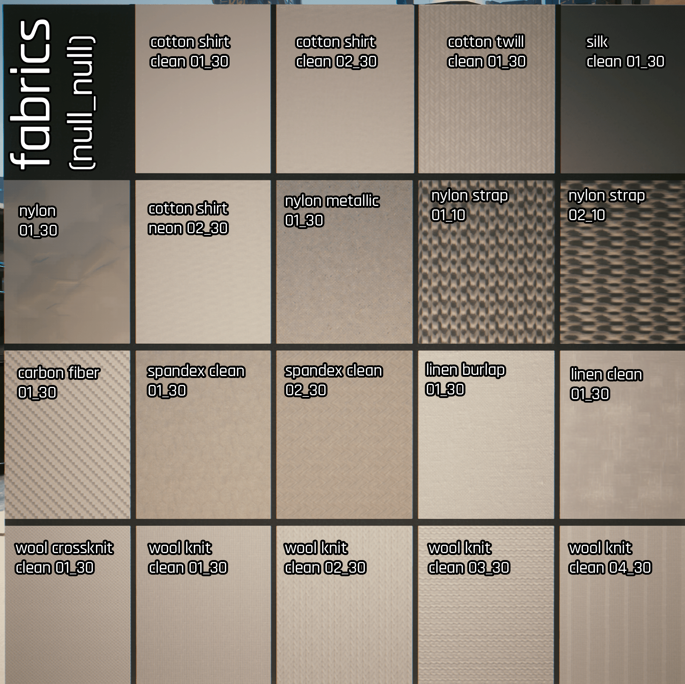<figcaption></figcaption></figure>

<figure><figcaption></figcaption></figure>

<figure><figcaption></figcaption></figure>

<figure><figcaption></figcaption></figure>

## bronze\_roof\_tile\_bare

### roughness and colour

<figure><figcaption>
How roughness affects a material (the colour was not changed)
</figcaption></figure>

## Silver

### material variants

<figure><figcaption></figcaption></figure>

## Metals: rolled

<figure><figcaption></figcaption></figure>

## Plastic

### Plastic Tech HQ

<figure>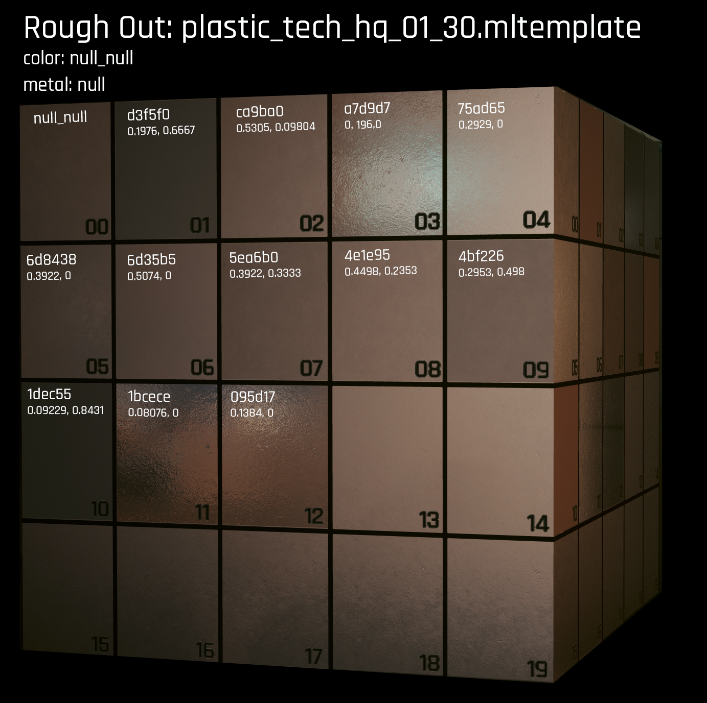<figcaption></figcaption></figure>
