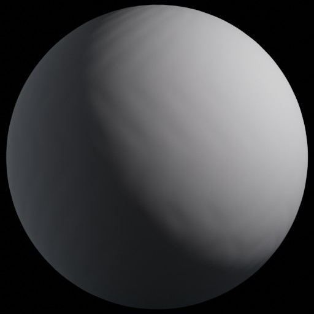

# Multilayered: Previews

## 3D Rendered Previews

@jato on the [Cyberpunk 2077 Modding Community Discord server](https://discord.gg/Epkq79kd96) has created 3D rendered previews as `.jpeg` files of all the `.mlsetups` in the game. Original post can be found [here](https://discord.com/channels/717692382849663036/1021790625265369218). The following list has been generated from these previews. A `.zip` is also [hosted](../../../.gitbook/assets/MLTEMPLATE\_previews.zip) on this Wiki.


More accurate previews rendered in-game (check [below](./#assorted-misc)) can be created with the [Material Preview AMM Prop](https://www.nexusmods.com/cyberpunk2077/mods/10515).


|                             aluminium\_annodised                            |                               aluminium\_bare\_01\_300                              |                                aluminium\_brushed\_01\_300                                |
| :-------------------------------------------------------------------------: | :---------------------------------------------------------------------------------: | :---------------------------------------------------------------------------------------: |
|  |  |  |

|                              aluminium\_old\_01\_300                              |                                 aluminium\_polished\_01\_300                                |                                 aluminium\_rolled\_annodised                                |
| :-------------------------------------------------------------------------------: | :-----------------------------------------------------------------------------------------: | :-----------------------------------------------------------------------------------------: |
|  |  |  |

|                                   aluminium\_rolled\_bare\_01\_300                                  |                                   aluminium\_rolled\_rough\_01\_300                                   |                               aluminium\_rough\_01\_300                               |
| :-------------------------------------------------------------------------------------------------: | :---------------------------------------------------------------------------------------------------: | :-----------------------------------------------------------------------------------: |
|  |  |  |

|                             asphalt\_old\_01\_300                             |                                   asphalt\_old\_fractured\_01\_300                                  |                                  asphalt\_old\_patches\_01\_300                                 |
| :---------------------------------------------------------------------------: | :-------------------------------------------------------------------------------------------------: | :---------------------------------------------------------------------------------------------: |
|  |  |  |

|                              asphalt\_paint\_01\_300                              |                              asphalt\_road\_01\_300                             |                                  asphalt\_road\_damaged\_01\_300                                  |
| :-------------------------------------------------------------------------------: | :-----------------------------------------------------------------------------: | :-----------------------------------------------------------------------------------------------: |
|  |  |  |

|                                asphalt\_road\_new\_01\_300                                |                                asphalt\_road\_old\_01\_300                                |                              asphalt\_tires\_01\_300                              |
| :---------------------------------------------------------------------------------------: | :---------------------------------------------------------------------------------------: | :-------------------------------------------------------------------------------: |
|  |  |  |

|                             blood\_smooth\_1\_30                            |                             brass\_bare\_01\_300                            |                              brass\_brushed\_01\_300                              |
| :-------------------------------------------------------------------------: | :-------------------------------------------------------------------------: | :-------------------------------------------------------------------------------: |
|  |  |  |

|                            brass\_old\_01\_300                            |                               brass\_polished\_01\_300                              |                                 brass\_rolled\_bare\_01\_300                                |
| :-----------------------------------------------------------------------: | :---------------------------------------------------------------------------------: | :-----------------------------------------------------------------------------------------: |
|  |  |  |

|                                 brass\_rolled\_rough\_01\_300                                 |                             brass\_rough\_01\_300                             |                                 bricks\_old\_damaged\_01\_200                                 |
| :-------------------------------------------------------------------------------------------: | :---------------------------------------------------------------------------: | :-------------------------------------------------------------------------------------------: |
|  |  |  |

|                                 bricks\_old\_painted\_01\_200                                 |                                bricks\_old\_rough\_01\_200                                |                             bronze\_bare\_01\_300                             |
| :-------------------------------------------------------------------------------------------: | :---------------------------------------------------------------------------------------: | :---------------------------------------------------------------------------: |
|  |  |  |

|                             bronze\_old\_01\_300                            |                               bronze\_polished\_01\_300                               |                                   bronze\_roof\_tile\_bare\_01\_300                                   |
| :-------------------------------------------------------------------------: | :-----------------------------------------------------------------------------------: | :---------------------------------------------------------------------------------------------------: |
|  |  |  |

|                              bronze\_rough\_01\_300                             |                             canvas\_clean\_01\_30                             |                               car\_paint\_metallic\_01                              |
| :-----------------------------------------------------------------------------: | :---------------------------------------------------------------------------: | :---------------------------------------------------------------------------------: |
|  |  |  |

|                             carbon\_fiber\_01\_30                             |                                     carpet\_office\_felt\_clean\_01\_300                                    |                                  carpet\_ribbed\_clean\_01\_300                                 |
| :---------------------------------------------------------------------------: | :---------------------------------------------------------------------------------------------------------: | :---------------------------------------------------------------------------------------------: |
|  |  |  |

|                                 carpet\_thick\_clean\_01\_300                                 |                                  carpet\_underlay\_old\_01\_300                                 |                             ceramic\_6x6\_01\_300                             |
| :-------------------------------------------------------------------------------------------: | :---------------------------------------------------------------------------------------------: | :---------------------------------------------------------------------------: |
|  |  |  |

|                                  ceramic\_6x6\_damaged\_01\_300                                 |                              ceramic\_6x12\_01\_300                             |                                  ceramic\_6x12\_damaged\_01\_300                                  |
| :---------------------------------------------------------------------------------------------: | :-----------------------------------------------------------------------------: | :-----------------------------------------------------------------------------------------------: |
|  |  |  |

|                              ceramic\_16x16\_01\_300                              |                                  ceramic\_16x16\_01\_metal\_300                                 |                                  ceramic\_16x16\_dirty\_01\_300                                 |
| :-------------------------------------------------------------------------------: | :---------------------------------------------------------------------------------------------: | :---------------------------------------------------------------------------------------------: |
|  |  |  |

|                                   ceramic\_16x16\_missing\_01\_300                                  |                             cinderblock\_01\_300                            |                                 cinderblock\_painted\_01\_300                                 |
| :-------------------------------------------------------------------------------------------------: | :-------------------------------------------------------------------------: | :-------------------------------------------------------------------------------------------: |
|  |  |  |

|                              circuit\_board\_01\_30                             |                          cliff\_rock\_01                          |                          cliff\_rock\_02                          |
| :-----------------------------------------------------------------------------: | :---------------------------------------------------------------: | :---------------------------------------------------------------: |
|  |  |  |

|                          cliff\_rock\_03                          |                                  colour\_checker\_plastic\_tech                                 |                                  concrete\_cast\_rough\_01\_300                                 |
| :---------------------------------------------------------------: | :---------------------------------------------------------------------------------------------: | :---------------------------------------------------------------------------------------------: |
|  |  |  |

|                                     concrete\_cast\_rough\_dyed\_01\_300                                    |                                 concrete\_new\_clean\_01\_300                                 |                                    concrete\_new\_clean\_dyed\_01\_300                                    |
| :---------------------------------------------------------------------------------------------------------: | :-------------------------------------------------------------------------------------------: | :-------------------------------------------------------------------------------------------------------: |
|  |  |  |

|                                  concrete\_new\_cracked\_01\_300                                  |                                 concrete\_new\_dirty\_01\_300                                 |                                  concrete\_new\_painted\_01\_300                                  |
| :-----------------------------------------------------------------------------------------------: | :-------------------------------------------------------------------------------------------: | :-----------------------------------------------------------------------------------------------: |
|  |  |  |

|                                      concrete\_new\_painted\_matte\_01\_300                                     |                                 concrete\_new\_rough\_01\_300                                 |                                    concrete\_new\_rough\_dyed\_01\_300                                    |
| :-------------------------------------------------------------------------------------------------------------: | :-------------------------------------------------------------------------------------------: | :-------------------------------------------------------------------------------------------------------: |
|  |  |  |

|                                  concrete\_old\_damage\_01\_300                                 |                                     concrete\_old\_damage\_rebar\_01\_300                                     |                                  concrete\_old\_panels\_01\_300                                 |
| :---------------------------------------------------------------------------------------------: | :-----------------------------------------------------------------------------------------------------------: | :---------------------------------------------------------------------------------------------: |
|  |  |  |

|                                      concrete\_old\_panels\_cracks\_01\_300                                     |                                        concrete\_old\_panels\_horizontal\_01\_300                                       |                                            concrete\_old\_panels\_horizontal\_cracks\_01\_300                                           |
| :-------------------------------------------------------------------------------------------------------------: | :---------------------------------------------------------------------------------------------------------------------: | :-------------------------------------------------------------------------------------------------------------------------------------: |
|  |  |  |

|                                     concrete\_old\_panels\_leaks\_01\_300                                     |                                   concrete\_old\_shuttered\_01\_300                                   |                                       concrete\_old\_shuttered\_cracks\_01\_300                                       |
| :-----------------------------------------------------------------------------------------------------------: | :---------------------------------------------------------------------------------------------------: | :-------------------------------------------------------------------------------------------------------------------: |
|  |  |  |

|                                       concrete\_old\_shuttered\_leaks\_01\_300                                      |                                        concrete\_old\_shuttered\_painted\_01\_300                                       |                              concrete\_road\_01\_300                              |
| :-----------------------------------------------------------------------------------------------------------------: | :---------------------------------------------------------------------------------------------------------------------: | :-------------------------------------------------------------------------------: |
|  |  |  |

|                                   concrete\_road\_cracked\_01\_300                                  |                                    concrete\_road\_fractured\_01\_300                                   |                                   concrete\_road\_painted\_01\_300                                  |
| :-------------------------------------------------------------------------------------------------: | :-----------------------------------------------------------------------------------------------------: | :-------------------------------------------------------------------------------------------------: |
|  |  |  |

|                                  concrete\_road\_tires\_01\_300                                 |                               concrete\_rough\_01\_300                              |                                   concrete\_rough\_cracked\_01\_300                                   |
| :---------------------------------------------------------------------------------------------: | :---------------------------------------------------------------------------------: | :---------------------------------------------------------------------------------------------------: |
|  |  |  |

|                                   concrete\_rough\_damaged\_01\_300                                   |                                       concrete\_rough\_damaged\_rebar\_01\_300                                      |                                  concrete\_rough\_leaks\_01\_300                                  |
| :---------------------------------------------------------------------------------------------------: | :-----------------------------------------------------------------------------------------------------------------: | :-----------------------------------------------------------------------------------------------: |
|  |  |  |

|                               concrete\_smooth\_01\_300                               |                                    concrete\_smooth\_cracked\_01\_300                                   |                                  concrete\_smooth\_dyed\_01\_300                                  |
| :-----------------------------------------------------------------------------------: | :-----------------------------------------------------------------------------------------------------: | :-----------------------------------------------------------------------------------------------: |
|  |  |  |

|                                       concrete\_smooth\_dyed\_polished\_01\_300                                       |                                  concrete\_smooth\_old\_01\_300                                 |                                    concrete\_smooth\_polished\_01\_300                                    |
| :-------------------------------------------------------------------------------------------------------------------: | :---------------------------------------------------------------------------------------------: | :-------------------------------------------------------------------------------------------------------: |
|  |  |  |

|                                       concrete\_smooth\_tile\_hex\_5x6\_01\_300                                       |                                          concrete\_smooth\_tile\_hex\_foil\_5x6\_01\_300                                          |                                          concrete\_smooth\_tile\_hex\_foil\_5x6\_02\_300                                          |
| :-------------------------------------------------------------------------------------------------------------------: | :-------------------------------------------------------------------------------------------------------------------------------: | :-------------------------------------------------------------------------------------------------------------------------------: |
|  |  |  |

|                             copper\_bare\_01\_300                             |                               copper\_brushed\_01\_300                              |                             copper\_old\_01\_300                            |
| :---------------------------------------------------------------------------: | :---------------------------------------------------------------------------------: | :-------------------------------------------------------------------------: |
|  |  |  |

|                               copper\_polished\_01\_300                               |                                 copper\_rolled\_bare\_01\_300                                 |                                  copper\_rolled\_rough\_01\_300                                 |
| :-----------------------------------------------------------------------------------: | :-------------------------------------------------------------------------------------------: | :---------------------------------------------------------------------------------------------: |
|  |  |  |

|                                   copper\_roof\_tile\_bare\_01\_300                                   |                              copper\_rough\_01\_300                             |                              corduroy\_clean\_01\_30                              |
| :---------------------------------------------------------------------------------------------------: | :-----------------------------------------------------------------------------: | :-------------------------------------------------------------------------------: |
|  |  |  |

|                                 cotton\_shirt\_clean\_01\_30                                |                                 cotton\_shirt\_clean\_02\_30                                |                                cotton\_shirt\_neon\_02\_30                                |
| :-----------------------------------------------------------------------------------------: | :-----------------------------------------------------------------------------------------: | :---------------------------------------------------------------------------------------: |
|  |  |  |

|                                 cotton\_twill\_clean\_01\_30                                |                          debug\_outdated                          |                            debug\_parity\_test                            |
| :-----------------------------------------------------------------------------------------: | :---------------------------------------------------------------: | :-----------------------------------------------------------------------: |
|  |  |  |

|                            debug\_uv\_testing                           |                         default\_gray                         |                            denim\_camo\_01\_30                            |
| :---------------------------------------------------------------------: | :-----------------------------------------------------------: | :-----------------------------------------------------------------------: |
|  |  |  |

|                             denim\_clean\_01\_30                            |                           denim\_clean\_02                          |                            denim\_neon\_01\_30                            |
| :-------------------------------------------------------------------------: | :-----------------------------------------------------------------: | :-----------------------------------------------------------------------: |
|  |  |  |

|                               dirt\_universal\_01\_300                              |                                  duct\_tape\_characters\_01\_10                                 |                               duct\_tape\_clean\_01\_10                               |
| :---------------------------------------------------------------------------------: | :---------------------------------------------------------------------------------------------: | :-----------------------------------------------------------------------------------: |
|  |  |  |

|                            dust\_light\_01\_50                            |                                  ebony\_irregular\_bare\_01\_300                                  |                                  ebony\_irregular\_bare\_02\_300                                  |
| :-----------------------------------------------------------------------: | :-----------------------------------------------------------------------------------------------: | :-----------------------------------------------------------------------------------------------: |
|  |  |  |

|                                     ebony\_irregular\_bare\_02\_hrz\_300                                    |                                    ebony\_irregular\_polished\_01\_300                                    |                                    ebony\_irregular\_polished\_02\_300                                    |
| :---------------------------------------------------------------------------------------------------------: | :-------------------------------------------------------------------------------------------------------: | :-------------------------------------------------------------------------------------------------------: |
|  |  |  |

|                                  ebony\_straight\_bare\_01\_300                                 |                                  ebony\_straight\_bare\_02\_300                                 |                                    ebony\_straight\_polished\_01\_300                                   |
| :---------------------------------------------------------------------------------------------: | :---------------------------------------------------------------------------------------------: | :-----------------------------------------------------------------------------------------------------: |
|  |  |  |

|                                    ebony\_straight\_polished\_02\_300                                   |                                      ebony\_straight\_polished\_02\_hrz\_300                                      |                                       ebony\_straight\_polished\_floor\_01\_300                                       |
| :-----------------------------------------------------------------------------------------------------: | :---------------------------------------------------------------------------------------------------------------: | :-------------------------------------------------------------------------------------------------------------------: |
|  |  |  |

|                                       ebony\_straight\_polished\_floor\_02\_300                                       |                              elastic\_clean\_01\_30                             |                                  elastic\_ribbed\_clean\_01\_30                                 |
| :-------------------------------------------------------------------------------------------------------------------: | :-----------------------------------------------------------------------------: | :---------------------------------------------------------------------------------------------: |
|  |  |  |

|                             enameled\_hq\_01\_30                            |                                  enameled\_metal\_clean\_01\_30                                 |                                    enameled\_metal\_weathered\_01\_30                                   |
| :-------------------------------------------------------------------------: | :---------------------------------------------------------------------------------------------: | :-----------------------------------------------------------------------------------------------------: |
|  |  |  |

|                                   factory\_floor\_cracked\_01\_300                                  |                                      factory\_floor\_cracked\_dyed\_01\_300                                     |                                 factory\_floor\_old\_01\_300                                |
| :-------------------------------------------------------------------------------------------------: | :-------------------------------------------------------------------------------------------------------------: | :-----------------------------------------------------------------------------------------: |
|  |  |  |

|                                   factory\_floor\_painted\_01\_300                                  |                                     factory\_floor\_painted\_old\_01\_300                                     |                                  factory\_floor\_rough\_01\_300                                 |
| :-------------------------------------------------------------------------------------------------: | :-----------------------------------------------------------------------------------------------------------: | :---------------------------------------------------------------------------------------------: |
|  |  |  |

|                            felt\_clean\_01\_30                            |                         foam\_01\_100                         |                              foam\_pyramid\_01\_100                             |
| :-----------------------------------------------------------------------: | :-----------------------------------------------------------: | :-----------------------------------------------------------------------------: |
|  |  |  |

|                            gold\_bare\_01\_300                            |                              gold\_brushed\_01\_300                             |                            gold\_old\_01\_300                           |
| :-----------------------------------------------------------------------: | :-----------------------------------------------------------------------------: | :---------------------------------------------------------------------: |
|  |  |  |

|                              gold\_polished\_01\_300                              |                             gold\_rough\_01\_300                            |                           graffiti\_01\_100                           |
| :-------------------------------------------------------------------------------: | :-------------------------------------------------------------------------: | :-------------------------------------------------------------------: |
|  |  |  |

|                             graphics\_logos\_001                            |                             graphics\_logos\_002                            |                             graphics\_logos\_003                            |
| :-------------------------------------------------------------------------: | :-------------------------------------------------------------------------: | :-------------------------------------------------------------------------: |
|  |  |  |

|                          grass\_dry\_01                         |                           grass\_green\_01                          |                           grass\_scrub\_01                          |
| :-------------------------------------------------------------: | :-----------------------------------------------------------------: | :-----------------------------------------------------------------: |
|  |  |  |

|                        gravel\_01                       |                             grime\_film\_01\_300                            |                                houndstooth\_clean\_01\_30                               |
| :-----------------------------------------------------: | :-------------------------------------------------------------------------: | :-------------------------------------------------------------------------------------: |
|  |  |  |

|                                 insulation\_quilted\_01\_200                                |                            iron\_bare\_01\_300                            |                              iron\_brushed\_01\_300                             |
| :-----------------------------------------------------------------------------------------: | :-----------------------------------------------------------------------: | :-----------------------------------------------------------------------------: |
|  |  |  |

|                            iron\_cast\_01\_300                            |                                 iron\_cast\_painted\_01\_300                                |                                    iron\_cast\_painted\_studs\_01\_300                                    |
| :-----------------------------------------------------------------------: | :-----------------------------------------------------------------------------------------: | :-------------------------------------------------------------------------------------------------------: |
|  |  |  |

|                                 iron\_cast\_polished\_01\_300                                 |                                iron\_cast\_studs\_01\_300                               |                            iron\_old\_01\_100                           |
| :-------------------------------------------------------------------------------------------: | :-------------------------------------------------------------------------------------: | :---------------------------------------------------------------------: |
|  |  |  |

|                                iron\_old\_rusted\_01\_100                               |                              iron\_polished\_01\_300                              |                                iron\_rolled\_bare\_01\_300                                |
| :-------------------------------------------------------------------------------------: | :-------------------------------------------------------------------------------: | :---------------------------------------------------------------------------------------: |
|  |  |  |

|                                 iron\_rolled\_rough\_01\_300                                |                             iron\_rough\_01\_300                            |                             jersey\_clean\_01\_30                             |
| :-----------------------------------------------------------------------------------------: | :-------------------------------------------------------------------------: | :---------------------------------------------------------------------------: |
|  |  |  |

|                         latex\_01\_30                         |                            latex\_neon\_01\_30                            |                             leather\_bull\_01\_30                             |
| :-----------------------------------------------------------: | :-----------------------------------------------------------------------: | :---------------------------------------------------------------------------: |
|  |  |  |

|                             leather\_croc\_01\_30                             |                              leather\_holes\_01\_30                             |                             leather\_old\_01\_30                            |
| :---------------------------------------------------------------------------: | :-----------------------------------------------------------------------------: | :-------------------------------------------------------------------------: |
|  |  |  |

|                             leather\_old\_02\_30                            |                              leather\_rough\_01\_30                             |                                   leather\_standard\_clean\_01\_30                                  |
| :-------------------------------------------------------------------------: | :-----------------------------------------------------------------------------: | :-------------------------------------------------------------------------------------------------: |
|  |  |  |

|                                led\_matrix\_16x16\_01\_16                               |                             linen\_burlap\_01\_30                             |                             linen\_clean\_01\_30                            |
| :-------------------------------------------------------------------------------------: | :---------------------------------------------------------------------------: | :-------------------------------------------------------------------------: |
|  |  |  |

|                                 linoleum\_floor\_6x6\_01\_300                                 |                                    linoleum\_floor\_6x6\_worn\_01\_300                                    |                                     linoleum\_floor\_strip\_eggshell\_01                                    |
| :-------------------------------------------------------------------------------------------: | :-------------------------------------------------------------------------------------------------------: | :---------------------------------------------------------------------------------------------------------: |
|  |  |  |

|                           marble\_plain\_01                           |                                marble\_plain\_polished\_01                                |                              marble\_plain\_raw\_01                             |
| :-------------------------------------------------------------------: | :---------------------------------------------------------------------------------------: | :-----------------------------------------------------------------------------: |
|  |  |  |

|                                 metal\_floor\_dirty\_01\_100                                |                                     metal\_floor\_painted\_dirty\_01\_100                                     |                                   metal\_generic\_cast\_hq\_01\_30                                  |
| :-----------------------------------------------------------------------------------------: | :-----------------------------------------------------------------------------------------------------------: | :-------------------------------------------------------------------------------------------------: |
|  |  |  |

|                                metal\_generic\_hq\_01\_30                               |                          mirror\_01\_100                          |                      mud\_01                      |
| :-------------------------------------------------------------------------------------: | :---------------------------------------------------------------: | :-----------------------------------------------: |
|  |  |  |

|                           multilayer\_debug                           |                            multilayer\_default                            |                             mylar\_clean\_01\_30                            |
| :-------------------------------------------------------------------: | :-----------------------------------------------------------------------: | :-------------------------------------------------------------------------: |
|  |  |  |

|                                     mylar\_insulation\_crumpled\_01\_200                                    |                                    mylar\_insulation\_quilted\_01\_200                                    |                         nylon\_01\_30                         |
| :---------------------------------------------------------------------------------------------------------: | :-------------------------------------------------------------------------------------------------------: | :-----------------------------------------------------------: |
|  |  |  |

|                              nylon\_metallic\_01\_30                              |                             nylon\_strap\_01\_10                            |                             nylon\_strap\_02\_10                            |
| :-------------------------------------------------------------------------------: | :-------------------------------------------------------------------------: | :-------------------------------------------------------------------------: |
|  |  |  |

|                             oxford\_clean\_01\_30                             |                                paint\_fine\_clean\_01\_300                                |                                    paint\_fine\_clean\_matte\_01\_300                                   |
| :---------------------------------------------------------------------------: | :---------------------------------------------------------------------------------------: | :-----------------------------------------------------------------------------------------------------: |
|  |  |  |

|                               paint\_fine\_old\_01\_300                               |                             paint\_thick\_01\_300                             |                                  paint\_thick\_chequer\_01\_300                                 |
| :-----------------------------------------------------------------------------------: | :---------------------------------------------------------------------------: | :---------------------------------------------------------------------------------------------: |
|  |  |  |

|                                 paint\_thick\_hazard\_01\_300                                 |                                paint\_thick\_old\_01\_300                               |                                  paint\_thick\_peeling\_01\_300                                 |
| :-------------------------------------------------------------------------------------------: | :-------------------------------------------------------------------------------------: | :---------------------------------------------------------------------------------------------: |
|  |  |  |

|                          patina\_01\_300                          |                                patina\_roof\_tile\_01\_300                                |                               pebbles\_smooth\_01\_200                              |
| :---------------------------------------------------------------: | :---------------------------------------------------------------------------------------: | :---------------------------------------------------------------------------------: |
|  |  |  |

|                                 photovoltaic\_cells\_01\_200                                |                             plaid\_clean\_01\_30                            |                             plaid\_clean\_02\_30                            |
| :-----------------------------------------------------------------------------------------: | :-------------------------------------------------------------------------: | :-------------------------------------------------------------------------: |
|  |  |  |

|                             plaid\_clean\_03\_30                            |                             plaid\_clean\_04\_30                            |                                plaster\_exterior\_01\_300                               |
| :-------------------------------------------------------------------------: | :-------------------------------------------------------------------------: | :-------------------------------------------------------------------------------------: |
|  |  |  |

|                                   plaster\_exterior\_damp\_01\_300                                  |                                plaster\_exterior\_damp\_neutral\_01\_300                                |                                    plaster\_exterior\_neutral\_01\_300                                    |
| :-------------------------------------------------------------------------------------------------: | :-----------------------------------------------------------------------------------------------------: | :-------------------------------------------------------------------------------------------------------: |
|  |  |  |

|                                    plaster\_exterior\_patched\_01\_300                                    |                                         plaster\_exterior\_patched\_neutral\_01\_300                                        |                                   plaster\_exterior\_rough\_01\_300                                   |
| :-------------------------------------------------------------------------------------------------------: | :-------------------------------------------------------------------------------------------------------------------------: | :---------------------------------------------------------------------------------------------------: |
|  |  |  |

|                                           plaster\_exterior\_rough\_neutral\_01\_300\_copy                                          |                             plastic\_camo\_01\_30                             |                               plastic\_hard\_scratches                              |
| :---------------------------------------------------------------------------------------------------------------------------------: | :---------------------------------------------------------------------------: | :---------------------------------------------------------------------------------: |
|  |  |  |

|                             plastic\_hard\_smooth                             |                                plastic\_lightcover\_01\_50                                |                                   plastic\_pattern\_bubble\_01\_30                                  |
| :---------------------------------------------------------------------------: | :---------------------------------------------------------------------------------------: | :-------------------------------------------------------------------------------------------------: |
|  |  |  |

|                                   plastic\_pattern\_diamond\_01\_30                                   |                                   plastic\_pattern\_smooth\_01\_30                                  |                                   plastic\_pattern\_square\_01\_30                                  |
| :---------------------------------------------------------------------------------------------------: | :-------------------------------------------------------------------------------------------------: | :-------------------------------------------------------------------------------------------------: |
|  |  |  |

|                                    plastic\_pattern\_squiggle\_01\_30                                   |                               plastic\_scraped\_01\_300                               |                                   plastic\_scraped\_matte\_01\_300                                  |
| :-----------------------------------------------------------------------------------------------------: | :-----------------------------------------------------------------------------------: | :-------------------------------------------------------------------------------------------------: |
|  |  |  |

|                                       plastic\_scraped\_matte\_leopard\_01\_300                                       |                                      plastic\_scraped\_matte\_zebra\_01\_300                                      |                                  plastic\_scraped\_old\_01\_300                                 |
| :-------------------------------------------------------------------------------------------------------------------: | :---------------------------------------------------------------------------------------------------------------: | :---------------------------------------------------------------------------------------------: |
|  |  |  |

|                             plastic\_hard\_smooth                             |                                plastic\_lightcover\_01\_50                                |                                   plastic\_pattern\_bubble\_01\_30                                  |
| :---------------------------------------------------------------------------: | :---------------------------------------------------------------------------------------: | :-------------------------------------------------------------------------------------------------: |
|  |  |  |

|                                   plastic\_pattern\_diamond\_01\_30                                   |                                   plastic\_pattern\_smooth\_01\_30                                  |                                   plastic\_pattern\_square\_01\_30                                  |
| :---------------------------------------------------------------------------------------------------: | :-------------------------------------------------------------------------------------------------: | :-------------------------------------------------------------------------------------------------: |
|  |  |  |

|                                    plastic\_pattern\_squiggle\_01\_30                                   |                               plastic\_scraped\_01\_300                               |                                   plastic\_scraped\_matte\_01\_300                                  |
| :-----------------------------------------------------------------------------------------------------: | :-----------------------------------------------------------------------------------: | :-------------------------------------------------------------------------------------------------: |
|  |  |  |

|                                       plastic\_scraped\_matte\_leopard\_01\_300                                       |                                      plastic\_scraped\_matte\_zebra\_01\_300                                      |                                  plastic\_scraped\_old\_01\_300                                 |
| :-------------------------------------------------------------------------------------------------------------------: | :---------------------------------------------------------------------------------------------------------------: | :---------------------------------------------------------------------------------------------: |
|  |  |  |

|                                    plastic\_scraped\_textured\_01\_300                                    |                                      plastic\_scraped\_textured\_hq\_01\_300                                      |                                   plastic\_scraped\_tread1\_01\_300                                   |
| :-------------------------------------------------------------------------------------------------------: | :---------------------------------------------------------------------------------------------------------------: | :---------------------------------------------------------------------------------------------------: |
|  |  |  |

|                              plastic\_tarp\_01\_200                             |                              plastic\_tech\_01\_300                             |                                 plastic\_tech\_dirty\_01\_300                                 |
| :-----------------------------------------------------------------------------: | :-----------------------------------------------------------------------------: | :-------------------------------------------------------------------------------------------: |
|  |  |  |

|                                  plastic\_tech\_glossy\_01\_300                                 |                               plastic\_tech\_hq\_01\_30                               |                                 plastic\_tech\_neon\_01\_300                                |
| :---------------------------------------------------------------------------------------------: | :-----------------------------------------------------------------------------------: | :-----------------------------------------------------------------------------------------: |
|  |  |  |

|                                    plastic\_tech\_threadplate\_01\_300                                    |                                 plastic\_tech\_worn\_01\_300                                |                             player\_wa\_shirt\_01                             |
| :-------------------------------------------------------------------------------------------------------: | :-----------------------------------------------------------------------------------------: | :---------------------------------------------------------------------------: |
|  |  |  |

|                                  polyester\_knit\_clean\_01\_30                                 |                                  polyester\_knit\_clean\_02\_30                                 |                                  polyester\_knit\_clean\_03\_30                                 |
| :---------------------------------------------------------------------------------------------: | :---------------------------------------------------------------------------------------------: | :---------------------------------------------------------------------------------------------: |
|  |  |  |

|                                   polyester\_knit\_metallic\_01\_30                                   |                               polythene\_sheet\_01\_200                               |                                   polythene\_sheet\_leaks\_01\_200                                  |
| :---------------------------------------------------------------------------------------------------: | :-----------------------------------------------------------------------------------: | :-------------------------------------------------------------------------------------------------: |
|  |  |  |

|                                    polythene\_sheet\_moisture\_01\_200                                    |                           rock\_debris\_01                          |                              rubber\_bumper\_01\_300                              |
| :-------------------------------------------------------------------------------------------------------: | :-----------------------------------------------------------------: | :-------------------------------------------------------------------------------: |
|  |  |  |

|                                   rubber\_bumper\_damaged\_01\_300                                  |                               rubber\_clean\_hq\_01\_30                               |                                 rubber\_simple\_clean\_01\_30                                 |
| :-------------------------------------------------------------------------------------------------: | :-----------------------------------------------------------------------------------: | :-------------------------------------------------------------------------------------------: |
|  |  |  |

|                                   rubber\_simple\_weathered\_01\_30                                   |                                rust\_thick\_flaky\_01\_300                                |                                rust\_thick\_rough\_01\_300                                |
| :---------------------------------------------------------------------------------------------------: | :---------------------------------------------------------------------------------------: | :---------------------------------------------------------------------------------------: |
|  |  |  |

|                                 rust\_thick\_smooth\_01\_300                                |                                rust\_thick\_spots\_01\_300                                |                             sand\_compressed\_01                            |
| :-----------------------------------------------------------------------------------------: | :---------------------------------------------------------------------------------------: | :-------------------------------------------------------------------------: |
|  |  |  |

|                              sand\_dry\_cracked\_01                             |                          sand\_loose\_01                          |                             sequin\_clean\_01\_30                             |
| :-----------------------------------------------------------------------------: | :---------------------------------------------------------------: | :---------------------------------------------------------------------------: |
|  |  |  |

|                            silk\_clean\_01\_30                            |                             silver\_bare\_01\_300                             |                               silver\_brushed\_01\_300                              |
| :-----------------------------------------------------------------------: | :---------------------------------------------------------------------------: | :---------------------------------------------------------------------------------: |
|  |  |  |

|                             silver\_old\_01\_300                            |                               silver\_polished\_01\_300                               |                              silver\_rough\_01\_300                             |
| :-------------------------------------------------------------------------: | :-----------------------------------------------------------------------------------: | :-----------------------------------------------------------------------------: |
|  |  |  |

|                                soil\_peat\_coarse\_01\_100                                |                               soil\_peat\_fine\_01\_100                               |                          soil\_rocky\_01                          |
| :---------------------------------------------------------------------------------------: | :-----------------------------------------------------------------------------------: | :---------------------------------------------------------------: |
|  |  |  |

|                          soil\_rocky\_01                          |                          soil\_sandy\_01                          |                              spandex\_clean\_01\_30                             |
| :---------------------------------------------------------------: | :---------------------------------------------------------------: | :-----------------------------------------------------------------------------: |
|  |  |  |

|                              spandex\_clean\_02\_30                             |                             stains\_oil\_01\_100                            |                             steel\_bare\_01\_300                            |
| :-----------------------------------------------------------------------------: | :-------------------------------------------------------------------------: | :-------------------------------------------------------------------------: |
|  |  |  |

|                                  steel\_bare\_annodised\_01\_300                                  |                                   steel\_bare\_threadplate\_01\_300                                   |                              steel\_brushed\_01\_30                             |
| :-----------------------------------------------------------------------------------------------: | :---------------------------------------------------------------------------------------------------: | :-----------------------------------------------------------------------------: |
|  |  |  |

|                              steel\_brushed\_01\_300                              |                              steel\_dented\_01\_100                             |                                   steel\_dented\_annodised\_01\_100                                   |
| :-------------------------------------------------------------------------------: | :-----------------------------------------------------------------------------: | :---------------------------------------------------------------------------------------------------: |
|  |  |  |

|                                  steel\_dented\_coroded\_01\_100                                  |                                  steel\_dented\_coroded\_01\_100                                  |                                steel\_galvanized\_01\_300                               |
| :-----------------------------------------------------------------------------------------------: | :-----------------------------------------------------------------------------------------------: | :-------------------------------------------------------------------------------------: |
|  |  |  |

|                                      steel\_galvanized\_corrugated\_01\_300                                     |                                      steel\_galvanized\_corrugated\_02\_300                                     |                                          steel\_galvanized\_corrugated\_painted\_01\_300                                          |
| :-------------------------------------------------------------------------------------------------------------: | :-------------------------------------------------------------------------------------------------------------: | :-------------------------------------------------------------------------------------------------------------------------------: |
|  |  |  |

|                                          steel\_galvanized\_corrugated\_painted\_02\_300                                          |                                         steel\_galvanized\_corrugated\_rust\_01\_300                                        |                                         steel\_galvanized\_corrugated\_rust\_02\_300                                        |
| :-------------------------------------------------------------------------------------------------------------------------------: | :-------------------------------------------------------------------------------------------------------------------------: | :-------------------------------------------------------------------------------------------------------------------------: |
|  |  |  |

|                                steel\_hq\_brushed\_01\_10                               |                               steel\_hq\_milled\_01\_10                               |                               steel\_hq\_milled\_02\_10                               |
| :-------------------------------------------------------------------------------------: | :-----------------------------------------------------------------------------------: | :-----------------------------------------------------------------------------------: |
|  |  |  |

|                               steel\_hq\_noise\_01\_10                              |                            steel\_old\_01\_300                            |                                steel\_old\_rusty\_01\_300                               |
| :---------------------------------------------------------------------------------: | :-----------------------------------------------------------------------: | :-------------------------------------------------------------------------------------: |
|  |  |  |

|                                      steel\_old\_rusty\_threadplate\_01\_300                                      |                                 steel\_old\_scraped\_01\_300                                |                                   steel\_old\_threadplate\_01\_300                                  |
| :---------------------------------------------------------------------------------------------------------------: | :-----------------------------------------------------------------------------------------: | :-------------------------------------------------------------------------------------------------: |
|  |  |  |

|                                steel\_perforated\_01\_100                               |                               steel\_polished\_01\_300                              |                             steel\_rebar\_01\_30                            |
| :-------------------------------------------------------------------------------------: | :---------------------------------------------------------------------------------: | :-------------------------------------------------------------------------: |
|  |  |  |

|                                 steel\_rolled\_bare\_01\_300                                |                                      steel\_rolled\_bare\_annodised\_01\_300                                      |                                 steel\_rolled\_rough\_01\_300                                 |
| :-----------------------------------------------------------------------------------------: | :---------------------------------------------------------------------------------------------------------------: | :-------------------------------------------------------------------------------------------: |
|  |  |  |

|                             steel\_rough\_01\_300                             |                                    steel\_rough\_threadplate\_01\_300                                   |                                  steel\_tempered\_large\_01\_30                                 |
| :---------------------------------------------------------------------------: | :-----------------------------------------------------------------------------------------------------: | :---------------------------------------------------------------------------------------------: |
|  |  |  |

|                                  steel\_tempered\_large\_02\_30                                 |                                  steel\_tempered\_medium\_01\_30                                  |                                  steel\_tempered\_small\_01\_30                                 |
| :---------------------------------------------------------------------------------------------: | :-----------------------------------------------------------------------------------------------: | :---------------------------------------------------------------------------------------------: |
|  |  |  |

|                           sticker\_bomb\_01                           |                               terrain\_asphalt\_old\_01                               |                                     terrain\_asphalt\_old\_fractured\_01                                    |
| :-------------------------------------------------------------------: | :-----------------------------------------------------------------------------------: | :---------------------------------------------------------------------------------------------------------: |
|  |  |  |

|                               terrain\_cliff\_rock\_01                              |                               terrain\_cliff\_rock\_02                              |                               terrain\_cliff\_rock\_03                              |
| :---------------------------------------------------------------------------------: | :---------------------------------------------------------------------------------: | :---------------------------------------------------------------------------------: |
|  |  |  |

|                                terrain\_concrete\_road\_01                                |                                     terrain\_concrete\_road\_cracked\_01                                    |                              terrain\_grass\_dry\_01                              |
| :---------------------------------------------------------------------------------------: | :---------------------------------------------------------------------------------------------------------: | :-------------------------------------------------------------------------------: |
|  |  |  |

|                               terrain\_grass\_green\_01                               |                               terrain\_grass\_scrub\_01                               |                            terrain\_gravel\_01                            |
| :-----------------------------------------------------------------------------------: | :-----------------------------------------------------------------------------------: | :-----------------------------------------------------------------------: |
|  |  |  |

|                           terrain\_mud\_01                          |                               terrain\_rock\_debris\_01                               |                                 terrain\_sand\_compressed\_01                                 |
| :-----------------------------------------------------------------: | :-----------------------------------------------------------------------------------: | :-------------------------------------------------------------------------------------------: |
|  |  |  |

|                                  terrain\_sand\_dry\_cracked\_01                                  |                               terrain\_sand\_loose\_01                              |                               terrain\_soil\_rocky\_01                              |
| :-----------------------------------------------------------------------------------------------: | :---------------------------------------------------------------------------------: | :---------------------------------------------------------------------------------: |
|  |  |  |

|                               terrain\_soil\_sandy\_01                              |                            terrain\_trash\_01                           |                              titanium\_bare\_01\_300                              |
| :---------------------------------------------------------------------------------: | :---------------------------------------------------------------------: | :-------------------------------------------------------------------------------: |
|  |  |  |

|                                titanium\_brushed\_01\_300                               |                              titanium\_old\_01\_300                             |                                titanium\_polished\_01\_300                                |
| :-------------------------------------------------------------------------------------: | :-----------------------------------------------------------------------------: | :---------------------------------------------------------------------------------------: |
|  |  |  |

|                                  titanium\_rolled\_bare\_01\_300                                  |                                   titanium\_rolled\_rough\_01\_300                                  |                               titanium\_rough\_01\_300                              |
| :-----------------------------------------------------------------------------------------------: | :-------------------------------------------------------------------------------------------------: | :---------------------------------------------------------------------------------: |
|  |  |  |

|                       trash\_01                       |                      unused                     |                             velvet\_clean\_01\_30                             |
| :---------------------------------------------------: | :---------------------------------------------: | :---------------------------------------------------------------------------: |
|  |  |  |

|                                    wallpaper\_pattern\_a\_old\_01\_300                                    |                               wallpaper\_plain\_01\_300                               |                                  wallpaper\_plain\_damp\_01\_300                                  |
| :-------------------------------------------------------------------------------------------------------: | :-----------------------------------------------------------------------------------: | :-----------------------------------------------------------------------------------------------: |
|  |  |  |

|                              water\_puddle\_01\_150                             |                               windows\_opaque\_01\_200                              |                                  windows\_opaque\_foil\_01\_200                                 |
| :-----------------------------------------------------------------------------: | :---------------------------------------------------------------------------------: | :---------------------------------------------------------------------------------------------: |
|  |  |  |

|                                      windows\_opaque\_foil\_streaky\_01\_200                                      |                                   windows\_opaque\_streaky\_01\_200                                   |                              wood\_hq\_burl\_01\_30                             |
| :---------------------------------------------------------------------------------------------------------------: | :---------------------------------------------------------------------------------------------------: | :-----------------------------------------------------------------------------: |
|  |  |  |

|                                wood\_plain\_beech\_01\_300                                |                                     wood\_plain\_beech\_stained\_01\_300                                    |                               wood\_plain\_oak\_01\_300                               |
| :---------------------------------------------------------------------------------------: | :---------------------------------------------------------------------------------------------------------: | :-----------------------------------------------------------------------------------: |
|  |  |  |

|                                wood\_plain\_pine\_01\_300                               |                                     wood\_plain\_pine\_polished\_01\_300                                    |                                 wood\_plain\_plywood\_01\_300                                 |
| :-------------------------------------------------------------------------------------: | :---------------------------------------------------------------------------------------------------------: | :-------------------------------------------------------------------------------------------: |
|  |  |  |

|                                  wool\_crossknit\_clean\_01\_30                                 |                               wool\_knit\_clean\_01\_30                               |                               wool\_knit\_clean\_02\_30                               |
| :---------------------------------------------------------------------------------------------: | :-----------------------------------------------------------------------------------: | :-----------------------------------------------------------------------------------: |
|  |  |  |

|                               wool\_knit\_clean\_03\_30                               |                               wool\_knit\_clean\_04\_30                               |
| :-----------------------------------------------------------------------------------: | :-----------------------------------------------------------------------------------: |
|  |  |

## Assorted Misc

ToDo: These need to be grouped (one picture per type), and then they need to be linked with nice headers. But I'd rather put them on here before they rot away on my disk for a few more months

### fabric materials

<figure><figcaption></figcaption></figure>

<figure><figcaption></figcaption></figure>

<figure><figcaption></figcaption></figure>

<figure><figcaption></figcaption></figure>

## bronze\_roof\_tile\_bare

### roughness and colour

<figure><figcaption>
How roughness affects a material (the colour was not changed)
</figcaption></figure>

## Silver

### material variants

<figure><figcaption></figcaption></figure>

## Metals: rolled

<figure><figcaption></figcaption></figure>

## Plastic

### Plastic Tech HQ

<figure><figcaption></figcaption></figure>
