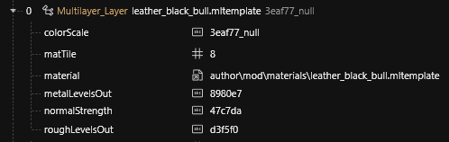
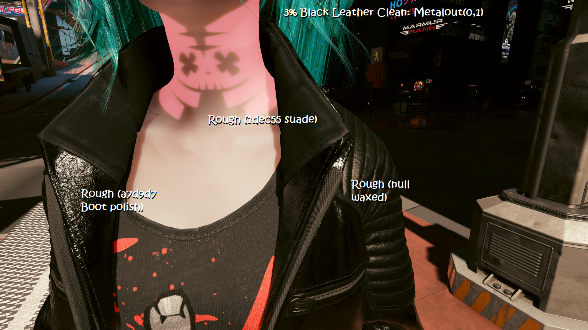

# Vantablack leather through Metalness

## Summary

**Published:** May 21 2025 by [beckylou\_1](https://app.gitbook.com/u/cqyE5SIC8GdJ2SJjjKCB32zFDM62 "mention")\
**Last documented update:** May 21 2025 by [manavortex](https://app.gitbook.com/u/NfZBoxGegfUqB33J9HXuCs6PVaC3 "mention")

This page will tell you how to create a truly black leather material by creating a custom `.mltemplate`&#x20;

### Wait, that's not what I want!

* If you want to learn more about metalness in general, please check [configuring-materials](../configuring-materials/ "mention") -> [#roughness-metalness](../configuring-materials/#roughness-metalness "mention")
* Did you know? You can darken any material by adding a semi-transparent layer of **black silk** (pick the bottom entry from the roughness menu)

## How to create black leather

1. Find the leather material template under `base\surfaces\materials\fabric\leather`
2. Add them to your project
3. [Custompath](../../../modding-guides/items-equipment/custompathing-assets.md) them by moving them to a folder like `author\mod\materials`

### Edit the new mltemplate file

1. Open the file by double-clicking
2. Find the "overrides" section and expand it
3. Add the following values into `metalLevelsOut`:


To save typing these numbers, you can steal them from a different material such as silk or spandex.


<table><thead><tr><th width="97">n</th><th width="65">v(0)</th><th width="91">v(1)</th></tr></thead><tbody><tr><td>280c47</td><td>0</td><td>0</td></tr><tr><td>7cda36</td><td>0</td><td>0.25</td></tr><tr><td>749e4d</td><td>0</td><td>0.5</td></tr><tr><td>b56c4b</td><td>0</td><td>0.75</td></tr><tr><td>8980e7</td><td>0</td><td>1</td></tr></tbody></table>

4. Save your new .mltemplate

### Change your item's base material

1. In MLSetupBuilder / the .mlsetup,  you can now use your newly-created file instead of `leather_black_bull.mltemplate` (simply change the path).
2. Pick a metalLevelsOut from the list above:

<figure><figcaption></figcaption></figure>

&#x20;You can then use the roughness in conjunction with the metal levels to create various types of truly black leather.

<figure><figcaption>
Standard Clean Leather: Metalicity(1)
</figcaption></figure>
