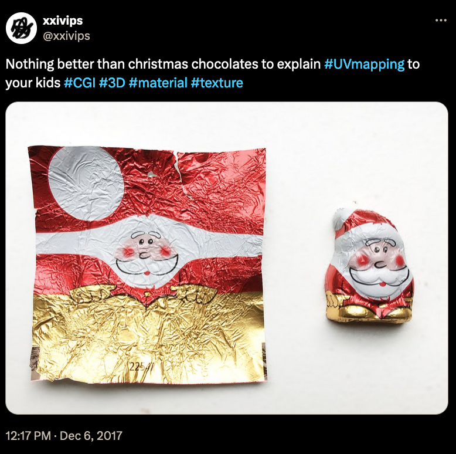
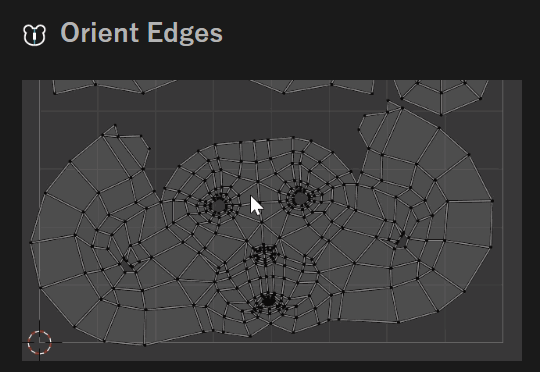
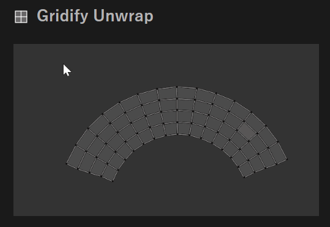
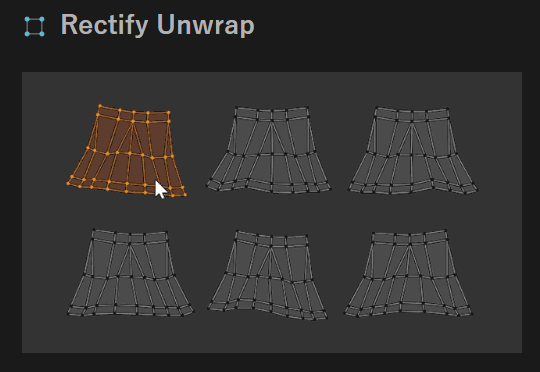
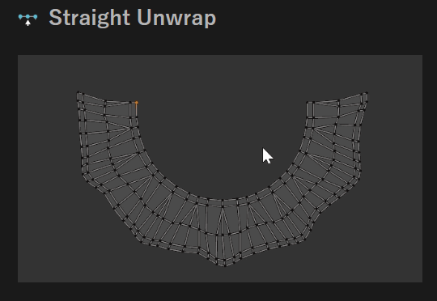

# UV Mapping: texturing a 3d object

## Summary

**Published:** Jan 21 2024 by [manavortex](https://app.gitbook.com/u/NfZBoxGegfUqB33J9HXuCs6PVaC3 "mention")\
**Last documented update:** Jan 21 2024 by [manavortex](https://app.gitbook.com/u/NfZBoxGegfUqB33J9HXuCs6PVaC3 "mention")

This page contains the theory of how to connect meshes (3d objects) with textures (which are 2d after all)

### Wait, this isn't what I want!

* For a hands-on guide to UV mapping, check [adding-decals.md](../../modding-guides/items-equipment/editing-existing-items/adding-decals.md "mention") -> [#step-5-uv-projection](../../modding-guides/items-equipment/editing-existing-items/adding-decals.md#step-5-uv-projection "mention")
* For import/export help, check [images-importing-editing-exporting.md](../../modding-guides/textures-and-luts/images-importing-editing-exporting.md "mention")

## What is "UV mapping" and can I eat it?

This is the technical term for the process of mapping a flat texture on your three-dimensional object. The most hands-on example for this is Christmas chocolate:&#x20;

<figure><figcaption></figcaption></figure>

Regardless of that, **you can not eat it**.

## Where can I see them?


To look at an object's UV mapping, you'll have to fire up Blender (or a 3d editing software of your choice).


&#x20;An object's UV maps are visible in the Data tab:

<figure><figcaption></figcaption></figure>

## How do I edit the UV mapping?


To look at an object's UV mapping, you'll have to fire up Blender (or a 3d editing software of your choice).


Open the UV editing perspective, select a mesh, and switch to Edit Mode. If you select vertices in the `viewport` on the right, you can see their UV islands in the `UV editor` on the left:

<figure><figcaption></figcaption></figure>

You change the mapping by editing those UV islands. For a more hands-on guide of this, refer to [adding-decals.md](../../modding-guides/items-equipment/editing-existing-items/adding-decals.md "mention") -> [#step-5-uv-projection](../../modding-guides/items-equipment/editing-existing-items/adding-decals.md#step-5-uv-projection "mention")

## Recommended AddOns

### [MioUV](https://github.com/mio3io/mio3\_uv) (Blender 4.2, free)

If you work with UV mappings, you should definitely check out MioUV. It automates a bunch of things that used to take the better part of an afternoon:

<figure><figcaption></figcaption></figure>

 

<figure><figcaption></figcaption></figure>

 

<figure><figcaption></figcaption></figure>

 

<figure><figcaption></figcaption></figure>

