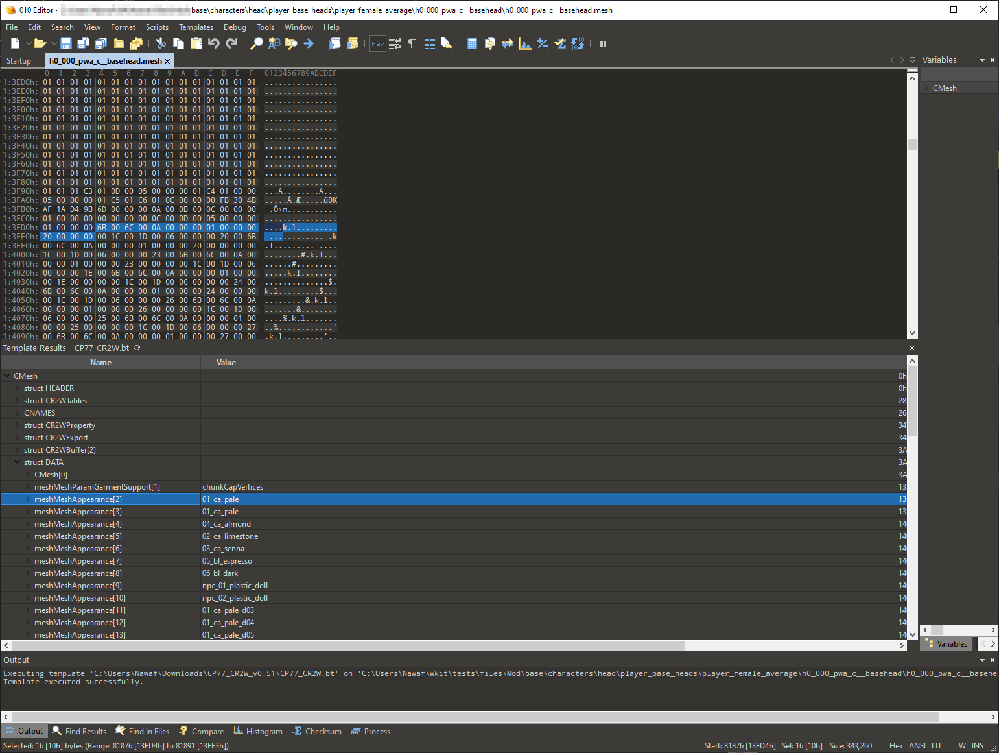

# 010 Editor (ARCHIVED)

<figure><figcaption></figcaption></figure>

We can now use Wolvenkit's  [File Editor](https://app.gitbook.com/s/-MP_ozZVx2gRZUPXkd4r/wolvenkit-app/editor/file-editor "mention"), and hex editing has become obsolete. As of April 2026, you shouldn't have to use a hex editor – ever.

If you find that you have to do this anyway, please create a [ticket on github](https://github.com/WolvenKit/WolvenKit/issues) so that we can tech this away..

## Overview

010 Editor is a generic hex editing software which is capable of reading and writing REDengine W2RC files. A custom template for the 010 Editor created by @alphaZomega must be used to parse game files as human-readable.

## Download

The 010 Editor can be downloaded from Sweetscape's website



#### 010 Editor Template for Cyberpunk 2077

alphaZomega's CP77\_CR2W.bt 010 template can be downloaded from the following link: [https://www.mediafire.com/file/udqqvb4yz1xpuka/CP77\_CR2W\_v0.51.zip](https://www.mediafire.com/file/udqqvb4yz1xpuka/CP77_CR2W_v0.51.zip/file)

## Setup

1. Install 010 Editor and run it.\\
2. install alphaZomega's template by navigating to Templates > View Installed Templates, then click Add and add CP77\_CR2W.bt.\\
3. Navigate to your Cybeprunk 2077 installation, locate the _`oo2ext_7_win64.dll`_ file, then copy and paste the DLL to the same location as the BT template file.

## Scripts

### Unkarkify and Rebuild

Unpack and pack the compressed "KARK'd" data within a CP77\_CR2W file

### Erase

Deletes an entire name and value's worth of a section inside the aforementioned formatted file

### changeMatHdrs

Changes all the Material headers' numbers inside a file to be a universal one with zero offsets

### insertMatHdrs

Creates a new material header inside a file
